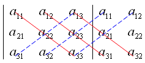
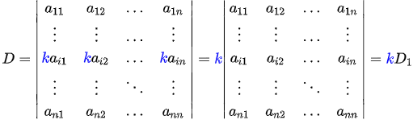
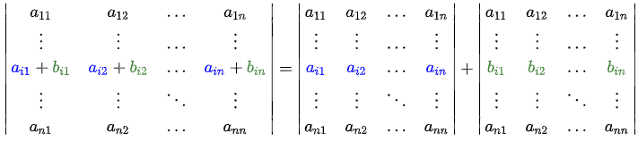
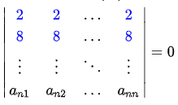
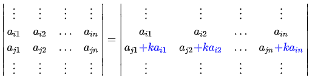
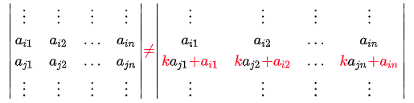

### 线性代数基本概念汇总

------

####  1. 转置与共轭转置

##### 1.1 转置

* $\left( A ^ { \mathrm { T } } \right) ^ { \mathrm { T } } = A$
* $( A + B ) ^ { \mathrm { T } } = A ^ { \mathrm { T } } + B ^ { \mathrm { T } }$
* $( A B ) ^ { \mathrm { T } } = B ^ { \mathrm { T } } A ^ { \mathrm { T } }$
* $\left( A ^ { - 1 } \right) ^ { T } =\left( A ^ { T } \right) ^ { -1 }$， 若$A$为可逆矩阵
* $( c A ) ^ { \mathrm { T } } = c A ^ { \mathrm { T } }$
* $\operatorname { det } \left( A ^ { \mathrm { T } } \right) = \operatorname { det } ( A )$， 即矩阵转置不改变行列式  

##### 1.2 共轭转置

* $\left( A ^ { * } \right) ^ { * } = A$
* $( A + B ) ^ { * } = A ^ { * } + B ^ { * }$
* $( A B ) ^ { * } = B ^ { * } A ^ { * }$
* $A$是可逆矩阵，当且仅当$A^{*}$可逆：$\left( A ^ { * } \right) ^ { - 1 } = \left( A ^ { - 1 } \right) ^ { * }$
* $( r A ) ^ { * } = r ^ { * } A ^ { * }$， 其中$r$为复数，$r^{*}$为$r$的复共轭
* 若$A$为方阵，则$\operatorname { det } \left( A ^ { * } \right) = ( \operatorname { det } A ) ^ { * }$，$\operatorname { tr } \left( A ^ { * } \right) = ( \operatorname { tr } A ) ^ { * }$
* $A^{*}$的特征值是$A$的特征值的复共轭，即$eig (A^{*})=(eig(A))^{*}$

 

#### 2. 矩阵的秩

* **矩阵的行秩和列秩相等**，即$r(A)=r(A^{*})$

* 若$A$为$m \times n$矩阵，则$r  ( A ) \leq \min ( m , n )$，等号成立时，称$A$满秩

* **$n$阶方阵$A$可逆 $\Leftrightarrow$ $r(A)=n$，即$A$满秩**

* 可逆矩阵与任何矩阵乘积的秩等于该矩阵的秩，设$A$是$m \times n$矩阵，$P$是$m$阶可逆方阵，$Q$是$n$阶可逆方阵，则
  $$
  r(A)=r(PA)=r(AQ)=r(PAQ)
  $$

* $r(A+B) \leq r(A)+r(B)$

* **西尔维斯特（Sylvester）不等式**: 如果 $A$是一个 $m × n$ 的矩阵且 $B$ 是 $n × k$ 的, 则
  $$
  r ( A ) + r ( B ) - n \leq r ( A B ) \leq min(r(A),r(B))
  $$

* $\operatorname { rank } ( A ) = \operatorname { rank } ( \overline { A } ) = \operatorname { rank } \left( A ^ { T } \right) = \operatorname { rank } \left( A ^ { * } \right) = \operatorname { rank } \left( A ^ { * } A \right)$

#### 3. 行列式

##### 3.1 行列式的计算

* 二阶矩阵的行列式
  $$
  \left| \begin{array} { l l } { a _ { 1,1 } } & { a _ { 1,2 } } \\ { a _ { 2,1 } } & { a _ { 2,2 } } \end{array} \right| = a _ { 1,1 } a _ { 2,2 } - a _ { 1,2 } a _ { 2,1 }
  $$

* 三阶矩阵的行列式
  $$
  \left| \begin{array} { l l l } { a _ { 1,1 } } & { a _ { 1,2 } } & { a _ { 1,3 } } \\ { a _ { 2,1 } } & { a _ { 2,2 } } & { a _ { 2,3 } } \\ { a _ { 3,1 } } & { a _ { 3,2 } } & { a _ { 3,3 } } \end{array} \right| = a _ { 1,1 } a _ { 2,2 } a _ { 3,3 } + a _ { 1,2 } a _ { 2,3 } a _ { 3,1 } + a _ { 1,3 } a _ { 2,1 } a _ { 3,2 } - a _ { 1,3 } a _ { 2,2 } a _ { 3,1 } - a _ { 1,1 } a _ { 2,3 } a _ { 3,2 } - a _ { 1,2 } a _ { 2,1 } a _ { 3,3 }
  $$
  即下图每条红线上的元素的乘积之和减去每条蓝线上元素的乘积之和

  

##### 3.2 行列式的性质

* 在行列式中，一行（列）元素全为0，则此行列式的值为0。

  

* 在行列式中，某一行（列）有公因子$k$，则可以提出$k$。

  

* 在行列式中，某一行（列）的每个元素是两数之和，则此行列式可拆分为两个相加的行列式。

  

* 行列式中的两行（列）互换，改变行列式正负符号。

  

* 在行列式中，有两行（列）对应成比例或相同，则此行列式的值为0。

  

* 将一行（列）的$k$倍加进另一行（列）里，行列式的值不变。

  

  注意：一行（列）的$k$倍加上另一行（列），行列式的值改变。

  

* 将行列式的行列互换，行列式的值不变，其中行列互换相当于转置。
  $$
  D = \left| a _ { i j } \right| = \left| a _ { j i } \right| = D ^ { \mathrm { T } }
  $$

* 乘法定理：$\operatorname { det } ( A B ) = \operatorname { det } ( A ) \operatorname { det } ( B )$

* 数乘：若将矩阵中的每一行每一列上的数都乘以一个常数$r$，那么所得到的行列式不是原来的$r$倍，而是$r^{n}$倍。
  $$
  \operatorname { det } ( r A ) = \operatorname { det } \left( r I _ { n } \cdot A \right) = \operatorname { det } \left( r I _ { n } \right) \cdot \operatorname { det } ( A ) = r ^ { n } \operatorname { det } ( A )
  $$

* 若$A$是可逆矩阵，$\operatorname { det } \left( A ^ { - 1 } \right) = ( \operatorname { det } ( A ) ) ^ { - 1 }$
* 共轭矩阵的行列式值等于矩阵行列式值的共轭：$\operatorname { det } ( \overline { A } ) = \overline { \operatorname { det } ( A ) }$
* 行列式是所有特征值（按代数重数计）的乘积。特殊地，三角矩阵的行列式等于其对角线上所有元素的乘积。

#### 4. 矩阵的逆

* $AA^{-1}=I$

* $\left( A ^ { - 1 } \right) ^ { - 1 } = A$
* $( \lambda A ) ^ { - 1 } = \frac { 1 } { \lambda } \times A ^ { - 1 }$
* $( A B ) ^ { - 1 } = B ^ { - 1 } A ^ { - 1 }$
* $\left( A ^ { \mathrm { T } } \right) ^ { - 1 } = \left( A ^ { - 1 } \right) ^ { \mathrm { T } }$
* $\operatorname { det } \left( A ^ { - 1 } \right) = { \operatorname { det } ( A ) } ^{-1}$

 

#### 5. 矩阵的迹

* $\operatorname { tr } ( \mathbf { A } + \mathbf { B } ) = \operatorname { tr } ( \mathbf { A } ) + \operatorname { tr } ( \mathbf { B } )$
* $\operatorname { tr } ( r \cdot \mathbf { A } ) = r \cdot \operatorname { tr } ( \mathbf { A } )$

* $\operatorname { tr } ( \mathbf { A } ) = \operatorname { tr } \left( \mathbf { A } ^ { T } \right)$

* $\operatorname { tr } ( \mathbf { A B } ) = \operatorname { tr } ( \mathbf { B } \mathbf { A } )$，$ \operatorname { tr } ( \mathbf { A B C } ) = \operatorname { tr } ( \mathbf { B C A } ) = \operatorname { tr } ( \mathbf { C A B } )$

* 一个矩阵的迹是其特征值的总和：
  $$
  \operatorname { tr } ( \mathbf { A } ) = \lambda _ { 1 } + \lambda _ { 2 } + \cdots + \lambda _ { n }
  $$

* $\operatorname { tr } ( \mathbf { A A^{*} } ) = \sum _ { i = 1 } ^ { n } |a  _ { i i }|^{2}$，特别地，$\operatorname { tr } ( \mathbf { A A^{*} } ) = 0 \Leftrightarrow \mathbf {A} =0$

#### 6. 线性方程组相关结论

* **齐次线性方程组的基本定理**：齐次线性方程组$A_{m \times n }x=0$ 的任何一个基础解系恰含$n-r(A)$个解向量（即基础解系向量组的秩是$n-r(A)$）。
  * 当$r(A) = n$时，原方程组仅有零解；
  * 当$r(A) <n $时，有无穷多个解（从而有非零解）。

* **齐次线性方程组只有零解 $\Leftrightarrow$ 系数矩阵可逆 $\Leftrightarrow$ 系数矩阵满秩 $\Leftrightarrow$ 系数矩阵行列式不等于零 $\Leftrightarrow$ 系数矩阵的行（列）向量线性无关 $\Leftrightarrow$ 系数矩阵非奇异**

#### 7. 特征值和特征向量

##### 7.1 定义

特征方程：$A v = \lambda v$

标量$\lambda$称为特征值，$v$称为属于特征值$\lambda$的特征向量。

##### 7.2 特征多项式与特征值计算

求解多项式方程$|\lambda I - A|=0$可解得每一个$\lambda _ {i}$，多项式$|\lambda I - A|$称为矩阵$A$的特征多项式。

##### 7.3 几何重数与代数重数

齐次线性方程组$( A - \lambda I ) v = 0$的解集称为矩阵$A$的特征值$\lambda$的特征子空间，其维数（等于$n-r(\lambda I - A)$）称为特征值$\lambda$的**几何重数**，表示特征值$\lambda$有几个线性无关的特征向量。

特征多项式可表示为：$| \lambda I - A | = \prod _ { i = 1 } ^ { s } \left( \lambda - \lambda _ { i } \right) ^ { n _ { i } }$，正整数$n_{i}$称为特征值$\lambda _ {i}$的**代数重数**，表示$\lambda _ {i}$是方程$|\lambda I - A|=0$的$n_{i}$重根。

**任何特征值的几何重数不超过其代数重数**

##### 7.4 谱半径

矩阵$A$的所有特征值的集合记为$\sigma ( A )$，称为$A$的谱。特征值的最大模称为$A$的**谱半径**，记为$\rho ( A )$，即
$$
\rho ( A ) = \max \{ | \lambda | : \lambda \in \sigma ( A ) \}
$$

##### 7.5 特征值的性质

* 矩阵的行列式等于其所有特征值的积，即$| A | = \prod _ { i = 1 } ^ { s } \left( \lambda _ { i } \right) ^ { n _ { i } }$ 

* 矩阵的迹等于其所有特征值的和，即$\operatorname { tr } ( A ) = \sum _ { i = 1 } ^ { s } n _ { i } \lambda _ { i }$

* $A$可逆 $\Leftrightarrow$ 0不是$A$的特征值

* 若$A$可逆，其逆矩阵的特征多项式为：
  $$
  \left| \lambda I - A ^ { - 1 } \right| = \prod _ { i = 1 } ^ { s } \left( \lambda - \lambda _ { i } ^ { - 1 } \right) ^ { n _ { i } }
  $$
  且若$\alpha$是$A$的属于特征值$\lambda$的特征向量, 则$\alpha$也是$A^{-1}$的属于特征值$\lambda ^ {-1}$的特征向量。 

##### 7.6 特征向量的性质

* 属于不同特征值的特征向量线性无关 
* $n$阶矩阵$A$可以对角化 $\Leftrightarrow$ $A$有$n$个线性无关的特征向量

#### 8. 矩阵的相似对角化

##### 8.1 定义

若存在对角矩阵$D = \operatorname { diag } \left( \lambda _ { 1 } , \lambda _ { 2 } , \cdots , \lambda _ { n } \right)$与可逆矩阵$P = \left( \alpha _ { 1 } , \alpha _ { 2 } , \cdots , \alpha _ { n } \right)$使得
$$
A = P D P ^ { - 1 }
$$
则称$A$与$D$相似。有时也会把上式称为矩阵$A$的**特征值分解**。

##### 8.2 计算

$D$的对角元即为$A$的各个特征值，$P$的列向量是属于各个特征值的特征向量（排列顺序与$D$中特征值的排列顺序相同）。

##### 8.3 对角化条件

一个$n$阶矩阵$A$可以对角化 $\Leftrightarrow$ $A$的每个特征值的代数重数与几何重数相等$\Leftrightarrow$ $A$的最小多项式没有重根。特别地，若$A$有$n$个不同（线性无关）的特征值，则$A$可以对角化。

#### 9. 正交矩阵和酉矩阵

##### 9.1 定义

**复数矩阵**$Q$是**酉矩阵**，有：
$$
Q^{*}Q=QQ^{*}=I
$$
特别地，当$Q$中元素是**实数**时，称其为**正交矩阵**，即：
$$
Q^{T}Q=QQ^{T}=I
$$

##### 9.2 性质

* 酉矩阵（正交矩阵）的列向量构成内积空间$C^{n}$（$R^{n}$）上的一组标准正交基

* 酉矩阵（正交矩阵）的行向量构成内积空间$C^{n}$（$R^{n}$）上的一组标准正交基
* $Q^{-1}=Q^{*}$，特别地，对正交矩阵，$Q^{-1}=Q^{T}$
* $Q^{*}$（$Q^{T}$）是酉矩阵（正交矩阵）
* $| \operatorname { det } ( Q ) | = 1$
* $\| Q x \| _ { 2 } = \| x \| _ { 2 }$

#### 10. 对称矩阵和埃尔米特矩阵

##### 10.1 定义

**埃尔米特（Hermite）矩阵**，又称厄米矩阵、自伴随矩阵，满足：
$$
A^{*}=A
$$
实数域上，称为**对称矩阵**，满足：
$$
A^{T}=A
$$
**反埃尔米特矩阵**，又称斜埃尔米特矩阵，满足：
$$
A^{*}=-A
$$
实数域上，称为**反对称矩阵**，满足：
$$
A^{T}=-A
$$

##### 10.2 性质

埃尔米特矩阵：

* 若$A$和$B$是埃尔米特矩阵，那么它们的和$A+B$也是埃尔米特矩阵；而只有在$A$和$B$满足交换性（即$AB = BA$）时，它们的积才是埃尔米特矩阵。

* 可逆的埃尔米特矩阵$A$的逆矩阵$A^{-1}$仍然是埃尔米特矩阵。

* 如果$A$是埃尔米特矩阵，对于正整数$n$，$A^{n}$是埃尔米特矩阵。
* **埃尔米特矩阵的特征值均为实数**。
* 埃尔米特矩阵是正规矩阵，可被酉对角化。  
* 方阵$C$与其共轭转置的和 $C+C^{*}$是埃尔米特矩阵。

斜埃尔米特矩阵：

* 斜埃尔米特矩阵的特征值全是纯虚数。
* 斜埃尔米特矩阵的主对角线上的所有元素都一定是纯虚数，特别地，**反对称矩阵主对角线上元素一定都是0**。
* 如果$A$是斜埃尔米特矩阵，那么$iA$是埃尔米特矩阵。
* 如果$A, B$是斜埃尔米特矩阵，那么对于所有的实数$a, b$，$aA + bB$也一定是斜埃尔米特矩阵。
* 斜埃尔米特矩阵的奇数次方仍是斜埃尔米特 矩阵，偶数次方是埃尔米特矩阵。
* 斜埃尔米特矩阵是正规矩阵。
* 方阵$C$与其共轭转置的差 $C-C^{*}$是斜埃尔米特矩阵。

共同性质：

* 任意一个方块矩阵$C$都可以写成一个埃尔米特矩阵$A$和一个斜埃尔米特矩阵$B$的和：
  $$
  C = A + B \quad , \quad A = \frac { 1 } { 2 } \left( C + C ^ { * } \right) \quad , \quad B = \frac { 1 } { 2 } \left( C - C ^ { * } \right)
  $$

#### 11. 正定矩阵

##### 11.1 定义

一个**埃尔米特矩阵$M$**是**正定矩阵**，当且仅当对于任意的非零复向量$z$，其复二次型$z^{*}Mz>0$。

特别地，在实数域上，要求是实二次型$z^{T}Mz>0$。

类似地，$z^{*}Mz \geq 0$时称为半正定矩阵。

##### 11.2 判别方式

对$n×n$的埃尔米特矩阵$M$，下列性质与"$M$为正定矩阵”等价：

* **矩阵$M$的所有的特征值$\lambda_i$都是正的**。
* $M$的所有顺序主子式，也就是顺序主子阵的行列式都是正的（西尔维斯特准则）。明确来说，就是考察下列矩阵的行列式：
  * $M$左上角$1\times 1$的矩阵
  * $M$左上角$2\times 2$的矩
  * ...
  * $M$自身

#### 12. 范数

##### 12.1 向量范数

若$V$是定义在数域$\mathbb F$上的一个线性空间，则$V$中的向量范数需要满足以下三条性质：

* 正定性：对$\forall x \in V$，$\| x \| = 0 \Longleftrightarrow x = 0$；

* 齐次性：对$\forall k \in \mathbb { F }$，$x \in V$，有
  $$
  \| k x \| = | k | \| x \|；
  $$

* 三角不等式：对$\forall x , y \in V$，有
  $$
  \| x + y \| \leq \| x \| + \| y \|
  $$

常见的向量范数有：

* **$l_{1}$范数**：$\| x \| _ { 1 } = \sum _ { j = 1 } ^ { n } \left| x _ { j } \right|$
* **$l_{2}$范数或欧几里得范数**：$\| x \| _ { 2 } = \left( \sum _ { j = 1 } ^ { n } \left| x _ { j } \right| ^ { 2 } \right) ^ { 1 / 2 }$
* **$l _ { \infty }$范数或最大范数**：$\| x \| _ { \infty } = \max _ { 1 < j < n } \left| x _ { j } \right|$
* **$l_{p}$范数**：$\| x \| _ { p } = \left( \sum _ { j = 1 } ^ { n } \left| x _ { j } \right| ^ { p } \right) ^ { 1 / p } , p \geq 1$

##### 12.2 矩阵范数

矩阵范数的定义除需满足正定性、齐次性和三角不等式以外，还需满足次乘性：
$$
\| A B \| \leq \| A \| \| B \|
$$
常见的矩阵范数有：

* **Frobenius范数或F-范数**：$\| A \| _ { F } = \left( \sum _ { i , j = 1 } ^ { n } \left| a _ { i j } \right| ^ { 2 } \right) ^ { 1 / 2 } = \sqrt { \operatorname { tr } \left( A ^ { * } A \right) }$
* **1-范数或极大列和范数**：$\| A \| _ { 1 } = \max _ { 1 \leq j \leq n } \sum _ { i = 1 } ^ { n } \left| a _ { i j } \right|$
* **$\infty$-范数或极大行和范数**：$\| A \| _ { \infty } = \max _ { 1 \leq i \leq n } \sum _ { j = 1 } ^ { n } \left| a _ { i j } \right|$
* **2-范数或谱范数或欧几里得范数**：$\| A \| _ { 2 } = \sqrt { \lambda _ { \max } \left( A ^ { * } A \right) }$

#### 13. 正规矩阵与酉对角化

若$n$阶矩阵$A$有：$AA^{*}=A^{*}A$成立，则称$A$为**正规矩阵**。

正规矩阵都可以**酉对角化**，即存在酉矩阵$U$，使得$U^{*}AU=D$为对角矩阵。其中$D$的对角元就是$A$的特征值，$U$的列向量有对应的彼此正交的单位特征向量组成。

特别地，在实数域上，有$A=UDU^{T}$，此时$U$为正交矩阵。

正规矩阵的重要性质：**正规矩阵属于不同特征值的特征向量相互正交**。

对称、反对称矩阵，Hermite、反Hermite矩阵，正交矩阵，酉矩阵都是正规矩阵。

#### 14. 奇异值分解

设$A$是一个$m \times n$的矩阵，存在$m$阶和$n$阶的**酉矩阵**$U$和$V$，使得
$$
A=UDV^{*}
$$
称为$A$的奇异值分解（SVD）。其中$D = \operatorname { diag } \left( \sigma _ { 1 } , \sigma _ { 2 } , \cdots , \sigma _ { r } , 0 , \cdots , 0 \right) _ { m \times n }$，并且$\sigma _ { 1 } \geq \sigma _ { 2 } \geq \cdots \geq \sigma _ { r } > 0$，称为$A$的**奇异值**。

$A$的奇异值就是$AA^{*}$（同时也是$A^{*}A$）的非零特征值的平方根。

#### 15. 摩尔－彭若斯广义逆

设$A$是$m\times n$的矩阵，如果$n \times m$矩阵$X$满足下述**所有**方程组：
$$
\begin{array} { l l } { \text { (1) } \quad A X A = A } \\ { \text { (2) } \quad X A X = X } \\ { \text { (3) } \quad ( A X ) ^ { * } = A X } \\ { \text { (4) } \quad ( X A ) ^ { * } = X A } \end{array}
$$
则称$X$是矩阵$A$的**摩尔-彭若斯（Moore-Penrose）广义逆矩阵**，记为$A ^ { \dagger }$。

通常用**$SVD$算法**来计算Moore-Penrose广义逆，即：
$$
A ^ { \dagger } = V D ^ { \dagger } U ^ { * }
$$

