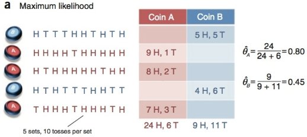
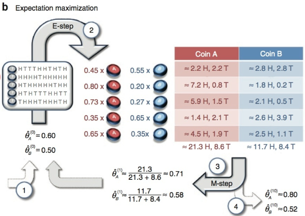
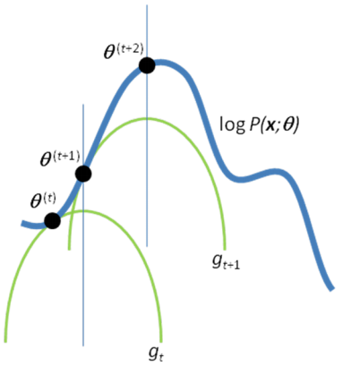

### EM算法原理解析

***

【参考资料】

吴恩达	CS229课程资料

[What is the expectation maximization algorithm?](https://www.nature.com/articles/nbt1406#f1)

#### 1. EM算法引入

EM算法，是在数据分布中存在隐变量（latent variable）的情况下，对参数进行极大似然估计的方法。有隐变量的似然函数的形式一般是和的对数，在应用传统极大似然法时，对这个函数求导是非常麻烦的，EM算法的引入巧妙地解决了这个问题。

引入EM算法时最常用的例子就是三硬币模型，这里给出这个例子的变体版本，来说明EM算法和极大似然估计的区别。

现在有两枚硬币A和B，我们进行如下实验：在每轮中，随机选取一枚硬币，投掷十次，记录下正面和反面朝上的情况，一共进行五轮实验，即共投掷50次。现在我们的任务是估计硬币A和B正面朝上的概率$\theta_A，\theta_B$。在已知每轮选择的是哪枚硬币的前提下，参数估计非常简单，直接应用极大似然估计法，可以得到
$$
\hat { \theta } _ { A } = \frac { \# \text { of heads using } \operatorname { coin } A } { \text { total } \# \text { of flips using coin } A } \tag{1.1}
$$

$$
\hat { \theta } _ { B } = \frac { \# \text { of heads using coin } \mathrm { B } } { \text { total } \# \text { of flips using coin } \mathrm { B } } \tag{1.2}
$$

如下图所示：

但如果我们不知道每轮投掷的是哪枚硬币，情况就比较麻烦了，在利用式（1.1）和（1.2）计算时，我们无法知道分母的确切大小，我们知道的只有分子。这时候，每轮投掷的具体是哪枚硬币，对于我们来说，就是一个隐变量。我们称这种情况下观测到的硬币朝向是不完全数据。要解决这类问题，就需要EM算法的帮助。

EM算法是一个两步的迭代过程。我们先初始化一组参数$\hat { \theta } _ { A } ^ { ( 0 ) }$，$\hat { \theta } _ { B } ^ { ( 0 ) }$，然后利用它们去估计隐变量的概率分布，这对应E-Step；在确定隐变量概率分布后，我们也不是去选择某一个具体的隐变量取值（即选择硬币A还是B），而是考虑所有可能的情况（即可能选择A也可能选择B），这时极大似然估计的对象就变成了观测到的结果对隐变量概率分布的数学期望（即每轮选择硬币A的概率乘上对应轮次正反面朝上的次数，加上选择硬币B的概率乘上对应轮次正反面朝上的次数，如上图所示），这对应M-Step。估计得到新的参数后，在开始新一轮的迭代，直到算法收敛为止。这就是EM算法的基本思想，即“期望最大化”。

#### 2. 数学推导过程

数学推导的过程按照吴恩达CS229的思路给出。

假设训练数据集为$\left\{ x ^ { ( 1 ) } , \ldots , x ^ { ( m ) } \right\}$，包含$m$个样本，隐变量用$z$表示。现在要拟合数据的完全分布，似然函数如下：
$$
\begin{aligned} \ell ( \theta ) & = \sum _ { i = 1 } ^ { m } \log p ( x ; \theta ) \\ & = \sum _ { i = 1 } ^ { m } \log \sum _ { z } p ( x , z ; \theta ) \end{aligned}
$$
上式中第二个等号的来源是边缘概率分布的求法。

对于每一个样本$i$，我们假设$z$服从某种分布$Q _ { i }$，则$Q _ { i }$满足$\sum _ { z } Q _ { i } ( z ) = 1$，$Q _ { i } ( z ) \geq 0$。

考虑如下推导过程：
$$
\begin{eqnarray} \sum _ { i } \log p \left( x ^ { ( i ) } ; \theta \right) & =& \sum _ { i } \log \sum _ { z ^ { ( i ) } } p \left( x ^ { ( i ) } , z ^ { ( i ) } ; \theta \right) \tag{2.1}\\ & = &\sum _ { i } \log \sum _ { z ^ { ( i ) } } Q _ { i } \left( z ^ { ( i ) } \right) \frac { p \left( x ^ { ( i ) } , z ^ { ( i ) } ; \theta \right) } { Q _ { i } \left( z ^ { ( i ) } \right) } \tag{2.2}\\ & \geq& \sum _ { i } \sum _ { z ^ { ( i ) } } Q _ { i } \left( z ^ { ( i ) } \right) \log \frac { p \left( x ^ { ( i ) } , z ^ { ( i ) } ; \theta \right) } { Q _ { i } \left( z ^ { ( i ) } \right) } \tag{2.3}\end{eqnarray}
$$
直接最大化式（2.2）是很困难的，因为这是和的对数形式。所以在上式的最后一步转化为了求式（2.2）的下界，这里利用了Jensen不等式：
$$
\mathrm { E } [ f ( X ) ] \geq f ( \mathrm { E } X ) \tag{2.4}
$$
在式（2.2）中，$\sum _ { z ^ { ( i ) } } Q _ { i } \left( z ^ { ( i ) } \right) \left[ \frac { p \left( x ^ { ( i ) } , z ^ { ( i ) } ; \theta \right) } { Q _ { i } \left( z ^ { ( i ) } \right) } \right]$可以写成期望的形式，即：
$$
\sum _ { z ^ { ( i ) } } Q _ { i } \left( z ^ { ( i ) } \right) \left[ \frac { p \left( x ^ { ( i ) } , z ^ { ( i ) } ; \theta \right) } { Q _ { i } \left( z ^ { ( i ) } \right) } \right]=\mathrm { E } _ { z ^ { ( i ) } \sim Q _ { i } } \left[ \frac { p \left( x ^ { ( i ) } , z ^ { ( i ) } ; \theta \right) } { Q _ { i } \left( z ^ { ( i ) } \right) } \right]
$$
在根据Jensen不等式，就可以得到
$$
f \left( \mathrm { E } _ { \mathrm { z } ^ { ( i ) } \sim Q _ { i } } \left[ \frac { p \left( x ^ { ( i ) } , z ^ { ( i ) } ; \theta \right) } { Q _ { i } \left( z ^ { ( i ) } \right) } \right] \right) \geq \mathrm { E } _ { z ^ { ( i ) } \sim Q _ { i } } \left[ f \left( \frac { p \left( x ^ { ( i ) } , z ^ { ( i ) } ; \theta \right) } { Q _ { i } \left( z ^ { ( i ) } \right) } \right) \right]
$$
即式（2.3）。

对于任意形式的分布$Q _ { i }​$，式（2.3）都给出了似然$\sum _ { i } \log p \left( x ^ { ( i ) } ; \theta \right)​$的一个下界。现在我们要做的是，使式（2.3）成为一个tight的lower bound，这样才能保证我们在最大化下界的同时，也能最大化对数似然$\sum _ { i } \log p \left( x ^ { ( i ) } ; \theta \right)​$。

于是，我们就要保证在（当前的）$\theta$点，似然函数$\sum _ { i } \log p \left( x ^ { ( i ) } ; \theta \right)$的取值与式（2.3）的取值相同，即Jensen不等式要取到等号。这里需要用到Jensen不等式的一个重要性质：在式（2.4）中，若$X$的取值是一个常数，则不等式取等号。对于式（2.2）和（2.3）来说，也就是要求
$$
\frac { p \left( x ^ { ( i ) } , z ^ { ( i ) } ; \theta \right) } { Q _ { i } \left( z ^ { ( i ) } \right) } = c \tag{2.5}
$$
其中$c$为常数。把式（2.5）稍微变换以下，并且两边求和，即
$$
\sum _ { z } p \left( x ^ { i } , z ^ { ( i ) } ; \theta \right) = \sum _ { z } Q _ { i } \left( z ^ { ( i ) } \right) c
$$
同时，根据$\sum _ { z } Q _ { i } \left( z ^ { ( i ) } \right) = 1$，可得
$$
\sum _ { z } p \left( x ^ { i } , z ^ { ( i ) } ; \theta \right) = c
$$
于是乎，我们再把式（2.5）变换一下，即可得到：
$$
\begin{aligned} Q _ { i } \left( z ^ { ( i ) } \right) & = \frac { p \left( x ^ { ( i ) } , z ^ { ( i ) } ; \theta \right) } { \sum _ { z } p \left( x ^ { ( i ) } , z ; \theta \right) } \\ & = \frac { p \left( x ^ { ( i ) } , z ^ { ( i ) } ; \theta \right) } { p \left( x ^ { ( i ) } ; \theta \right) } \\ & = p \left( z ^ { ( i ) } | x ^ { ( i ) } ; \theta \right) \end{aligned}
$$
这说明，当$Q _ { i }$取为$z ^ { ( i ) }$的后验概率分布时，式（2.3）即可成为似然$\sum _ { i } \log p \left( x ^ { ( i ) } ; \theta \right)$的一个tight的lower bound，我们就可以通过最大化式（2.3）来最大化似然函数，从而求得参数$\theta$。

所以**EM算法的流程**如下：

* **E-Step**：对于每一个样本$i$，求
  $$
  Q _ { i } \left( z ^ { ( i ) } \right) : = p \left( z ^ { ( i ) } | x ^ { ( i ) } ; \theta \right) \tag{2.6}
  $$

* **M-Step**：更新参数$\theta$
  $$
  \theta : = \arg \max _ { \theta } \sum _ { i } \sum _ { z ^ { ( i ) } } Q _ { i } \left( z ^ { ( i ) } \right) \log \frac { p \left( x ^ { ( i ) } , z ^ { ( i ) } ; \theta \right) } { Q _ { i } \left( z ^ { ( i ) } \right) } \tag{2.7}
  $$

#### 3. EM算法的收敛性

假设$\theta ^ { ( t ) }$和$\theta ^ { ( t + 1 ) }$是两次连续迭代过程的参数，现在我们要证明每次参数更新确实能使似然函数$\ell \left( \theta   \right)$增大，即证明$\ell \left( \theta ^ { ( t ) } \right) \leq \ell \left( \theta ^ { ( t + 1 ) } \right)$，那么EM算法就能收敛。

我们从参数$\theta ( t )$开始，由第2节的分析可以知道，选择$Q _ { i } ^ { ( t ) } \left( z ^ { ( i ) } \right) : = p \left( z ^ { ( i ) } | x ^ { ( i ) } ; \theta ^ { ( t ) } \right)$，那么Jensen不等式的等号成立，有
$$
\ell \left( \theta ^ { ( t ) } \right) = \sum _ { i } \sum _ { z ^ { ( i ) } } Q _ { i } ^ { ( t ) } \left( z ^ { ( i ) } \right) \log \frac { p \left( x ^ { ( i ) } , z ^ { ( i ) } ; \theta ^ { ( t ) } \right) } { Q _ { i } ^ { ( t ) } \left( z ^ { ( i ) } \right) } \tag{3.1}
$$
新的参数$\theta ^ { ( t + 1 ) }$是通过最大化上式右侧得来的，即
$$
\theta ^ { ( t + 1 ) }=\arg \max _ { \theta } \sum _ { i } \sum _ { z ^ { ( i ) } } Q _ { i } \left( z ^ { ( i ) } \right) \log \frac { p \left( x ^ { ( i ) } , z ^ { ( i ) } ; \theta \right) } { Q _ { i } \left( z ^ { ( i ) } \right) }
$$
显然有
$$
\sum _ { i } \sum _ { z ^ { ( i ) } } Q _ { i } ^ { ( t ) } \left( z ^ { ( i ) } \right) \log \frac { p \left( x ^ { ( i ) } , z ^ { ( i ) } ; \theta ^ { ( t + 1 ) } \right) } { Q _ { i } ^ { ( t ) } \left( z ^ { ( i ) } \right) } \\
\qquad \geq \sum _ { i } \sum _ { z ^ { ( i ) } } Q _ { i } ^ { ( t ) } \left( z ^ { ( i ) } \right) \log \frac { p \left( x ^ { ( i ) } , z ^ { ( i ) } ; \theta ^ { ( t ) } \right) } { Q _ { i } ^ { ( t ) } \left( z ^ { ( i ) } \right) }
$$
于是有
$$
\begin{aligned} \ell \left( \theta ^ { ( t + 1 ) } \right) & \geq \sum _ { i } \sum _ { z ^ { ( i ) } } Q _ { i } ^ { ( t ) } \left( z ^ { ( i ) } \right) \log \frac { p \left( x ^ { ( i ) } , z ^ { ( i ) } ; \theta ^ { ( t + 1 ) } \right) } { Q _ { i } ^ { ( t ) } \left( z ^ { ( i ) } \right) } \\ & \geq \sum _ { i } \sum _ { z ^ { ( i ) } } Q _ { i } ^ { ( t ) } \left( z ^ { ( i ) } \right) \log \frac { p \left( x ^ { ( i ) } , z ^ { ( i ) } ; \theta ^ { ( t ) } \right) } { Q _ { i } ^ { ( t ) } \left( z ^ { ( i ) } \right) } \\ & = \ell \left( \theta ^ { ( t ) } \right) \end{aligned}
$$
所以EM算法的收敛性即可得到证明。

#### 4. 另一种数学形式

一些资料中EM算法有另外一种形式的定义，即引入所谓的$Q$函数。

$Q$函数的定义如下：
$$
Q ( \boldsymbol { \theta } | \boldsymbol { \theta } ^ { ( t ) } ) = \mathrm { E } _ { \mathbf { Z } \left| \mathbf { X } , \boldsymbol { \theta } ^ { ( t ) } \right. } [ \log P (\mathbf { X } , \mathbf { Z } | \boldsymbol { \theta } ) ] = \sum _ {\mathbf { Z }} \log P (\mathbf { X } , \mathbf { Z } | \boldsymbol { \theta } )P(\mathbf { Z }|\mathbf { X },\theta^{(t)})
$$
为方便起见，这里省略了对样本的求和，只考虑单个样本的情况。

那么EM算法表述为：

* **E-Step**：计算
  $$
  Q ( \boldsymbol { \theta } | \boldsymbol { \theta } ^ { ( t ) } ) =\sum _ {\mathbf { Z }} \log P (\mathbf { X } , \mathbf { Z } | \boldsymbol { \theta } )P(\mathbf { Z }|\mathbf { X },\theta^{(t)}) \tag{4.1}
  $$

* **M-Step**：更新参数
  $$
  \boldsymbol { \theta } ^ { ( t + 1 ) } = \underset { \boldsymbol { \theta } } { \arg \max } Q ( \boldsymbol { \theta } | \boldsymbol { \theta } ^ { ( t ) } ) \tag{4.2}
  $$

这种定义方式与第2节末的定义方式完全相同。在式（4.1）中，已知$\theta^{(t)}$的情况下，我们实际能求解的是$P ( \mathbf { Z } | \mathbf { X } , \theta ^ { ( t ) } )​$，即式（2.6）；而式（2.7）可改写为：
$$
\theta^{(t+1)} = \arg \max _ { \theta } \sum _ { i } \sum _ { z ^ { ( i ) } } [Q _ { i } \left( z ^ { ( i ) } \right) \log{ p \left( x ^ { ( i ) } , z ^ { ( i ) } ; \theta \right) }- { Q _ { i } \left( z ^ { ( i ) } \right)\log{Q_{i}(z^{(i)})} }]
$$
$\theta^{(t)}$已知的情况下，上式中中括号内的后一项与我们要优化的目标$\theta$无关，可以省略，于是有
$$
\begin{aligned}
\theta^{(t+1)} &= \arg \max _ { \theta } \sum _ { i } \sum _ { z ^ { ( i ) } } Q _ { i } \left( z ^ { ( i ) } \right) \log{ p \left( x ^ { ( i ) } , z ^ { ( i ) } ; \theta \right) }
\\ &= \arg \max _ { \theta } \sum _ { i } \sum _ { z ^ { ( i ) } } p \left( z ^ { ( i ) } | x ^ { ( i ) } ; \theta ^{(t)} \right) \log{ p \left( x ^ { ( i ) } , z ^ { ( i ) } ; \theta \right) }
\end{aligned}
$$
此即式（4.2）的形式。

#### 5. 理解EM算法

本质上，EM算法就是在当前参数$\theta^{(t)}$这个点，不断构建似然函数的tight lower bound，然后通过最大化这个lower bound，来实现增大似然函数的目标。当然，EM算法不能保证找到全局最优点。

