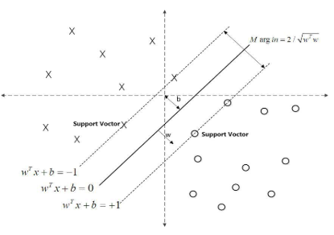
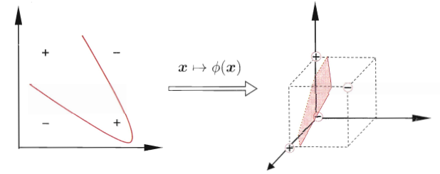
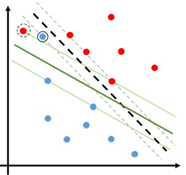

## SVM基本原理详解

### 0. 参考资料

**CSDN **@[v_JULY_v](https://me.csdn.net/v_JULY_v)    [支持向量机通俗导论（理解SVM的三层境界）](https://blog.csdn.net/v_JULY_v/article/details/7624837)

李航   	《统计学习方法》 清华大学出版社

周志华  	《机器学习》	清华大学出版社

### 1. 公式速查

这里给出SVM的公式总结，旨在帮助已经比较熟悉SVM基本原理但又不记得具体数学内容的读者进行简单的回忆。

* 硬间隔

  * 原始问题
    $$
    \begin{eqnarray} & { \min _ { w , b } } & &{ \frac { 1 } { 2 } \| w  \| ^ { 2 } }& \\ 
    & { \text { s.t. } } & &{ y _ { i } \left( w \cdot x _ { i } + b \right) - 1 \geqslant 0 , \quad i = 1,2 , \cdots , N } \end{eqnarray} 
    $$

  * 对偶问题
    $$
    \begin{eqnarray} 
    \max _ { \alpha }  & \quad & - \frac { 1 } { 2 } \sum _ { i = 1 } ^ { N } \sum _ { j = 1 } ^ { N } \alpha _ { i } \alpha _ { j } y _ { i } y _ { j } \left( x _ { i } \cdot x _ { j } \right) + \sum _ { i = 1 } ^ { N } \alpha _ { i }  \\ 
    { \text { s.t. } } & \quad & { \sum _ { i = 1 } ^ { N } \alpha _ { i } y _ { i } = 0 } \\ 
    & \quad & { \alpha _ { i } \geqslant 0 , \quad i = 1,2 , \cdots , N } 
    \end{eqnarray}
    $$

* 软间隔

  * 原始问题
    $$
    \begin{eqnarray}
    \min _   { \boldsymbol { w } , b , \xi _ { i } } &\quad& \frac { 1 } { 2 } \| \boldsymbol { w } \| ^ { 2 } + C \sum _ { i = 1 } ^ { N } \xi _ { i } \\
    \text { s.t. } &\quad& y _ { i } \left( \boldsymbol { w } ^ { \mathrm { T } } \boldsymbol { x } _ { i } + b \right) \geqslant 1 - \xi _ { i }  \\ 
    &\quad& \xi _ { i } \geqslant 0 , i = 1,2 , \ldots , N 
    \end{eqnarray}
    $$

  * 对偶问题
    $$
    \begin{eqnarray} \max _ { \alpha } & \quad & { \sum _ { i = 1 } ^ {N } \alpha _ { i } - \frac { 1 } { 2 } \sum _ { i = 1 } ^ { N } \sum _ { j = 1 } ^ { N } \alpha _ { i } \alpha _ { j } y _ { i } y _ { j } \boldsymbol { x } _ { i } ^ { \mathrm { T } } \boldsymbol { x } _ { j } } \\ 
    \text { s.t. }  & \quad &  \sum _ { i = 1 } ^ { N } \alpha _ { i } y _ { i } = 0  \\ 
    & \quad & { 0 \leqslant \alpha _ { i } \leqslant C , \quad i = 1,2 , \ldots , m } \end{eqnarray}
    $$

* 常用的核函数

  

### 2. 基本原理	

考虑一个二分类问题，假定训练数据集为
$$
T = \left\{ \left( x _ { 1 } , y _ { 1 } \right) , \left( x _ { 2 } , y _ { 2 } \right) , \cdots , \left( x _ { N } , y _ { N } \right) \right\}
$$
需要注意的是，标签$y _ { i } \in \mathcal { Y } = \{ + 1 , - 1 \} , \quad i = 1,2 , \cdots , N$。当$y _ { i } = + 1$时，称$x_{i}$为正例；当$y _ { i } = - 1$时，称$x_{i}$为负例。

假定数据时线性可分的，学习的目标是找到分离超平面$w ^ { T } x + b=0$，这个超平面由法向量$w$和距离原点的位移项$b$确定。可以正确划分数据集的超平面可能有数个，而SVM的目标就是要找到一个**唯一的“最佳”划分超平面**。为了描述划分超平面的好坏，我们首先引入**间隔**的概念。

#### 2.1 函数间隔与几何间隔

在超平面$w ^ { T } x + b=0$确定的情况下，$| w ^ {T} x + b |$能够相对的表示点$x$距离超平面的远近。而$ w ^ {T} x + b$的符号与类标记$y$的符号是否一致能够表示分类是否正确。所以，我们可以用$y ( w  ^{T} x + b )$来表示分类的正确性及确信度，由此可以引出**函数间隔（Functional margin）**的概念。

定义超平面$(w, b)$关于样本点$(x_{i}, y_{i})$的函数间隔为：
$$
\hat { \gamma }_{i} = y _ {i} \left( w ^ { T } x _ {i} + b \right) \tag{2.1.1}
$$
同时，定义超平面$(w, b)$关于训练数据集$T$的函数间隔为超平面$(w, b)$关于$T$中所有样本点$(x_{i}, y_{i})$的函数间隔的最小值，即
$$
\hat { \gamma } = \min _ { l = 1 , \cdots , N } \hat { \gamma } _ { i } \tag{2.1.2}
$$
但是，函数间隔的定义存在问题。我们注意到，只要成比例的改变$w$和$b$，例如，将它们改为$2w$和$2b$，超平面并没有改变，但函数间隔却称为原来的2倍，这显然不是我们想要的。一个可行的方法是，我们可以对法向量$w$增加约束，使得间隔是固定的，这就引出了**几何间隔（Geometric margin）**的概念。

假定对于一个点$x$，令其垂直投影到超平面上的对应点为$x_0$ ，$w$是垂直于超平面的一个向量，$\gamma$为样本$x$到超平面的距离，如下图所示：

根据平面几何知识，有
$$
x = x _ { 0 } + \gamma \frac { w } { \| w \| } \tag{2.1.3}
$$
其中$ \| w \| $表示$w$的2范数，而$w/\|w\|$即为单位向量。由于$x_0$是超平面上的点，将之代入超平面方程，我们可以得到$w ^ { T } x _ { 0 } + b = 0$，即$w ^ { T } x _ { 0 } = - b$。

在式（2.1.3）的两边同乘以$w^{T}$，根据$w ^ { T } x _ { 0 } = - b$和$w ^ { T } w = \| w \| ^ { 2 }$，我们可以得到：
$$
\gamma = \frac { w ^ { T } x + b } { \| w \| } \tag{2.1.4}
$$
当然，为了表示分类的正确与否，我们还要令式（2.1.4）乘上对应的类别$y$，于是，对于一个样本点$(x_{i}, y_{i})$，我们即可得出它的几何间隔：
$$
\tilde { \gamma_{i} } = y_{i} \gamma_{i} = \frac { y_{i}(w ^ { T } x + b) } { \| w \| } = \frac { \hat { \gamma_{i} } } { \| w \| } \tag{2.1.5}
$$
式（2.1.5）告诉我们，几何间隔$\tilde { \gamma_{i} }$就是函数间隔$\hat { \gamma_{i} }$除以$ \| w \| $的结果。当超平面参数$w$和$b$成比例改变时（超平面没有改变），几何间隔不变。因此，几何间隔就是我们所寻求的真正的超平面关于点的间隔。

类似地，我们可以像式（2.1.2）那样定义定义超平面$(w, b)$关于训练数据集$T$的几何间隔，此处不再赘述。

#### 2.2 硬间隔最大化

有了间隔的定义之后，我们的目标就变成了找到**距离数据点“间隔”最大的超平面**，这样的超平面具有最高的分类确信度。

要找到最大间隔分离超平面，就是要使几何间隔最大，于是有下列约束优化问题
$$
\begin{eqnarray} &{ \max _ { w , b } } &  &{ \tilde \gamma }& \\ 
&{ \text { s.t. } } & &{ y _ { i } \left( \frac { w } { \| w \| } \cdot x _ { i } + \frac { b } { \| w \| } \right) \geqslant \tilde \gamma  , \quad i = 1,2 , \cdots , N } \end{eqnarray}
$$
即我们希望最大化超平面$(w, b)$关于训练数据集的几何间隔$\tilde \gamma$，约束条件表示的是超平面$(w, b)$关于每个训练样本点的几何间隔至少是$\tilde \gamma$。

考虑几何间隔和函数间隔的关系式（2.1.5），可以将这个问题改写为
$$
\begin{eqnarray} & { \max _ { w , b } } & &{ \frac { \hat { \gamma } } { \| w \| } }& \\ 
& { \text { s.t. } } & &{ y _ { i } \left( w \cdot x _ { i } + b \right) \geqslant \hat { \gamma } , \quad i = 1,2 , \cdots , N } \end{eqnarray}
$$
同时我们注意到，函数间隔$\hat { \gamma }$的取值并不影响最优化问题的解。事实上，如果我们将$w$和$b$按比例改变为$\lambda w$和$\lambda b$，这是函数间隔变为$\lambda \hat \gamma$。函数间隔的这一改变对上面优化问题的目标函数和不等式约束都没有影响，换言之，这样做产生了一个等价问题。于是，为了方便起见，我们取$\hat \gamma=1$，代入上面的优化问题，同时注意到，最大化$\frac { 1 } { \| w \| }$和$\frac { 1 } { 2 } \| w \| ^ { 2 }$是等价的，于是可以得到下面的优化问题：
$$
\begin{eqnarray} & { \min _ { w , b } } & &{ \frac { 1 } { 2 } \| w  \| ^ { 2 } }& \\ 
& { \text { s.t. } } & &{ y _ { i } \left( w \cdot x _ { i } + b \right) - 1 \geqslant 0 , \quad i = 1,2 , \cdots , N } \end{eqnarray} \tag{2.2.1}
$$
这是一个QP问题，我们将它称为SVM的**基本型**。

我们可以通过下图来进一步理解这个问题，图中的实线就是寻找到的最优超平面，其到虚线两条边界的距离相等，这个距离便是几何间隔$\tilde \gamma=\frac { 1 } { \| w \| }$（注意我们已经将函数间隔定义为了1），两条虚线间隔边界之间的距离等于$2 \tilde \gamma$。

注意到，没有任何点落在两条虚线边界之间。而虚线边界上的点被称为**支持向量（Support vector）**，它们满足方程$w ^ { T } x + b = 1$（正例）或$w ^ { T } x + b = - 1$（负例）。

很显然，在决定分离超平面时，只有支持向量起作用，对于不是支持向量的点，我们将其去掉也完全不改变解，这就是SVM的名称**支持向量机（Support Vector Machine）**的由来。支持向量的个数一般很少，或者说它们是稀疏的，所以支持向量机只由很少的“重要的”训练样本决定。

这样做的一大优势是，在面临明显的异常数据点（Outlier）时，只要我们不将其选为支持向量，那么异常点对最后得到的分类模型就没有任何影响。

#### 2.3 对偶问题

这部分的内容涉及到一系列凸优化理论的知识，包括拉格朗日对偶、强对偶性、Slater条件、KKT条件等，如果想要深入了解，不妨去另外查看一些相应的资料。当然，如果对这些理论不熟悉也不要紧，只需要知道我们**引入对偶问题的目的是为了进一步简化问题的求解，以及引出SVM的核心——核函数**。

为了得到问题（2.2.1）的对偶问题，我们首先构建**拉格朗日函数（Lagrange function）**，有：
$$
\mathcal { L } ( w , b , \alpha ) = \frac { 1 } { 2 } \| w \| ^ { 2 } - \sum _ { i = 1 } ^ { n } \alpha _ { i } \left( y _ { i } \left( w ^ { T } x _ { i } + b \right) - 1 \right) \tag{2.3.1}
$$
其中，$\alpha = \left( \alpha _ { 1 } , \alpha _ { 2 } , \cdots , \alpha _ { N } \right) ^ { \mathrm { T } }$为拉格朗日乘子向量。

对式（2.3.1）在$(w, b)$上求下界，即将拉格朗日函数$\mathcal { L } ( w , b , \alpha )$分别对$w,b$求偏导数并令其等于0：
$$
\begin{aligned} \nabla _ { w } L ( w , b , \alpha ) & = w - \sum _ { i = 1 } ^ { N } \alpha _ { i } y _ { i } x _ { i } = 0 \\ \nabla _ { b } L ( w , b , \alpha ) & = \sum _ { i = 1 } ^ { N } \alpha _ { i } y _ { i } = 0 \end{aligned}
$$
得
$$
\begin{eqnarray} { w = \sum _ { i = 1 } ^ { N } \alpha _ { i } y _ { i } x _ { i } } \tag{2.3.2} \\
{ \sum _ { i = 1 } ^ { N } \alpha _ { i } y _ { i } = 0 } \tag{2.3.3} \end{eqnarray}
$$
将上述结果代入式（2.3.1），我们可以得到**拉格朗日对偶函数（Lagrange dual function）**：
$$
\begin{eqnarray}
g (\alpha) &=& \inf _ {w,b} \mathcal { L } ( w , b , \alpha ) \\
&=& \frac { 1 } { 2 } \sum _ { i , j = 1 } ^ { n } \alpha _ { i } \alpha _ { j } y _ { i } y _ { j } x _ { i } ^ { T } x _ { j } - \sum _ { i , j = 1 } ^ { n } \alpha _ { i } \alpha _ { j } y _ { i } y _ { j } x _ { i } ^ { T } x _ { j } - b \sum _ { i = 1 } ^ { n } \alpha _ { i } y _ { i } + \sum _ { i = 1 } ^ { n } \alpha _ { i }  \\ 
&=& \sum _ { i = 1 } ^ { n } \alpha _ { i } - \frac { 1 } { 2 } \sum _ { i , j = 1 } ^ { n } \alpha _ { i } \alpha _ { j } y _ { i } y _ { j } x _ { i } ^ { T } x _ { j } \tag{2.3.4}
\end{eqnarray}
$$
（详细的推导过程请见CSDN **@[v_JULY_v](https://me.csdn.net/v_JULY_v)    [支持向量机通俗导论（理解SVM的三层境界](https://blog.csdn.net/v_JULY_v/article/details/7624837)）

对式（2.3.4）求极大，并且加上式（2.3.3）和$\alpha _ { i } \geqslant 0$的约束条件，可以得到对偶问题：
$$
\begin{eqnarray} 
\max _ { \alpha }  & \quad & - \frac { 1 } { 2 } \sum _ { i = 1 } ^ { N } \sum _ { j = 1 } ^ { N } \alpha _ { i } \alpha _ { j } y _ { i } y _ { j } \left( x _ { i } \cdot x _ { j } \right) + \sum _ { i = 1 } ^ { N } \alpha _ { i }  \\ 
{ \text { s.t. } } & \quad & { \sum _ { i = 1 } ^ { N } \alpha _ { i } y _ { i } = 0 } \\ 
& \quad & { \alpha _ { i } \geqslant 0 , \quad i = 1,2 , \cdots , N } 
\end{eqnarray}
\tag{2.3.5}
$$
原始问题（2.2.1）满足Slater条件，即强对偶性成立，因此可以根据对偶问题（2.3.5）的最优解$\alpha ^ *$求原始问题（2.2.1）的最优解$w^* $和$b^*$。

注意到原始问题（2.2.1）中存在不等式约束，因此可以得到KKT条件：
$$
\begin{array} { l } { \nabla _ { w } L \left( w ^ { * } , b ^ { * } , \alpha ^ { * } \right) = w ^ { * } - \sum _ { i = 1 } ^ { N } \alpha _ { i } ^ { * } y _ { i } x _ { i } = 0 } \\ { \nabla _ { b } L \left( w ^ { * } , b ^ { * } , \alpha ^ { * } \right) = - \sum _ { i = 1 } ^ { N } \alpha _ { i } ^ { * } y _ { i } = 0 } \\ { \alpha _ { i } ^ { * } \left( y _ { i } \left( w ^ { * } \cdot x _ { t } + b ^ { * } \right) - 1 \right) = 0 , \quad i = 1,2 , \cdots , N } \\ { y _ { i } \left( w ^ { * } \cdot x _ { i } + b ^ { * } \right) - 1 \geqslant 0 , \quad i = 1,2 , \cdots , N } \\ { \alpha _ { i } ^ { * } \geqslant 0 , \quad i = 1,2 , \cdots , N } \end{array}
$$
由此可以得到：
$$
w ^ { * } = \sum _ { i = 1 } ^ { N } \alpha _ { i } ^ { * } y _ { i } x _ { i } \tag{2.3.6}
$$
KKT条件告诉我们，对于任意训练样本$(x_i,y_i)$，总有$\alpha_i=0$或$y _ { i } f \left( \boldsymbol { x } _ { i } \right) = 1$。若$\alpha_i=0$，则该样本不会在式（2.3.6）的求和中出现，也就不会对$f(x)$有任何影响；若$\alpha_i>0$，则必有$y _ { i } f \left( \boldsymbol { x } _ { i } \right) = 1$，所对应的样本点位于最大间隔边界上，是一个支持向量。换言之，**SVM的参数只与支持向量有关**。

$b^*$的求解要稍微复杂一些。首先我们知道，在$\alpha ^ { * } = \left( \alpha _ { 1 } ^ { * } , \alpha _ { 2 } ^ { * } , \cdots , \alpha _ { i } ^ { * } \right) ^ { \mathrm { T } }$中，存在下标$j$，使得$\alpha _ { j } ^ { * } > 0$（如果$\alpha^*=0$，由式（2.3.6）可知$w^*=0$，这显然不是原始问题的解，产生矛盾）。对此$j$有：
$$
y _ { j } \left( w ^ { * } \cdot x _ { j } + b ^ { * } \right) - 1 = 0 \tag{2.3.7}
$$
将式（2.3.6）代入式（2.3.7），并注意到$y _ { j } ^ { 2 } = 1$，在两边同乘以$y_{j}$，即得：
$$
b ^ { * } = y _ { j } - \sum _ { i = 1 } ^ { N } \alpha _ { i } ^ { * } y _ { i } \left( x _ { i } \cdot x _ { j } \right) \tag{2.3.8}
$$
于是，分离超平面可以写成：
$$
\sum _ { i = 1 } ^ { N } \alpha _ { i } ^ { * } y _ { i } \left( x \cdot x _ { i } \right) + b ^ { * } = 0 \tag{2.3.9}
$$

#### 2.4 核函数

在之前的讨论中，我们假设训练数据集是线性可分的，但在现实任务中，我们碰到的往往是线性不可分的情况。对于这样的问题，可将样本从原始空间映射到一个更高维的特征空间，使得样本在这个特征空间线性可分。例如在下图中，异或问题就是一个典型的线性不可分问题，我们将原始的二维空间映射到一个合适的三维空间，就能找到一个合适的划分超平面。

令$\phi ( \boldsymbol { x } )$表示将$x$映射后的向量，于是，在特征空间中划分超平面所对应的模型可表示为：
$$
f ( \boldsymbol { x } ) = \boldsymbol { w } ^ { \mathrm { T } } \phi ( \boldsymbol { x } ) + b
$$
与式（2.2.1）类似，我们可以得到下列优化问题：
$$
\begin{eqnarray}
\min _ { w , b }  &\quad& \frac { 1 } { 2 } \| \boldsymbol { w } \| ^ { 2 }  
\\ 
\text { s.t. } &\quad&  y _ { i } \left( \boldsymbol { w } ^ { \mathrm { T } } \phi \left( \boldsymbol { x } _ { i } \right) + b \right) \geqslant 1 , \quad i = 1,2 , \ldots , N 
\end{eqnarray}
\tag{2.4.1}
$$
其对偶问题是：
$$
\begin{eqnarray}
\max _ { \alpha }  &\quad& \sum _ { i = 1 } ^ { N } \alpha _ { i } - \frac { 1 } { 2 } \sum _ { i = 1 } ^ { N} \sum _ { j = 1 } ^ { N } \alpha _ { i } \alpha _ { j } y _ { i } y _ { j } \phi \left( \boldsymbol { x } _ { i } \right) ^ { \mathrm { T } } \phi \left( \boldsymbol { x } _ { j } \right) \\
\text { s.t. }  &\quad&  { \sum _ { i = 1 } ^ { N } \alpha _ { i } y _ { i } = 0 } 
\\
&\quad& \alpha _ { i } \geqslant 0 , \quad i = 1,2 , \ldots , N
\end{eqnarray}
\tag{2.4.2}
$$
求解问题（2.4.2）涉及到计算$\phi \left( \boldsymbol { x } _ { i } \right) ^ { \mathrm { T } } \phi \left( \boldsymbol { x } _ { j } \right)$，这是样本$\boldsymbol { x } _ { i }$与$\boldsymbol { x } _ { j}$映射到特征空间之后的内积。由于特征空间的维数可能很高，甚至可能是无穷维，因此直接计算$\phi \left( \boldsymbol { x } _ { i } \right) ^ { \mathrm { T } } \phi \left( \boldsymbol { x } _ { j } \right)$通常是困难的。为了简化运算，我们可以设想这样一个函数：
$$
\kappa \left( \boldsymbol { x } _ { i } , \boldsymbol { x } _ { j } \right) = \left\langle \phi \left( \boldsymbol { x } _ { i } \right) , \phi \left( \boldsymbol { x } _ { j } \right) \right\rangle = \phi \left( \boldsymbol { x } _ { i } \right) ^ { \mathrm { T } } \phi \left( \boldsymbol { x } _ { j } \right) \tag{2.4.3}
$$
即**$\boldsymbol { x } _ { i }$与$\boldsymbol { x } _ { j}$在特征空间的内积等于它们在原始样本空间中通过函数$\kappa ( \cdot , \cdot )$计算的结果**。这个方法被称为**核技巧（Kernel trick）**。有了这样的函数，我们就不必直接去计算高维甚至无穷维特征空间中的内积，于是问题（2.4.2）可以重写为：
$$
\begin{eqnarray}
\max _ { \alpha }  &\quad& \sum _ { i = 1 } ^ { N } \alpha _ { i } - \frac { 1 } { 2 } \sum _ { i = 1 } ^ { N } \sum _ { j = 1 } ^ { N } \alpha _ { i } \alpha _ { j } y _ { i } y _ { j } \kappa \left( \boldsymbol { x } _ { i } , \boldsymbol { x } _ { j } \right)  \\ 
\text { s.t. }  &\quad& { \sum _ { i = 1 } ^ { N } \alpha _ { i } y _ { i } = 0 } \\ 
&\quad&  \alpha _ { i } \geqslant 0 , \quad i = 1,2 , \ldots , N  
\end{eqnarray}
\tag{2.4.4}
$$
求解后即可得到：
$$
\begin{aligned} f ( \boldsymbol { x } ) & = \boldsymbol { w } ^ { \mathrm { T } } \phi ( \boldsymbol { x } ) + b \\ & = \sum _ { i = 1 } ^ { N } \alpha _ { i } y _ { i } \phi \left( \boldsymbol { x } _ { i } \right) ^ { \mathrm { T } } \phi ( \boldsymbol { x } ) + b \\ & = \sum _ { i = 1 } ^ { N } \alpha _ { i } y _ { i } \kappa \left( \boldsymbol { x } , \boldsymbol { x } _ { i } \right) + b \end{aligned} \tag{2.4.5}
$$
这里的函数$\kappa ( \cdot , \cdot )$就是**“核函数”（Kernel function）**，一个核函数就隐式地定义了一个特征空间。

当然，并不是所有函数都能作为“核函数”来使用。可以证明，$\kappa$是核函数当且仅当对于任意数据$D = \left\{ x _ { 1 } , x _ { 2 } , \dots , x _ { m } \right\}$，“核矩阵”（Kernel matrix）$\mathbf { K }$总是半正定的：
$$
\mathbf { K } = \left[ \begin{array} { c c c c c } { \kappa \left( \boldsymbol { x } _ { 1 } , \boldsymbol { x } _ { 1 } \right) } & { \dots } & { \kappa \left( \boldsymbol { x } _ { 1 } , \boldsymbol { x } _ { j } \right) } & { \dots } & { \kappa \left( \boldsymbol { x } _ { 1 } , \boldsymbol { x } _ { m } \right) } \\ { \vdots } & { \ddots } & { \vdots } & { \ddots } & { \vdots } \\ { \kappa \left( \boldsymbol { x } _ { i } , \boldsymbol { x } _ { 1 } \right) } & { \cdots } & { \kappa \left( \boldsymbol { x } _ { i } , \boldsymbol { x } _ { j } \right) } & { \cdots } & { \kappa \left( \boldsymbol { x } _ { i } , \boldsymbol { x } _ { m } \right) } \\ { \vdots } & { \ddots } & { \vdots } & { \ddots } & { \vdots } \\ { \kappa \left( \boldsymbol { x } _ { m } , \boldsymbol { x } _ { 1 } \right) } & { \cdots } & { \kappa \left( \boldsymbol { x } _ { m } , \boldsymbol { x } _ { j } \right) } & { \cdots } & { \kappa \left( \boldsymbol { x } _ { m } , \boldsymbol { x } _ { m } \right) } \end{array} \right]
$$
因此，只要一个对称函数所对应的核矩阵半正定，它就能作为核函数使用。事实上，对于一个半正定核矩阵，总能找到一个与之对应的映射$\phi$。

通过前面的讨论可知，我们希望样本在特征空间内线性可分，因此特征空间的好坏对支持向量机的性能至关重要。而核函数隐式地定义了一个线性空间，于是，**“核函数选择”成为SVM的最大变数**。若核函数选择不合适，则意外着将样本映射到了一个不合适的特征空间，很可能导致性能不佳。

下面列出几种常用的核函数：

#### 2.5 软间隔与正则化

核函数的引入为非线性问题提供一个高效的解决方法，但这样对于解决实际问题还是不够的。在现实任务中往往很难确定合适的核函数使得训练样本在特征空间线性可分；退一步说，即便恰好找到了某个核函数使训练集在特征空间中线性可分，也很难断定这个貌似线性可分的结果是不是由于过拟合所造成的（比如噪声或outlier的存在）。

我们来看下图中的这个例子：

图中，用黑色实线圈出的蓝色点是一个outlier，在不考虑这个outlier的情况下，我们得到的分离超平面和间隔边界在图中分别用深绿色和浅绿色实线表示；在加入这个outlier后，得到的分离超平面和间隔边界用黑色和灰色实线表示。很明显，在outlier点的影响下，分离超平面发生了偏移，并且间隔也变小了。在这种情况下，如果我们要预测一个新的数据点，即图中用黑色虚线圈出的红色点，那么它可能会被错误的分类到蓝色数据点的区域中。这可以被视为是一种过拟合的情况。

缓解该问题的一个办法是允许SVM在一些样本上出错。为此，要引入**软间隔（Soft margin）**的概念，如下图所示。

软间隔允许某些样本不满足约束，对每个样本点$\left( x _ { i } , y _ { i } \right)$引入一个松弛变量$\xi _ { i } \geqslant 0$，使得函数间隔加上松弛变量大于等于1，这样，约束条件就变为：
$$
y _ { i } \left( \boldsymbol { w } ^ { \mathrm { T } } \boldsymbol { x } _ { i } + b \right) \geqslant 1 - \xi_{i}
$$
当松弛变量$\xi_{i}=0$时，约束条件没有发生变化，而$\xi_{i}$越大，对原始约束条件就”违背“的越多，因此我们对松弛变量$\xi_{i}$引入一个惩罚系数$C>0$，目标函数变为：
$$
\frac { 1 } { 2 } \| w \| ^ { 2 } + C \sum _ { i = 1 } ^ { N } \xi _ { i } \tag{2.5.1}
$$
最小化目标函数（2.5.1）包含两层含义：使$\frac { 1 } { 2 } \| w \| ^ { 2 }$尽量小，即间隔尽量大，同时使误分类点的个数尽量小，$C$是调和二者的系数。

于是我们可以得到如下优化问题：
$$
\begin{eqnarray}
\min _   { \boldsymbol { w } , b , \xi _ { i } } &\quad& \frac { 1 } { 2 } \| \boldsymbol { w } \| ^ { 2 } + C \sum _ { i = 1 } ^ { N } \xi _ { i } \\
\text { s.t. } &\quad& y _ { i } \left( \boldsymbol { w } ^ { \mathrm { T } } \boldsymbol { x } _ { i } + b \right) \geqslant 1 - \xi _ { i }  \\ 
&\quad& \xi _ { i } \geqslant 0 , i = 1,2 , \ldots , N 
\end{eqnarray}  \tag{2.5.2}
$$
这就是常用的软间隔SVM。

下面我们求解它的对偶问题。构造拉格朗日函数为：
$$
\begin{aligned} L ( \boldsymbol { w } , b , \boldsymbol { \alpha } , \boldsymbol { \xi } , \boldsymbol { \mu } ) = & \frac { 1 } { 2 } \| \boldsymbol { w } \| ^ { 2 } + C \sum _ { i = 1 } ^ { N } \xi _ { i } \\ & + \sum _ { i = 1 } ^ { N } \alpha _ { i } \left( 1 - \xi _ { i } - y _ { i } \left( \boldsymbol { w } ^ { \mathrm { T } } \boldsymbol { x } _ { i } + b \right) \right) - \sum _ { i = 1 } ^ { N } \mu _ { i } \xi _ { i } \end{aligned} \tag{2.5.3}
$$
其中$\alpha _ { i } \geqslant 0 , \mu _ { i } \geqslant 0$是拉格朗日乘子。

令$L ( \boldsymbol { w } , b , \boldsymbol { \alpha } , \boldsymbol { \xi } , \boldsymbol { \mu } )$对$\boldsymbol { w } , b , \xi _ { i }$的偏导为零可得
$$
\begin{eqnarray} w & = \sum _ { i = 1 } ^ { N } \alpha _ { i } y _ { i } x _ { i } \tag{2.5.4} \\ 0 & = \sum _ { i = 1 } ^ { N } \alpha _ { i } y _ { i } \tag{2.5.5} \\ C & = \alpha _ { i } + \mu _ { i } \tag{2.5.6} \end{eqnarray}
$$
将式（2.5.4）~（2.5.6）代入式（2.5.2），即可得到对偶问题：
$$
\begin{eqnarray} \max _ { \alpha } & \quad & { \sum _ { i = 1 } ^ {N } \alpha _ { i } - \frac { 1 } { 2 } \sum _ { i = 1 } ^ { N } \sum _ { j = 1 } ^ { N } \alpha _ { i } \alpha _ { j } y _ { i } y _ { j } \boldsymbol { x } _ { i } ^ { \mathrm { T } } \boldsymbol { x } _ { j } } \\ 
\text { s.t. }  & \quad &  \sum _ { i = 1 } ^ { N } \alpha _ { i } y _ { i } = 0  \\ 
& \quad & { 0 \leqslant \alpha _ { i } \leqslant C , \quad i = 1,2 , \ldots , m } \end{eqnarray}
\tag{2.5.7}
$$
根据KKT条件，可以解得对偶问题的最优解为：
$$
\begin{eqnarray}
w ^ { * } &=& \sum _ { i = 1 } ^ { N } \alpha _ { i } ^ { * } y _ { i } x _ { i } \tag{2.5.8}\\
b ^ { * } &=& y _ { j } - \sum _ { i = 1 } ^ { N } y _ { i } \alpha _ { i } ^ { * }x _ { j }^{T} x _ { i } \tag{2.5.9}
\end{eqnarray}
$$
其中下标$j$对应$0 < \alpha _ { j } ^ { * } < C$。

* **支持向量**

在线性不可分的情况下，将对偶问题（2.5.7）的解$\alpha ^ { * } = \left( \alpha _ { 1 } ^ { * } , \alpha _ { 2 } ^ { * } , \cdots , \alpha _ { N } ^ { * } \right) ^ { \mathrm { T } }$中对应于$\alpha _ { i } ^ { * } > 0$的样本点$\left( x _ { i } , y _ { i } \right)$的实例$x _ { i }$称为支持向量（软间隔的支持向量）。这时的支持向量要比线性可分时的情况复杂一些，如下图所示，分离超平面用实线表示，间隔边界用虚线表示，正例点由”$\circ$“表示，负例点由”$\times$“表示。图中还标出了实例$x _ { i }$到间隔边界的距离$\frac { \xi _ { i } } { \| w \| }$。

软间隔的支持向量$x _ { i }$或者在间隔边界上，或者在间隔边界与分离超平面之间，或者在分离超平面误分一侧。具体来说，若$\alpha _ { i } ^ { * } < C$，则$\xi _ { i } = 0$，支持向量$x _ { i }$恰好落在间隔边界上；若$\alpha _ { i } ^ { * } = C , 0 < \xi _ { i } < 1$，则分类正确，$x _ { i }$在间隔边界与分离超平面之间；若$\alpha _ { i } ^ { * } = C$，$\xi _ { i } = 1$，则$x _ { i }$在分离超平面上；若$\alpha _ { i } ^ { * } = C$，$\xi _ { i } > 1$，则$x _ { i }$位于分离超平面误分一侧。

* **Hinge 损失函数**

在实际操作中，我们常常使用式（2.5.2）的等价问题，此时我们的优化目标是：
$$
\min _ { \boldsymbol { w } , b } \frac { 1 } { 2 } \| \boldsymbol { w } \| ^ { 2 } + C \sum _ { i = 1 } ^ { N } \ell _ { 0 / 1 } \left( y _ { i } \left( \boldsymbol { w } ^ { \mathrm { T } } \boldsymbol { x } _ { i } + b \right) - 1 \right) \tag{2.5.10}
$$
其中$C>0$是一个常数，$\ell _ { 0 / 1 }$是”0/1损失函数“：
$$
\ell _ { 0 / 1 } ( z ) = \left\{ \begin{array} { l l } { 1 , } & { \text { if } z < 0 } \\ { 0 , } & { \text { otherwise } } \end{array} \right.
$$
观察式（2.5.2）和式（2.5.10）可以发现，我们实际上是做了如下替换：
$$
\xi_{i} = \ell _ { 0 / 1 } \left( y _ { i } \left( \boldsymbol { w } ^ { \mathrm { T } } \boldsymbol { x } _ { i } + b \right) - 1 \right.
$$
此时$\xi_{i}$的约束条件$\xi _ { i } \geqslant 0$依然满足。

由于$\ell _ { 0 / 1 }$是一个非凸、非连续的函数，不易进行优化，因此我们常常使用其他数学性质较好地替代损失函数，常见的有：

hinge损失：$\ell _ {hinge} ( z ) = \max ( 0,1 - z )$

指数损失：$\ell _ { e x p } ( z ) = \exp ( - z )$

对率损失：$\ell _ { l o g } ( z ) = \log ( 1 + \exp ( - z ) )$

其中使用最多的是hinge损失函数，它具有一些独特的性质，可以使得SVM的学习更具有鲁棒性，我们会在之后的笔记中进一步分析。

### 3. 总结：SVM的优缺点

我们不妨与另一个经常使用的经典分类模型——Logistic Regression进行对比，来总结以下SVM的优缺点。

**优点**：

* **不平衡数据**：SVM不依赖于数据的分布（只由少量支持向量决定），所以数据是否平衡影响不是很大（有影响的）；LR依赖于数据的分布所以类别不平衡的数据需要进行平衡处理。
* **鲁棒性**：对于SVM来说，增、删非支持向量样本对模型没有影响。
* **特征维度**：SVM参数计算的复杂度只与支持向量有关，而不是特征空间的维数从而在一定程度上避免了“维数灾难”；LR的参数计算复杂度会随着特征维度的增加而增加；
* **泛化性能**：相对来讲，SVM过拟合的风险更小，因为其模型复杂度与特征维度关系不大；而LR在特征维度较高的情况下具有过拟合风险，必须进行正则化；

**缺点**：

* **结果可解释性**：LR可以给出每个点属于每一类的概率，对于点击率预测等问题比较适合，而SVM是非概率的；
* **标准化**：SVM依赖数据表达的距离测度（即各个特征的scale），这与间隔的计算有关，SVM的求解基于间隔最大化，如果特征的尺度大小不一，那么有些维度的特征所起的作用就会受到影响（小尺度的特征对间隔的影响更大），从而对结果的正确率造成影响，因此，在**使用SVM前，一般都需要对数据进行normalization**；LR的结果则对数据是否标准化不敏感，需要normalization的原因主要是为了加快收敛速度；
* **样本特点**：只有少量支持向量起作用的特性决定了SVM对大量数据的利用率不高（当然另一方面，SVM在小样本下表现较好，不易过拟合），因此，在大样本情况下，通常采用LR；

* **调参**：（软间隔）SVM自带正则项，比较依赖于对惩罚系数的调参；
* **优化复杂度**：SVM对大规模训练样本难以实施，因为SVM是借助于QP来求解支持向量，在样本数较多时，计算复杂度较高，尽管SMO等算法可以在一定程度上解决这个问题，但收敛速度依然较慢；LR的收敛相对较快一些，可以使用SGD等方法。