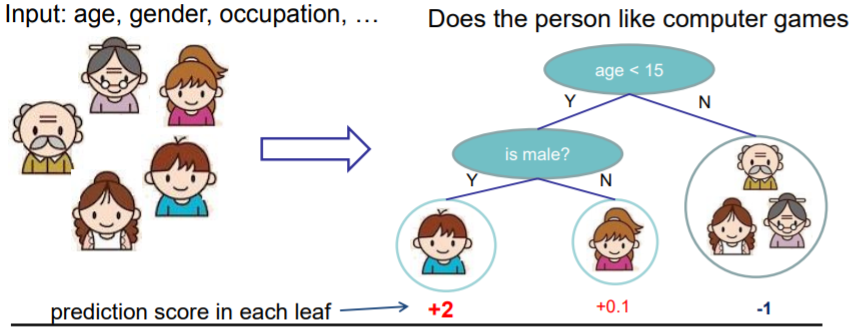
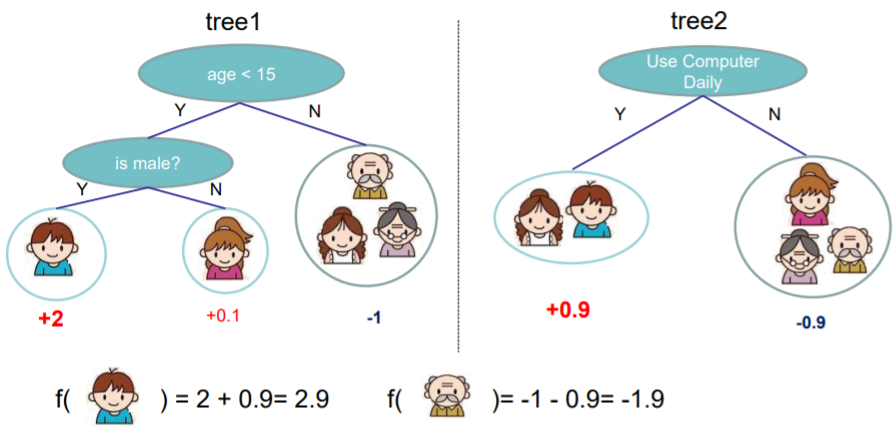
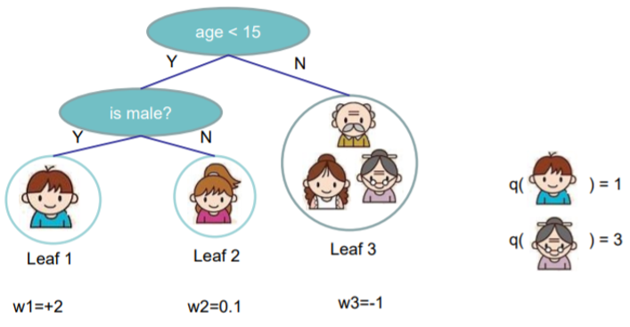
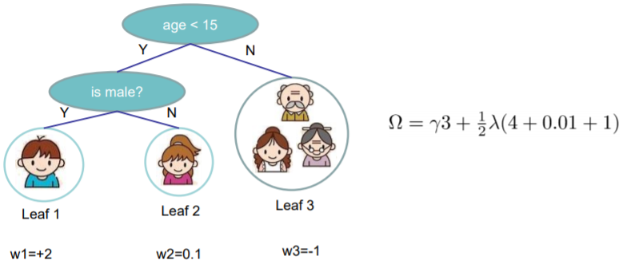

### XGBoost原理解析

***

参考资料：

陈天奇博士的slides：[Introduction to Boosted Trees](https://homes.cs.washington.edu/~tqchen/pdf/BoostedTree.pdf)

XGBoost是“Extreme Gradient Boosting” 的缩写，是Gradient Boosting的一种改进算法，由陈天奇博士于2014年提出。这里我们直接按照他的PPT思路来对XGBoost的原理进行介绍。

从名字就可以看出，传统的gradient boosting的基础是梯度，或者说一阶导数，而XGBoost不仅使用了一阶导数，还使用了二阶导数。

我们约定$x _ { i } \in \mathbf { R } ^ { d }$代表第$i$个训练样本，标签是$y_i$，模型的预测值为$\hat { y } _ { i }$。使用CART回归树作为基学习器，我们首先从回归问题出发，考虑下面这个例子:

这里我们的目标是根据年龄、性别、职业等特征预测一个人对电脑游戏的喜爱程度。

传统的回归树ensemble可能得到像下面这样的模型：

假设我们有$K$棵树，那么ensemble的模型就是这些树的求和（即加性模型）：
$$
\hat { y } _ { i } = \sum _ { k = 1 } ^ { K } f _ { k } \left( x _ { i } \right)
$$
通常目标函数由训练loss和正则化项构成：
$$
O b j = \sum _ { i = 1 } ^ { n } l \left( y _ { i } , \hat { y } _ { i } \right) + \sum _ { k = 1 } ^ { K } \Omega \left( f _ { k } \right)
$$
这里$\Omega \left( f _ { k } \right)$代表的是树的复杂度，它包含两部分：

* 树的结构复杂度，可以用叶结点数量、树的深度、进行划分（split）的次数等指标来衡量；
* 所有叶结点上的值（称为权重）的l2 norm。（*这一项是XGBoost独有的，它代表了对叶结点上权重的平滑*）

与gradient boosting类似，我们采用加性模型和前向分布算法来进行训练，如下：
$$
\begin{aligned} \hat { y } _ { i } ^ { ( 0 ) } & = 0 \\ \hat { y } _ { i } ^ { ( 1 ) } & = f _ { 1 } \left( x _ { i } \right) = \hat { y } _ { i } ^ { ( 0 ) } + f _ { 1 } \left( x _ { i } \right) \\ \hat { y } _ { i } ^ { ( 2 ) } & = f _ { 1 } \left( x _ { i } \right) + f _ { 2 } \left( x _ { i } \right) = \hat { y } _ { i } ^ { ( 1 ) } + f _ { 2 } \left( x _ { i } \right) \\...\\ \hat { y } _ { i } ^ { ( t ) } & = \sum _ { k = 1 } ^ { t } f _ { k } \left( x _ { i } \right) = \hat { y } _ { i } ^ { ( t - 1 ) } + f _ { t } \left( x _ { i } \right) \end{aligned}
$$
在第$t$步，目标函数表达为：
$$
\begin{aligned} O b j ^ { ( t ) } & = \sum _ { i = 1 } ^ { n } l \left( y _ { i } , \hat { y } _ { i } ^ { ( t ) } \right) + \sum _ { i = 1 } ^ { t } \Omega \left( f _ { i } \right) \\ & = \sum _ { i = 1 } ^ { n } l \left( y _ { i } , \hat { y } _ { i } ^ { ( t - 1 ) } + f _ { t } \left( x _ { i } \right) \right) + \Omega \left( f _ { t } \right) \end{aligned}
$$
考虑平方损失函数：
$$
\begin{aligned} O b j ^ { ( t ) } & = \sum _ { i = 1 } ^ { n } \left( y _ { i } - \left( \hat { y } _ { i } ^ { ( t - 1 ) } + f _ { t } \left( x _ { i } \right) \right) \right) ^ { 2 } + \Omega \left( f _ { t } \right) \\ & = \sum _ { i = 1 } ^ { n } \left[l \left( y _ { i } , \hat { y } _ { i } ^ { ( t - 1 ) } \right)+ 2 \left( \hat { y } _ { i } ^ { ( t - 1 ) } - y _ { i } \right) f _ { t } \left( x _ { i } \right) + f _ { t } \left( x _ { i } \right) ^ { 2 } \right] + \Omega \left( f _ { t } \right) \end{aligned}
\tag{1}
$$
事实上，我们可以将上式改写成泰勒展开的形式。回忆一下泰勒展开：
$$
f ( x + \Delta x ) \simeq f ( x ) + f ^ { \prime } ( x ) \Delta x + \frac { 1 } { 2 } f ^ { \prime \prime } ( x ) \Delta x ^ { 2 }
$$
定义
$$
g _ { i } = \partial _ { \hat { y } ^ { ( t - 1 ) } } l \left( y _ { i } , \hat { y } ^ { ( t - 1 ) } \right) , \quad h _ { i } = \partial _ { \hat { y } ^ { ( t - 1 ) } } ^ { 2 } l \left( y _ { i } , \hat { y } ^ { ( t - 1 ) } \right)
$$
于是我们有：
$$
O b j ^ { ( t ) } \simeq \sum _ { i = 1 } ^ { n } \left[ l \left( y _ { i } , \hat { y } _ { i } ^ { ( t - 1 ) } \right) + g _ { i } f _ { t } \left( x _ { i } \right) + \frac { 1 } { 2 } h _ { i } f _ { t } ^ { 2 } \left( x _ { i } \right) \right] + \Omega \left( f _ { t } \right)
\tag{2}
$$
对于平方损失函数，有：
$$
g _ { i } = \partial _ { \hat { y } ^ { ( t - 1 ) } } \left( \hat { y } ^ { ( t - 1 ) } - y _ { i } \right) ^ { 2 } = 2 \left( \hat { y } ^ { ( t - 1 ) } - y _ { i } \right) \\ h _ { i } = \partial _ { \hat { y } ^ { ( t - 1 ) } } ^ { 2 } \left( y _ { i } - \hat { y } ^ { ( t - 1 ) } \right) ^ { 2 } = 2
$$
代回到式（2），就是式（1）的形式。

将式（2）中与优化无关的项去掉，我们新的目标函数变为：
$$
\sum _ { i = 1 } ^ { n } \left[ g _ { i } f _ { t } \left( x _ { i } \right) + \frac { 1 } { 2 } h _ { i } f _ { t } ^ { 2 } \left( x _ { i } \right) \right] + \Omega \left( f _ { t } \right) \tag{3}
$$
其中$g _ { i } = \partial _ { \hat { y } ^ { ( t - 1 ) } } l \left( y _ { i } , \hat { y } ^ { ( t - 1 ) } \right)$，$h _ { i } = \partial _ { \hat { y } ^ { ( t - 1 ) } } ^ { 2 } l \left( y _ { i } , \hat { y } ^ { ( t - 1 ) } \right)$。

到此为止，我们已经得到了XGBoost中的目标函数，与gradient boosting相比，这里引入了二阶导数和正则化项。

接下来，我们重新定义一下决策树的表达式：
$$
f _ { t } ( x ) = w _ { q ( x ) } , \quad w \in \mathbf { R } ^ { T } , q : \mathbf { R } ^ { d } \rightarrow \{ 1,2 , \cdots , T \} \tag{4}
$$
这里的$w$是一个向量，它的每个分量就是每个叶子结点上的值；$q$是一个下标映射函数，其作用是将一个样本映射到其对应的叶子结点上。式（4）的效果可以用下图来说明：

再定义树的复杂度为：
$$
\Omega \left( f _ { t } \right) = \gamma T + \frac { 1 } { 2 } \lambda \sum _ { j = 1 } ^ { T } w _ { j } ^ { 2 }
$$
上式包含了叶子结点的数目以及叶子结点上值的l2 norm。比如：

我们定义每个叶子结点上的样本集合为：
$$
I _ { j } = \{ i | q \left( x _ { i } \right) = j \}
$$
然后将目标函数重新改写为：
$$
\begin{aligned} O b j ^ { ( t ) } & \simeq \sum _ { i = 1 } ^ { n } \left[ g _ { i } f _ { t } \left( x _ { i } \right) + \frac { 1 } { 2 } h _ { i } f _ { t } ^ { 2 } \left( x _ { i } \right) \right] + \Omega \left( f _ { t } \right) \\ & = \sum _ { i = 1 } ^ { n } \left[ g _ { i } w _ { q \left( x _ { i } \right) } + \frac { 1 } { 2 } h _ { i } w _ { q \left( x _ { i } \right) } ^ { 2 } \right] + \gamma T + \lambda \frac { 1 } { 2 } \sum _ { j = 1 } ^ { T } w _ { j } ^ { 2 } \\ & = \sum _ { j = 1 } ^ { T } \left[ \left( \sum _ { i \in I _ { j } } g _ { i } \right) w _ { j } + \frac { 1 } { 2 } \left( \sum _ { i \in I _ { j } } h _ { i } + \lambda \right) w _ { j } ^ { 2 } \right] + \gamma T \end{aligned}
\tag{5}
$$
上式中两次求和$\sum _ { j = 1 } ^ { T }\sum _ { i = I _ { j } }$实际上就是$\sum _ { i = 1 } ^ { n }$。

注意到式（5）是$T$个独立的二次函数的和。

对于一个简单的二次函数，有如下性质：
$$
\operatorname { argmin } _ { x } G x + \frac { 1 } { 2 } H x ^ { 2 } = - \frac { G } { H } , H > 0
$$

$$
\min _ { x } G x + \frac { 1 } { 2 } H x ^ { 2 } = - \frac { 1 } { 2 } \frac { G ^ { 2 } } { H }
$$

我们定义$G _ { j } = \sum _ { i \in I _ { j } } g _ { i }$，$H _ { j } = \sum _ { i \in I _ { j } } h _ { i }$，于是目标函数变为：
$$
\begin{aligned} O b j ^ { ( t ) } & = \sum _ { j = 1 } ^ { T } \left[ \left( \sum _ { i \in I _ { j } } g _ { i } \right) w _ { j } + \frac { 1 } { 2 } \left( \sum _ { i \in I _ { j } } h _ { i } + \lambda \right) w _ { j } ^ { 2 } \right] + \gamma T \\ & = \sum _ { j = 1 } ^ { T } \left[ G _ { j } w _ { j } + \frac { 1 } { 2 } \left( H _ { j } + \lambda \right) w _ { j } ^ { 2 } \right] + \gamma T \end{aligned} \tag{6}
$$
我们假设树的结构已经确定（即$q(x)$固定），那么每棵树的最优权重和最优目标值为：
$$
w _ { j } ^ { * } = - \frac { G _ { j } } { H _ { j } + \lambda } \tag{7}
$$

$$
O b j = - \frac { 1 } { 2 } \sum _ { j = 1 } ^ { T } \frac { G _ { j } ^ { 2 } } { H _ { j } + \lambda } + \gamma T \tag{8}
$$

我们仍然通过电脑游戏的例子来对式（8）进行说明：

于是我们可以得到搜寻单棵树的简单算法：

* 穷举所有可能的树的结构$q$

* 根据式（8）计算每个特定结构$q$的得分，确定最佳结构：
  $$
  O b j = - \frac { 1 } { 2 } \sum _ { j = 1 } ^ { T } \frac { G _ { j } ^ { 2 } } { H _ { j } + \lambda } + \gamma T
  $$

* 找到最佳结构后，使用最优的叶子结点权重值：
  $$
  w _ { j } ^ { * } = - \frac { G _ { j } } { H _ { j } + \lambda }
  $$

这里的问题是，可能的树结构有无穷多个，再实际操作中我们应该怎么列举呢？这里XGBoost使用了类似于信息增益的划分准则。

考虑划分某个结点前的目标函数值：
$$
\begin{aligned}
O b j &= - \frac { 1 } { 2 } \sum _ { j = 1 } ^ { T } \frac { G _ { j } ^ { 2 } } { H _ { j } + \lambda } + \gamma T \\
&= - \frac { 1 } { 2 } (\sum _ { j = 1 } ^ { T-1 } \frac { G _ { j } ^ { 2 } } { H _ { j } + \lambda } + \frac { \left( G _ { L } + G _ { R } \right) ^ { 2 } } { H _ { L } + H _ { R } + \lambda }) + \gamma T
\end{aligned}
$$
划分后的目标函数值为：
$$
O b j = - \frac { 1 } { 2 } (\sum _ { j = 1 } ^ { T-1 } \frac { G _ { j } ^ { 2 } } { H _ { j } + \lambda } + \frac { G _ { L } ^ { 2 } } { H _ { L } + \lambda } + \frac { G _ { R } ^ { 2 } } { H _ { R } + \lambda }) + \gamma (T+1)
$$
将划分前的目标值减去划分后的目标值，即可得到增益：
$$
G a i n = \frac { 1 } { 2 } \left[ \frac { G _ { L } ^ { 2 } } { H _ { L } + \lambda } + \frac { G _ { R } ^ { 2 } } { H _ { R } + \lambda } - \frac { \left( G _ { L } + G _ { R } \right) ^ { 2 } } { H _ { L } + H _ { R } + \lambda } \right] - \gamma 
\tag{9}
$$
其中$\frac { G _ { L } ^ { 2 } } { H _ { L } + \lambda }$代表了划分后左子结点的目标得分，$\frac { G _ { R } ^ { 2 } } { H _ { R } + \lambda }$代表了划分后右子结点的目标得分，$\frac { \left( G _ { L } + G _ { R } \right) ^ { 2 } } { H _ { L } + H _ { R } + \lambda }$是父结点（即不进行划分）的目标得分，$\gamma$代表了划分后引入新的叶子结点所增加的复杂度。例如，对于划分准则$x _ { j } < a$，左右结点$G$的值计算如下：

剩下的问题就是如何找到最佳划分点了，这里我们采用传统决策树算法中的做法即可：

* 对于每个结点，对所有特征穷举：
  * 对每一个特征，根据该特征的取值对所有样本进行排列；
  * 利用线性扫描的方式找到该特征的最佳划分点；
  * 取所有特征最佳划分点中的最佳值。

至此，我们可以将XGBoost下的提升树算法总结如下：

* 每次迭代增加一棵新的树

* 在每次迭代开始时，计算：
  $$
  g _ { i } = \partial _ { \hat { y } ^ { ( t - 1 ) } } l \left( y _ { i } , \hat { y } ^ { ( t - 1 ) } \right) , \quad h _ { i } = \partial _ { \hat { y } ^ { ( t - 1 ) } } ^ { 2 } l \left( y _ { i } , \hat { y } ^ { ( t - 1 ) } \right)
  $$

* 从深度为0开始，利用贪心法来生成一棵树$f _ { t } ( x )$，目标函数为：
  $$
  O b j = - \frac { 1 } { 2 } \sum _ { j = 1 } ^ { T } \frac { G _ { j } ^ { 2 } } { H _ { j } + \lambda } + \gamma T
  $$

* 将$f _ { t } ( x )$增加到模型中：$\hat { y } _ { i } ^ { ( t ) } = \hat { y } _ { i } ^ { ( t - 1 ) } + f _ { t } \left( x _ { i } \right)$。
  * 通常作为替代，新的模型为：$y ^ { ( t ) } = y ^ { ( t - 1 ) } + \epsilon f _ { t } \left( x _ { i } \right)$
  * $\epsilon$被称作步长或者shrinkage，通常设置在0.1左右
  * 这意外着在每一步，我们不执行最优的模型，并保留继续提升的空间，这中做法可以防止过拟合。

以上就是XGBoost的基本原理，当然在实际操作中，XGBoost还在这之上添加了许多的技巧和算法上的优化，比如在训练决策树时采用了类似随机森林的采样方式，这里就不一一介绍了。