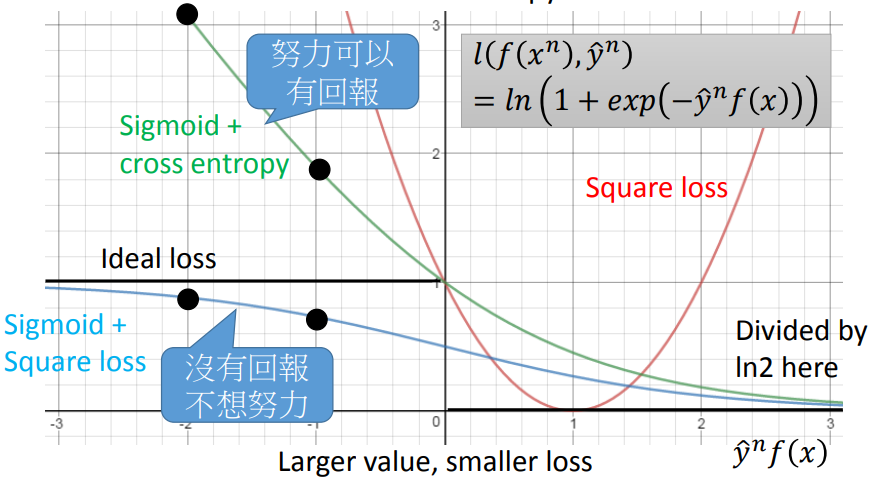
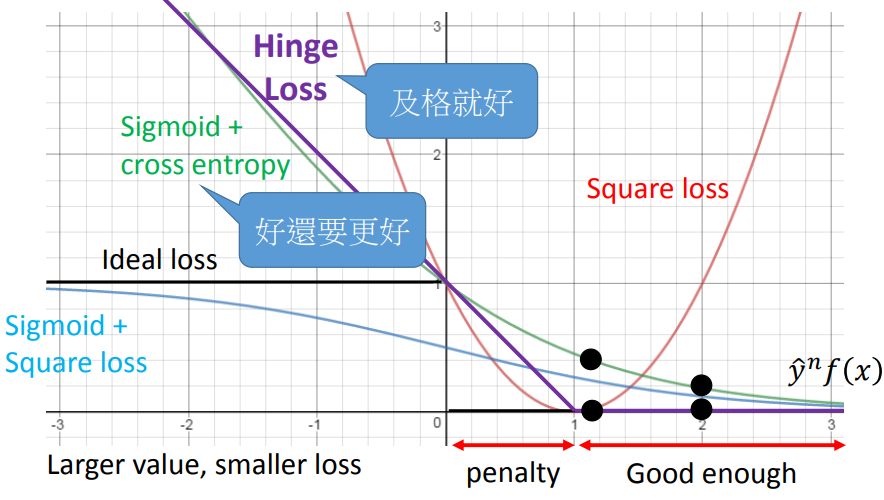

### 另类解读SVM：从损失函数说起

------

#### 0. 参考资料

本笔记主要参考台大李宏毅老师2016年秋季机器学习课程中对SVM的讲解：

.pdf)

以及李航老师的《统计学习方法》、周志华老师的《机器学习》中的相关内容。

#### 1. 损失函数

考虑简单的二分类问题，数据样本为${(x^1, \hat y^1),(x^2, \hat y^2),...,(x^n, \hat y^n)}$，数据样本的标签$\hat { y } ^ { n } = + 1 , - 1$。我们可以构造一个预测函数$f(x)$和判别函数$g(x)$，使得当$f(x)>0$时，$g(x)=1$；$f(x)<0$时，$g(x)=-1$。那么我们可以很方便的定义如下的loss函数：
$$
L ( f ) = \sum _ { n } \delta \left( g \left( x ^ { n } \right) \neq \hat { y } ^ { n } \right) \tag{1.1}即当$g \left( x ^ { n } \right) \neq \hat { y } ^ { n } $时，$L ( f )$的值
$$
即当$g \left( x ^ { n } \right) \neq \hat { y } ^ { n } $时，$L ( f )$的值为0，反之，$L ( f )$值为1。式（1.1）的意义是$g$得到的错误结果的次数。这是我们理想情况下的loss函数。然而这个loss很难进行微分，因为它是不连续的，于是我们需要寻求其他近似的loss函数来代替它。

将式（1.1）改写为：
$$
L ( f ) = \sum _ { n } l \left( f \left( x ^ { n } \right) , \hat { y } ^ { n } \right) \tag{1.2}
$$
我们可以用$\hat { y } ^ { n } f \left( x ^ { n } \right)$来描述分类的正确性（即函数间隔）：当${ y } ^ { n } = + 1$时，有$f(x)>0$，并且$f(x)$越大，分类的置信度越高；当${ y } ^ { n } = - 1$时，有$f(x)<0$，并且$f(x)$越小，，分类的置信度越高。总结起来就是，$\hat { y } ^ { n } f \left( x ^ { n } \right)$越大，分类结果越好，同时对应的loss值越低。

我们来看几个常见的loss函数：

* **Square Loss**​	

根据我们之前的讨论，其表达式是：
$$
l \left( f \left( x ^ { n } \right) , \hat { y } ^ { n } \right) = \left( \hat { y } ^ { n } f \left( x ^ { n } \right) - 1 \right) ^ { 2 }\tag{1.3}
$$
我们可以这样来理解这个loss：当${ y } ^ { n } = + 1$时，要求$f(x)$接近1，loss是比较小的；当${ y } ^ { n } = - 1$时，$f(x)$接近-1，loss是比较小的。

* **Sigmoid + Square Loss**

其表达式为：
$$
l \left( f \left( x ^ { n } \right) , \hat { y } ^ { n } \right) = \left( \sigma \left( \hat { y } ^ { n } f ( x ) \right) - 1 \right) ^ { 2 } \tag{1.4}
$$
较小的loss值要求当${ y } ^ { n } = + 1​$时，$\sigma ( f ( x ) )​$要接近于1；当${ y } ^ { n } = - 1​$，$\sigma ( f ( x ) )​$要接近于0（利用$\sigma(-x)=1-\sigma(x)​$得到）。

* **Sigmoid + Cross Entropy**

表达式为：
$$
{ l \left( f \left( x ^ { n } \right) , \hat { y } ^ { n } \right) }{ = \ln \left( 1 + \exp \left( - \hat { y } ^ { n } f ( x ) \right) \right) } \tag{1.5}
$$
这是我们在做logistic regression时使用的loss。

我们画出这三个loss函数的曲线图，如下：

对于Square Loss来说，当$\hat { y } ^ { n } f \left( x ^ { n } \right)$的值变大时，Loss值也会变大，这显然是不合理的，因此它不是我们要寻求的loss。

对于Sigmoid + Square Loss来说，函数曲线的斜率很小，相应的会造成优化时的梯度变化较小，模型会比较没有动力进行优化。

对于Sigmoid + Cross Entropy Loss来说，当$\hat { y } ^ { n } f \left( x ^ { n } \right)<0$，即分类错误时，对应的loss曲线斜率较大，这时梯度下降很快，模型会有动力朝着正确的结果优化，因此这是一个合理的loss函数的选择。注意在图中，我们将loss除以了ln2，这不影响优化的结果，但是可以让这个loss成为理想loss的一个tight up bound。也就是说，当我们选择sigmoid + cross entropy loss时，我们实际上是在优化理想loss的一个上界。

如果我们使用式（1.5）的logistic损失函数来代替理想损失函数，则几乎就得到了logistic回归模型。在这种情况下，SVM与logistic回归的优化目标相近，性能也相当。

下面我们来看另一个非常重要的、在SVM中被广泛使用的loss函数——**Hinge Loss**，它的表达式如下：
$$
l \left( f \left( x ^ { n } \right) , \hat { y } ^ { n } \right) = \max \left( 0,1 - \hat { y } ^ { n } f ( x ) \right) \tag{1.6}
$$
下面给出这个loss函数的图像：

从图像上可以看出，Hinge Loss不仅要求模型分类正确，还要求分类正确的置信度大过一个margin，loss值才是0，此时优化结束。

hinge损失有一块“平坦”的零区域，这使得SVM的解具有稀疏性，而logistic损失是光滑的单调递减函数，不能导出类似支持向量的概念，因此logistic回归的解依赖于更多的训练样本，其预测开销更大。

#### 2. 经验风险最小化

有了loss函数的定义以后，我们可以直接最小化以下的目标函数：
$$
L ( f ) = \sum _ { n }l \left( f \left( x ^ { n } \right) , \hat { y } ^ { n } \right.) + \lambda \| w \| _ { 2 } \tag{2.1}
$$
上式中的第一项即为**经验风险（empirical risk）**，第二项为**正则项**，$\lambda$是正则化系数。我们可以把式（1.6）的hinge loss代入式（1.7），得到：
$$
L ( f ) = \sum _ { n }\max \left( 0,1 - \hat { y } ^ { n } f ( x ) \right) + \lambda \| w \| _ { 2 } \tag{2.2}
$$
式（2.2）似乎和我们常见的SVM的形式有所区别，接下来我们对它进行改写，来说明式（2.2）实际上是和软间隔SVM等价的。

我们定义松弛变量：
$$
\varepsilon ^ { n } = \max \left( 0,1 - \hat { y } ^ { n } f ( x ) \right) \tag{2.3}
$$
那么式（2.2）就变为：
$$
L ( f ) = \sum _ { n }\varepsilon ^ { n } + \lambda \| w \| _ { 2 } \tag{2.4}
$$
同时，在**最小化式（2.4）的loss的前提下**，式（2.3）是和下面两个约束条件等价的：
$$
\begin{array} { l } { \varepsilon ^ { n } \geq 0 } \\ { \varepsilon ^ { n } \geq 1 - \hat { y } ^ { n } f ( x ) } \end{array} \tag{2.5}
$$
这里需要注意的是，一般情况下，式（2.3）和式（2.5）代表的两个不等式是不等价的，比如说，为了满足式（2.5），我们只要需要取$\varepsilon^{n}=\infty$即可，但这并不满足式（2.3）。**只有当在最小化loss的前提下**，式（2.3）和式（2.5）才是等价的。

于是，将式（2.4）和式（2.5）总结一下，就可以得到下面的优化问题：
$$
\begin{eqnarray}
\min &\quad& L ( f ) = \sum _ { n }\varepsilon ^ { n } + \lambda \| w \| _ { 2 } \\
\text{s.t.} &\quad& { \varepsilon ^ { n } \geq 0 } \\
&\quad& \hat { y } ^ { n } f ( x ) \geq 1 - \varepsilon ^ { n }
\end{eqnarray}
\tag{2.6}
$$
再把目标函数改写为等价的形式，有
$$
\begin{eqnarray}
\min &\quad& L ( f ) = \frac {1}{2} \|w\|_{2}^{2} +  C \sum _ { n }\varepsilon ^ { n }  \\
\text{s.t.} &\quad& { \varepsilon ^ { n } \geq 0 } \\
&\quad& \hat { y } ^ { n } f ( x ) \geq 1 - \varepsilon ^ { n }
\end{eqnarray}
\tag{2.7}
$$
这就是经典的软间隔SVM的形式！因此，我们在求解软间隔SVM时，实际上就是以hinge loss为目标，在训练数据集上进行经验风险最小化。

事实上，我们可以把式（2.7）目标函数中的$\varepsilon^{n}$替换成其他loss函数，得到其他学习模型，这些模型的性质与所使用的替代loss函数直接相关，但它们具有一个共性：优化目标中的第一项用来描述划分超平面的“间隔”大小，另一项用来表述训练集上的误差，写成一般形式：
$$
\min _ { f } \quad \Omega ( f ) + C \sum _ { n }  l \left( f \left( x ^{n} \right) , \hat y ^{n} \right) \tag{2.8}
$$
其中$\Omega ( f )$称为**结构风险（structural risk）**，用于描述模型$f$的某些性质；第二项$l \left( f \left( x ^{n} \right) , \hat y ^{n} \right)$称为**经验风险（empirical risk）**用于描述模型与训练数据的契合程度；$C$用于对二者进行折中。

从经验风险最小化的角度来看，$\Omega ( f )$表述了我们希望获得具有何种性质的模型（例如希望获得复杂度较小的模型），这为引入领域知识和用户意图提供了途径；另一方面，该信息有助于削减假设空间，从而降低了最小化训练误差的过拟合风险。从这个角度来说，式（2.8）所代表的就是式（2.4）的正则化问题，$C$可以视为正则化系数。

