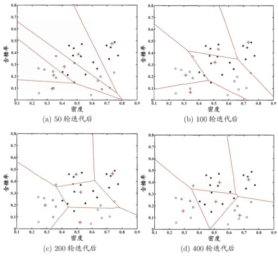
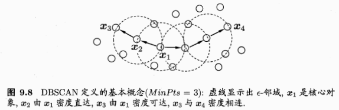
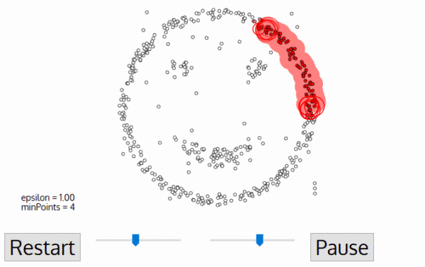
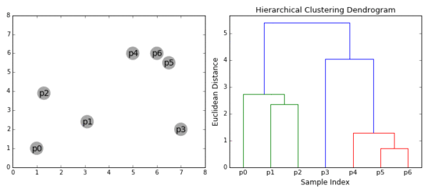
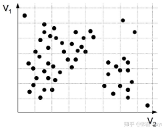
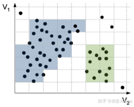
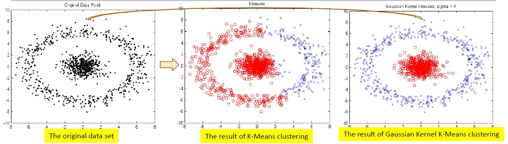

### 常见聚类方法小结

***

【参考资料】

周志华	《机器学习》

[数据科学家需要了解的5种聚类算法](https://zhuanlan.zhihu.com/p/37381630)

[用于数据挖掘的聚类算法有哪些，各有何优势](https://www.zhihu.com/question/34554321/answer/64372216)

[一篇文章透彻解读聚类分析（附数据和R代码）](https://zhuanlan.zhihu.com/p/37856153)

[机器学习：基于网格的聚类算法](https://cloud.tencent.com/developer/article/1005263)

聚类算法的种类非常之多，这里挑几种典型的，大概按照周志华老师《机器学习》中第九章的体系进行介绍。

#### 1. 原型聚类

原型聚类，即基于原型的聚类（prototype-based clustering），此类算法假设聚类结构能通过一组原型来刻画，一般都采用迭代的方式来求解原型向量。这类算法都需要事先指定需要划分的簇的数量，这是它们的一大缺点。

##### 1.1 k-means

给定样本集$D = \left\{ x _ { 1 } , x _ { 2 } , \ldots , x _ { m } \right\}$，k-means算法针对聚类所得簇划分$\mathcal { C } = \left\{ C _ { 1 } , C _ { 2 } , \dots , C _ { k } \right\}$最小化平方误差
$$
E = \sum _ { i = 1 } ^ { k } \sum _ { \boldsymbol { x } \in C _ { i } } \left\| \boldsymbol { x } - \boldsymbol { \mu } _ { i } \right\| _ { 2 } ^ { 2 } \tag{1.1}
$$
其中$\mu _ { i } = \frac { 1 } { \left| C _ { i } \right| } \sum _ { x \in C _ { i } } x$是簇$C _ { i }$的均值向量。

最小化式（1.1）需要考虑样本集$D$所有可能的簇划分，这是一个NP难问题。因此，k-means算法采用贪心策略，通过迭代优化来近似求解。算法流程如下：

其中第1行对均值向量进行初始化，在第4-8行与第9-16行依次对当前簇划分及均值向量迭代更新，若迭代后的聚类结果保持不变，则在第18行将当前簇划分结果返回。

动图示例：

##### 1.2 LVQ

学习向量量化（Learning Vector Quantization）也是试图找到一组原型向量来刻画聚类结构，但与一般聚类算法不同的是，LVQ是一种**有监督的聚类方法**。可以理解为LVQ通过聚类形成了类似各个类别下的“子类”的结构，每个子类对应一个聚类簇。

给定样本集合$D = \left\{ \left( \boldsymbol { x } _ { 1 } , y _ { 1 } \right) , \left( \boldsymbol { x } _ { 2 } , y _ { 2 } \right) , \ldots , \left( \boldsymbol { x } _ { m } , y _ { m } \right) \right\}$，每个样本$\boldsymbol { x } _ { j }$是由$n$个属性描述的特征向量$\left( x _ { j 1 } ; x _ { j 2 } ; \ldots ; x _ { j n } \right)$，$y _ { j } \in \mathcal { Y }$是样本$x _ { j }$的类别标记。LVQ的目标是学得一组$n$维原型向量$\left\{ p _ { 1 } , p _ { 2 } , \dots , p _ { q } \right\}$，每个原型向量代表一个聚类簇，簇标记$t _ { i } \in \mathcal { Y }$。

LVQ的算法描述如下：

算法第1行先对原型向量进行初始化，例如对第$q$个簇可从类别标记为$t_q$的样本中随机选取一个作为原型向量。算法第2~12行对原型向量进行迭代优化。在每一轮迭代中，算法随机选取一个有标记训练样本，找出与其距离最近的原型向量，并根据两者的类别标记是否一致来对原型向量进行相应的更新。在第12行中，若算法的停止条件已满足（例如已达到最大迭代轮数，或原型向量更新很小甚至不再更新），则将当前原型向量作为最终结果返回。

显然，LVQ的关键是第6~10行，即如何更新原型向量。直观上看，对样本$\boldsymbol { x } _ { j }​$，若最近的原型向量$\boldsymbol { p } _ { i^{*} }​$与$x _ { j }​$的类别标记相同，则令$\boldsymbol { p } _ { i^{*} }​$向$\boldsymbol { x } _ { j }​$的方向靠拢，如第7行所示，此时原型向量更新为
$$
\boldsymbol { p } ^ { \prime } = \boldsymbol { p } _ { i ^ { * } } + \boldsymbol { \eta } \cdot \left( \boldsymbol { x } _ { j } - \boldsymbol { p } _ { i ^ { * } } \right)
$$
$p ^ { \prime }​$与$\boldsymbol { x } _ { j }​$之间的距离为
$$
\begin{aligned} \left\| \boldsymbol { p } ^ { \prime } - \boldsymbol { x } _ { j } \right\| _ { 2 } & = \left\| \boldsymbol { p } _ { i ^ { * } } + \eta \cdot \left( \boldsymbol { x } _ { j } - \boldsymbol { p } _ { i } \cdot \right) - \boldsymbol { x } _ { j } \right\| _ { 2 } \\ & = ( 1 - \eta ) \cdot \left\| \boldsymbol { p } _ { i^{*} } - \boldsymbol { x } _ { j } \right\| _ { 2 } \end{aligned}
$$
令学习率$\eta \in ( 0,1 )$，则原型向量$\boldsymbol { p } _ { i^{*} }$在更新为$p ^ { \prime }$之后将更接近$\boldsymbol { x } _ { j }$。

类似地，若$\boldsymbol { p } _ { i^{*} }$与$x _ { j }$的类别标记不同，则更新后的原型向量与$\boldsymbol { x } _ { j }$之间的距离将增大为$( 1 + \eta ) \cdot \left\| \boldsymbol { p } _ { i^{*} }  - \boldsymbol { x } _ { j } \right\| _ { 2 }$，从而更远离$x_j$。

在学得一组原型向量$\left\{ p _ { 1 } , p _ { 2 } , \dots , p _ { q } \right\}$后，即可实现对样本空间$\mathcal { X }$的簇划分。对任意样本$x$，它将被划入与其距离最近的原型向量代表的簇中；换言之，每个原型向量$\boldsymbol { p } _ { i }$定义了与之相关的一个区域$R _ { i }$，该区域中每个样本与$\boldsymbol { p } _ { i }$的距离不大于它与其他原型向量$\boldsymbol { p } _ { i ^ { \prime } } \left( i ^ { \prime } \neq i \right)$的距离，即
$$
R _ { i } = \{ \boldsymbol { x } \in \mathcal { X } | \left\| \boldsymbol { x } - \boldsymbol { p } _ { i } \right\| _ { 2 } \leqslant \left\| \boldsymbol { x } - \boldsymbol { p } _ { i ^ { \prime } } \right\| _ { 2 } , i ^ { \prime } \neq i \}
$$
由此形成了对样本空间$\mathcal { X }$的簇划分$\left\{ R _ { 1 } , R _ { 2 } , \dots , R _ { q } \right\}$，该划分通常称为“Voronoi剖分”（Voronoi tessellation）。

若将$R _ { i }$中样本全用原型向量$\boldsymbol { p } _ { \mathbf { i } }$表示，则可实现数据的“有损压缩”，这称为“向量量化”；LVQ由此得名。

LVQ效果如下：

#### 2. 密度聚类

密度聚类亦称基于密度的聚类（density-based clustering），此类算法假设聚类结构能通过样本分布的紧密程度确定，通常情形下，密度聚类算法从样本密度的角度来考察样本之间的可连接性，并基于可连接样本不断扩展聚类簇以得到最终的聚类结果。

##### 2.1 DBSCAN

DBSCAN全称“Density-Based Spatial Clustering of Applications with Noise”。其核心思想是在数据空间中找到分散开的密集区域，简单来说就是画圈，其中要定义两个参数，一个是圈的最大半径$\epsilon​$，一个是一个圈里面最少应该容纳多少个点，即$M i n P t s ​$。

给定数据集$D = \left\{ \boldsymbol { x } _ { 1 } , \boldsymbol { x } _ { 2 } , \dots , \boldsymbol { x } _ { m } \right\}$，定义下面这几个概念：

* $\epsilon$-邻域：对$\boldsymbol { x } _ { j } \in D$，其$\epsilon$-邻域包含样本集$D$中与$\boldsymbol { x } _ { j }$的距离不大于$\epsilon$的样本，即$N _ { \epsilon } \left( \boldsymbol { x } _ { j } \right) = \left\{ \boldsymbol { x } _ { i } \in D | \operatorname { dist } \left( \boldsymbol { x } _ { i } , \boldsymbol { x } _ { j } \right) \leqslant \epsilon \right\}$；
* 核心对象（core object）：若$x _ { j }$的$\epsilon$-邻域至少包含$M i n P t s$个样本，即$\left| N _ { \epsilon } \left( \boldsymbol { x } _ { j } \right) \right| \geqslant M i n P t s$，则$x _ { j }$是一个核心对象；
* 密度直达（directly density-reachable）：若$x _ { j }$位于$\boldsymbol { x } _ { i }$的$\epsilon$邻域中，且$\boldsymbol { x } _ { i }$是核心对象，则称$x _ { j }$由$\boldsymbol { x } _ { i }$密度直达；
* 密度可达（density-reachable）：对$\boldsymbol { x } _ { i }​$与$\boldsymbol { x } _ { j }​$，若存在样本序列$p _ { 1 } , p _ { 2 } , \dots , p _ { n }​$，其中$\boldsymbol { p } _ { 1 } = \boldsymbol { x } _ { i } , \boldsymbol { p } _ { n } = \boldsymbol { x } _ { j }​$且$\boldsymbol { p } _ { i + 1 }​$由$p _ { i }​$密度直达，则称$x _ { j }​$由$x _ { i }​$密度可达；
* 密度相连（density-connected）：对$\boldsymbol { x } _ { i }$与$\boldsymbol { x } _ { j }$，若存在$x _ { k }$使得$\boldsymbol { x } _ { i }$与$\boldsymbol { x } _ { j }$均由$\boldsymbol { x } _ { k }$密度可达，则称$\boldsymbol { x } _ { i }$与$\boldsymbol { x } _ { j }$密度相连。

上述概念的直观显示如下图：

基于上述概念，DBSCAN的算法流程如下：

DBSCAN算法先任选数据集中的一个核心对象作为“种子”（seed），再由此出发确定相应的聚类簇。在第1~7行中，算法先根据给定的邻域参数$( \epsilon , M i n P t s )$找出所有核心对象；然后在第10~24行中，以任一核心对象为出发点，找出由其密度可达的样本生成聚类簇，直到所有核心对象均被访问过为止。

动图示例：

上面最后没有被划分到聚类簇中的点就是噪声。

#### 3. 层次聚类

层次聚类（hierarchical clustering）试图在不同层次对数据集进行划分，从而形成树形的聚类结构。实现方式主要有两种：“自底向上”和“自顶向下”。“自底向上”的方式就是一开始将所有样本都视为单独的类，然后每次迭代合并距离最近的两个类，直到所有所有样本都属于同一个大类。“自顶向下”的方式正相反，一开始将所有样本视为同一个类，然后每次迭代不断拆分大类，直到所有样本都属于不同的类。两种方法在性能上并无优劣之分，只是算法实现速度会根据具体问题而有所不同。

这里介绍AGNES（Agglomerative Nesting）算法，它是自底向上策略的典型代表。这里的关键是如何计算两个聚类簇之间的距离。给定聚类簇$C _ { i }$和$C _ { j }$，主要有三种计算距离的方式：

* 最小距离：$d _ { \min } \left( C _ { i } , C _ { j } \right) = \min _ { \boldsymbol { x } \in C _ { i } , \boldsymbol { z } \in C _ { j } } \operatorname { dist } ( \boldsymbol { x } , \boldsymbol { z } )$
* 最大距离：$d _ { \max } \left( C _ { i } , C _ { j } \right) = \max _ { \boldsymbol { x } \in C _ { i , z } \in C _ { j } } \operatorname { dist } ( \boldsymbol { x } , \boldsymbol { z } )$
* 平均距离：$d _ { \mathrm { avg } } \left( C _ { i } , C _ { j } \right) = \frac { 1 } { \left| C _ { i } \right| \left| C _ { j } \right| } \sum _ { \boldsymbol { x } \in C _ { i } } \sum _ { \boldsymbol { z } \in C _ { j } } \operatorname { dist } ( \boldsymbol { x } , \boldsymbol { z } )$

显然，最小距离由两个簇的最近样本决定，最大距离由两个簇的最远样本决定，而平均距离则由两个簇的所有样本共同决定。当簇距离由$d _ { \mathrm { min } }$、$d _ { \max }$或$d _ { \mathrm { avg } }$计算时，AGNES算法被相应地称为“单链接”（single-linkage）、“全链接”（complete-linkage）或“均链接”（average-linkage）算法。

AGNES算法流程如下：

其中，在第1 ~ 9行，算法先对仅含一个样本的初始聚类簇和相应的距离矩阵进行初始化；然后在第11 ~ 23行，AGNES不断合并距离最近的聚类簇，并对合并得到的聚类簇的距离矩阵进行更新。上述过程不断重复，直至达到预设的聚类簇数。

#### 4. 模型聚类

基于模型的聚类方法（Model-based methods）主要包括基于概率模型的方法和基于神经网络的方法，尤其以基于概率的模型居多。这里的概率模型主要是指概率生成模型，通常参数要通过EM算法求解。基于神经网络的方法则主要是指自组织映射方法（Self Organized Maps，SOM）。

这里介绍经典的概率模型方法——高斯混合（GMM）聚类。

##### 4.1 GMM聚类

GMM聚类的思想是：如果数据点符合某个高斯分布成分，那么它就被划分为那个高斯分布对应的类别。GMM聚类的参数需要使用EM算法来求解，过程与标准GMM模型的参数求解过程一样。GMM聚类的整个算法流程如下：

算法的第1行对高斯混合分布的模型参数进行初始化。然后，在第2-12行基于EM算法对模型参数进行迭代更新，其中第3-5行是E-步，第6-10行是M-步。若EM算法的停止条件满足（例如已达到最大迭代轮数，或似然函数增长很少甚至不再增长），则在第14-17行根据高斯混合分布确定簇划分，在第18行返回最终结果。

#### 5. 网格聚类

网格聚类（grid-based clustering）的基本思想是将样本空间划分为相同大小的网格，将数据对象映射到网格单元中，并计算每个单元的密度。根据预设阈值来判断每个网格单元是不是高密度单元，由邻近的稠密单元组成“类”。

这里简单介绍下网格聚类的代表算法CLIQUE（*领会思想即可*）。

CLIQUE算法（CLustering In QUEst）主要有两个参数：

* 网格的步长——确定空间网格划分
*  密度阈值——网格中对象数量大于等于该阈值表示该网格为稠密网格

算法流程如下：

1、 对$n$维空间进行划分，对每一个维度等量划分，将全空间划分为互不相交的网格单元

2、 计算每个网格的密度，根据给定的阈值识别稠密网格和非稠密网格，且置所有网格初始状态为“未处理”

（CLIQUE采用自下而上的识别方式，首先确定低维空间的数据密集单元，当确定了$k-1$维中所有的密集单元，$k$维空间上的可能密集单元就可以确定。因为，当某一单元的数据在$k$维空间中是密集的，那么在任一$k-1$维空间中都是密集的。如果数据在某一$k-1$维空间中不密集，那么数据在$k$维空间中也是不密集的）

3、 遍历所有网格，判断当前网格是否为“未处理”，若不是“未处理”状态，则处理下一个网格；若是“未处理”状态，则进行步骤4~8处理，直到所有网格处理完成，转到步骤8

4、 改变网格标记为“已处理”，若是非稠密网格，则转到步骤2

5、 若是稠密网格，则将其赋予新的簇标记，创建一个队列，将该稠密网格置于队列中

6、 判断队列是否为空，若空，则处理下一个网格，转到第2步；若队列不为空，则进行如下处理

1） 取队头的网格元素，检查其所有邻接的有“未处理”的网格

2） 更改网格标记为“已处理”

3） 若邻接网格为稠密网格，则将其赋予当前簇标记，并将其加入队列

4） 转到步骤5

7、 密度连通区域检查结束，标记相同的稠密网格组成密度连通区域，即目标簇

8、 修改簇标记，进行下一个簇的查找，转到第2步

9、 遍历整个数据集，将数据元素标记为所有网格簇标记值

图例：

选择一定宽度的格子来分割数据空间：

设置阈值为2，将相邻稠密的格子合并形成一个“类”:

#### 6. 简单总结

下面对各个算法的优缺点进行简答的比较总结。

* **k-Means**：优点是速度非常快，但是缺点有三个：第一，必须强制指定数据集中包含多少个类，即$k$的值；第二，在聚类开始时，质心点的选取是随机的，算法可能会始化出差异巨大的点，从而导致质心点的位置不可重复且缺乏一致性；第三，k-means无法解决不规则形状的聚类，如下图：

  

* **DBSCAN**：可以解决不规则形状的聚类，也不需要预先设定需要划分的类别个数，还能将异常值识别为噪声；不过DNSCAN的缺点是对两个参数（圈的距离和圈内点的数量）非常敏感，当数据的密度变化时，用于识别邻近点的距离阈值和核心点的设置会随着聚类发生变化，参数会变得难以估计，这一点在高维数据中比较明显；
* **层次聚类**：不要求指定聚类的数量，由于这是一个构建树的过程，我们甚至可以选择那种聚类看起来更合适。另外，该算法对距离阈值的选择不敏感，无论怎么定，算法始终会倾向于给出更好地聚类结果。层次聚类特别适合于具有层次结构的数据。但是缺点是算法效率较低。
* **GMM聚类**：优点是比较灵活，尤其是和k-Means相比起来，对类别的划分不那么‘’hard“，这得益于标准差参数的引入。实际上k-Means是GMM算法的一个特例，k-Means的聚类形状是圆形，而GMM聚类则是大小形状不一的椭圆形。其次，权重的引入将数据点的划分转化成了概率的形式，比如某个点于X聚类的百分比是多少，属于Y聚类的百分比是多少。换言之，GMM支持混合”成员“，划分更加的“soft”。GMM聚类的缺点在于执行效率低下，另外基于EM算法的参数求解过程也容易陷入局部最优。

* **网格聚类**：优点是执行效率高，因为其处理速度与数据点的个数无关，而只依赖于数据空间中每个维度上单元的个数；但是缺点也较多，比如对参数敏感、无法处理不规则分布数据、维数灾难等。