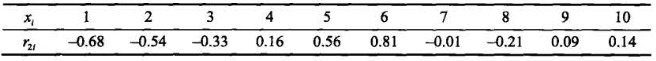
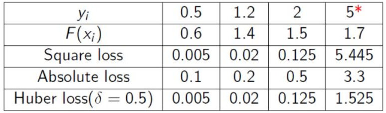

### 梯度提升与GBDT原理解析

***

主要参考资料如下：

李航老师《统计学习方法》8.4节

[机器学习-一文理解GBDT的原理-20171001](https://zhuanlan.zhihu.com/p/29765582)

[GBDT、XGBoost、LightGBM 的使用及参数调优](https://zhuanlan.zhihu.com/p/33700459)

梯度提升树（Gradient Boosting Decision Tree, GBDT）是Boosting族算法中的重要代表，也是统计学习中性能最好的方法之一。在这篇笔记中，我们首先介绍GBDT的基本原理，然后引出更加一般的梯度提升算法框架。

#### 1. GBDT 回归原理

GBDT是一种迭代的决策树算法，又被称为MART（Multiple Additive Regression Tree)。GBDT一般采用CART回归树（即二叉回归树）作为基学习器，利用前向分布算法和加法模型来实现最终的学习器。我们针对回归问题来对GBDT的原理进行说明。

GBDT可以表示为决策树的加法模型：
$$
f _ { M } ( x ) = \sum _ { m = 1 } ^ { M } T \left( x ; \Theta _ { m } \right)
$$
其中$T \left( x ; \Theta _ { m } \right)$表示一颗决策树；$\Theta _ { m }$为决策树的参数；$M$为树的个数。

假设训练数据集$T = \left\{ \left( x _ { 1 } , y _ { 1 } \right) , \left( x _ { 2 } , y _ { 2 } \right) , \cdots , \left( x _ { N } , y _ { N } \right) \right\}$。回忆一下CART回归树的算法，如果将输入空间$\mathcal { X }$划分为$J$个互不相交的区域$R _ { 1 } , R _ { 2 } , \cdots , R _ { J }$，并且在每个区域上确定输出的常量$c _ { j }​$，那么树可表示为
$$
T ( x ; \Theta ) = \sum _ { j = 1 } ^ { J } c _ { j } I \left( x \in R _ { j } \right)
$$
其中，参数$\Theta = \left\{ \left( R _ { 1 } , c _ { 1 } \right) , \left( R _ { 2 } , c _ { 2 } \right) , \cdots , \left( R _ { J } , c _ { J } \right) \right\}$表示树的区域划分和各区域上的常数。$J$是回归树的复杂度，即叶结点个数。

GBDT采用以下前向分步算法：
$$
\begin{array} { l } { f _ { 0 } ( x ) = 0 } \\ { f _ { m } ( x ) = f _ { m - 1 } ( x ) + T \left( x ; \Theta _ { m } \right) , \quad m = 1,2 , \cdots , M } \\ { f _ { M } ( x ) = \sum _ { m = 1 } ^ { M } T \left( x ; \Theta _ { m } \right) } \end{array}
$$
在前向分步算法的第$m$步，给定当前模型$f _ { m - 1 } ( x )$，需求解
$$
\hat { \Theta } _ { m } = \arg \min _ { \Theta _ { m } } \sum _ { i = 1 } ^ { N } L \left( y _ { i } , f _ { m - 1 } \left( x _ { i } \right) + T \left( x _ { i } ; \Theta _ { m } \right) \right)
$$
得到$\hat { \Theta } _ { m }$，即第$m$棵树的参数。

对于回归问题，通常采用均方误差损失函数，即
$$
L ( y , f ( x ) ) = ( y - f ( x ) ) ^ { 2 }
$$
因此对于GBDT，损失函数为
$$
\begin{array} { l } { L \left( y , f _ { m - 1 } ( x ) + T \left( x ; \Theta _ { m } \right) \right) } \\ { \quad = \left[ y - f _ { m - 1 } ( x ) - T \left( x ; \Theta _ { m } \right) \right] ^ { 2 } } \\ { \quad = \left[ r - T \left( x ; \Theta _ { m } \right) \right] ^ { 2 } } \end{array}
$$
这里，
$$
r = y - f _ { m - 1 } ( x )
$$
是当前模型拟合数据的残差（residual）。所以，**对回归问题的GBDT来说，只需简单的拟合当前模型的残差，这是GBDT算法的核心思想**。或者也可以理解为，在每轮迭代中，GBDT使用当前模型的残差作为新的标签值，来训练新的回归树。

**GBDT回归树算法**总结如下：

**输入**：训练数据集$T = \left\{ \left( x _ { 1 } , y _ { 1 } \right) , \left( x _ { 2 } , y _ { 2 } \right) , \cdots , \left( x _ { N } , y _ { N } \right) \right\}$，$x _ { i } \in \mathcal { X } \subseteq \mathbf { R } ^ { n }$，$y _ { i } \in \mathcal { Y } \subseteq \mathbf { R }$；

**输出**：提升树$f _ { M } ( x )$。

**（1）**初始化$f _ { 0 } ( x ) = 0$

**（2）**对$m = 1,2 , \cdots , M$

（a）计算残差：$r _ { m i } = y _ { i } - f _ { m - 1 } \left( x _ { i } \right) , \quad i = 1,2 , \cdots , N$	

（b）拟合残差$r _ { m i }$学习一个回归树，得到$T \left( x ; \Theta _ { m } \right)$

（c）更新$f _ { m } ( x ) = f _ { m - 1 } ( x ) + T \left( x ; \Theta _ { m } \right)$

**（3）**得到回归问题提升树：
$$
f _ { M } ( x ) = \sum _ { m = 1 } ^ { M } T \left( x ; \Theta _ { m } \right)
$$

**GBDT回归树实例**（来自《统计学习方法》）

下表为训练数据，$x$的取值范围为区间$[ 0.5,10.5 ]$，$y$的取值范围为区间$[5.0,10.0]$，学习这个回归问题的提升树模型，考虑只用二叉树作为基函数：

（1）步骤一：求$f _ { 1 } ( x )$，即回归树$T _ { 1 } ( x )$

* （a）首先通过以下优化问题：
  $$
  \min _ { s } \left[ \min _ { c _ { 1 } } \sum _ { x _ { i } \in R _ { 1 } } \left( y _ { i } - c _ { 1 } \right) ^ { 2 } + \min _ { c _ { 2 } } \sum _ { x _ { i } \in R _ { 2 } } \left( y _ { i } - c _ { 2 } \right) ^ { 2 } \right]
  $$
  求解训练数据的切分点$s$：
  $$
  R _ { 1 } = \{ x | x \leq s \} , R _ { 2 } = \{ x | x > s \}
  $$
  容易求得在$R _ { 1 }$，$R _ { 2 }$内部使平方误差达到最小值的$c_1$，$c_2$为
  $$
  \begin{aligned} c _ { 1 } & = \frac { 1 } { N _ { 1 } } \sum _ { x _ { i } \in R _ { 1 } } y _ { i } \\ c _ { 2 } & = \frac { 1 } { N _ { 2 } } \sum _ { x _ { i } \in R _ { 2 } } y _ { i } \end{aligned}
  $$
  这里$N_1$，$N_2$是$R_1$，$R_2$的样本点数。

* （b）具体地，求解训练数据的切分点。根据所给数据，考虑如下切分点：
  $$
  1.5,2.5,3.5,4.5,5.5,6.5,7.5,8.5,9.5
  $$
  对各切分点，不难求出相应的$R _ { 1 }$,$R _ { 2 }$，$c _ { 1 }$，$c _ { 2 }$及
  $$
  m ( s ) = \min _ { c _ { 1 } } \sum _ { x _ { i } \in R _ { 1 } } \left( y _ { i } - c _ { 1 } \right) ^ { 2 } + \min _ { c _ { 2 } } \sum _ { x _ { i } \in R _ { 2 } } \left( y _ { i } - c _ { 2 } \right) ^ { 2 }
  $$
  例如，当$s=2.5$时，
  $$
  R _ { 1 } = \{ 1,2 \} , R _ { 2 } = \{ 3,4 , \cdots , 9,10 \} , c _ { 1 } = 5.63 , c _ { 2 } = 7.73
  $$

  $$
  m ( s ) = \min _ { c _ { 1 } } \sum _ { x _ { i } \in R _ { 1 } } \left( y _ { i } - c _ { 1 } \right) ^ { 2 } + \min _ { c _ { 2 } } \sum _ { x _ { i } \in R _ { 2 } } \left( y _ { i } - c _ { 2 } \right) ^ { 2 } = 12.07
  $$

  遍历所有的$s$，计算$m(s)​$，结果列表如下：

  

  可知当$s = 6.5$时$m ( s )​$达到最小值，此时
  $$
  R _ { 1 } = \{ 1,2 , \cdots , 6 \} , R _ { 2 } = \{ 7,8,9,10 \} , c _ { 1 } = 6.24 , c _ { 2 } = 8.91
  $$
  所以回归树$T _ { 1 } ( x )$为：
  $$
  T _ { 1 } ( x ) = \left\{ \begin{array} { l l } { 6.24 } & { x < 6.5 } \\ { 8.91 } & { x \geqslant 6.5 } \end{array} \right.
  $$

  $$
  f _ { 1 } ( x ) = T _ { 1 } ( x )
  $$

  用$f_1(x)$拟合训练数据的残差，表中$r _ { 2 i } = y _ { i } - f _ { 1 } \left( x _ { i } \right)$

  

  平方损失误差为：
  $$
  L \left( y , f _ { 1 } ( x ) \right) = \sum _ { i = 1 } ^ { 10 } \left( y _ { i } - f _ { 1 } \left( x _ { i } \right) \right) ^ { 2 } = 1.93
  $$

（2）步骤二：求$T _ { 2 } ( x )$，方法与求$T _ { 1 } ( x )$一样，只是拟合的数据是上一步得到的残差，可以得到：
$$
T _ { 2 } ( x ) = \left\{ \begin{array} { c l } { - 0.52 } & { x < 3.5 } \\ { 0.22 } & { x \geqslant 3.5 } \end{array} \right.
$$

$$
f _ { 2 } ( x ) = f _ { 1 } ( x ) + T _ { 2 } ( x ) = \left\{ \begin{array} { l l } { 5.72 } & { x < 3.5 } \\ { 6.46 } & { 3.5 \leq x < 6.5 } \\ { 9.13 } & { x \geqslant 6.5 } \end{array} \right.
$$

用$f _ { 2 } ( x )$拟合训练数据的平方损失误差是
$$
L \left( y , f _ { 1 } ( x ) \right) = \sum _ { i = 1 } ^ { 10 } \left( y _ { i } - f _ { 1 } \left( x _ { i } \right) \right) ^ { 2 } = 0.79
$$
继续迭代
$$
\begin{aligned}
T _ { 3 } ( x ) &= \left\{ \begin{array} { l l } { 0.15 , } & { x < 6.5 } \\ { - 0.22 , } & { x \geqslant 6.5 } \end{array} \right. \quad L \left( y , f _ { 3 } ( x ) \right) = 0.47
\\T _ { 4 } ( x ) &= \left\{ \begin{array} { l l } { - 0.16 , } & { x < 4.5 } \\ { 0.11 , } & { x \geqslant 4.5 } \end{array} \right. \quad L \left( y , f _ { 4 } ( x ) \right) = 0.30\\
T _ { 5 } ( x ) &= \left\{ \begin{array} { l l } { 0.07 , } & { x < 6.5 } \\ { - 0.11 , } & { x \geqslant 6.5 } \end{array} \right. \quad L \left( y , f _ { 5 } ( x ) \right) = 0.23\\
T _ { 6 } ( x ) &= \left\{ \begin{array} { l l } { - 0.15 , } & { x < 2.5 } \\ { 0.04 , } & { x \geqslant 2.5 } \end{array} \right.
\end{aligned}
$$
则
$$
\begin{aligned}
f _ { 6 } ( x ) &= f _ { 5 } ( x ) + T _ { 6 } ( x ) = T _ { 1 } ( x ) + \dots + T _ { 5 } ( x ) + T _ { 6 } ( x ) \\
&= \left\{ \begin{array} { l l } { 5.63 , } & { x < 2.5 } \\ { 5.82 , } & { 2.5 \leqslant x < 3.5 } \\ { 6.56 , } & { 3.5 \leqslant x < 4.5 } \\ { 6.83 , } & { 4.5 \leqslant x < 6.5 } \\ { 8.95 , } & { x \geqslant 6.5 } \end{array} \right.
\end{aligned}
$$
用$f _ { 6 } ( x )$拟合训练数据的平方损失误差是
$$
L \left( y , f _ { 1 } ( x ) \right) = \sum _ { i = 1 } ^ { 10 } \left( y _ { i } - f _ { 1 } \left( x _ { i } \right) \right) ^ { 2 } = 0.17
$$
假设此时已满足误差要求，那么$f ( x ) = f _ { 6 } ( x )$即为所求提升树。

#### 2. GBDT分类原理

GBDT回归树可以直接用于分类，也就是说GBDT 无论用于分类还是回归一直都是使用的 CART 回归树。这里面的核心是因为 GBDT 每轮的训练是在上一轮的训练的残差基础之上进行训练的。要求每轮迭代的时候，弱分类器的输出的结果相减是有意义的，即残差相减是有意义的。

在分类训练的时候，是针对样本$x$每个可能的类都训练一个分类回归树。针对样本有三类的情况，我们实质上是在每轮的训练的时候是同时训练三颗树。第一棵树针对样本$x$的第一类，输入为$(x, 0)$。第二棵树输入针对样本$x$的第二类，假设$x$属于第二类，输入为$(x, 1)$。第三棵树针对样本$x$的第三类，输入为$ (x, 0)$。在这里每棵树的训练过程其实就是CART回归树的生成过程。在此处使用CART回归树算法即可解出三棵树，以及三棵树对$x$类别的预测值$f_1(x), f_2(x), f_3(x)$。在此类训练中，我们仿照多分类的逻辑回归，使用 softmax 来产生概率。

之后我们可以针对类别1求出残差 $r_{11}(x) = 0 − f_1(x)$；类别2求出残差$r_{22}(x) = 1 − f_2(x)$；类别3求出残差$r_{33}(x) = 0 − f_3(x)$。然后开始第二轮训练，针对第一类输入为$(x, r_{11} (x))$，针对第二类输入为$(x, r_{22}(x))$，针对第三类输入为$(x, r_{33}(x))$。继续训练出三棵树，一直迭代$M$轮，每轮构建3棵树。当训练完毕以后，新来一个样本时，我们需要预测该样本的类别的时候，便可使用 softmax 计算每个类别的概率。

或者从另一个角度来理解上面的做法，我们实际上是用类别的one-hot编码向量作为样本标签来训练回归树。

#### 3. 梯度提升

GBDT使用平方损失函数，每一步的优化都是很简单的，但是对于其他损失函数来说，往往每一步优化并不那么容易，尤其是残差的定义方式。为此，Freidman提出了更一般的算法——梯度提升法（gradient boosting）。使用一般梯度提升算法的模型又被称为GBM（Gradient Boosting Machine），如果基学习器是决策树，并且使用平方损失，那么GBM就退化为一般的GBDT。（*有些资料中GBDT不局限于使用平方损失，这里我们将其称为广义的GBDT*）。

在AdaBoost的笔记中，我们曾从梯度下降的角度给出过AdaBoost原理的解释，这实际上就是梯度提升思想的一种体现。梯度提升法是梯度下降法的近似方法，其关键是利用损失函数的负梯度在当前模型的值：
$$
- \left[ \frac { \partial L \left( y , f \left( x _ { i } \right) \right) } { \partial f \left( x _ { i } \right) } \right] _ { f ( x ) = f _ { m - 1 } ( x ) }作为回归问题中提升树算法的残差的近似值（与其说负梯度作为残差的近似值，不如说残差是负梯度的一种特例），拟合一个回归树，这就是梯度提升决策树。
$$
作为回归问题中提升树算法的残差的近似值（与其说负梯度作为残差的近似值，不如说残差是负梯度的一种特例），拟合新的基学习器（对于GBDT来说是一颗回归树）。

不难发现，当使用平方损失函数时，当前模型的负梯度实际上就是通常意义上的残差：
$$
-\frac { \partial \sum _ { i } L \left( y _ { i } , f \left( x _ { i } \right) \right) } { \partial f \left( x _ { i } \right) } = -\frac { \partial L \left( y _ { i } , f \left( x _ { i } \right) \right) } { \partial f \left( x _ { i } \right) } =  y _ { i } - f \left( x _ { i } \right) 
$$
这时的GBDT就是第一节中叙述的算法。

基于平方损失的GBDT在解决回归问题上不一定是一个好的选择，一个比较明显的缺点是其对异常值过于敏感，所以广义上的GBDT在处理回归问题时也会采用绝对值损失：
$$
L ( y , F ) = | y - F |
$$
或者Huber损失：
$$
L ( y , F ) = \left\{ \begin{array} { l l } { \frac { 1 } { 2 } ( y - F ) ^ { 2 } } & { | y - F | \leq \delta } \\ { \delta ( | y - F | - \delta / 2 ) } & { | y - F | > \delta } \end{array} \right.
$$
来代替平方损失。这两个损失函数对异常值的表现更加鲁棒：

当然，除了第二节中的GBDT分类算法，对于分类问题，我们也可以采用分类的loss函数，比如二分类问题的logistic损失：
$$
L ( y , F ) = \log ( 1 + \exp ( - 2 y F ) ) , y \in \{ - 1 , + 1 \}
$$
当采用指数损失函数时，GBDT会产生一个类似于AdaBoost的模型。

**梯度提升算法**（以回归树树为基学习器）总结如下：

* 1）初始化弱分类器，估计使损失函数极小化的一个常数值，此时树仅有一个根结点
  $$
  f _ { 0 } ( x ) = \arg \min _ { c } \sum _ { i = 1 } ^ { N } L \left( y _ { i } , c \right)
  $$

* 2）对迭代轮数$1,2 , \cdots , M$

  * a）对$i = 1,2 , \cdots , N​$，计算损失函数的负梯度值在当前模型的值，将它作为残差的估计。即
    $$
    r _ { m i } = - \left[ \frac { \partial L \left( y , f \left( x _ { i } \right) \right) } { \partial f \left( x _ { i } \right) } \right] _ { f ( x ) = f _ { m - 1 } (x ) }
    $$
    对于平方损失函数，它就是通常所说的残差；对于一般损失函数，它就是残差的近似值。

  * b）对$r _ { m i }$拟合一个回归树，得到第$m$m棵树的叶结点区域$R _ { m j }$，$j = 1,2 , \cdots , J$

  * c）对$j = 1,2 , \cdots , J$计算
    $$
    c _ { m j } = \arg \min _ { c } \sum _ { x _ { i } \in R _ { m j } } L \left( y _ { i } , f _ { m - 1 } \left( x _ { i } \right) + c \right)
    $$
    即利用线性搜索估计叶结点区域的值，使损失函数极小化。

  * d）更新回归树
    $$
    f _ { m } ( x ) = f _ { m - 1 } ( x ) + \sum _ { j = 1 } ^ { J } c _ { m j } I \left( x \in R _ { m j } \right)
    $$

* 3）得到输出的最终模型
  $$
  \hat { f } ( x ) = f _ { M } ( x ) = \sum _ { m = 1 } ^ { M } \sum _ { j = 1 } ^ { J } c _ { m j } I \left( x \in R _ { m j } \right)
  $$
  

#### 4. 与其他方法的比较

* **GBDT与Random Forest**

GBDT和RF都将决策树作为基学习器，但是GBDT所使用的决策树深度通常很小，而RF使用的决策树深度通常较大。

RF是Bagging算法的一种，而Bagging主要关注的是减小模型的**方差**。考虑到偏差-方差平衡，基学习器就需要具有较小的偏差，而较大的方差会通过Bagging集成得到减小，所以Bagging通常会采用比较复杂的基学习器模型。这就是RF使用较深决策树（有时甚至不会进行剪枝）的原因。

相反，GBDT是Boosting算法的一种，Boosting主要关注减小模型的**偏差**。因此，基学习器就要具有较小的方差，而偏差会经由Boosting集成得到减小。所以GBDT通常使用深度较小的决策树。

* **GBDT与AdaBoost**

GBDT与AdaBoost都属于Boosting算法，都采用决策树作为基学习器。用一句话来概括两者的区别与联系：**两者处理问题的出发点和核心思想不同，但是方法上有交集的部分**。

GBDT的核心思想是基于残差的学习，在每轮迭代中用当前模型的残差作为新的标签值来训练新的基学习器，而AdaBoost则通过对训练集进行重新加权来训练新的基学习器。

另外，狭义上的GBDT使用的是平方损失函数，其基学习器是回归二叉树，由回归问题拓展到分类问题，而AdaBoost使用的是指数损失函数，基学习器是分类树（可以二叉也可以多叉），由二分类问题拓展到多分类和回归问题。

从梯度提升的角度来说，使用指数损失的GBDT可以看成是AdaBoost的一种特例。AdaBoost的加性模型是基学习器的加权和，在梯度提升的框架下，其权重扮演了类似于学习率的角色，并且能通过自适应的方法确定（即通过当前模型的误差计算）；而GBDT的加性模型就是对基学习器的简单求和，没有AdaBoost中类似于权重或者学习率的概念。