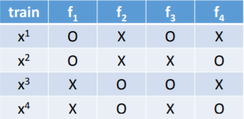
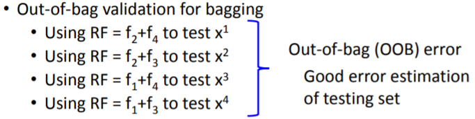
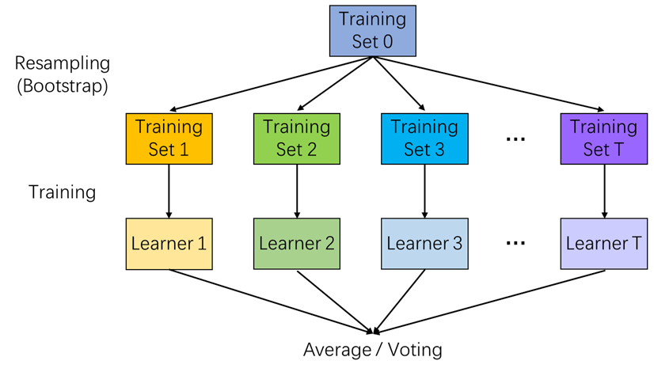
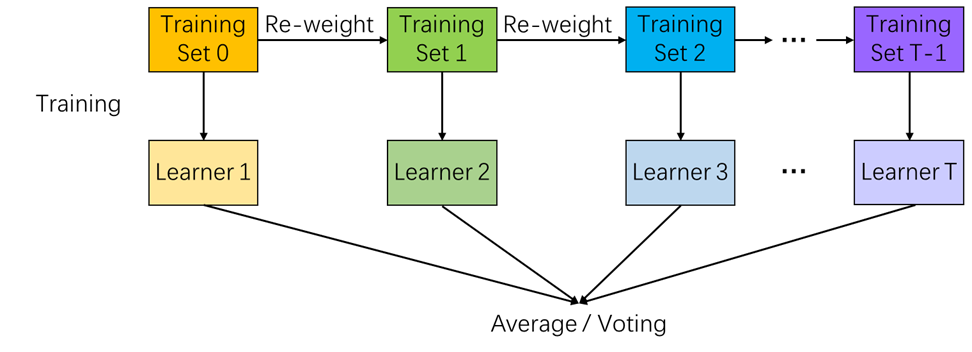

### 集成学习概览：Bagging与Boosting

***

主要参考了以下资料：

[集成学习综述-从决策树到XGBoost](https://mp.weixin.qq.com/s/cg_fHz1jTplhZX81_QCP0w)

李宏毅老师的机器学习课程中对应章节：[ensemble learning](http://speech.ee.ntu.edu.tw/~tlkagk/courses/ML_2017/Lecture/Ensemble.pdf)

周志华老师《机器学习》书中对应章节

集成学习（ensemble learning）是机器学习中一种重要的思想，其核心是**将一些简单的机器学习模型组合起来得到一个强大的模型**。通常来讲被组合的简单模型称为弱学习器（weak learner）或基学习器（base learner），组合起来后形成的模型为强学习器（strong learner）。

根据训练各个弱学习器的思路不同，集成学习主要分为两种方式：**Bagging**和**Boosting**。前者通过对原始训练样本集进行随机抽样，形成不同的训练样本集来训练每个弱学习器，各个弱学习器之间可以认为近似是独立的，典型代表是随机森林；后者为训练样本增加权重（AdaBoost），或者构造标签值（GBDT）来依次训练每个弱学习器，各个弱学习器之间相关，后面的弱学习器利用了前面的弱学习器的信息。

#### 1. Bagging

Bagging的思路是对训练集进行若干次重新采样，组成若干个训练子集，从每个训练子集中独立训练出一个分类器，最后整合所有分类器的结果进行预测。在整合预测结果时，通常对分类任务采用简单投票法，对回归任务使用简单平均法。

Bagging的基础是**Bootstrap采样法**（中文又译为自助采样法），这也是“Bagging”这个名称的来源（Bootstrap Aggregating）。Bootstrap是一种有放回抽样方法，具体做法是：在$n$个样本的集合中有放回的抽取$n$个样本形成一个数据集。在这个新的数据集中原始样本集中的一个样本可能会出现多次，也可能不出现。

假设样本集中有$n$个样本，每次抽中其中任何一个样本的概率都为$1/n$，即等概率，一个样本在每次抽样中没被抽中的概率为$1-1/n$。由于是有放回的抽样，每两次抽样之间是独立的，因此对于连续$n$次抽样，一个样本没被抽中的概率为：
$$
( 1 - 1 / n ) ^ { n }
$$
可以证明，当$n$趋向于无穷大时这个值的极限是$1/e$，约等于0.368，其中$e$是自然对数的底数。即如下结论成立：
$$
\lim _ { n \rightarrow + \infty } ( 1 - 1 / n ) ^ { n } = 1 / e
$$
证明过程很简单，在微积分中，有这样一个重要极限：
$$
\lim _ { n \rightarrow + \infty } ( 1 + 1 / n ) ^ { n } = e
$$
这说明在训练每个基学习器时，只使用了初始训练集中63.2%的样本，剩下约36.8%的样本可用作验证集来对泛化性能进行“**包外估计**”（out-of-bag estimation）。为此，对于训练集中某一特定样本$x$，我们只需要考虑那些未使用$x$训练的基学习器在$x$上的预测结果，然后以此类推，求出整个训练集中所有样本预测结果的误差，即可得到包外误差。

比如，对四个样本和四个分类器的简单例子：

包外估计的做法是：

从偏差-方差分解的角度看，**Bagging主要关注降低方差**，因此它在不剪枝决策树、神经网络等容易过拟合的学习器上效用更为明显。

#### 2. Boosting

Boosting算法中的基学习器是串行训练的，其工作机制是：先从初始训练集中训练出一个基学习器，再根据基学习器的表现对训练样本分布进行调整（比如采取重新加权的方式），使得先前基学习器做错的训练样本再后续受到更多关注，然后基于调整后的样本分布来训练下一个基学习器；如此重复进行，直到训练得到的基学习器数量达到指定要求，最后将所有基学习器的结果进行加权结合。

从偏差-方差分解的角度看，**Boosting主要关注降低偏差**，因此Boosting能基于泛化性能相当弱的学习器构建出很强的集成。

#### 3. Stacking

除了Bagging和Boosting外，集成学习还有另外一种策略：Stacking。Stacking的基本思想是**采用学习的方法来对各个学习器进行加权结合**。

我们通过下面的例子来说明stacking的工作原理：

首先在原始训练集上，我们训练出各个初级学习器（在图中分别是小明、老王、老李、小毛的system），然后将各初级学习器的输出结果作为新的feature，再训练一个次级学习器（图中的final classifier）来进行最终的预测，也就相当于通过学习的方式结合了之前的初级学习器。

值得注意的是，在运用Stacking时，我们需要对整个数据集进行四次划分。除了通常使用的验证集和测试集外，我们还需要对训练集再进行一次划分。这是为了防止训练次级学习器时在之前的训练数据上产生过拟合。

#### 4. 图解小结

* Bagging：“并行”训练

* Boosting：“串行”训练

* Stacking：“堆叠”训练

