A Brief Report on Domain Generalization

***

【**Date**】	**2018/03/14**

#### 1. Definition

Domain generalization (DG) is a sub-problem in transfer learning which focuses on the domain shift problem between training set and testing set.

 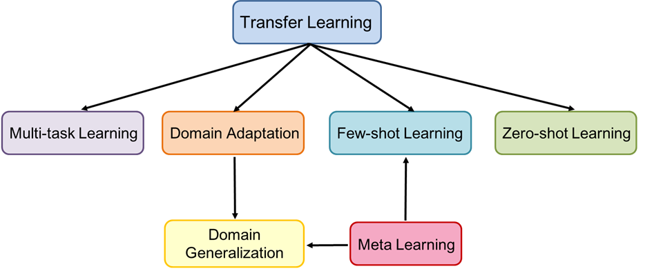

A similar but different topic is domain adaptation (DA). DA studies domain shift problem from source domain to **known target domain**. That is, the target domain data can be used for training. 

On the other hand, DG studies domain shift problem from source domain(s) to **unknown target domain**. That is, the target data will not appear in training. 

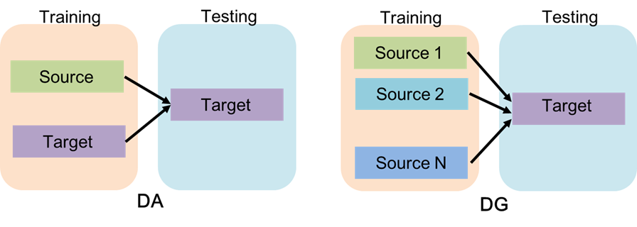

Therefore, some domain adaptation methods cannot be directly used for domain generalization. 

#### 2. Overview

The existing DG methods can be roughly divided into four categories. 

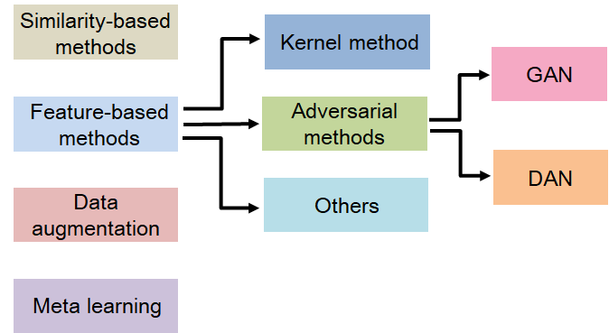

**1) Similarity-based methods**

These methods make their predictions based on the similarity between multiple source domains and target domain. A typical idea is training a series of source-specific classifiers and then ensembling them by weighted sum.

**2) Feature-based methods**

These methods aims at mining domain-invariant features or knowledges between multiple source domains, which can be directly transfer to target domain.

Feature-based methods can be further divided into three categories, which are kernel methods, adversarial methods and others. Kernel methods are traditional machine learning techniques. Their performances are usually worse than deep learning-based methods. Therefore, we will not introduce them in this report.

Adversarial method is a very representative technique in domain-invariant feature learning. There are two ways to realize adversarial feature learning: GAN-based and DAN-based.

DAN(Domain Adversarial Network) is a classical DA method. Its framework is as follows:

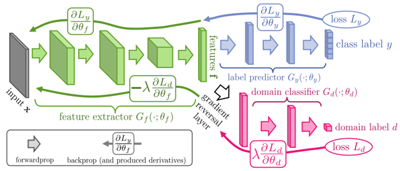

The main idea of DAN is a gradient reversal layer which reverses the gradient from domain classifier to enforce feature extractor learns domain-agnostic information. The loss function of DAN is:
$$
L_{y}-\lambda L_{d}
$$
The idea of GAN is very similar to DAN, unless it uses GAN loss instead:
$$
\min _{G_{f}, G_{y}} \max _{G_{d}} L_{y}+\lambda L_{d}
$$
**3) Data augmentation**

These methods focus on adding small perturbations to source samples to simulate more domain shift cases. Then original source data and the augmented data are trained jointly to make the network more robust.

**4) Meta learning**

These methods want to teach the network to "learn to generalize". They may also incorporate feature-based or similarity-based ideas, but use meta learning settings. Meta learning methods in DG are mainly based on the MAML algorithm or its extensions.

#### 3. Methods in Papers

##### 3.1 Classifier fusion

**paper**: BEST SOURCES FORWARD: DOMAIN GENERALIZATION THROUGH SOURCE-SPECIFIC NETS

**date**: ICIP 2018

**tag**: similarity-based, ensemble

A very straightforward method:

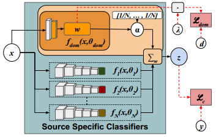

The domain specific classifiers are fused by weighted sum. All the weights are shared between domain specific classifiers, expect the last layer.

The weights are determined by the scores output from domain classifies. To further improve robustness and reduce the risk arisen from unreliable sources, a domain-agnostic component is added to the final classifier. That is, the final classification scores are modified by a uniform distributed weights:
$$
z_{i}=(1-\alpha) \sum_{j=1}^{N} w_{i, j} f_{j}\left(x_{i}, \theta_{j}\right)+\frac{\alpha}{N} \sum_{j=1}^{N} f_{j}\left(x_{i}, \theta_{j}\right)
$$
In practice, $\alpha=0.25$.

##### 3.2 Low-rank AlexNet

**paper**: Deeper, Broader and Artier Domain Generalization

**date**: ICCV 2017

**tag**: future-based, low-rank

This paper proposes a low-rank parameterized AlexNet for DG learning. The network parameters of the $i$th domain is:
$$
\Theta^{(i)}=\Theta^{(0)}+\Delta^{(i)}
$$
where $\Theta^{(0)}$ can be seen as a domain-agnostic model, and $\Delta^{(i)}$ can be seen as a domain specific bias term. 

In the case of CNN, the weights of each domain can be denoted as：
$$
\mathcal{W}_{\mathrm{CONV}}^{(i)}=g\left(z^{(i)} | \mathcal{W}\right)=\mathcal{W} \times_{5} z^{(i)}
$$
where $\mathcal{W}$ is in the size of Height $\times$ Weight $\times$ Depth$\times$ Filter Number $\times$ $(S+1)$, $S$ is the number of source domains. $z^{(i)}$ is a binary $(S+1)$-D vector encoding the $i$th domain with only the $i$th and last dimension being 1.

To reduce parameters, the weight tensor is decomposed into low-rank ones:
$$
\mathcal{W}=\mathcal{G} \times_{1} U_{1} \cdots \times_{M} U_{M}
$$
While $\mathcal{G}$ is a $K_{1} \times \ldots K_{M}$ sized low-rank core tensor, and $U_{m}$ are $K_{m} \times D_{m}$ matrices (note that $D_{M}=S+1$). Therefore, by learning $\left\{\mathcal{G}, U_{1} \ldots U_{M}\right\}$ instead of $\mathcal{W}$, the number is reduced from $\left(D_{1} \times \cdots \times D_{M-1} \times(S+1)\right)$ to $\left(K_{1} \times \ldots K_{M}\right) + \sum_{m=1}^{M-1} D_{m} \times K_{m}+K_{M} \times(S+1)$.

In addition, the authors believe that $U_M$ produces a $K_M$-dimensional vector that can linearly combine the share factors, instead of the original case of equally weighted sum. 

##### 3.3 MTAE

**paper**: Domain Generalization for Object Recognition with Multi-task Autoencoders

**date**: ICCV 2015

**tag**: feature-based

MTAE is the abbreviation of *Multi-Task Autoencoders*. MTAE uses a particular source view to reconstruct all the source views in the same class. The total loss function is composed of the reconstruction losses between a particular  source view and all source views. In other words, there are two types of reconstruction tasks: self-domain reconstruction and cross-domain reconstruction.

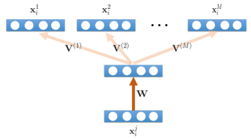

The encoder weights are shared across domains, while the decoder weights are domain specific. After the training of encoder and decoders, a classifier is trained based on the latent features generated by the encoder. 

Note that MTAE is not am end-to-end method because it separates the domain-invariant feature learning and the classification process. 

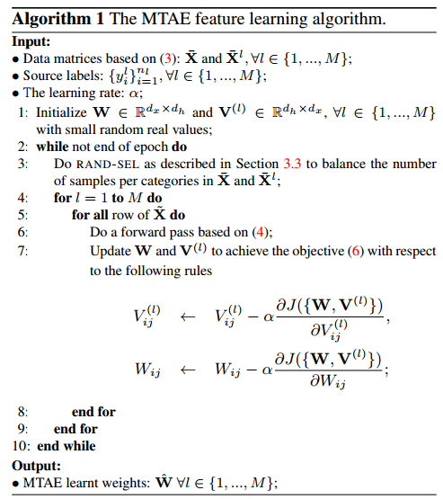

##### 3.4 CCSA

**paper**: Unified Deep Supervised Domain Adaptation and Generalization 

**date**: ICCV 2017

**tag**: feature-based

CCSA is the abbreviation of *Classification and Contrastive semantic alignment*. This method can be used for supervised DA (SDA) and DG. Here we only introduce its application in DG.

The architecture for SDA is as follows:

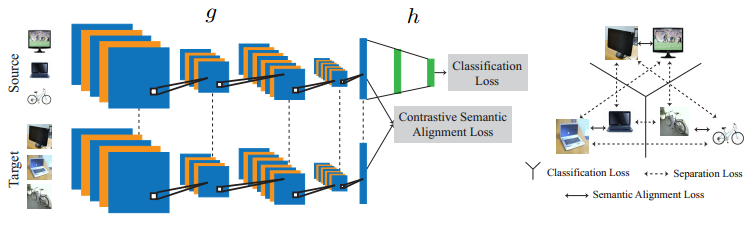

As for DG, one can view the target domain as other source domains in the figure above. The weights are totally shared across domains.

The CCSA loss consists of three parts:
$$
\mathcal{L}_{C C S A}(f)=\mathcal{L}_{C}(h \circ g)+\mathcal{L}_{S A}(g)+\mathcal{L}_{S}(g)
$$
where $\mathcal{L}_{C}$ is classification loss, $\mathcal{L}_{S A}$ is semantic alignment loss, $\mathcal{L}_{S}$ is separation loss, $h$ is the classification network and $g$ is the feature extractor.

The semantic alignment loss encourages samples from different domains but the same label to map nearby in the embedding space:
$$
d\left(g\left(x_{i}^{s}\right), g\left(x_{j}^{t}\right)\right)=\frac{1}{2}\left\|g\left(x_{i}^{s}\right)-g\left(x_{j}^{t}\right)\right\|^{2}
$$
The separation loss enforce samples from different domains and with different labels to be mapped as far as possible in the embedding space:
$$
k\left(g\left(x_{i}^{s}\right), g\left(x_{j}^{t}\right)\right)=\frac{1}{2} \max \left(0, m-\left\|g\left(x_{i}^{s}\right)-g\left(x_{j}^{t}\right)\right\|\right)^{2}
$$
The CCSA loss can guide the network to learn a discriminative and domain-invariant feature, with the class distribution aligned.

##### 3.5 SLRC

**paper**: Deep Domain Generalization With Structured Low-Rank Constraint

**date**: TIP 2018

**tag**: feature-based, low-rank

SLRC is the abbreviation of *Structured Low-Rank Constraint*. The whole architecture consists of domain-specific networks and a domain-invariant network. 

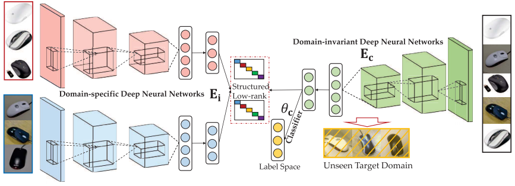

A structed low-rank constraint is deployed between the outputs of the domain invariant network and domain-specific networks. That is, the output of the domain-invariant network is used to reconstruct the outputs of the domain-specific networks. The rank of the reconstruction matrix (or structed matrix) should be as low as possible, in order to learn domain-invariant knowledge.
$$
\min _{Z} \operatorname{rank}(Z), \quad \text { s.t. } \mathbf{H}_{s}=\mathbf{H}_{c} Z
$$
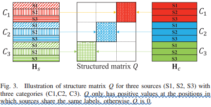

There is also an additional constraint on the weights between the domain-specific and domain-invariant networks:
$$
\mathcal{L}_{d}=\sum_{i=1}^{m} \sum_{l=1}^{L}\left(\left\|W_{i}^{l}-W_{c}^{l}\right\|_{\mathrm{F}}^{2}+\left\|b_{i}^{l}-b_{c}^{l}\right\|_{2}^{2}\right)
$$
The motivation behind this operation is that "different networks should have similar activation values given the same class of objects from different domains, and our domain-invariant network is designed to capture most shared factors across tasks".

##### 3.6 NGLCM+HEX

**paper**: LEARNING ROBUST REPRESENTATIONS BY PROJECTING SUPERFICIAL STATISTICS OUT 

**date**: ICLR 2019 Oral

**tag**: feature-based

This paper did an interesting work. It translates the traditional visual feature GLCM (Grey-Level Co-occurrence Matrix) into a differentiable, neural network version called NGLCM. 

The authors assume that domain information in images is mainly textual information with high frequency of occurrence, such as background. GLCM is used to capture highly frequented textual information in images, but it is not differentiable. Therefore, the authors design a neural network building block called NGLCM to capture these superficial statistics. Details of NGLCM can be found in the paper.

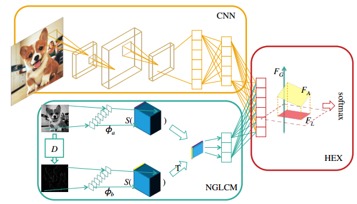

The textual features are then projected out of the raw CNN features after extracted by NGLCM, such that only the semantic information is preserved. Let $F_A$, $F_G$, $F_P$ be the results of jointly representation, only the textual representation, and only the raw CNN representation respectively:
$$
\begin{aligned} F_{A} &=f([h(X ; \theta), g(X ; \phi)] ; \xi) \\ F_{G} &=f([\mathbf{0}, g(X ; \phi)] ; \xi) \\ F_{P} &=f([h(X ; \theta), \mathbf{0}] ; \xi) \end{aligned}
$$
The projection is implemented by a method called HEX. The main idea of HEX is projecting $F_{A}$ onto the subspace orthogonal to $F_{G}$ with:
$$
F_{L}=\left(I-F_{G}\left(F_{G}^{T} F_{G}\right)^{-1} F_{G}^{T}\right) F_{A}
$$
Then $F_{L}$ is used for parameter tuning. In testing time, $F_{P}$ is used instead of $F_{L}$, in case the network overfits on the superficial statistics of training images. 

In addition, the authors used another projection method adopting the reverse gradient (DAN) idea, which is denoted as ADV in the paper.

Experiments show that ADV performs a little better than HEX on *MNIST-Rotation* (96.2% v.s. 95.8%), while HEX performs better than ADV on *PACS* (70.2% v.s. 68.6%).

 ##### 3.7 MMD-AAE

**paper**: Domain Generalization with Adversarial Feature Learning 

**date**: CVPR 2018

**tag**: feature-based, adversarial, GAN

MMD-AAE adopts multiple losses to learn domain-invariant features. Its main framework is modified from the adversarial autoencoder (AAE).

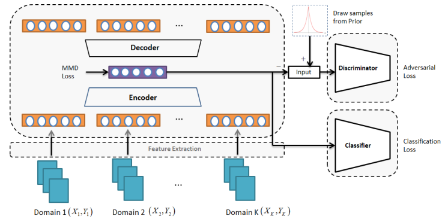

The overall loss function is:
$$
\min _{C, \mathcal{Q}, P} \max _{D} \mathcal{L}_{\mathrm{err}}+\lambda_{0} \mathcal{L}_{\mathrm{ae}}+\lambda_{1} \mathcal{R}_{\mathrm{mmd}}+\lambda_{2} \mathcal{J}_{\mathrm{gan}}
$$
where $\mathcal{L}_{\mathrm{err}}$ is the classification loss, $\mathcal{L}_{\mathrm{ae}}$ is the AAE reconstruction loss, $\mathcal{R}_{\mathrm{mmd}}$ is the MMD loss:
$$
\mathcal{R}_{\mathrm{mmd}}\left(\mathbf{H}_{1}, \ldots, \mathbf{H}_{K}\right)=\frac{1}{K^{2}} \sum_{1 \leq i, j \leq K} \operatorname{MMD}\left(\mathbf{H}_{i}, \mathbf{H}_{j}\right)
$$
MMD loss is used to minimize the difference between multiple source domains. Then the latent representation of AAE is aligned to a prior distribution using GAN loss:
$$
\mathcal{J}_{\mathrm{gan}}=\mathbb{E}_{\mathbf{h} \sim p(\mathbf{h})}[\log D(\mathbf{h})]+\mathbb{E}_{\mathbf{x} \sim p(\mathbf{x})}[\log (1-D(Q(\mathbf{x})))]
$$
to further improve the generalization ability. 

The authors  empirically chose the Laplace distribution as the prior: $\mathbf{h} \sim$ Laplace $(\eta)$,  where $\eta=\frac{1}{\sqrt{2}}$.

Therefore, the domain-invariant feature learning in MMD-AAE includes two aspects:  a discrepancy minimization via MMD loss and a prior distribution alignment via GAN loss.

The idea of AAE is very similar to VAE, expect that AAE uses GAN loss to match the latent representation to a prior, while VAE uses KL divergence. Based on AAE, MMD-AAE further introduces a MMD-loss to emphasize domain-agnostic feature learning.

An important experimental conclusion is: 

> the priors which can lead to sparse representation are good for domain generalization tasks. 

##### 3.8 CIDDG

**paper**: Deep Domain Generalization via Conditional Invariant Adversarial Networks

**date**: ECCV 2018

**Tag**: feature-based, adversarial, reverse gradient

CIDDG is the abbreviation of *conditional invariant deep domain generalization*. 

* **Motivation**

This paper discusses a neglected issue in domain-invariant feature modelling. In DG, we require the joint distribution of features and labels $$P(X, Y)$$ to be invariant. Most   studies assumes that the conditional distribution $P(Y | X)$ remains stable across domains, i.e., when the within-class representation $X$ changes, the class label $Y$ remains unchanged. Therefore, domain-invariant learning reduced to the guarantee of invariance of the marginal distribution $P(X)$, as $P(X,Y)=P(Y|X)P(X)$.

However, some "causal relation" studies shows that the causal structure is often $Y \rightarrow X$  instead of $X \rightarrow Y$ in computer vision. In other words, it is the label (or class) that determines how the feature will look like, but not the feature determines what the class it belongs to. Consequently, $P(Y|X)$ will not remain the same, and it will change as $P(X)$ changes (see more details in the paper). 

Therefore, the authors turn to minimize the discrepancy in $P(X|Y)$ across different domains, in terms of the label prior distribution $P(Y)$ does not change. 

* **Methodology**

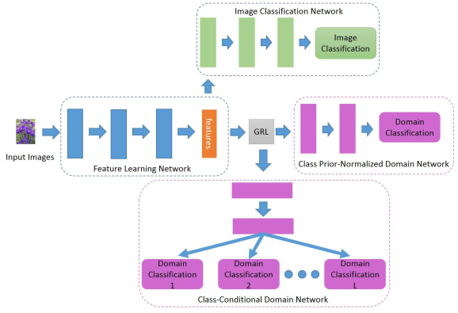

The loss of class-conditional domain classification network is:
$$
L_{c o n}\left(\theta_{f}, \theta_{d}^{j}\right)=\sum_{m=1}^{C}\left[\frac{1}{N_{j}^{m}} \sum_{i=1}^{N_{j}^{m}} \sum_{n=1}^{C} I\left[y_{i \sim j}^{d}=n\right] \log P_{n}\left(F_{d}^{j}\left(F_{f}\left(x_{i \sim j}^{m}\right)\right)\right)\right]
$$
Note that here we compute the loss of each class independently, in order to perform class-conditional learning. If we have $L$ classes, we must construct $L$ sub-branches of the networks. Each sub-branch corresponds to one class.

The loss of class prior-normalized domain network is:
$$
L_{n o r m}\left(\theta_{f}, \theta_{p}\right)=\sum_{m=1}^{C} \frac{1}{N^{m}}\left[\sum_{i=1}^{N^{m}} \sum_{n=1}^{C} \beta^{m}\left(y_{i}^{m}\right) I\left[y_{i}^{d}=n\right] \log P_{n}\left(F_{p}\left(F_{f}\left(x_{i}\right)\right)\right)\right)
$$
where $\beta^{m}(Y)$ is the normalized weight:
$$
\begin{aligned}
P_{N}^{m}(T(X)) &= \sum_{j=1}^{L} P^{m}(T(X) | Y=j) P^{m}(Y=j) \beta^{m}(Y=j)\\ &=\sum_{j=1}^{L} P^{m}(T(X) | Y=j) \frac{1}{L}
\end{aligned}
$$
$\beta^{m}(Y)$ enforces the prior probability for each class to be the same in order to reduce the negative effect caused by the probable change of $P(Y)$.

$\beta^{m}(Y)$ can be empirically obtained as:
$$
\beta^{m}\left(y_{i}^{m}\right)=\frac{1}{L} \frac{1}{P^{m}\left(Y=y_{i}^{m}\right)}=\frac{N^{m}}{L \times N_{j=y_{i}^{m}}^{m}}
$$
The total loss function is:
$$
R\left(\theta_{f},\left\{\theta_{d}^{j}\right\}_{j=1}^{L}, \theta_{p}, \theta_{c}\right)=L_{c l a}\left(\theta_{f}, \theta_{c}\right)+\lambda\left(\sum_{j=1}^{L} L_{c o n}\left(\theta_{f}, \theta_{d}^{j}\right)+L_{n o r m}\left(\theta_{f}, \theta_{p}\right)\right) 
$$
The training process is iterative using the idea of gradient reversal layer (GRL):
$$
\begin{aligned} \theta_{f}^{i+1} &=\theta_{f}^{i}-\gamma\left[\frac{\partial L_{c l a}^{i}}{\partial \theta_{f}}+\lambda\left(\sum_{j=1}^{L} \frac{\partial L_{c o n}^{i}\left(\theta_{f}, \theta_{d}^{j}\right)}{\partial \theta_{f}}+\frac{\partial L_{n o r m}^{i}}{\partial \theta_{f}}\right)\right] \\ \theta_{c}^{i+1} &=\theta_{c}^{i}-\gamma \frac{\partial L_{c l a}^{i}}{\partial \theta_{c}} \\\left(\theta_{d}^{j}\right)^{i+1} &=\left(\theta_{d}^{j}\right)^{i}+\gamma \lambda \frac{\partial L_{c o n}^{i}\left(\theta_{f}, \theta_{d}^{j}\right)}{\partial \theta_{d}^{j}} \\ \theta_{p}^{i+1} &=\theta_{p}^{i}+\gamma \lambda \frac{\partial L_{n o r m}^{i}}{\partial \theta_{p}} \end{aligned}
$$

##### 3.9 ADAGE

**paper**: Agnostic Domain Generalization 

**date**: 2018

**tag**: feature-based, adversarial, reversal gradient, image translation

ADAGE is the abbreviation of A*gnostic Domain Generalization*.

The main idea of ADAGE is to use a image transformer to filter domain information and then extract features on the transformed image.

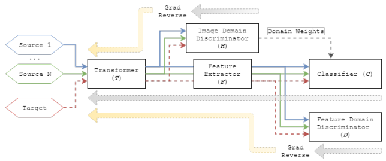

ADAGE requires both the input and output of the feature extractor to be invariant. An image domain discriminator is used on the input of the feature extractor (i.e., the transformed image) to ensure image-level invariance. While a feature domain discriminator is used on the output of feature extractor to ensure feature-level invariance. 

The output scores of image domain discriminator are also used as weights of the classifier. *But this method is problematic*: on one hand,  the image domain discriminator requires the scores to be equal so that domain information is confused; On the other hand, the domain weighting scheme requires the scores to convey enough domain information such that the classifier can be correctly weighted. *These two aspects are contradict*. *Why not directly use the scores of original image as domain weights?*

The transformer is an incremental structure with layer aggregation.

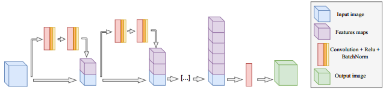

ADAGE uses reversal gradient to implement adversarial learning. The total loss is:
$$
\begin{aligned} \mathcal{L}\left(\theta_{T}, \theta_{F}, \theta_{D}, \theta_{H}, \theta_{C}\right)=& \sum_{i=1 . . S, S+1} \sum_{j=1 \ldots N^{i}} \mathcal{L}_{C}^{j, i}\left(\theta_{T}, \theta_{F}, \theta_{C}\right)+\eta \mathcal{L}_{e}^{j, i=S+1}\left(\theta_{T}, \theta_{F}, \theta_{C}\right) \\ &-\lambda \mathcal{L}_{D}^{j, i}\left(\theta_{T}, \theta_{F}, \theta_{D}\right)-\gamma \mathcal{L}_{H}^{j, i}\left(\theta_{T}, \theta_{H}\right) \end{aligned}
$$
where $\mathcal{L}_{C}^{j, i}$ and $\mathcal{L}_{e}^{j, i=S+1}$ are classification loss ($\mathcal{L}_{e}^{j, i=S+1}$ is only active in DA setting), $\mathcal{L}_{D}^{j, i}$ and $\mathcal{L}_{H}^{j, i}$ are the loss of feature and image domain discriminator respectively.

##### 3.10 CrossGrad

**paper**: GENERALIZING ACROSS DOMAINS VIA CROSS-GRADIENT TRAINING

**date**: ICLR 2018

**tag**: data augmentation

The authors assume that the domain $d$ induces a latent domain feature $g$, and $g$ can affect the class $y$ during inference.

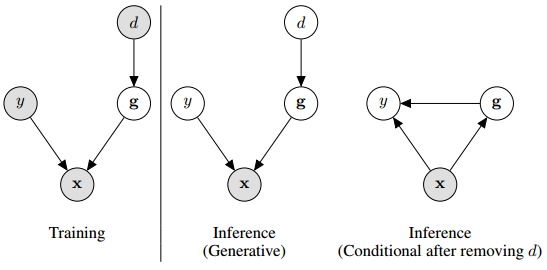

Based on this assumption, the authors propose a cautious data augmentation strategy that perturbs the input to make only small moves along the estimated domain features, in order to change the class label as little as possible. 

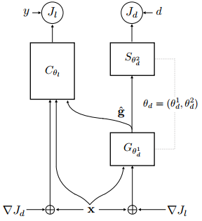

The input is perturbed along the direction of greatest domain change. An additional branch is added to train the domain feature extractor $G$ to avoid domain shifts when the data is perturbed to cause class label shifts. This ensures the direction of domain changes in the domain classifier is not highly correlated with the direction of class label changes. In other words, change the domain information in the input $x$ will not change its class label. 

The algorithm is:

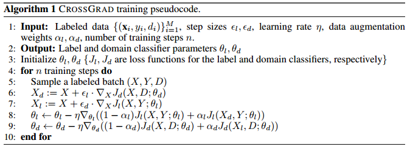

##### 3.11 ADA

**paper**: Generalizing to Unseen Domains via Adversarial Data Augmentation 

**date**: NIPS 2018

**tag**: data augmentation

ADA is the abbreviation of *Adversarial Data Augmentation*.

ADA allows the model to generalize given only one source domain.

The main idea of ADA is finding a new sample that maximizes the classification loss while keeps the distance from the original sample as close as possible.
$$
x_{\gamma}^{*}=\arg \max _{x \in \mathcal{X}}\left\{\ell\left(\theta ;\left(x, y_{0}\right)\right)-\gamma c_{\theta}\left(\left(x, y_{0}\right),\left(x_{0}, y_{0}\right)\right)\right\}
$$
The new augmented sample preservers the semantic features of the original sample, but the difficulty of classification increases due to shifted distributions. In other words, the new augmented sample is a "hard example" for current classifier. Then a new classifier is trained on these "hard examples" as well as original data.

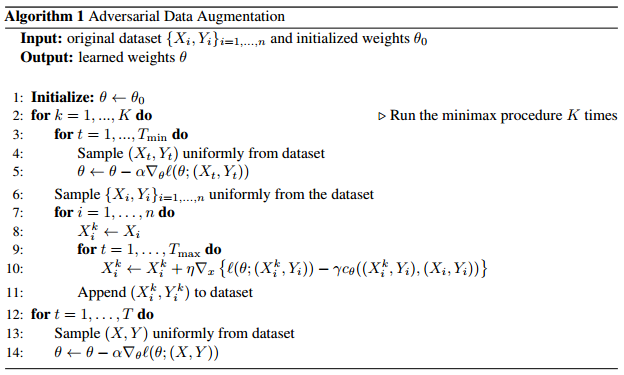

##### 3.12 MLDG

**paper**: Learning to Generalize: Meta-Learning for Domain Generalization 

**date**: AAAI 2018

**tag**: meta-learning

MLDG is the abbreviation of *Meta-Learning for Domain Generalization*.

MLDG is modified from the MAML algorithm in meta learning. Instead of different classification tasks in few-shot learning settings, MLDG resamples virtual source domains and virtual target domains from the real source domains to perform meta training and meta testing. 

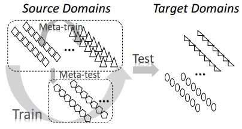

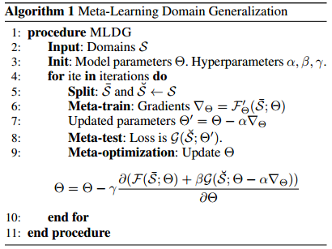

MLDG also uses the meta-train gradient in meta-optimization, which is different from the original MAML.

The objective of MLDG is:
$$
\underset{\Theta}{\operatorname{argmin}} \mathcal{F}(\Theta)+\beta \mathcal{G}\left(\Theta-\alpha \mathcal{F}^{\prime}(\Theta)\right)
$$
Using the first-order Taylor expansion, the objective can be rewrite as:
$$
\underset{\Theta}{\operatorname{argmin}} \mathcal{F}(\Theta)+\beta \mathcal{G}(\Theta)-\beta \alpha\left(\mathcal{G}^{\prime}(\Theta) \cdot \mathcal{F}^{\prime}(\Theta)\right)
$$
By minimizing this objective, we want to minimize the loss on both meta-train and meta-test domains while keep their gradients as similar as possible. $\beta \alpha\left(\mathcal{G}^{\prime}(\Theta) \cdot \mathcal{F}^{\prime}(\Theta)\right)$ can be seen as a regularization term that can improve the model's generalization ability on both meta-train and meta-test domains.

The authors further propose two variations of MLDG:

* MLDG-GC: computes the cosine similarity of $\mathcal{G}^{\prime}(\Theta)$ and $\mathcal{F}^{\prime}(\Theta)$ instead of dot product
  $$
  \underset{\Theta}{\operatorname{argmin}} \mathcal{F}(\Theta)+\beta \mathcal{G}(\Theta)-\beta \alpha \frac{\mathcal{F}^{\prime}(\Theta) \cdot \mathcal{G}^{\prime}(\Theta)}{\left\|\mathcal{F}^{\prime}(\Theta)\right\|_{2}\left\|\mathcal{G}^{\prime}(\Theta)\right\|_{2}}
  $$

* MLDG-GN: uses another perspective of "similar direction" gradients
  $$
  \underset{\Theta}{\operatorname{argmin}} \mathcal{F}(\Theta)+\beta\left\|\mathcal{G}^{\prime}\left(\Theta-\alpha \mathcal{F}^{\prime}(\Theta)\right)\right\|_{2}^{2}
  $$

Experiments show that vanilla MLDG performs best on PACS.

##### 3.13 MetaReg

**paper**: MetaReg: Towards Domain Generalization using Meta-Regularization 

**date**: NIPS 2018

**tag**: meta-learning

MetaReg aims at learning a regularizer that can generalize to unseen target domains. That is, only the regularizer is responsible to capture domain-invariant information, rather than the feature extractor. After the regularizer is trained, a final model is fine-tuned on the entire source dataset using the trained regularizer. 

The loss function is:
$$
L_{r e g}(\psi, \theta)=L(\psi, \theta)+R(\psi, \theta)
$$
where $L(\psi, \theta)$ is the classification loss, $R(\psi, \theta)$ is the regularization, $\psi$ and $\theta$ are parameters of feature extractor and classifier respectively.

 Let $\phi$ be the parameters of the regularizer, then the training process is:
$$
\begin{aligned} \beta^{1} & \leftarrow \theta_{a}^{(k)} \\ \beta^{t} &=\beta^{t-1}-\alpha \nabla_{\beta^{t-1}}\left[L^{(a)}\left(\psi^{(k)}, \beta^{t-1}\right)+R_{\phi}\left(\beta^{t-1}\right)\right] \quad \forall t \in\{2, \ldots l\} \\ \hat{\theta}_{a}^{(k)} &=\beta^{l}\\
\phi^{(k+1)}&=\phi^{(k)}-\alpha \nabla_{\phi} L^{(b)}\left.\left(\psi^{(k)}, \hat{\theta}_{a}^{(k)}\right)\right|_{\phi=\phi^{(k)}}
\end{aligned}
$$
In practice, the regularizer takes the form of weighted L1 loss: $R_{\phi}(\theta)=\sum_{i} \phi_{i}\left|\theta_{i}\right|$.

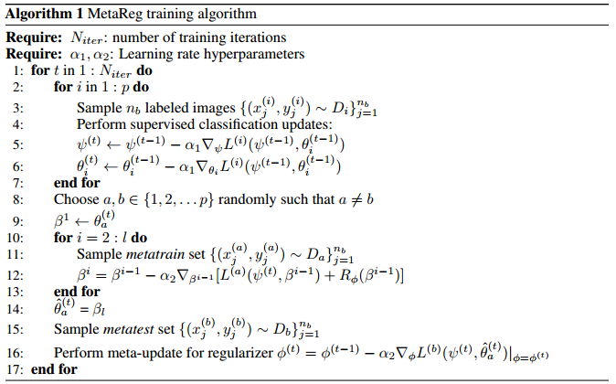

The regularizer is only added to the classifier, i.e., meta-learning is only performed on the classifier. Therefore, the parameters updated by meta-learning is much fewer, while MLDG updates the parameters of entire network. This allows MetaReg to be applied in deeper networks such as ResNet (previous methods usually uses AlexNet as base model). 

#### 4. Conclusion

Two important properties of all the methods are listed here:

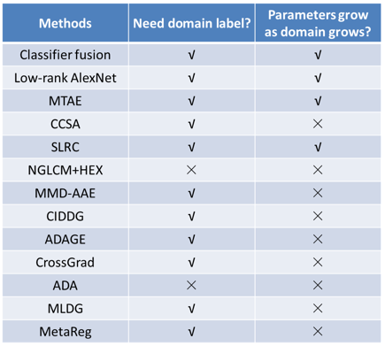

Whether a method needs domain label or not determines how much supervised information will be used. Removing domain label will make DG problem relatively harder. The scenario that using mixed domain inputs is called *Unguided Domain Generalization (UDG)* in the *NGLCM+HEX paper*.

Whether model parameters grow as the number of source domain grows is another important property. If the parameters do grow with the number of domains, the generalization ability of model will definitely be limited by the quality and number of source domains.  