### A Report on Cross-media Retrieval Methods

***

*All the work is from the research  group of Peng Yuxin,  Peking  University.* *All the methods reported are DNN-based methods.*

#### 0. Problem definition

Cross-media retrieval scenario:

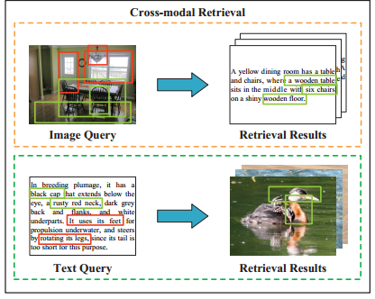

The main challenge of cross-media retrieval is to deal with the inconsistency between different modalities and learn the intrinsic correlation between them.

A key for cross-media retrieval is how to learn cross-modal common representations.

#### 1. CBT

【**paper**】Cross-modal Bidirectional Translation via Reinforcement Learning

【**source**】IJCAI 2018

【**method**】Cross-modal Bidirectional Translation (CBT)

【**tag**】machine translation, reinforcement learning

In this paper, the authors treat images as a special kind of language. They attempt to conduct bidirectional transformation between image and text to further enhance cross-modal correlation.

**Network architecture**

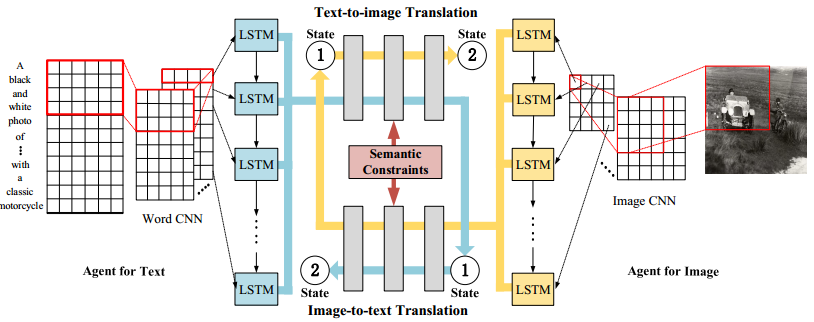

Firstly use image CNN and Word CNN to extract sequence features and feed them   to LSTM models. Then transform the LSTM hidden features from one modality to another and back again by fc layers. The middle layer is connected by weight sharing and a softmax loss layer to keep semantic consistency.

**Reinforcement training process**

Take image-to-text translation as example. The image feature representation $s^i$ from LSTM is transformed to text feature space to get translated feature $s^{i}_{mid}$， then  $s^{i}_{mid}$ is transformed back to the original image feature space to get reproduced feature $s^i_{ori}$. The text feature representation is $s^t$.

* Inter-modality reward $r^{i n t er}$: similarity between $s^{i}_{mid}$ and $s^t$;
* Intra-modality reward $r^{i n t r a}$: similarity between $s^i_{ori}$ and $s^i$.

Total reward:
$$
r_{p}=\alpha r^{i n t e r}+(1-\alpha) r^{i n t r a}
$$
Text-to-image pipeline is similar.

The whole reinforcement training algorithm:

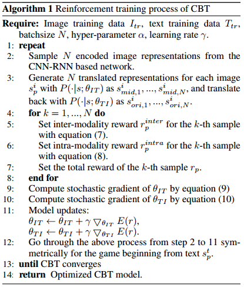

 

#### 2. MCSM

【**paper**】Modality-specific Cross-modal Similarity Measurement with Recurrent Attention Network

【**source**】TIP 2018

【**method**】Modality-specific Cross-modal Similarity Measurement (MCSM)

【**tag**】attention

**Overview**

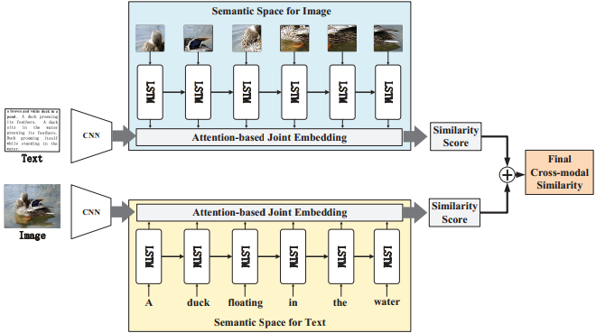

The proposed approach does not construct explicit common feature spaces between image and text modality. It aligns image feature to text feature space and text feature to image feature space respectively in two branches. 

**Architecture**

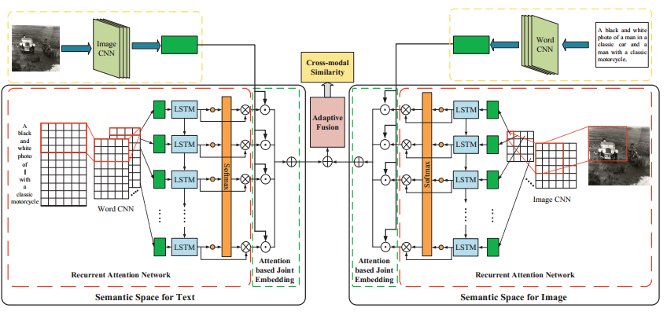

Take image modality as an example. The LSTM hidden outputs are embedded with attention weights. The attention weights are computed by:
$$
\begin{aligned} M^{i} &=\tanh \left(W_{a}^{i} H_{i}\right) \\ a^{i} &=\operatorname{softmax}\left(w_{i a}^{T} M_{i}\right) \end{aligned}
$$
The recurrent attention network learns the weighted sum of local information in image modality, while WordCNN learns the global information of text modality. Then a similarity can be computed between them:
$$
\operatorname{sim}_{i}\left(i_{p}, t_{p}\right)=\sum_{j=1}^{n} a_{j}^{i_{p}} h_{j}^{i_{p}} \cdot q_{p}^{t}
$$
An joint embedding loss is defined by both consider matched and mismatched image-text pairs with the defined similarity:
$$
L_{i}=\frac{1}{N} \sum_{n=1}^{N} l_{i 1}\left(i_{n}^{+}, t_{n}^{+}, t_{n}^{-}\right)+l_{i 2}\left(t_{n}^{+}, i_{n}^{+}, i_{n}^{-}\right)
$$
where
$$
\begin{array}{l}{l_{i 1}\left(i_{n}^{+}, t_{n}^{+}, t_{n}^{-}\right)=\max \left(0, \alpha+\operatorname{sim}_{i}\left(i_{n}^{+}, t_{n}^{+}\right)-\operatorname{sim}_{i}\left(i_{n}^{+}, t_{n}^{-}\right)\right)} \\ {l_{i 2}\left(t_{n}^{+}, i_{n}^{+}, i_{n}^{-}\right)=\max \left(0, \alpha+\operatorname{sim}_{i}\left(i_{n}^{+}, t_{n}^{+}\right)-\operatorname{sim}_{i}\left(i_{n}^{-}, t_{n}^{+}\right)\right)}\end{array}
$$
Similarly, for text branch, the similarity score is:
$$
\operatorname{sim}_{t}\left(i_{p}, t_{p}\right)=\sum_{j=1}^{m} a_{j}^{t_{p}} h_{j}^{t_{p}} \cdot q_{p}^{i}
$$
and the jointly embedding loss is:
$$
L_{t}=\frac{1}{M} \sum_{n=1}^{M} l_{t 1}\left(t_{n}^{+}, i_{n}^{+}, i_{n}^{+}\right)+l_{t 2}\left(i_{n}^{+}, t_{n}^{+}, t_{n}^{-}\right)
$$
**Adaptive fusion**: the similarity score $\operatorname{sim}_{i}\left(i_{p}, t_{p}\right)$ and $\operatorname{sim}_{t}\left(i_{p}, t_{p}\right)$ are further fused to form a final cross-modal similarity, in order to **boost cross-modal retrieval performance.** 

Firstly, $\operatorname{sim}_{i}\left(i_{p}, t_{p}\right)$ and $\operatorname{sim}_{t}\left(i_{p}, t_{p}\right)$ are min-max normalized as $r_{i}\left(i_{p}, t_{p}\right)$ and $r_{t}\left(i_{p}, t_{p}\right)$. Then the fused similarity is computed as:
$$
\begin{array}{l}{\operatorname{Sim}\left(i_{p}, t_{p}\right)=r_{t}\left(i_{p}, t_{p}\right) \cdot \operatorname{sim}_{i}\left(i_{p}, t_{p}\right)+r_{i}\left(i_{p}, t_{p}\right) \cdot \operatorname{sim}_{t}\left(i_{p}, t_{p}\right)}\end{array}
$$
The motivation is that larger similarity in one semantic space should lead to a higher importance of the corresponding pair in another semantic space.

#### 3. MHTN

【**paper**】MHTN: Modal-adversarial Hybrid Transfer Network for Cross-modal Retrieval

【**source**】TCYB 2018

【**method**】 Modal-adversarial Hybrid Transfer Network (MHTN)

【**tag**】adversarial learning 

This studies **knowledge transfer from single-modal source domain to cross-modal target domain**. Five modalities are involved: image, audio, video, text, 3D object. The label spaces of source and target domain are **heterogeneous**.

**Architecture**

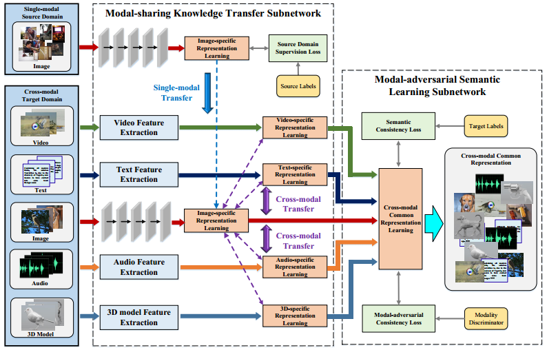

MHTN consists of two subnetworks:

* **Modal-sharing knowledge transfer subnetwork**: 

  

  * **single-modal knowledge transfer**: transfer knowledge from source to target in shared modality (image); a **MMD loss** is added to minimize the discrepancy between source and target image features; a **source classification loss** is also added to preserve sematic constraints.
  * **cross-modal knowledge transfer**: transfer knowledge from the centric modality (image) to other modalities in target domain; a **l2 loss** is added to minimize the discrepancy between features of different modalities.

* **Modal-adversarial Semantic Learning Subnetwork**:

  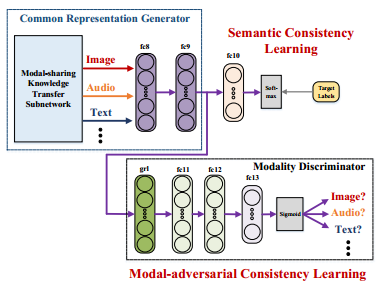

  This module takes the output of Modal-sharing knowledge transfer subnetwork as input. A modality discriminator is used to distinguish the modality of input features. The adversarial process is realized by **gradient reversal layer**.  A **target classifier** is also added to preserve semantic consistency. 

The total loss of the whole network consists of **five** parts. The final output of the network is a cross-modal common representation.

#### 4. CM-GAN

【**paper**】CM-GANs: Cross-modal Generative Adversarial Networks for Common Representation Learning 

【**source**】TMM 2019

【**method**】 Cross-modal Generative Adversarial Network (CM-GAN)

【**tag**】adversarial learning, GAN

This paper aims at learning a common representation for image and text modality via GAN-based adversarial learning.

**Architecture**

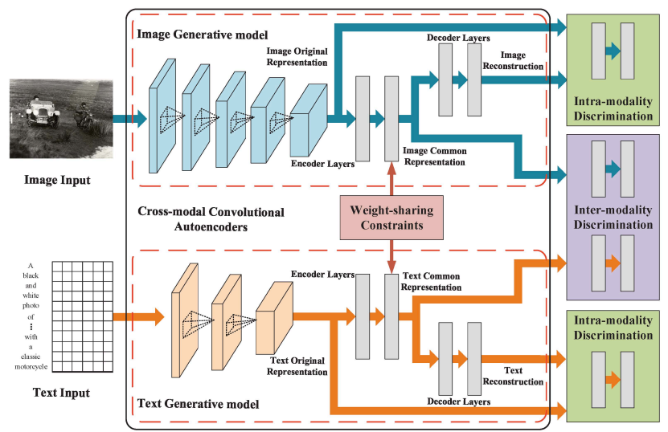

1) Generator:

The generator of CM-GAN is convolutional autoencoders. For both image and text inputs, the latent features (i.e., the output of encoder) are extracted by CNNs.  The latent feature goes through several fc layers to get image or text common representations. The weights of the last layer are shared between two branches. 

Then the common representation goes through several fully-connected decoder layers to reconstruct the original latent feature. 

Therefore, for each branch, **three** representations are generated: original latent representations, common representations and reconstructed representations.

2) Discriminator:

* Intra-modality discrimination: discriminates original latent representation and  the reconstructed representation of image and text modality respectively;
* Inter-modality discrimination: discriminates the image common representation and the text common representation.

#### 5. TPCKT

【**paper**】TPCKT: Two-level Progressive Cross-media Knowledge Transfer 

【**source**】TMM 2019

【**method**】 TPCKT

【**tag**】adversarial learning

This paper studies **knowledge transfer from cross-modal source domain to cross-modal target domain**. There are two main challenges: 1) inconsistency information between different modalities; 2) disjoint label space between source and target domain. For simplicity, image and text modality are chosen in this paper.

**Architecture**

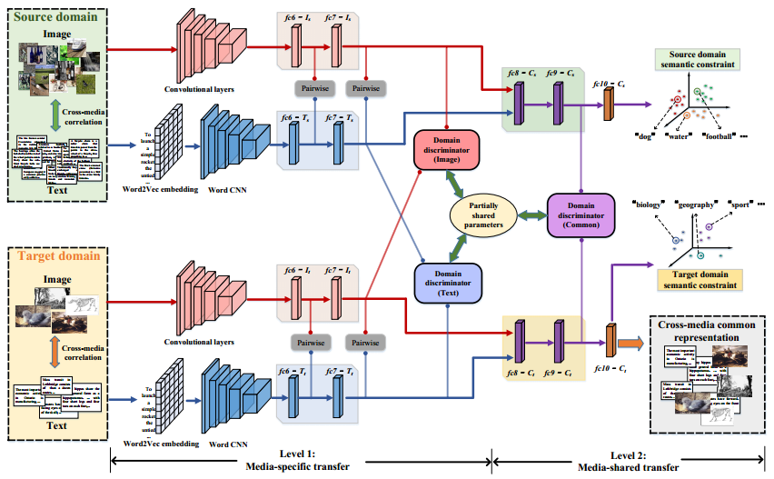

1) Media-specific transfer

The media-specific transfer aims at align the data distributions of the same media  type between source and target domain. A domain discriminator is adopted for each media type. One GRL layer is used for adversarial learning.

To preserve the intrinsic consistency between two medias, the authors proposed two strategies. First, the media-specific domain discriminators of image and text share the last fc layer. Second,  a pairwise L2 loss is  applied in fc6 and fc7 layers between the representations of two medias for each domain.

2) Media-shared transfer

The outputs of $f c 7-I / f c 7-T$ are passed through two fc layers, which are shared between two medias, to generate a common representation. A media-shared discriminator is used to distinguish the common representations of source and target domain.

Note that the last fc layer of this discriminator is also shared with the previous media-specific domain discriminators, in order to “enhance the consistency of media -specific and media-shared transfer processes”.

Finally the classification loss of source and target domain is added for maintaining the semantically discriminative ability.

**Training**

The authors propose a **progressive semantic transfer mechanism** to train the whole network. The motivation is to avoid noisy and useless information in the early training period, i.e., to make the early training stage easier by gradually choose “harder” samples for the network.

Whether a category is easy or not is defined by its similarity with the other domain. If the similarity is high, then samples from that category will be chosen. 

The output of fc9 layer (i.e., the common representation) is used for compute similarity. The similarity between a source class and the target domain is the mean of the similarities between that source class and all the target classes.  Computation of the similarity between a target class and source domain is the similar.

Then the similarities are ranked in a descending order. Top-k classes in source domain and top-l classes are selected for the training in this iteration.

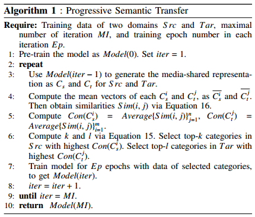

#### 6. C$^3$L

【**paper**】Show and Tell in the Loop: Cross-Modal Circular Correlation Learning

【**source**】TMM 2018

【**method**】 Cross-Modal Circular Correlation Learning (C$^3$L) 

【**tag**】bidirectional generation

The authors propose a unified framework with a circular learning process for cross-modal retrieval, image-to-text caption and text-to-image synthesis.

**Framework**

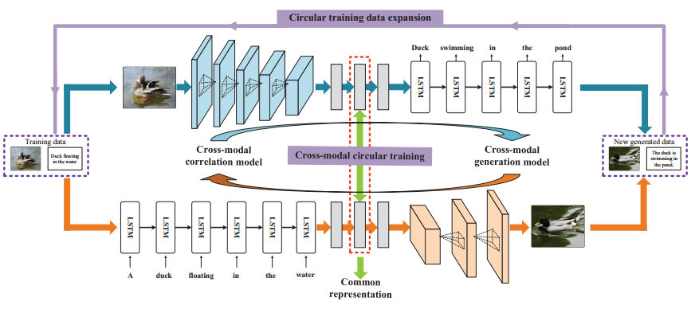

The whole framework consists of two pathways:

* Image-to-text pathway: an encoder CNN and a decoder RNN for image-to-text caption;
* Text-to-image pathway: an encoder RNN and a decoder CNN for text-to-image synthesis.

Following the encoder CNN and encoder RNN, three fc layers are adopted. The intermediate layer is linked between two pathways for cross-modal common representation learning. Then the outputs of the last fc layer are fed to the decoder CNN or decoder RNN for generation.

The new generated image-text pairs are fed back as the inputs for data augmentation. 

**Training**

In order to learn the common representation, a triplet loss is adopted:
$$
L_{c o r r}=\frac{1}{N} \sum_{n=1}^{N} l_{c o r r_{1}}\left(i_{n}^{+}, t_{n}^{+}, t_{n}^{-}\right)+l_{c o r r_{2}}\left(t_{n}^{+}, i_{n}^{+}, i_{n}^{-}\right)
$$
where
$$
\begin{array}{l}{l_{c o r r_{1}}\left(i_{n}^{+}, t_{n}^{+}, t_{n}^{-}\right)=} \\ {\max \left(0, \lambda-\operatorname{sim}\left(i_{n}^{+}, t_{n}^{+}\right)+\operatorname{sim}\left(i_{n}^{+}, t_{n}^{-}\right)\right)} \\ {l_{c o r r_{2}}\left(t_{n}^{+}, i_{n}^{+}, i_{n}^{-}\right)=} \\ {\max \left(0, \lambda-\operatorname{sim}\left(t_{n}^{+}, i_{n}^{+}\right)+\operatorname{sim}\left(t_{n}^{+}, i_{n}^{-}\right)\right)}\end{array}
$$
The similarity is defined as the dot product on the common representation of image and text:
$$
\operatorname{sim}\left(i_{p}, t_{p}\right)=c_{p}^{i} \cdot c_{p}^{t}
$$
The image-to-text pathway is trained by the negative log likelihood objective function:
$$
L_{t x t G e n}\left(c_{p}^{i}, S_{p}\right)=-\sum_{t=1}^{K} \log w_{t}\left(s_{t}\right)
$$
The text-to-image pathway is trained in the form of a conditional GAN:
$$
\begin{array}{l}{L_{i m g G e n}=\log D\left(s_{q}^{i}, c_{q}^{t}\right)} \\ {\quad+\frac{1}{2}\left(\log \left(1-D\left(s_{q}^{i-}, c_{q}^{t}\right)\right)+\log \left(1-D\left(\hat{s_{q}^{i}}, c_{q}^{t}\right)\right)\right)}\end{array}
$$

