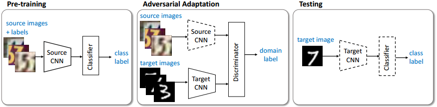
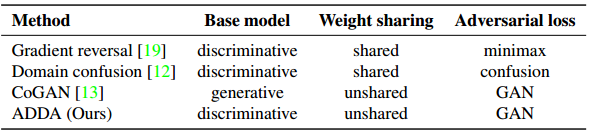
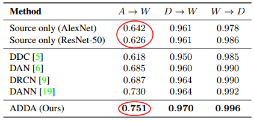
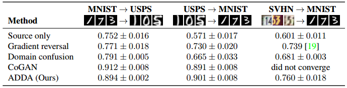
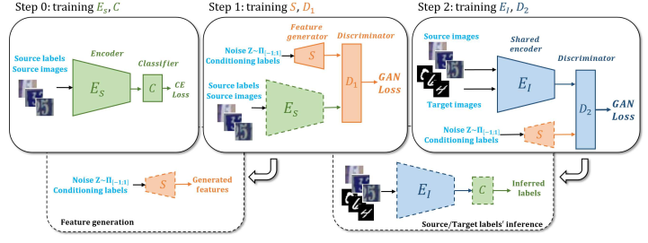
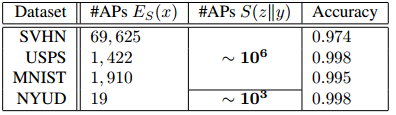
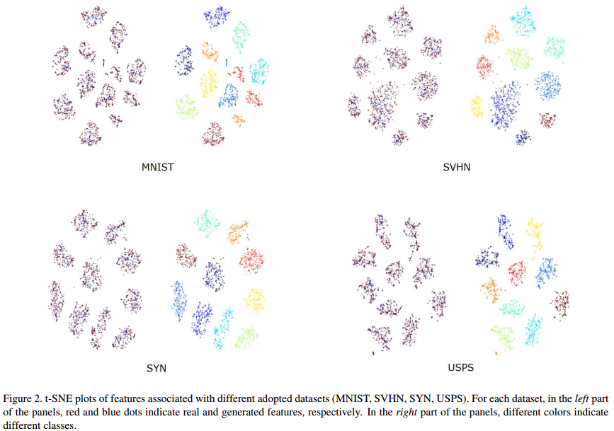
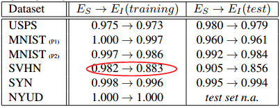

### ADDA and DIFA for Unsupervised Domain Adaptation

------

#### 1. ADDA

**paper**: [**Adversarial Discriminative Domain Adaptation**     *CVPR2017* ](http://openaccess.thecvf.com/content_cvpr_2017/papers/Tzeng_Adversarial_Discriminative_Domain_CVPR_2017_paper.pdf)

**1)  Methodology**

**Adversarial Discriminative Domain Adaptation (ADDA)** is a very straight method used for unsupervised domain adaptation. Its main idea is minimizing the discrepancy between source domain and target domain in the feature space via adversarial learning. ADDA adopts **the standard GAN loss** as its adversarial loss. 

The entire framework of ADDA consists of three stages.

*Stage 1*: Pre-train a **source CNN encoder** and its corresponding **classifier** using the labeled source images;

*Stage 2*: Perform the adversarial adaptation by training a **target CNN encoder** to spoof the **domain discriminator**, while fixing the source encoder at the same time;

*Stage 3*: Combine the target CNN encoder and the source classifier together to classify the unlabeled target images by fixing all the parameters.

We can clearly see that the main components of ADDA is a source CNN encoder, a target CNN encoder, a classifier and a domain discriminator. **The source domain and target domain using different encoders without any weight sharing**.  The authors did not use a shared encoder based on the following reasons:

> This this may make the optimization poorly conditioned, since the same network must handle images from two separate domains. 

*But I does not fully agree with this statement.*

By using adversarial learning, we are trying to make the feature distribution of target domain be as close as that of source domain.  

ADDA uses a discriminative base model, like many other adversarial models do.

**2)  Experiments**

Only important conclusions are listed here.

* **Conclusion 1**:  ADDA method itself but not the backbone CNN model brings an effective improvement.

   

* **Conclusion 2**: Modelling image distributions or in other words, using a generative model is unnecessary to enable effective adaptation. Because ADDA (discriminative model) can achieve a compatible performance with CoGAN (generative model). 

  

#### 2. DIFA

**paper**:  [**Adversarial Feature Augmentation for Unsupervised Domain Adaptation**	*CVPR2018* ](http://openaccess.thecvf.com/content_cvpr_2018/papers/Volpi_Adversarial_Feature_Augmentation_CVPR_2018_paper.pdf)

**1)  Methodology**

**DIFA (Domain Invariant & Feature Augmentation)** is an incremental work of ADDA. DIFA introduces **feature augmentation** in ADDA, resulting in a four-stage framework. Moreover, DIFA uses a shared encoder for source and target domain to enforce domain-invariant.

The entire framework is shown as follows:

The parameters of dashed line modules are fixed in the figure below.

*Stage 1*: Pretrain a **source encoder** $E_S$ and the corresponding **classifier** $C$; 

*Stage 2*: Train a feature generator $S$ to resemble source features by adversarial learning, and the corresponding discriminator is $D_1$;

*Stage 3*: Train a domain invariant encoder $E_I$, which takes both source and target images as inputs, to resemble the features generated by $S$, and the corresponding discriminator is $D_2$;

*Stage 4*: Use $E_I$ and $C$ to classify the target images.

* **Least Square GAN Loss**

The "GAN Loss" of $D_1$ is based on the conditional GAN framework and Least Square GAN loss:
$$
\begin{aligned} \min _ { \theta _ { S } } \max _ { \boldsymbol { \theta } _ { D _ { 1 } } } \ell _ { 1 } & = \mathbb { E } _ { \left( z , y _ { i } \right) \sim \left( p _ { z } ( z ) , Y _ { s } \right) } \left\| D _ { 1 } ( S ( z \| y _ { i } ) \| y _ { i } ) - 1 \right\| ^ { 2 } \\ & + \mathbb { E } _ { \left( x _ { i } , y _ { i } \right)  \sim \left( X _ { s } , Y _ { s } \right)} \left\| D _ { 1 } \left( E _ { s } \left( x _ { i } \right) \| y _ { i } \right) \right\| ^ { 2 } \end{aligned}
$$
where $p _ { z } ( z )$ is uniform noise in the range of [-1,1], and $\|$ denotes a concatenation operation.

The "GAN Loss" of $D_2$ is also based on the LSGAN loss:
$$
\begin{aligned} \min _ { \theta _ { E _ { I } } } \max _ { \theta _ { D _ { 2 } } } \ell _ { 2 } = & \mathbb { E } _ { x _ { i } \sim X _ { s } \cup X _ { t } } \left\| D _ { 2 } \left( E _ { I } \left( x _ { i } \right) \right) - 1 \right\| ^ { 2 } \\ & + \mathbb { E } _ { \left( z , y _ { i } \right) \sim \left( p _ { z } ( z ) , Y _ { s } \right) } \left\| D _ { 2 } ( S ( z \| y _ { i } ) ) \right\| ^ { 2 } \end{aligned}
$$
The authors observed that using a LSGAN loss led to more stability.

* **Feature Augmentation**

Feature augmentation is the main idea of this paper. The motivation of feature augmentation is to create more source features and supplement source feature distribution, which is similar to the idea of *data augmentation*. In other words, by introducing feature augmentation, the authors want to provide more "references" for the shared encoder $E_I$.

The feature generator $S$ takes as input the concatenation of a noise vector and a *one-hot* label code to generate the desired class.

* **Domain Invariant**

The so-called "domain invariant" is rather trivial in this paper, by learning a shared encoder $E_I$ using both source and target data to approach the distribution of features generated by $S$. The authors believed that this operation can "*map both source and target samples in a common feature space*".  

**2)  Experiment**

Two important issues in my opinion:

* **Generating Features**

Feature augmentation does provide much more features than original source ones.

The authors used a metric called *activation patterns (APs)* to evaluate the generating ability of feature generator $S$. 

t-SNE analysis shows that the generated features are discriminative enough.

* **Classification Ability**

The authors report the performance of $C \circ E _ { S }$ and $C \circ E _ { I }$ on source data.

Clearly, $E_S$ and $C$ are matched, but $E_I$ and $C$ may not, especially on SVHN the classification accuracy drops a lot (considering the distribution of SVHN is quite different from MNIST and USPS). 

This is an interesting finding. Putting source and target data together may be problematic because the feature representation of source data may drift to target data. However, fixing source feature and forcing target feature to approach it do not have this problem, as ADDA does. Or maybe we can jointly train the classifier and domain discriminator when using a shared encoder to mitigate this problem.