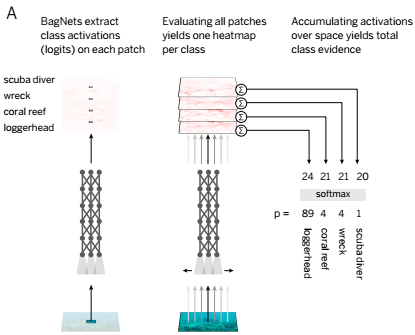
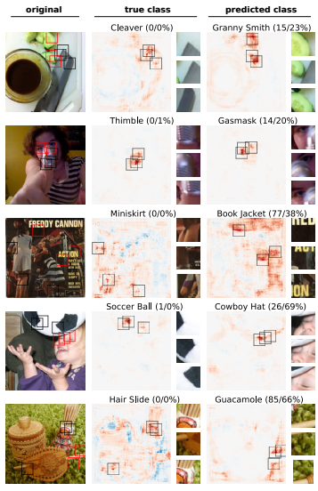
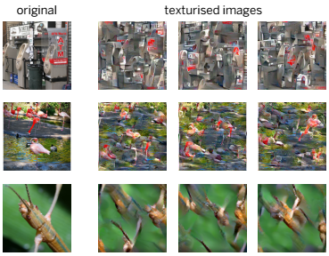
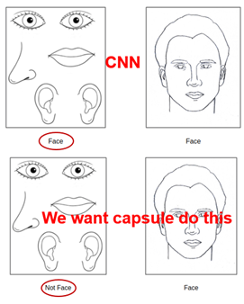
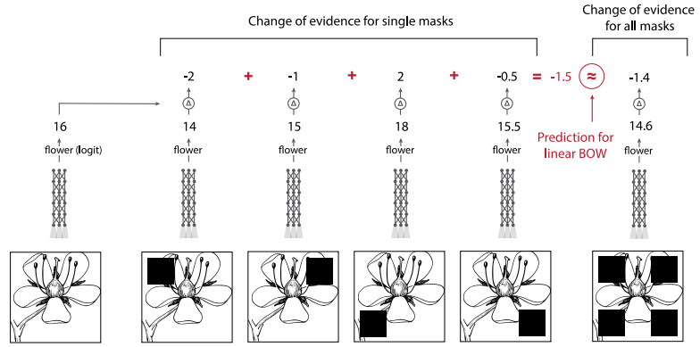
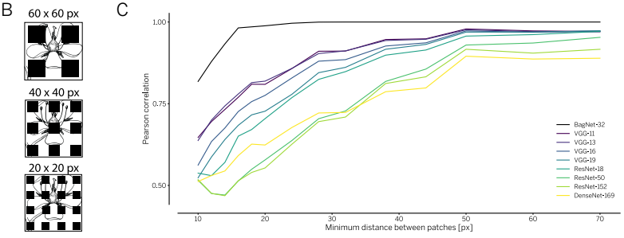
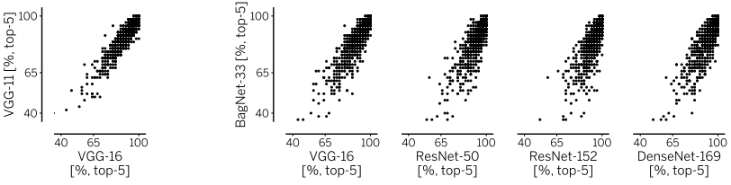
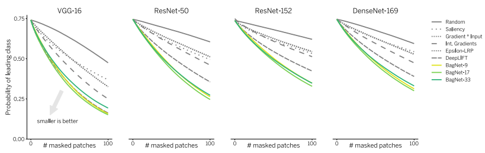

### BagNet: Integrating Bag of Features

***

**paper**: [Approximating CNNs with Bag-of-local-Features models works surprisingly well on ImageNet ](file:///E:/qwxu/%E7%A7%91%E7%A0%94/Papers/zotero/storage/ZN29MYIQ/forum.html)

#### 1. Introduction

In this interesting paper, the authors give an interpretation for modern CNNs from a very different perspective. They propose a more interpretable model called **BagNet** to approximate the function of modern CNNs. By studying the properties of BagNet and analogy to other CNN models, the authors  find some interesting conclusions.

**The greatest significance of BagNet lies in its interpretability, rather than its performance.** 

#### 2. Methodology

The idea of BagNet comes from traditional bag-of-features models, whose idea is similar to the bag-of-words representation in NLP. The Bag-of-word method cares only about the number of occurrences of words in a document, while ignores their orders. Similarly, in the case of CV, bag-of-features models only care about the presences of specific visual patterns, without their spatial relationships.

BagNet works by aggregating class scores which are independently predicted by small image patches. The architecture of BagNet is shown below:

 BagNet was constructed as follows:

* **Firstly, decompose the original image into small patches. **

  Here these patches are densely generated like anchor boxes in Faster R-CNN with fixed size of 9$\times$9, 17$\times$17, or 33$\times$33. In the codes, the original image is padded according to patch size, which means the number of patches is equivalent to the number of input pixels (such as 224$\times$224).

* **Secondly, use ResNet-50 to extract a 2048-d feature representation for each patch.**

  Here many 3$\times$3 filters in original ResNet-50 are replaced with 1$\times$1 filters to ensure the reception filed is the same as patch size.

* **Thirdly, use a linear classifier to infer a class vector for each patch.**

  In the case of ImageNet, the class vector is 1000-d (i.e., the number of classes). The authors use a single fully-connected layer with no activations as the linear classifier. This yields a 3D tensor of size 1000$\times$224$\times$224, which can also be  seen as heat maps for specific classes.

* **Finally, average each heat map over space dimension and use softmax function to output class probabilities.**

#### 3. Experiments

**1) Performance**

**Accuracy**: BagNet-17 got 80.5% top-5 accuracy (AlexNet level); BagNet-33 got 87.6% top-5 accuracy;

**Speed**: BagNet is much slower than vanilla ResNet-50 (155 fps v.s. 570 fps).

**2) Interpretability**

BagNet can tell you which parts of the image contribute most to certain decisions. The authors showed this function by using both true and wrong labels, and picked up the most predictive patches.

**3) Image Scrambling**

One important property of BagNet is that the model only cares about the occurrences of local features. In order to test whether modern CNNs also have similar properties or not, the authors scrambled the original images as model inputs. Surprisingly, VGG-16 is little affected (90.1% before v.s 79.4% after scrambling). However, ResNet and DenseNet failed  to recognize the scrambled images, the reasons of which are not yet fully understood.

For human, it is difficult to recognize the scrambled images.

This reminds me of the Capsule Net.

**4) Spatially distinct image manipulations**

The authors did some occlusion experiments. They compared the case of aggregation of independent masking regions and simultaneous masking regions. An example is shown by the figure below.

The authors measured the correlations of the output logits between these two cases. They believe that if interactions between different regions are weak, then the correlations should be strong. Results of different mask sizes and different models are shown below:

 

BagNet shows weak interactions between regions when the minimum distance between patches is greater than 30px. This is understandable because the reception filed of BagNet is around 30$\times$30 px. Interestingly, VGG has similar properties for image features larger than 30$\times$30 px, as the authors said:

>VGG-16 exhibits few interactions between image parts spaced by more than 30 pixels.

Performance is better for ResNet and DenseNet, which suggests that the interactions are stronger in deeper and more performant architectures.

**5) Error Distribution**

Top-5 accuracies for different classes is shown below:

BagNet-33 and VGG-16 performed quite similarly.

**6) Spatial Sensitivity**

Covering the most predictive areas found by BagNet and other methods will lead to a degradation of model performance, especially for VGG-16. This suggests that models like VGG-16 relies heavily on local features, rather than global relations.

#### 4. Discussion & Conclusion

This paper reveals that image classification tasks (especially for ImageNet) can be solved by just using small local features. The authors believe that the ImageNet task is not difficult enough for models to learn global information and causal relationships. 

In fact, VGG has quite similar properties to BagNet, which suggests that VGG may not has a global perspective as we expected. Situation is better for ResNet and DenseNet, indicating that deeper and useful architecture designs do help model interactions between image regions. 

 But the question still remains: does modern CNNs overfits on local features? If so, maybe we should find some more suitable tasks or introducing some new regularizations to force the model to learn more global and causal information. 

Notably, the authors give an possible explanation for why CNNs generalizes so poorly to distribution shifts:

>a DNN trained on natural images has learnt to recognize the textures and local image features  associated with different objects (like the fur and eyes of a cat or the keys of a typewriter) and will inevitably fail if presented with cartoon-like images as they lack the key local image features upon which it bases its decisions. 

This reminds me that global spatial features (such as shapes) may also be important for universal feature learning, along with semantic features.

 Finally, let's summarize the functions of BagNet:

* BagNet can be a good choice for those applications in which it is desirable to trade some accuracy for better interpretabililty;
* BagNet can also serve as a lower-bound to evaluate whether models have learned global information or not in future works.