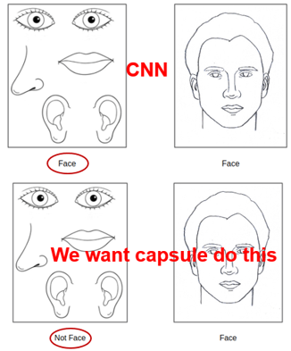
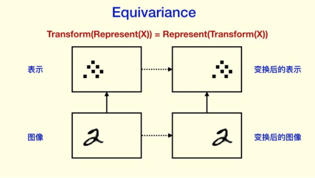
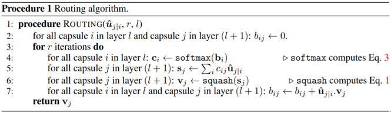
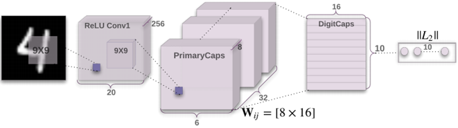
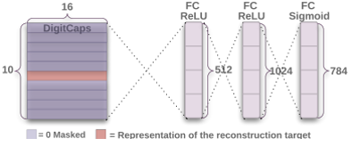
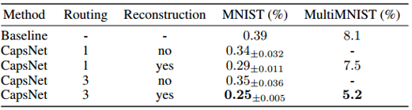
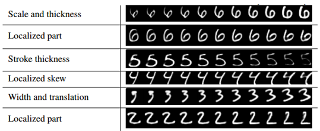
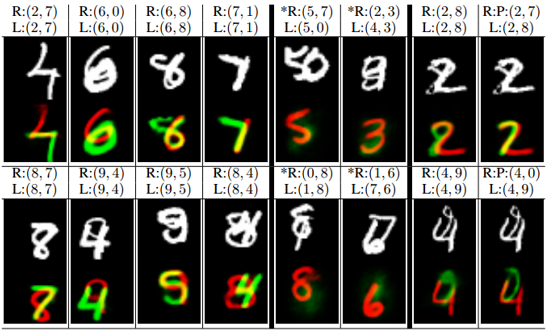

### Introduction of Capsules

------

**paper**:  [**Dynamic Routing Between Capsules**    *NIPS2017*](http://papers.nips.cc/paper/6975-dynamic-routing-between-capsules.pdf)

*(This report is not only based on this paper but also some materials from Internet as the original paper is obscure to read.)*

#### **1. Motivation of Capsules**
Before introducing Capsule Network in detail, let’s focus on the motivation of capsules first. *This part is not important but helpful to understand the concept of capsules in my opinion.*

**1)**	**Defect of CNNs**

CNN uses convolution layers to extract features in the image. The lower layers in CNN learn to detect some simple features such as edges, while the higher layers combine them together to form more complex features. However, it is difficult for CNN to perceive the consistency of the image after translation and rotation (and similar changes) by simple weighted sum.

CNN uses max-pooling to handle this problem. In a specific region of the feature map, maximum values are taken to mitigate the effects of translation and rotation. Max-pooling performs well when the extent of translation and rotation is small, but does not work when the variation is large, because the limitation of pooling kernel size. This the reason why data augmentation tricks such as rotate the original images can boost the performance of CNN. Moreover, after max-pooling, much valuable information is dropped.

The most important thing is that CNN only considers the existence of objects, without relations between them, such as spatial locations. A simple example is shown below. In this case, CNN firstly detects eyes, ears, nose and mouth, which are the components of a human face. Then the corresponding neurons are activated, shown the existence of a human face, despite the spatial distributions.

**2)**	**Equivariance and Invariance**

Hinton argues that the motivation of CNN is not correct. Current CNNs blindly pursue recognition rate, but our final goal is to get a good representation of the contents. If we find a good representation, we can “understand” the content, then these contents can be used for recognition, semantic analysis and so on. This indicates that what we need is equivariance but not invariance.

However, invariance does exist because human’s recognition about objects is not related to their locations. Hinton explains that knowledge, but not activities have to be invariant of viewpoint. In other words, the existence of objects should not be affected by changes such as translation or rotation, but their attributes should be different after these transformations.

#### 2. **Definition of Capsules**
Unlike traditional neurons whose input and output are scalars, a capsule takes vectors as input and output a vector. For the output vector of a capsule:

* Each dimension of this vector represents the characteristics /attributes (location, direction, size, etc.) of an entity.
* The norm/length of the vector represents the probability of the existence of the entity.

Each capsule detects one specific type of entity or pattern. Let $u_i$ be the input vectors and $v_j$ be the output vector, computation in a capsule is as follows:

**1) Affine transformation**
$$
\hat { u } _ { j i } = W _ { i j } u _ { i }
$$
**2) Weighted sum**
$$
s _ { j } = \sum _ { i } c _ { i j } \hat { u } _ { j i }
$$
**3) Squashing function**
$$
v _ { j } = \frac { \left\| s _ { j } \right\| ^ { 2 } } { 1 + \left\| s _ { j } \right\| ^ { 2 } } \frac { s _ { j } } { \left\| s _ { j } \right\| }
$$
This function is used to squash the value of $s_j$  to the interval [0,1]. It can be seen as the non-linear activation function in a capsule.

There are two types of parameters in a capsule: $W_{ij}$ and $c_{ij} / b_{ij}$. $W_{ij}$ is updated by BP, while $c_{ij} / b_{ij}$ is updated by the **dynamic routing** algorithm:

The max iteration step $r$  is a hyperparameter. This algorithm uses vector inner product to represent the similarity of $\hat { u } _ { i j }$ and $v _ { j }$. If vector $\hat { u } _ { i j }$ and $v _ { j }$ are close to each other, then corresponding $b _ { i j }$ will be lager, thus the weight $c _ { i j }$ will be larger. This works like an attention
mechanism. 

#### 3. CapsNet

The architecture proposed by the paper is shallow with only two convolutional layers and one fully connected layer.

**1) Conv layer**

A normal convolution layer with 256, 9 × 9 convolution kernels with a stride of 1 and ReLU activation.

**2) PrimaryCaps layer**

A convolutional capsule layer with 32 channels of convolutional 8D capsules (*i.e.*, each primary capsule contains 8 convolutional units with a 9 × 9 kernel and a stride of 2).

This layer can be seen as a normal convolution layer with totally 32 × 8 filters. But these filters are divided into 32 groups. In each group, each position of the feature map can be seen as a vector with 8 elements (*i.e.*, the channel dimension). Each vector represents a capsule. Capsules in the same group share parameters (because of convolution), while capsules from different groups have independent parameters.

**3) DigitCaps layer**

This layer is similar to fully-connected layers in traditional NN, used for final prediction. In the case of MNIST, this layer consists of 10 capsules with 16D vector output. Each capsule predicts the existence of a digit independently. This allows the network to recognize overlapped digits. Dynamic routing is only used once between PrimaryCaps and DigitCaps layer.

#### 4. Loss function

**1) Margin loss**

Loss of individual class:
$$
L _ { c } = T _ { c } \max \left( 0 , m ^ { + } - \left\| \mathbf { v } _ { c } \right\| \right) ^ { 2 } + \lambda \left( 1 - T _ { c } \right) \max \left( 0 , \left\| \mathbf { v } _ { c } \right\| - m ^ { - } \right) ^ { 2 }
$$
$T _ { c } = 1$ when class $c$ exists, otherwise $T _ { c } = 0$. $m ^ { + }$ and $m ^ { - }$ are set to 0.9 and 0.1 respectively in the paper.

Total loss:
$$
L = \sum _ { c } L _ { c }
$$
**2) Reconstruction loss**

Used as a regularization and is computed as sum of square error. Reconstruction is done by MLP.

#### 5. Experiment

Classification result on MNIST:

Only 3 iterations in dynamic routing is enough.

Different dimensions in a capsule output vector can represent some attributes:

Ability to distinguish overlapped digits:

#### 6. Pros

* The first implementation of capsules.

* Use dynamic routing to implement routing-by-agreement (the original idea of Hinton
  to update parameters).

* More robust to adversarial attack.

* Need fewer samples and more generalizable.

* Do not need data augmentation.

* The output vectors can be a good representation in other tasks such as detection and segmentation.

#### 7. Cons

* Large number of parameters.

* Difficult to be applied in large datasets that include more attributes.

* Computation is slow.

#### 8. Further Work

* Different squashing functions.

* Other implementation of routing-by-agreement.

* Improve computation efficiency.