## Disentangle 相关论文总结

### 1. 概述

在机器学习文献中，Disentangle 相关的工作主要分为两种：

* 第一种是 **Disentangled Representation Learning**，这类工作希望学到这样的一种特征（representation）：**该特征的每一个维度都相互独立，并且表示某一种特定的具体属性**。例如，从人脸数据集中学到的 disentangled representation，其第一个维度可能代表头发的颜色，第二个维度可能代表脸上的表情等等。

  **这类工作的目的就是学到这样的 disentangled representation，然后进行类似于 attribute manipulation 的操作**，即通过改变学到的 disentangled representation 中的某个维度，来改变这个维度对应的属性表征，而不引起其他属性的变化。

* 第二种是 **Feature Separation**，这类工作常常出现在 domain adaptation 和 image-to-image translaiton 的相关文献中。通常，这类工作会**将学到的某个中间 feature 拆成两个，其中一个随特定条件的改变而改变，另一个则不变**。例如在 domain adaptation 中，这类工作的通常表现形式是将特征分为 domain-invariant feature 和 domain-specific feature。

  有别于第一类工作，**这类工作的目的本身并不是 representation learning，而是希望借助 disentangle 的手段完成一些 downstream tasks**，比如 domain adaptation 或者 image-to-image translation。另外，这类工作通常需要一些监督信息来完成特征的分离，比如 domain 或者 class 的 label。

*（注！以上划分中的 Disentangled Representation Learning 和 Feature Separation 仅仅是个人称谓，方便对两类工作进行区分；大部分文献都不会对这两类工作进行区分，将它们统称为 Disentangled Representation Learning 或其他类似的称呼。）*

第一类 disentangle 工作通常都是纯理论研究，文章中往往充斥着大量的数学推导过程；第二类 disentangle 工作则更偏向具体的任务，比如 domain adaptation (DA) 和 image-to-image translation (I2I)。这篇总结中，我们的关注点在后一类 disentangle 工作。如果没有特殊的上下文说明，下文中出现的 disentangle 默认都是指第二类 disentangle 工作。

***

从具体细节上来看，第二类 disentangle 工作大体上又可以分为两种做法，第一种做法是“真正”的 feature separation，要求模型能同时学到 invariant feature 和 specific feature；第二种做法，只要求模型学到 invariant feature，而 specific feature 则以 one-hot vector 的形式直接给出（例如 domain label 或 class label），从某种意义上来讲，这种做法和条件生成（conditional generation）很像。

为了便于区分，在下文中，我们统一将第一类做法称为 disentangle (true separation)，第二类做法称为 disentangle (one-hot coding) 。

### 2. Basic Disentanglement

这一节介绍的方法都是在做纯粹的 disentangle，不涉及到 DA，I2I 等任务。

#### 2.1 AAE

【**Method**】**A**dversarial **A**uto**E**ncoders

【**paper**】Adversarial Autoencoders

【**source**】arXiv 2015

【**type**】disentangle (one-hot coding) 

AAE的具体介绍见：[对抗自编码器AAE原理](https://github.com/KveinXu/AIX/blob/master/%E6%B7%B1%E5%BA%A6%E5%AD%A6%E4%B9%A0/pdf/%E5%AF%B9%E6%8A%97%E8%87%AA%E7%BC%96%E7%A0%81%E5%99%A8AAE%E5%8E%9F%E7%90%86.pdf)

这里简单提一下有关 disentangle 的内容。AAE 的原文中给出了在全监督的情况下对输入图片进行 style (class-invariant) 和 content (class-dependent) 的 disentangle 的框架：

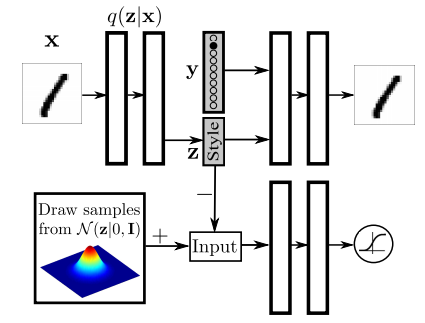

由于 content 信息是直接以 one-hot 的 class label 给出的，所以可以认为 encoder 就只会关注与类别无关的 style 信息（虽然这是一个很强的假设）。而这里 decoder 重建的过程实际上就是一个条件生成的过程。

另外，AAE还有在半监督条件下进行 disentangle 的框架，与全监督的区别是，这里 encoder 也要学出 one-hot 的 content code，并且与一个 categorical 先验对齐；同时，对于有标记的那部分数据，还要最小化 content code 和对应的 label 之间的 cross entropy。

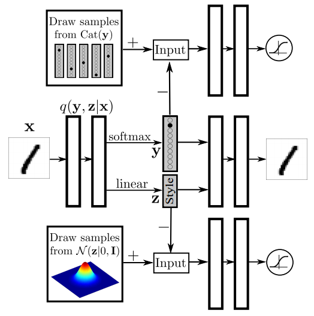

此外，将上面半监督框架中对标记数据的分类部分去掉，还可以进行无监督的 disentangle，此时可以通过 content code 来实现对原始数据的聚类，cluster 的数目由 categorical prior 的维数来控制。

#### 2.2 ACGAN

【**Method**】**A**uxiliary **C**lassifier **GAN**

【**paper**】Conditional Image Synthesis With Auxiliary Classifier GANs

【**source**】ICML 2017

【**type**】disentangle (one-hot coding) 

ACGAN 的介绍见：[GAN的有监督条件生成](https://github.com/KveinXu/AIX/blob/master/%E6%B7%B1%E5%BA%A6%E5%AD%A6%E4%B9%A0/pdf/GAN%E7%9A%84%E6%9C%89%E7%9B%91%E7%9D%A3%E6%9D%A1%E4%BB%B6%E7%94%9F%E6%88%90.pdf)

事实上，ACGAN 的原文中并没有提到 disentangle，但是许多 disentangle 文献的 related work 中都会提到 ACGAN，并且将它算作 disentangle 的工作，所以这里也简单提一下。

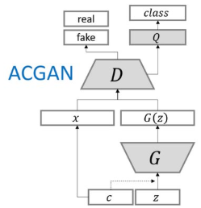

ACGAN 原本的目的是做条件生成，提供给 generator 的是 class label $c$ 和 latent code $z$ 。由于与 class 有关的 content 信息已经直接包含在 $c$ 中，所以 $z$ 就只提供 style 的信息。但实际上 ACGAN 没法直接做 disentangle，因为它缺少像 AAE 中的 encoder 那样做 inference 的部分。

### 3. Domain Adaptation

本节主要介绍 disentanle 在 DA 中的相关应用。在大多数情况下，DA 中的 disentangle 都是希望分离 domain-invariant feature 和 domain-specific feature，然后利用 domain-invariant feature 去进行后续的诸如 classification 之类的任务。

#### 3.1 DSN

【**Method**】**D**omain **S**eparation **N**etwork

【**paper**】Domain Separation Networks

【**source**】NIPS 2016

【**type**】disentangle (ture separation) 

DSN 是用 disentangle 的方法来做 DA 的经典工作。它的**基本假设**是：

>We define “low-level” differences in the distributions as those arising due to noise, resolution, illumination and color. “High-level” differences relate to the number of classes, the types of objects, and geometric variations, such as 3D position and pose. 
>
>We assume that our source and target domains differ mainly in terms of the distribution of low level image statistics and that they have high level parameters with similar distributions and the same label space.

大意是说，DSN 应用的 source 和 target domain 间只存在一些微小的、 low-level 的 statistics 上的差异，而不是 high-level 的、可能涉及到同一语义的不同视觉表征的差异。这个假设降低了 disentangle 的难度，因为显然对于模型来说，要分离出更抽象的 high-level 语义信息是更困难的。

DSN 认为，**只寻找 domain 之间共享的 representation 的做法是不完善的**，这会使得 shared representation 容易受到一些与 shared distribution 相关、但是与任务无关的噪声的污染：

>it leaves the shared representations vulnerable to contamination by noise that is correlated with the underlying shared distribution 

所以，DSN 借助 disentangle 来将 domain-specific feature 分离出去，从而进一步“纯化” 共享的 domain-invariant feature。

DSN的框架如下：

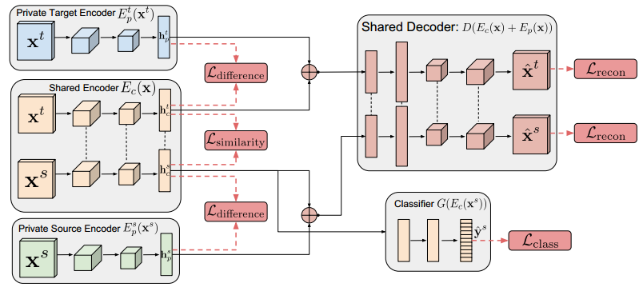

注意，抽取 domain-invariant feature 和 domain-specific feature 的 encoder 是不共享的，同时抽取两个 domain 各自的 specific feature 的 encoder 也是不共享的，**只有抽取两个 domain 的 invariant feature 的 encoder 是在 domain 之间共享的**。

DSN 的 loss 函数如下：
$$
\mathcal{L}=\mathcal{L}_{\text {task }}+\alpha \mathcal{L}_{\text {recon }}+\beta \mathcal{L}_{\text {difference }}+\gamma \mathcal{L}_{\text {similarity }}
$$
一共四个部分，其中 $\mathcal{L}_{\text {task }}$ 是任务相关的 loss，对于分类任务来说就是 cross entropy ；

$\mathcal{L}_{\mathrm{recon}}$ 是 reconstruction loss ：
$$
\mathcal{L}_{\text {recon }}=\sum_{i=1}^{N_{s}} \mathcal{L}_{\text {si }_{\text {mse }}}\left(\mathbf{x}_{i}^{s}, \hat{\mathbf{x}}_{i}^{s}\right)+\sum_{i=1}^{N_{t}} \mathcal{L}_{\text {si }_{\text {mse }}}\left(\mathbf{x}_{i}^{t}, \hat{\mathbf{x}}_{i}^{t}\right)
$$
不过这里的 reconstruction loss 用的不是传统的 MSE loss，而是 scale-invariant MSE loss：
$$
\mathcal{L}_{\mathrm{si}_{-} \mathrm{mse}}(\mathbf{x}, \hat{\mathbf{x}})=\frac{1}{k}\|\mathbf{x}-\hat{\mathbf{x}}\|_{2}^{2}-\frac{1}{k^{2}}\left([\mathbf{x}-\hat{\mathbf{x}}] \cdot \mathbf{1}_{k}\right)^{2}
$$
MSE 惩罚的是两张图片像素之间的绝对差异，而 si-MSE 惩罚的是两张图片相邻的一对像素之间的差异的差异，即相对差异。应用 si-MSE 可以使得模型更多关注在重建图片中物体的形状，而不是图片中的绝对颜色或强度。更多关于 si-MSE 的内容参见 [这篇论文](https://papers.nips.cc/paper/5539-depth-map-prediction-from-a-single-image-using-a-multi-scale-deep-network.pdf)。

$\mathcal{L}_{\text {difference }}$ 是一个 subspace orthogonality constraint ，目的是使 invariant feature 和 specific feature 的 subspace 互相垂直，以保证它们相互独立：
$$
\mathcal{L}_{\text {difference }}=\left\|\mathbf{H}_{c}^{s \top} \mathbf{H}_{p}^{s}\right\|_{F}^{2}+\left\|\mathbf{H}_{c}^{t^{\top}} \mathbf{H}_{p}^{t}\right\|_{F}^{2}
$$
最后是 $\mathcal{L}_{\text {similarity }}$，这个 loss 的目的是 align 两个 domain 间共享的 invariant feature，可以采用 DANN 和 MMD 两种形式：
$$
\mathcal{L}_{\text {similarity }}^{\mathrm{DANN}}=\sum_{i=0}^{N_{k}+N_{t}}\left\{d_{i} \log \hat{d}_{i}+\left(1-d_{i}\right) \log \left(1-\hat{d}_{i}\right)\right\}
$$

$$
\mathcal{L}_{\text {similarity }}^{\mathrm{MMD}}=\frac{1}{\left(N^{s}\right)^{2}} \sum_{i, j=0}^{N^{s}} \kappa\left(\mathbf{h}_{c i}^{s}, \mathbf{h}_{c j}^{s}\right)-\frac{2}{N^{s} N^{t}} \sum_{i, j=0}^{N^{s}, N^{t}} \kappa\left(\mathbf{h}_{c i}^{s}, \mathbf{h}_{c j}^{t}\right)+\frac{1}{\left(N^{t}\right)^{2}} \sum_{i, j=0}^{N^{t}} \kappa\left(\mathbf{h}_{c i}^{t}, \mathbf{h}_{c j}^{t}\right)
$$

实验中，DANN 形式的效果更好一些。

#### 3.2 DiDA

【**Method**】**Di**entanglement & **D**omain **A**daptation

【**paper**】DiDA: Disentangled Synthesis for Domain Adaptation 

【**source**】arXiv 2018

【**type**】disentangle (ture separation) 

与一般的 disentangle 方法相比，DiDA 的思路和做法都比较的与众不同。**DiDA 的核心思想是利用 disentangle 来进行数据增强，合成带标签的 target domain 数据来训练网络。**

具体来说，DiDA 的目的依然是学习分离 domain-invariant 和 domain-specific feature，不同之处在于，DiDA 会用提取到 domain-invariant 和 domain-specific feature 来合成更多地带有 label 的 target domain 数据，从而借此提升现有的 domain adaptation 方法的性能。

DiDA 的框架如下：

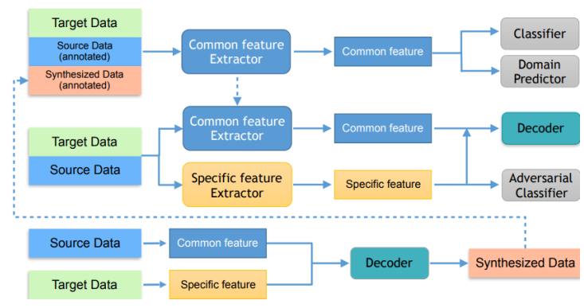

整个方法分为两个阶段：

* 第一阶段是 domain-adaptation stage，这个阶段会采用现成的 domain adaptation 方法，如DANN，来训练一个 common feature extractor ；
* 第二阶段是 disentanglement stage，这一阶段中 common feature extractor 的参数固定，然后用对抗的方式来训练一个 specific feature extractor，使其提取的特征只包含 class-agnostic 的信息，即欺骗 adversarial classifier ；Adversarial classifier 在分类时，会利用上一阶段 DA 网络的预测结果作为target domain 的伪标签；此外，该阶段还包含一个重建过程。

（*注！这里有一个小问题：按照第二阶段的对抗训练方式，sepcific feature extractor 提取的是 class-agnostic feature，这能等同于 domain-specific feature 吗？*）

**两个阶段是不断迭代的**，第二阶段训练结束后，DiDA 利用提取出的 source common feature 和 target specific feature 来合成带标记的 target domain 数据，再将合成数据喂给第一阶段，开始新的一轮迭代。作者认为，通过这种方式，**domain adaptation 和 disentangle 可以相互促进**，最终目的是提升现有的 domain adaptation 方法的效果。

下面展示的是实验中 DiDA 合成图片的效果：

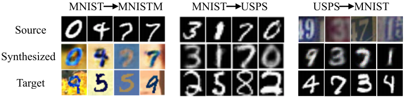

#### 3.3 FAN

【**Method**】**F**actorized **A**dversarial **N**etwork 

【**paper**】Factorized Adversarial Networks for Unsupervised Domain Adaptation 

【**source**】arXiv 2018

【**type**】disentangle (ture separation) 

FAN 的目的是 disentangle 出 domain-specific feature 和 task-specific feature，**然后只 adapt task-specific 的部分**。这样做的 **motivation 在于：直接去除掉一些 domain-specific 的信息，减轻对抗训练的负担，从而更有效地完成 domain adaptation**。

FAN的框架如下：

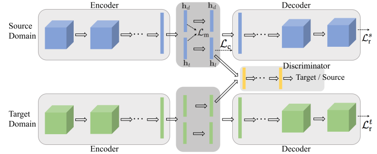

FAN 的训练过程分为**两个阶段**：

* 第一阶段先训练 source domain 的 disentangle 网络，目的是提取 source domain 的 task-specific 特征；

  此时 encoder 提取出的 feature 被分为 domain-specific 的 $\mathbf{h}_{d}$ 和 task-specific 的 $\mathbf{h}_{t}$ 两部分，同时会有一个 orthogonality 的约束 $\mathcal{L}_{\mathrm{m}}$ 来保证这两个feature 的 subspace 相互独立：
  $$
  \mathcal{L}_{\mathrm{m}}=\sum_{i=1}^{N}\left\|\mathbf{h}_{t i}^{\mathrm{T}} \mathbf{h}_{d i}\right\|^{2}
  $$
  然后，task-specific feature $\mathbf{h}_{t}$ 会被映射为 logit $\mathbf{h}_{l}$，并根据 source domain 的 label 产生一个分类 loss $\mathcal{L}_{\mathrm{c}}$；最后，logit $\mathbf{h}_{l}$ 和 domain-specific feature $\mathbf{h}_{d}$ concat到一起，并通过 decoder 进行重建，产生重建 loss $\mathcal{L}_{\mathrm{r}}$；

  source domain 的全部 loss 为
  $$
  \mathcal{L}_{\text {source }}=\alpha \mathcal{L}_{\mathrm{c}}+\beta \mathcal{L}_{\mathrm{m}}+\mathcal{L}_{\mathrm{r}}
  $$
  *（注！一般来讲，进行重建时 concat 的是  $\mathbf{h}_{t}$ 和  $\mathbf{h}_{d}$，关于这里为什么要用 logit $\mathbf{h}_{l}$ 来代替 $\mathbf{h}_{t}$，文章中并没有给出合理的解释。）*

* 第二阶段更新 target domain network 。训练时新增了 adversarial loss 来 align source 和 target domain 的 task-specific feature；同时，去除了分类 loss $\mathcal{L}_{\mathrm{c}}$ 和 orthogonality loss  $\mathcal{L}_{\mathrm{m}}$；

  需要注意的是，这里**对抗训练 align 的是 logit space，而不是 task-specific space 本身**。*（注！至于为什么要这样做，文章中并没有给出合理的解释，只说这样  “ works better in practice ”）*。

  关于为什么**不再加入 orthogonality loss**  $\mathcal{L}_{\mathrm{m}}$，文章中给出的解释是：对于source 和 target domain，task-specific feature 是共通的，在 adversarial loss 作用下 ，target network 会提取出类似于 source domain 的 task-specific feature，那么剩下的自然就是 target domain 的 domain-specific feature，这时 orthogonality loss 就显得不必要了。实验中，作者尝试加入过 target network 的 orthogonality loss，但效果没有提升。

  另外，target network 的参数是用第一阶段训练好的 source network 的参数初始化的。

#### 3.4 DADA

【**Method**】**D**eep **A**dversarial **D**isentangled **A**utoencoder

【**paper**】Domain Agnostic Learning with Disentangled Representations  

【**source**】ICML 2019 Oral

【**type**】disentangle (ture separation) 

与一般的 disentangle 相比，DADA 的做法具有一定的创新性。DADA 这篇文章研究的问题不是标准的 domain adaption，而是文章中重新定义的 **domain agnostic learning (DAL)** 。

DAL 是指这样的场景：**给定一个 source domain，需要 adapt 到多个 target domain，并且这些 target domain 是混合在一起的，没有 domain label**。

针对 DAL 问题，DADA 给出的解决方案是：**进行两个方面的 disentangle，分别是 domain disentanglement 和 class disentanglement**，使得最终提取出的 feature 同时包含 domain-invariant 和 class-relevant 的信息。

DADA 的框架如下：

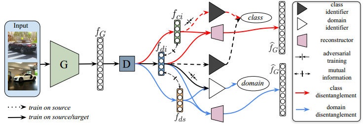

注意！DADA 不是将 feature 一分为三，而是分别利用 domain label 和 class label 进行两次互相独立的，一分为二的操作，所以说 DADA 进行的是两个方面的 disentangle 。

DADA 的整个训练流程如下：

首先 feature generator $G$ 提取完整的 feature $f_{G}$，然后由 disentangler $D$ 分别抽取出 domain-invariant (同时也是 class-relevant) feature $f_{di}$、domain-specific $f_{ds}$ 和 class-irrelevant feature $f_{ci}$，之后，分别以$（f_{di}，f_{ds}）$和 $（f_{di}，f_{ci}）$的组合进行重建；同时，分别由 class indentifier $C$ 和 domain identifier $DI$ 进行 class-level 和 domain-level 的对抗训练来完成 disentangle；另外，还有一个 mutual information estimator $M$，用于估计输入的两个 feature 之间的互信息，以便让整体网络进行最小化，从而使$（f_{di}，f_{ds}）$、 $（f_{di}，f_{ci}）$之间相互独立。

算法流程整理如下：

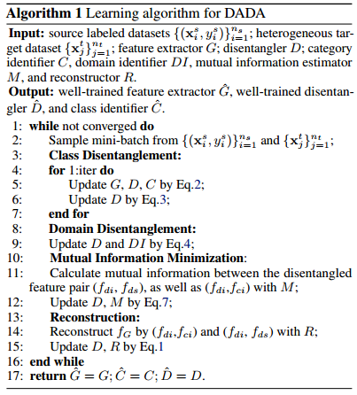

此外，为了能更好地 normalize 混杂在一起的 target domain 数据，作者还采用了 ring-style normalization 的方法，并衍生出了一个额外的 ring loss，具体细节参照原文。

*（注！这篇文章本身的要素很多，但个人认为核心的部分还是在于其从两个方面进行 disentangle 的思想；至于 mutual information estimator 和 ring loss，则来自于其他单独文章的研究成果。）*

### 4. Image Translaion

本节主要介绍 disentangle 在 I2I 中的相关应用，其中部分 I2I 方法本身也可以用于 DA，但由于这些方法的重点在 I2I，所以它们也被放在这一节中一并介绍。

#### 4.1 MUNIT

【**Method**】**M**ultimodal **UN**supervised **I**mage-to-Image **T**ranslation

【**paper**】Multimodal Unsupervised Image-to-Image Translation

【**source**】ECCV 2018

【**type**】disentangle (ture separation) 

MUNIT 的任务是 multi-modal I2I，它和下面将要介绍的 DRIT 有很多相似之处，所以这里就不展开介绍了，具体请参看之前的笔记：

[一图生万物的MUNIT](https://github.com/KveinXu/AIX/blob/master/%E6%B7%B1%E5%BA%A6%E5%AD%A6%E4%B9%A0/pdf/%E4%B8%80%E5%9B%BE%E7%94%9F%E4%B8%87%E7%89%A9%E7%9A%84MUNIT.pdf)

#### 4.2 DRIT

【**Method**】**D**isentangled **R**epresentation for **I**mage-to-Image **T**ranslation 

【**paper**】Diverse Image-to-Image Translation via Disentangled Representations 

【**source**】ECCV 2018 Oral

【**type**】disentangle (ture separation) 

与MUNIT一样，DRIT 的任务也是 multi-modal I2I ，这两个方法的假设也完全相同。完整的 DRIT 框架相当复杂，它基本覆盖了 MUNIT 的框架，并在此基础上添加了一些额外的 component。这里我们不会对 DRIT 所有的 component 都一一进行详细介绍，只是简要提一下它进行 disentangle 的策略。

DRIT 的框架如下：

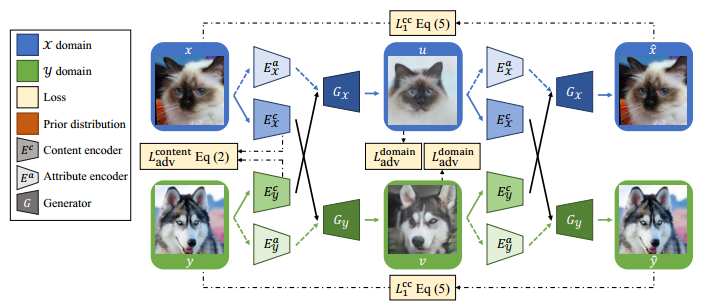

包括以下内容：

* Weight sharing：content encoder 的最后一层和 generator 的第一层在 domain 之间共享参数；

* Content adversarial loss：上图中的  $L_{\mathrm{adv}}^{\mathrm{content}}$，目的是确保 content code 是 domain-invariant 的，采用如下形式
  $$
  \begin{aligned} L_{\mathrm{adv}}^{\mathrm{content}}\left(E_{\mathcal{X}}^{c}, E_{\mathcal{Y}}^{c}, D^{c}\right) &=\mathbb{E}_{x}\left[\frac{1}{2} \log D^{c}\left(E_{\mathcal{X}}^{c}(x)\right)+\frac{1}{2} \log \left(1-D^{c}\left(E_{\mathcal{X}}^{c}(x)\right)\right)\right] \\ &+\mathbb{E}_{y}\left[\frac{1}{2} \log D^{c}\left(E_{\mathcal{Y}}^{c}(y)\right)+\frac{1}{2} \log \left(1-D^{c}\left(E_{\mathcal{Y}}^{c}(y)\right)\right)\right] \end{aligned}
  $$

以上两条都是为了保证 content 在 domain 之间的共享。

* Cross-cycle consistency loss：上图中的 $L_{1}^{\mathrm{cc}}$ ，这是一个交叉重建的 loss，和 MUNIT 的 latent reconstruction 不同，这里是 image reconstruction。具体来说，第一次提取 content 和 style code 后，交换两个 domain 的 content code，和原来的 style code 组合，进行 translation；然后，第二次提取 content 和 style code 后，再次交换两个 domain 的 content code，和原来的 style code 组合，重建回本来的图像，并与原始输入图像做一个 consistency loss；
* Domain adversarial loss：上图中的 $L_{\mathrm{adv}}^{\text {domain }}$，用来确保网络能生成 target domain 风格的图片； 

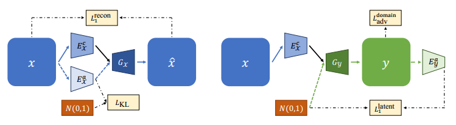

* Self-reconstruction loss：上图中的 $L_{1}^{\text {recon }}$，正常的 within-domain renconstruction loss；
* KL loss：上图中的 $L_{\mathrm{KL}}$，让 style code 去 align 先验，以便于采样生成 multi-modal 的图片；
* Latent regression loss：上图中的 $L_{1}^{\text {latent }}$，目的是从生成的图片中重建出采样的style code，和 MUNIT 的 latent reconstruction 是一回事。

完整的 loss 函数如下：
$$
\begin{aligned} \min _{G, E^{c}, E^{a}} \max _{D, D^{c}} & \quad \lambda_{\mathrm{adv}}^{\text {content }} L_{\mathrm{adv}}^{\mathrm{c}}+\lambda_{1}^{\mathrm{cc}} L_{1}^{\mathrm{cc}}+\lambda_{\mathrm{adv}}^{\mathrm{domain}} L_{\mathrm{adv}}^{\mathrm{domain}}+\lambda_{1}^{\mathrm{recon}} L_{1}^{\mathrm{recon}} \\ &+\lambda_{1}^{\text {latent }} L_{1}^{\text {latent }}+\lambda_{\mathrm{KL}} L_{\mathrm{KL}} \end{aligned}
$$
这篇文章还有一个期刊版本，里面提出了更进阶的方法 DRIT++，主要是在保持原来框架的基础上，针对 mode collapse 和 multi-domain I2I 的问题进行改进，与 disentangle 没有太大关系，这里就不再赘述了。

#### 4.3 CDDN

【**Method**】**C**ross-**D**omain **D**isentanglement **N**etworks

【**paper**】Image-to-image translation for cross-domain disentanglement 

【**source**】NIPS 2018

【**type**】disentangle (ture separation) 

任务依然是 multi-modal I2I，不过注意，**CDDN 研究的是 paired I2I**，即在训练时 source domain 和 target domain 有一一对应的图片，这和 MUNIT 以及 DRIT 研究的问题不同。

CDDN 的**框架**如下：

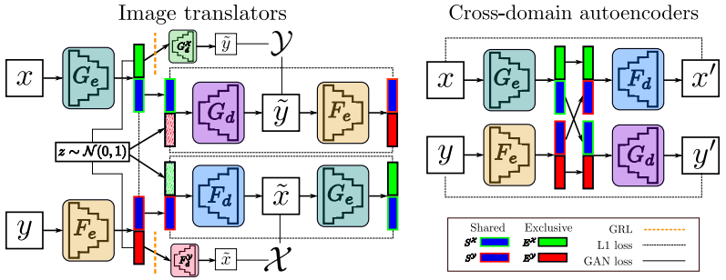

整体上，CDDN 分为 image translator 和 cross-domain autoencoders 两部分。

**1、** **Image translator 模块**

这里有两个比较独特的地方。第一是 specific feature (即图中的 exclusive feature) 的单独重建。这由 image translator 中的 specific decoder $G_{d}^{\mathcal{X}}$ 和 $F_{d}^{\mathcal{Y}}$ 来实现。以 domain $x$ 为例，$G_{d}^{\mathcal{X}}$ 只接受 encoder $G_e$ 提取的 specific feature 作为输入，去尽力生成 domain $y$ 的图片；另一方面，encoder $G_e$ 的目的是不让 $G_{d}^{\chi}$ 生成 domain $y$ 的图片，这通过对抗（GRL layer）的方式实现。这样做的目的是保证 domain $x$ 的 specific feature 不包含任何可以用来生成 domain $y$ 图片的信息。

（*注！个人觉得这种做法有点小问题，specific feature 本身提供的信息就是不完全的，怎么能只用 specific feature来生成完整的图片呢？*）

第二点是对两个 domain 的 content code 直接添加的 L1 约束。这是建立在输入的图片是 paired 的前提下才可以添加的。不过 L1 约束存在 trival solution，只要 encoder 输出都是0，也可满足约束，但这显然是没有意义的。所以为了避免这种情况，作者对 encoder 的输出加了小的噪声扰动 （$\mathcal{N}(0,0.1)$）。

（*注！与 adversarial loss 相比，L1 loss 是一个更强的约束，并且L1 loss 是 sample-to-sample 的，要求两个个体之间保持一致，所以施加 L1 loss 的前提是两张图片是 paired 的，否则就会在语义上出错；而adversarial loss 是 batch-to-batch 的，强调的是两者的整体distribution 一致，或者说两者是 domain-invariant 的，所以不要求输入的两张图片一定是 paired 。*）

Image translator 模块中剩下的部分就是 latent code 的重建，这与 MUNIT 中跨域重建的过程一模一样，这里就不多赘述了。

**2、Cross-domain autoencoder 模块**

这个模块的作用是进一步确保 content 的一致共享。原理十分简单，交换两个 domain 的content code 后再重建回原来图片。由于输入的两个 domain 的图片是 paired 的，它们所包含的 content code 是完全一致的，所以交换 content code 并不影响各自的重建；也是因此，这里并不需要向 DRIT 那样的 cycle consistency loss。

#### 4.4 CDRD

【**Method**】**C**ross-**D**omain **R**epresentation **D**isentangler 

【**paper**】Detach and Adapt: Learning Cross-Domain Disentangled Deep Representation 

【**source**】CVPR 2018

【**type**】disentangle (one-hot coding) 

CDRD 的主要任务是跨域的条件生成，这在文中被称为 cross-domain disentanglement。具体来讲，CDRD 希望在有监督信息的 source domain 上训练得到的条件生成模型，可以迁移到无监督的 target domain 上。如下图

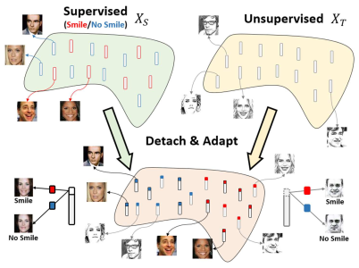

在这里，disentangle 的对象不再是 domain-invariant 和 domain-specifc feature，而是 attribute-agnostic 和 attribute-specific feature；至于 adaptation 的过程，则主要通过共享参数来实现。

CDRD 的框架如下：

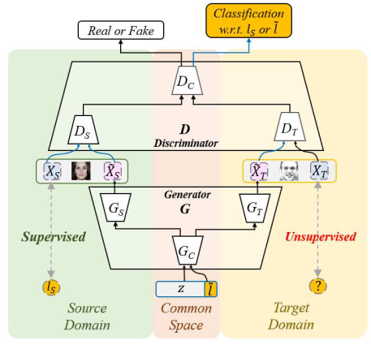

大体上，CDRD 可以看作是在 domain 间共享 generator 顶层参数和 discriminator 底层参数的两个 ACGAN。这里 attribute-specific 的信息是通过 label $l$ 来直接提供的，而 attribute-agnostic (或 style) 信息则包含在 code $z$ 中。

不管是 attribute-specific 还是 attribute-agnostic 信息在这里都是属于 domain-invariant 的部分，而 domain-specific 的部分，则包含在了不同 domain 的 generator / discriminator 中。

与直接 align domain-invariant feature 的 DA 方法不同的是，CDRD 中 adaptation 的过程被隐式的包含在训练跨域条件生成模型的 过程中。用文中的说法是：

>We propose an end-to-end learning framework for
>joint representation disentanglement and adaptation,
>while only attribute supervision is available in the
>source domain .

训练完毕后，discriminator 顶层的 auxiliary classifier 可以用来分类 target domain 的图片 （w.r.t attribute）。

CDRD 还有一个扩展的用于 I2I 的版本，称为 **Extended CDRD (E-CDRD)** ，框架如下：

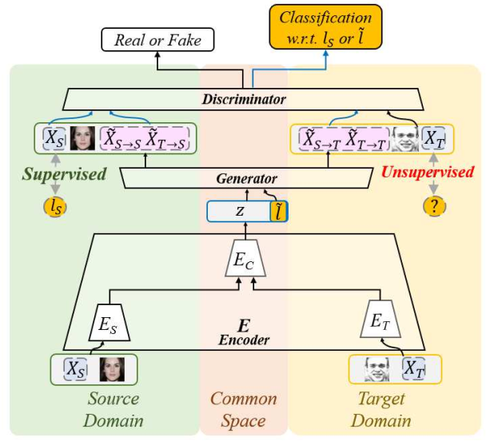

在 CDRD 的基础上，E-CDRD 只是在 generator 前面添加了 一组在底层共享参数的 encoder，分别用于提取各 domain 图片的 attribute-agnostic 信息 $z$，而 attribute-specific 还是直接以 label 的形式提供。

结构上，E-CDRD 的 encoder 和 generator 构成 一个 VAE，不过采用的 loss 经过了调整 ：
$$
\mathcal{L}_{v a e}^{S}=\left\|\Phi\left(X_{S}\right)-\Phi\left(\tilde{X}_{S \rightarrow S}\right)\right\|_{F}^{2}+K L\left(q_{S}\left(z_{S} | X_{S}\right) \| p(z)\right)
$$
重建的部分不再直接按照图片计算，而是以 perceptual loss 的形式。

E-CDRD 中 generator 生成的图片一共包括三部分，以 source domain 为例：从 $z$ 的先验中采样生成的 $\tilde{X}_{S}$，从 source image 导出的 $z$ 的后验中采样生成的 $\tilde{X}_{S \rightarrow S}$（即重建的图片），从 target image 导出的后验中采样生成的 $\tilde{X}_{S \rightarrow T}$（即转化的图片）；在对抗训练中，它们都属于负样本；而在一般的 I2I 框架中只有 $\tilde{X}_{S \rightarrow T}$ 的部分。个人理解是，E-CDRD 之所以要再加入 $\tilde{X}_{S}$ 和 $\tilde{X}_{S \rightarrow S}$ 用于对抗训练，可能是为了既要保证在 domain 间 translation 的能力，又要保证在 domain 内条件生成的能力。换言之，就像文章所说，E-CDRD 是一个 jointly 进行 I2I 和 条件生成 （文章中的说法是 disentangle）的框架。

#### 4.5 UFDN

【**Method**】**U**nified **F**eature **D**isentanglement **N**etwork  

【**paper**】A Unified Feature Disentangler for Multi-Domain Image Translation and Manipulation 

【**source**】NIPS 2018

【**type**】disentangle (one-hot coding) 

UFDN 的主要目标是 multi-domain I2I，当然它可以用来做 DA 。

UFDN 的框架如下：

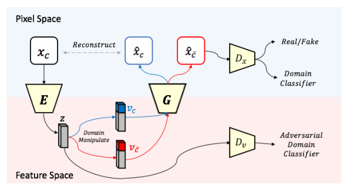

框架的主体是 encoder 和 decoder (generator)，构成 VAE 的结构。这里 encoder 只需要学习 domain-invariant feature，并且通过对抗的方式来实现；之后 domain-invariant 的 latent code 与 直接提供的代表 domain 信息的 one-hot vector 进行 concat，经过 generator 生成对应 domain 的图片，并以类似 ACGAN 的形式进行训练。

与 E-CDRD 的区别在于，UFDN 完全共享了 encoder 和 generator 的参数，而 E-CDRD 只是部分共享，所以 UFDN 对于 multi-domain I2I 有较好地 scalability 。

在进行 I2I 的时候有一点需要注意，**尽管在训练时 domain code 是以 binary 的 one-hot 的形式提供的，但在测试时，依然可以将 domain code 看作是连续的**，因此可以通过在不同 domain 的 domain code 之间进行插值来生成两个 domain 混合风格的图片。

UFDN 还具有对多种 attribute 进行 manipulate 的能力，具体来讲，只要将想要的 attribute 扩充到 domain code 中，就可以控制生成图片具有不同的 attribute，下面是一个实验例子

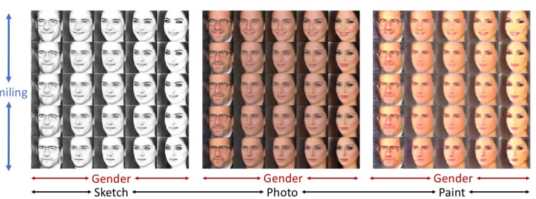

UFDN 也可以扩展到 DA 任务，具体做法是在学到的 domain-invariant feature 之上再加上一层 classifier；用于分类的 classifier 和 整个 I2I 的框架是 jointly train 的，也就是说，I2I 和 DA 形成了一个 multi-task 的形式。

### 5. Domain Generalization

本节主要介绍 disentangle 在 DG 中的应用，这部分工作目前还比较少；在一些 DG 文献中，也会将原本用于 DA 的 DSN 用来做 DG，作为一种 baseline 。

#### 5.1 DIVA

【**Method**】**D**omain **I**nvariant **V**ariational **A**utoencoders

【**paper**】DIVA: Domain Invariant Variational Autoencoders 

【**source**】arXiv 2019

【**type**】disentangle (true separation) 

DIVA 是一个生成模型，它根据 disentangle 假设来建立不同 domain 数据的内部生成模式，从而达到 DG 的目的。

DIVA 假设某个 domain 的数据由三个互相独立的 latent variable 控制（即一分为三的 disentangle），分别是：代表 domain 信息的 $z_{d}$，代表 class 信息的 $z_{y}$，以及除此以外的一些 variation $z_{x}$（比如 domain 内部固定的 style 或 mode）；其中 $z_{d}$ 直接受 domain label $d$ 控制，$z_y$ 直接受 class label $y$ 控制。

生成模型的图表示如下：

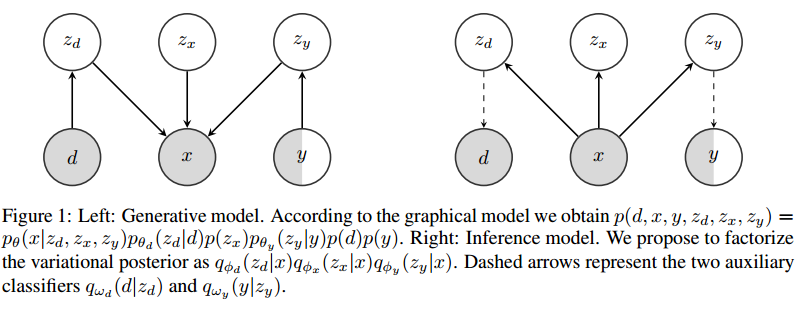

DIVA 整体建立在 VAE 的框架上。三个独立的 factor $z_d$、$z_y$、$z_x$ 分别由三个独立的 encoder 进行提取，并且分别与三个独立的先验 $p_{\theta_{d}}\left(z_{d} | d\right)$、$p_{\theta_{y}}\left(z_{y} | y\right)$、$p\left(z_{x}\right)$ 进行 align ；其中 $p_{\theta_{d}}\left(z_{d} | d\right)$、$p_{\theta_{y}}\left(z_{y} | y\right)$  是**条件先验**，它们的均值和方差用类似 CVAE 的方式学习得到，即通过一个额外的网络，以 $d$ 或 $y$ 为输入，学习 $p_{\theta_{d}}\left(z_{d} | d\right)$、$p_{\theta_{y}}\left(z_{y} | y\right)$  的均值和方差。

重建时，再从各自的后验中采样出 $z_d$、$z_y$、$z_x$，把它们 concat 到一起后在进行生成。

完整的 variational lower bound 为:
$$
\begin{aligned}
\mathcal{L}_{s}(d, x, y)= \ & \mathbb{E}_{q_{\phi_{d}} \left(z_{d} | x\right) q_{\phi_{x}}\left(z_{x} | x\right) q_{\phi_{y}}\left(z_{y} | x\right) }\left[\log p_{\theta}\left(x | z_{d}, z_{x}, z_{y}\right)\right] \\ &-\beta K L\left(q_{\phi_{d}}\left(z_{d} | x\right) \| p_{\theta_{d}}\left(z_{d} | d\right)\right)-\beta K L\left(q_{\phi_{x}}\left(z_{x} | x\right) \| p\left(z_{x}\right)\right) \\ &-\beta K L\left(q_{\phi_{y}}\left(z_{y} | x\right) \| p_{\theta_{y}}\left(z_{y} | y\right)\right) 
\end{aligned}
$$
这里借助了类似 $\beta$-VAE 的形式，即加入了一个权重 $\beta$。

为了进一步使分离出的 $z_d$ 和 $z_y$ 能够明确包含 domain 和 class 的信息，训练时 $z_d$ 被用来预测 domain label，$z_y$ 被用来预测 class label，加上这两个 classification loss 后，形成的完整 loss 是：
$$
\mathcal{F}_{\mathrm{DIVA}}(d, x, y) :=\mathcal{L}_{s}(d, x, y)+\alpha_{d} \mathbb{E}_{q_{\phi_{d}}\left(z_{d} | x\right)}\left[\log q_{\omega_{d}}\left(d | z_{d}\right)\right]+\alpha_{y} \mathbb{E}_{q_{\phi_{y}}\left(z_{y} | x\right)}\left[\log q_{\omega_{y}}\left(y | z_{y}\right)\right]
$$
需要注意的是，预测 class label 时，作者使用的是 $z_y$ 的均值。

训练完毕后的 inference 阶段，class 信息的 encoder 和 classifier 将被用来进行分类预测。

* **半监督 DIVA**：

  文章中作者提出了一种新的 DG 设定，这里称其为 semi-supervised DG (SSDG)。在 SSDG 的设定中，训练数据除了有多个带 class label 的 source domain 数据外，还存在不带 class label 的其他 domain 的数据，而 target domain 依然是没有见过的未知 domain；研究这种设定的动机是，在实际应用中，class label 的标注很难获得，但 domain label 却相对容易得到，所以可以利用这一部分不带 label 的其他 domain 的数据来辅助训练。

  为了使用 SSDG 的场景，不带 class label 的那部分数据的 variational lower bound 调整为：
  $$
  \begin{aligned} \mathcal{L}_{u}(d, x) &=\mathbb{E}_{q_{\phi_{d}}\left(z_{d} | x\right) q_{\phi_{x}}\left(z_{z} | x\right) q_{\phi_{y}}\left(z_{y} | x\right)}\left[\log p_{\theta}\left(x | z_{d}, z_{x}, z_{y}\right)\right] \\ &-\beta K L\left(q_{\phi_{d}}\left(z_{d} | x\right) \| p_{\theta_{d}}\left(z_{d} | d\right)\right)-\beta K L\left(q_{\phi_{x}}\left(z_{x} | x\right) \| p\left(z_{x}\right)\right) \\ &+\beta \mathbb{E}_{q_{\phi_{y}}\left(z_{y} | x\right) q_{\omega_{y}}\left(y | z_{y}\right)}\left[\log p_{\theta_{y}}\left(z_{y} | y\right)-\log q_{\phi_{y}}\left(z_{y} | x\right)\right] \\ &+\mathbb{E}_{q_{\phi_{y}}\left(z_{y} | x\right) q_{\omega_{y}}\left(y\left|z_{y}\left(y\left|z_{y}\left(y\left|z_{y}\left(y\left|z_{y}(y)\right| \text { og } p(y)-\log q_{\omega_{y}}\left(y | z_{y}\right)\right]\right.\right.\right.\right.\right.\right.} \end{aligned}
  $$
  同时新的 total loss 中去掉了不带 class label 的那部分数据的 class classification loss：
  $$
  \mathcal{F}_{\mathrm{SS}-\mathrm{DIVA}}=\sum_{n=1}^{N} \mathcal{F}_{\mathrm{DIVA}}\left(x_{n}, y_{n}, d_{n}\right)+  \sum_{m=1}^{M}  \left( \mathcal{L}_{u}\left(x_{m}, d_{m}\right)+\alpha_{d} \mathbb{E}_{q_{\phi_{d}}\left(z_{d} | x_{m}\right)}\left[\log q_{\omega_{d}}\left(d_{m} | z_{d}\right)\right] \right).
  $$
  

### 6. 总结

【**关于假设**】

在 DA / DG 和 I2I 领域，disentangle 常被用来分离 domain-invariant feature 和 domain-specific feature；在这种应用场景下，disentangle 假设被视为是常见的 shred latent space 假设的一种补充，后者假设两个或多个 domain 之间具有完全共享的、domain-invariant 的 latent space，而前者则假设 domain 之间的 latent space 是部分共享的，并且强调对不共享的 specific feature 的提取。

【**关于 DA / DG**】

在不涉及 I2I 的纯粹的 DA / DG 领域，disentangle-based 的方法往往同时对 domain-invariant 和 domain-specifc 进行分离和提取。在这类应用中，domain-invariant feature 是关注的重点，会被用来进行后续的诸如分类的任务；而对 domain-specific feature 的提取则被看成是一种辅助任务，目的是进一步 “纯化” domain-invariant feature，降低 adaptation 的难度，避免其中可能包含的 domain-specific 信息对 adaptation 的过程造成干扰。

在相关论文中，为保证 disentangle 的效果，往往会采用以下几种方法：

* **Renconstruction**：拼接 domain-invariant feature 和 domain-specific feature，并用它们重建原来的输入；保证 domain-invariant feautre 和 domain-specific feature 的互补完整性；
* **Orthogonality constraint**：通常以内积最小化的形式加在 domain-invariant 和 domain speific feature 之间，保证它们互相独立；或者是像 DADA 那样，使用一个额外的 mutual information estimator；
* **Adversarial training**：对于 domain-invariant feature，通过对抗训练的方式来欺骗 domain identifier；对于 domain-specific feature 用对抗方式欺骗 class identifier；目的是使 domain-invariant / speific feature 不包含 domain / class 信息；
* **Classification loss**：与对抗的方式相反，对于 domain-invariant feature，最小化 class classification loss；对于 domain-specific feature ，最小化 domain classification loss；目的是使 domain-invariant / speific feature 包含 class / domain 信息；

【**关于 I2I**】

I2I 中 disentangle 的应用大致分为两类：第一类是 multi-modal I2I，第二类是 conditional generation，包括 multi-domain I2I (将 domain 看作一种特殊的 condition)；前者对应 disentangle (true separation)，后者对应 disentangle (one-hot coding) 。

第一类 multi-modal I2I 的应用一般要求网络同时学习 domain-invariant 和 domain-speific feature，并且这两类 feature 都会被用到之后的生成任务中。这其中 domain-invariant feature (或 content) 是共享的，而 domain-specific feature (或 style) 会与高斯先验进行匹配，以满足采样生成 diverse 图片的能力。通常会采用的做法如下：

* **Within-domain reconstruction**：同一个 domain 的 content 和 style 组合重建原始输入，满足互补性；
* **Cross-domain reconstruction**：交换两个 domain 的 content code，重建原始图片，这是为了促进两个domain 间 content 的共享；如果是 paired I2I，那么只需要进行一次 translation 即可完成重建，如果是unpaired I2I，则需要经过两次 translation，形成一个 cycle；
* **Latent reconstruction**：从生成的图片中还原出提供的 content 和 style code，这是为了保证生成过程中信息流动的完整性，确保网络没有忽略输入的 content 和 style 、只做简单映射；这个过程中也可以加入 cross-domain 的机制，保证 content 的共享；
* **Advarial training**：一般有两种应用场合，第一种是应用在 content code 上，保证其是 domain-invariant 的；第二种是应用在生成图片上，保证其与 target 图片的 domain 风格一致；

第二类 conditional generation 的应用，也可以用来做 attribute manipulation，一般只要求网络学习 domain-invariant feature，而 domain-specific feature（或者说生成的 condition）则直接以 one-hot vector 的形式提供，因此这类应用的算法框架不会像 multi-modal I2I 的那么复杂。除了 **reconstruction**、**adversarial training** 等常见的要素外，这类应用的相关算法往往还会采用类似 **ACGAN** 的结构，即给 discriminator 添加一个 **auxiliary classifier**，来重建出提供的 condition，以达到 “ disentangle ” 的目的。

有些 I2I 的方法本身也可以用来做 DA，但这类 DA 方法往往与整个 I2I 的框架捆绑在一起。用 I2I 框架来做 DA 的场合，可以将整个训练过程看作一个 multi-task 的过程，学习如何生成图片的任务能够同时促进 DA 任务。

【**关于一些新方法**】

在最近的一些 disentangle 文章中，作者们不再进行单一的、二元的 domain-invariant feature 和 domain-specific feature 的分离，而是利用 domain label 和 class label 等不同的监督信息，来从多种角度进行 disentangle（比如 DADA），或者进行一分为三的 disentangle（比如 DIVA），这或许会成为 disentangle 的一种新趋势。

实际上，我们用 domain-invariant feature 来进行分类的潜在假设就是，domain-invariant feature 中包含对分类有用的信息，而 domain-specific feature 是对分类无用的噪声；换句话说，domain-invariant = class-relevant，domain-specific = class-irrelevant 。但实际上，domain-invariant feature 中不一定全部都是对分类有用的信息，也可能包含一些 domain 间共有的、但对分类无用的潜在变量，比如 domain 内固有的一些 style / mode。所以，在这种情况下，从多角度进行 disentangle 或者 做一分为三的 disentangle，来更进一步地 “纯化” 和 “提取” 真正对分类有用的信息，或许是一种更加合理的选择。