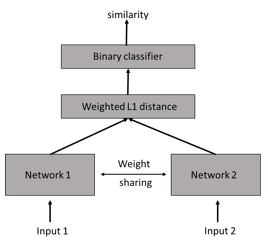
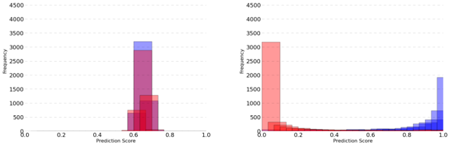
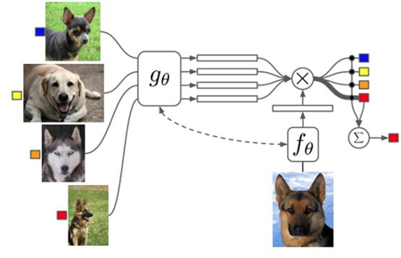
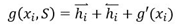
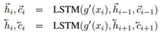
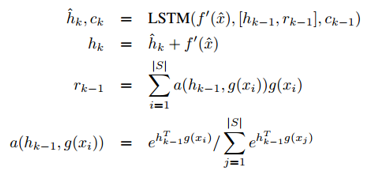
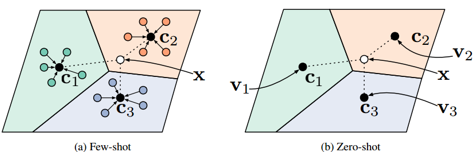
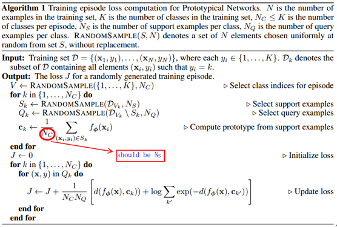
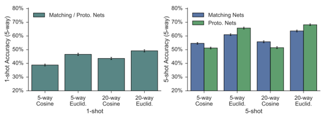
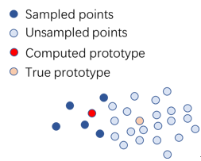

### **Three Classical Methods for Few-shot Learning**

------

#### **1. Definition of few-shot learning**

Few-shot classification is a scenario where a classifier must generalize to new classes not seen in the training set, given only a small number of examples of each new class. Usually the examples provided in both of the training and testing set are only a few. We call the scenario where there are N classes and K examples per class as a N-way K-shot classification. This definition can be extended to other forms of tasks such as regression.

#### 2. Dataset

* **Omniglot**

Omniglot is a dataset of 1623 handwritten characters collected from 50 alphabets. There are 20 examples associated with each character, where each example is drawn by a different human subject. This dataset is also called a “transpose” of MNIST as it contains large number of classes but fewer examples per class.

* **MiniImageNet**

The miniImageNet dataset is derived from the larger ILSVRC-12 dataset. It consists of 60,000 color images of size 84 × 84 divided into 100 classes with 600 examples each.

#### 3. Methods

##### 3.1 Siamese Network

**paper**: [**Siamese Neural Networks for One-Shot Image Recognition**      *ICML
workshop 2015*](http://www.cs.utoronto.ca/~gkoch/files/msc-thesis.pdf)

A very straightforward method using Siamese Networks for few-shot recognition.

Input of the networks is a pair of images, output is whether these two images belong to the same class or not.

**Some issues:**

a)  The weighted L1 distance
$$
p = \sigma \left( \sum _ { j } \alpha _ { j } \left| \mathbf { h } _ { 1 , l } ^ { ( j ) } - \mathbf { h } _ { 2 , l } ^ { ( j ) } \right| \right)
$$
The component-wise distance is weighted.

b)  Prediction for one-shot recognition is the class corresponding to the maximum similarity to the test image.

c)  The network not only achieves high accuracy but also separates the prediction scores.

##### 3.2 **Matching Network**

**paper**:  [**Matching Networks for One Shot Learning**      *NIPS2016*](http://papers.nips.cc/paper/6385-matching-networks-for-one-shot-learning.pdf)

The main idea of Matching Networks is akin to the Nearest Neighbor classifier, but in Matching Networks, inputs are encoded to a learned representation, while in KNN inputs are used directly.

**1)**  **Architecture**

Matching network maps a small labeled **support set** and **an unlabeled example** to its label, without fine-tuning. The support set is used as a reference for the network to find the most similar samples to the unlabeled sample that need to be classified. This is a bit like metric learning in the sense that the network tries to learn a distance to “matching” the test image. Intuitively, we can understand this as a kind of associate memory, which is used by the network to predict the class of a new example.

The output label is:
$$
P ( \hat { y } | \hat { x } , S ) = \sum _ { i = 1 } ^ { k } a \left( \hat { x } , x _ { i } \right) y _ { i }
$$
This equation essentially describes the output for a new class as a linear combination of the labels in the support set, which can be seen as a kind of attention mechanism. Note that the labels in the support set is one-hot vectors.

The index *a* is the attention coefficients computed by the softmax over the cosine distance $c$:
$$
a \left( \hat { x } , x _ { i } \right) = e ^ { c \left( f ( \hat { x } ) , g \left( x _ { i } \right) \right) } / \sum _ { j = 1 } ^ { k } e ^ { c \left( f ( \hat { x } ) , g \left( x _ { j } \right) \right) }
$$
Where $f$ and $g$ are embedding functions parameterized by neural networks.

**2)** **Full Context Embeddings**

FCE can be seen an additional module encoding the support set and the test image. The key point is that the support set should be able to modify how we embedded the images in it, and the test image as well. Images in the support set is encoded by a bidirectional LSTM after feature extraction by CNN.

*A little issue here is that the original paper does not mention how we can sort the unordered sample sequence as input for LSTM. This is discussed in another paper by the same authors: “Order Matters: Sequence to Sequence for Sets”.*

*Question:* *why did the authors use a LSTM to encode the whole dataset? Is that a little bit complicated? And how to sort the input sequence is just an additional issue when using LSTM. Why don’t we use other methods such as an attention mechanism to encode the support set instead.*

The test image is also encoded by a LSTM using attention mechanism:

Note that the recurrence is done by K steps using the same input, i.e., the CNN feature of the test image.

*Question: equation (4) and equation (5) is the attention over the support set. For equation (3), why does the authors sum the hidden state of LSTM and the input to get the new state? For equation (2), why does the authors concat (?) h and r?*

**3)**  **Training strategy**

**Step 1** Sample a label set $L$ from a task distribution $T$ 

**Step 2** Use $L$ to sample the support set $S$ and a batch $B$ (as a batch iteration)

**Step 3** Train the network to minimize the error predicting the labels in the batch $B$ conditioned on the support set $S$

This training strategy can be seen as a form of meta learning in that the network learns to learn from a given support set.

The held-out subset $L’$ is used to test.

**4)**  **Experiment**

See details and results in the paper. Here are some conclusions:

* FCE does not help on Omniglot (small dataset) but works on MiniImageNet (big dataset);
* The model will not work if the training tasks are much different from the testing tasks. For example, classify animals during training but classify dogs (fine-grained) during testing.

**5)**  **Discussion (and my own views)**

I think a spotlight of the Matching Network is that it uses the whole support set S instead of pair-wise comparisons used in methods like Siamese Network, which is more effective and considerable.

The paper has presented two drawbacks of the Matching Network. One is described in conclusion b) in the 4) part. Another is that the computation for each gradient update will become more expensive as the support set grows in size.

The paradigm for few-shot learning is a little strange and confused for me. Every time predicting a new class for an unlabeled example, Matching Networks need a support set as reference. However, for humans, we do not need a reference to discriminate an unseen class, once provide by a single example of that class. In other words, the model does not predict a class directly, but finds the class of the most similar sample in the support set, which is akin to the idea of KNN and metric learning as the paper said. The problem is, during training, the parameters are updated independently when providing a new support set, without incorporating any experience or memory from the previous set. *(Only my own views, may not be correct, as the parameters are updated based on the last step. What I emphasize is that will it be better to use an external memory or something like LSTM to store the state of the last step).* 

##### 3.3 **Prototypical Network**

**paper**: [**Prototypical Networks for Few-shot Learning**   *NIPS2017*](http://papers.nips.cc/paper/6996-prototypical-networks-for-few-shot-learning.pdf)

Prototypical network is a simpler yet better model than Matching network. It is based on the hypothesis that classification can be performed by computing distances to prototype
representations of each class.

**1)**  **Principles**

Prototypical network can be used for few-shot learning and zero-shot learning. For few-shot learning, Prototypical network learns a non-linear mapping of the input into an embedding space using a neural network and take a class’s prototype to be the mean of its support set in the embedding space. Classification is then performed for an embedded query point by simply finding the nearest class prototype.

For zero-shot learning, the only difference is that each class comes with meta-data giving a high-level description of the class rather than a small number of labelled examples.

In this paper, the authors use Euclidean distance to compute the distance between points. The embedding architecture mirrors that used by Matching network which is composed of four convolutional blocks.

**2)**  **Training strategy**

**3)  Mathematical viewpoints**

a)  Bregman divergence

If the definition of a “distance” is a kind of Bregman divergence, then the cluster representative achieves minimal distance to its assigned points is the cluster mean. In other words, the mixture density estimation of the cluster is its mean. Euclidean distance and KL divergence are both typical kinds of Bregman divergence.

b)  Reinterpretation as a linear model

We can expand the Euclidean term as follows: 
$$
- \left\| f _ { \phi } ( \mathbf { x } ) - \mathbf { c } _ { k } \right\| ^ { 2 } = - f _ { \phi } ( \mathbf { x } ) ^ { \top } f _ { \phi } ( \mathbf { x } ) + 2 \mathbf { c } _ { k } ^ { \top } f _ { \phi } ( \mathbf { x } ) - \mathbf { c } _ { k } ^ { \top } \mathbf { c } _ { k }
$$
c)  Comparison to Matching networks

Matching networks use the cosine similarity and produce a weighted nearest neighbor classifier given the support set. While prototypical networks use the Euclidean distance to produce a linear classifier. Note that in the case of one-shot learning, Matching network and Prototypical network become equivalent.

**4)**  **Experiments**

A comparison of different experimental settings on miniImageNet:

We can see that for Matching networks and Prototypical networks, using more classes (ways) to train both achieves better performance. This is understandable because the network did a tougher task during training but a simpler one when testing. The authors also find that it is usually best to train and test with the same “shot” number.
Another observation is that using Euclidean distance can improve performance over cosine distance for both of the networks. This effect is more pronounced for Prototypical networks as cosine distance is not a Bregman divergence, so it is not appropriate to estimate the cluster of a class by the mean of its support points. More experimental details and results can be seen in the paper.

**5)**  **Discussion and my own views**

a)  The probably existed bias for prototype representations

A natural question is whether the few shots or examples are representative enough to compute the prototype of the corresponding class. For example, if we sample five examples far away from the true prototype，then the computed prototype will have a bias, as the figure below shows. A more extreme example is that only one sample far away the true prototype is sampled in the case of one-shot. I am not sure whether the training strategy used by Prototypical networks can alleviate this problem or not. I am also unsure whether this problem is resoluble or inevitable in the scenario of few-shot learning. Actually, my first impression on the idea of prototype representations is to find the centroid of all the samples we can find, and the embed this centroid to a prototype representation to compute the distance. This may be a little violated against the few-shot scenario. But what I emphasize is that maybe we can fully utilize the data for classes with large number of samples to get a more precise prototype, while for classes with only several samples, five (approximately) shots is sufficient.

b)  About the support set

Similar issue has been discussed in section 5) of Matching networks. Obviously if we want to predict a class not existed in the current support set, we need to change another support set which contains this class, even the example of this class has been seen before. Moreover, consider two support sets which contain the same classes but different examples in each class, if we switch one support set to another, then the prototypes will be completely renewed, leaving out the memory of the previous set. In my opinion, every time the network see a different example of a new class, the prototype of this class only needs to be slightly modified, but not renewed completely. Therefore, can we use something like a knowledge database or a external memory to store all the examples and classes the network has seen? If so, the support set dose not need to be replaced any more when predicting a “external” example, and the prototype can be substantially modified every time the network sees a new example.

c)  Future work of Prototypical networks

The authors propose a direction for future work: utilize Bregman divergences other than squared Euclidean distance to find a non-linear classifier. The authors conducted preliminary explorations including learning a variance per dimension for each class but this did not lead to any empirical gains.