### Self-supervised Jigsaw Puzzles Tasks

***

#### 1. CFN

【**Paper**】Unsupervised Learning of Visual Representations by Solving Jigsaw Puzzles

【**Date**】ECCV2016

【**Method**】context-free network (CFN)

【**Introdunction**】

This paper proposed a novel self-supervised task called **Jigsaw puzzles**. The Jigsaw puzzles problem aims at arranging the shuffled image patches in the right order. Solving Jigsaw puzzles can help the network learn some high-level, global spatial correlations. 

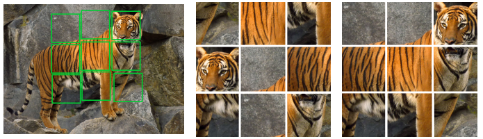

In this paper, the network is trained to solve Jigsaw puzzles as a pretext task. The learned features are then transferred to target tasks such as classification, detection and segmentation by fine-tuning. 

【**Method**】

The CFN network architecture used for Jigsaw puzzles tasks is

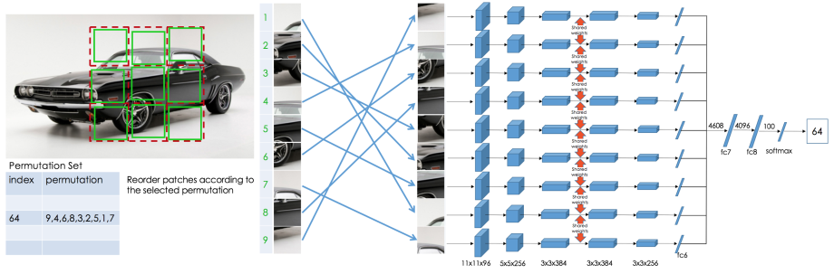

The network is required to recognize the index of the correct permutation order from a permutation set.

CFN uses AlexNet as a backbone. It is a siamese network with nine branches. Each image patch is fed into a branch independently. The parameters are shared until fc6 (including fc6).  Then the output features of fc6 are concatenated and fed into fc7.

CFN has fewer parameters than AlexNet. Because the feature map size output from conv5 and the number of hidden units in fc6 is smaller.

A $225\times225$ pixel window is randomly cropped from an image. The cropped image is divided into a $3\times3$ grid. Then a $64\times64$ pixel tile is randomly picked from each $75\times75$ pixel cell.

【**Tricks**】 

CFN can take "shortcuts" to solve Jigsaw puzzles. In order to prevent the network from learning some superficial information, several tricks are used.

* Multiple permutations: Using different permutations for training can prevent the network overfits on specific locations. The premutation set is a hyperparameter that needs to be carefully chosen.
* Random gap: leaving random gap between the tiles can prevent the model exploiting information like edge continuity and pixel intensity.
* Independent normalization: Normalizing  the mean and the standard deviation of each patch independently can prevent the model from finding similar low-level statistics between adjacent patches.
* Color jittering: Jittering the color channels and using grayscale images can prevent the model learning from chromatic aberration.

【**Experiments**】

1) Transfer pre-trained Jigsaw features to target tasks

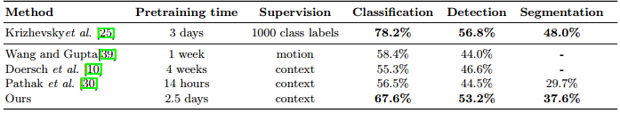

Conv5 feature of CFN is transferred. CFN can close the gap with supervised AlexNet.

2) Ablation studies of tricks

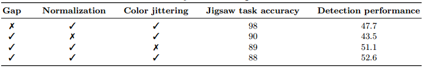

3) Choice of permutation set

The authors use *maximal Hamming distance* to choose permutation set. The algorithm is

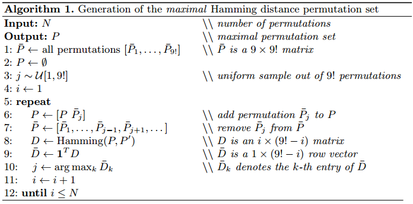

The results of different settings of permutation set are

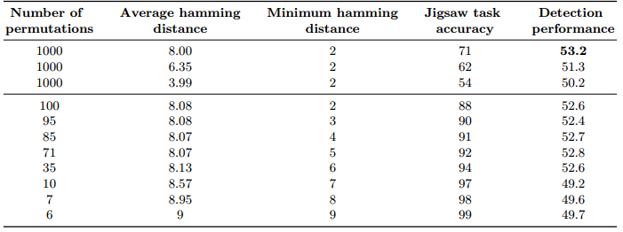

Two conclusions can be drawn:

* As the total number of permutations increases, the accuracy of Jigsaw task deceases because of the increasing difficulty, while the accuracy of detection increases.
* As the average Hamming distance increases, both the accuracy of Jigsaw task and detection increases. (A larger value of the average Hamming distance will induce a easier Jigsaw task because the permutations are very different.)

#### 2. Knowledge Transfer

【**Paper**】Boosting Self-Supervised Learning via Knowledge Transfer

【**Date**】CVPR 2018

【**Method**】knowledge transfer

【**Introduction**】

The definition of self-supervised learning:

>> > > In self-supervised learning, one trains a model to solve a so-called pretext task on a dataset without the need for human annotation. The main objective, however, is to transfer this model to a target domain and task. 

The general pipeline of self-supervised learning

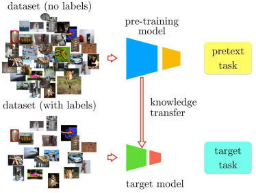

The authors re-define the Jigsaw puzzle tasks with a more difficult setting. The new task is called **Jigsaw++**. In Jigsaw++, a random number of tiles in the grid (up to 2) are replaced with tiles from another random image. The network needs to detect the occluding tiles and then reorders the remaining tiles. 

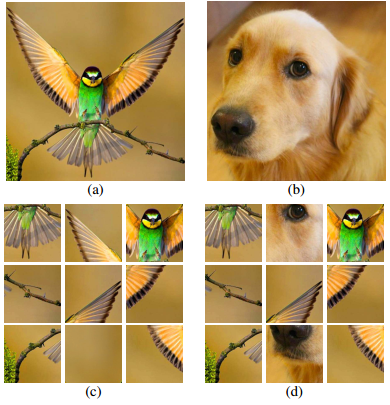

【**Method**】

The method proposed in this paper includes four steps:

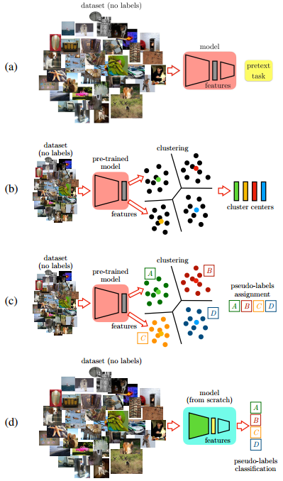

Step 1: Train the model to solve the Jigsaw++ task on a large-scale unlabeled dataset;

Step 2: Extract conv features from the pre-trained model and then do clustering on the extracted feature;

Step 3: Assign pseudo labels to the instances based on each cluster;

Step 4: Train the target model on the dataset  with pseudo labels.

Note that the datasets used in Step 1, 2, 3 can be different.

In this method, the pre-training and fine-tuning process are separated. It means that one can use a deeper model to solve a tougher pre-text task and then transfer the knowledge of the pre-trained model to a shallower target model to solve the target task. Unlike previous methods, the pre-trained model and the target model can be different.

The idea of knowledge transfer is based on the intuition that semantically similar instances should be close to each other in a good feature space. In other words, knowledge transfer aims at mining the similarity between instances in the feature-level. 

【**Experiment**】

The authors are interested in how far the performance of AlexNet on PASCAL can be improved by self-supervised pre-training. The conclusion is that training VGG16 with the Jigsaw++ task and then transferring to a target AlexNet can lead to a significant improvement.

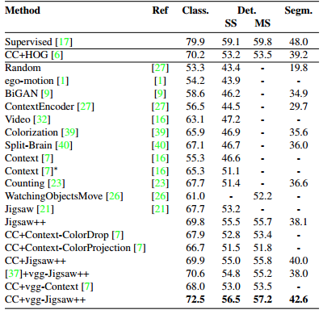

Moreover, the method is not sensitive to the number of clusters

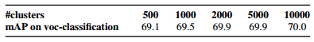

or using different datasets in different steps (2&3).

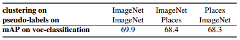

