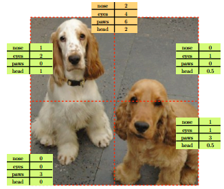
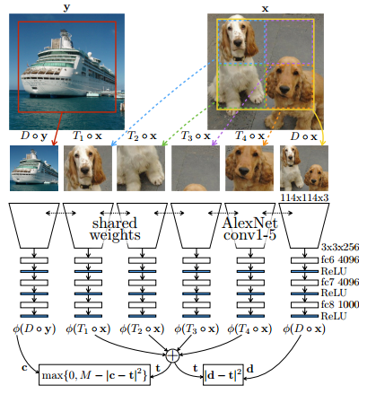
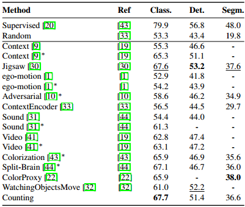
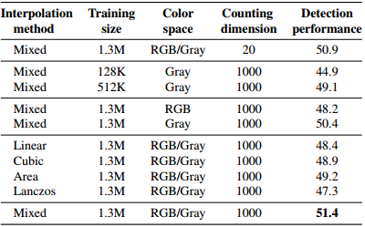
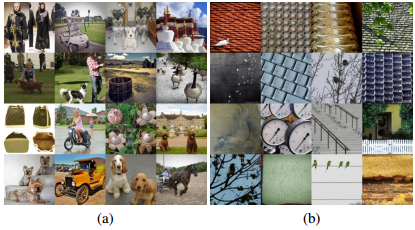

### Self-supervised Learning by Learning to Count

***

【**Paper**】Representation Learning by Learning to Count

【**Date**】ICCV 2017 Oral

【**Tag**】Self-supervised learning

【**Introduction**】

The main idea of the paper is that the number of visual primitives (or typical patterns) in the whole image should be equivalent to the sum of the number of visual primitives in each image tile.

The authors simulate this counting process by applying euqivariance between image transformations and feature transformations.

【**Methods**】

In detail, the authors require the feature representation of a downsampling image to be the same as the sum of feature representations of each tile from a $2\times 2$ grid. 
$$
\phi(D \circ \mathbf{x})=\sum_{j=1}^{4} \phi\left(T_{j} \circ \mathbf{x}\right)
$$
where $D$ is the downsampling operator with a factor of 2, $T_j$ is the tiling operator. Note that the sizes of the downsampling image and each image tile are the same.

Based on this formulation, the loss function can be $l_2$ loss:
$$
\ell(\mathbf{x})=\left|\phi(D \circ \mathbf{x})-\sum_{j=1}^{4} \phi\left(T_{j} \circ \mathbf{x}\right)\right|^{2}
$$
But this loss has $\phi(z)=0$, $\forall z$, as its trivial solution. Therefore, the authors use a contrastive loss instead to enforce the counting feature to be different between two randomly chosen different images.
$$
\begin{array}{l}{\ell_{\operatorname{con}}(\mathbf{x}, \mathbf{y})=\left|\phi(D \circ \mathbf{x})-\sum_{j=1}^{4} \phi\left(T_{j} \circ \mathbf{x}\right)\right|^{2}} \\ {+\max \left\{0, M-\left|\phi(D \circ \mathbf{y})-\sum_{j=1}^{4} \phi\left(T_{j} \circ \mathbf{x}\right)\right|^{2}\right\}}\end{array}
$$
The network architecture is:

The activation of the last layer (i.e., the output feature representation) is called the counting vector. Each dimension of the counting vector denotes a visual primitive desired to count.

【**Experiment**】

**1) Fine-tuning on PASCAL**

The counting method does not improve much compared to Jigsaw.

**2) Ablation Study**

* The counting method is not sensitive to the dimension of counting vector. (Seeing from the first and last row of the table.)
* The counting method is sensitive to the size of the training set. A large training set is required.
* **Preventing shortcuts**: 
  * Mixed interpolation methods: prevent the model from identifying the downsampling image or learning some other artifacts from specific downsampling methods;
  * Mixing RGB / Gray images: prevent the model telling tiles apart from downsampled images by using chromatic aberration.

**3) Visualization**

Images with highest magnitude of the counting vector have rich visual primitives (In Fig.(a)), while images with lowest magnitude of the counting vector have some superficial textures (In Fig.(b)).