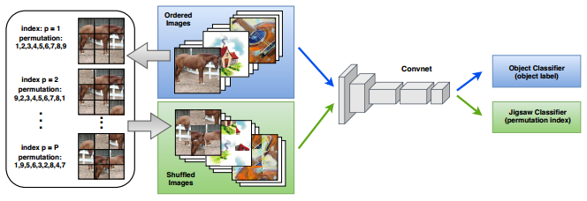
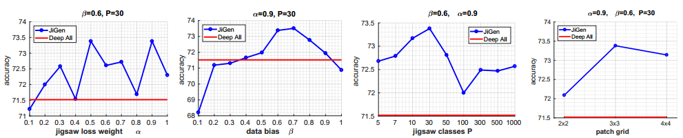
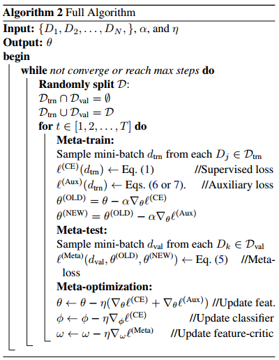
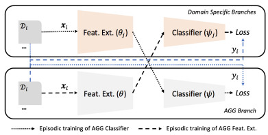
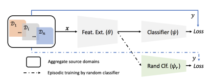
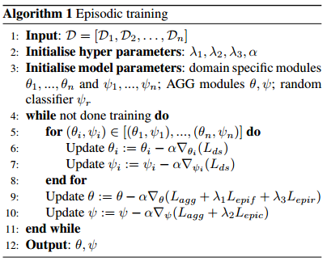
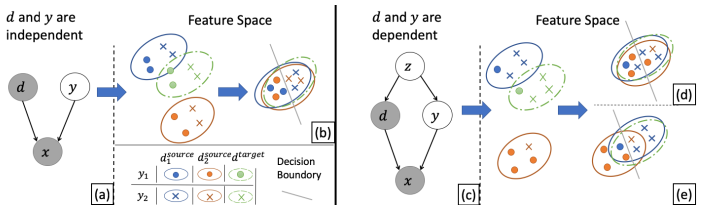
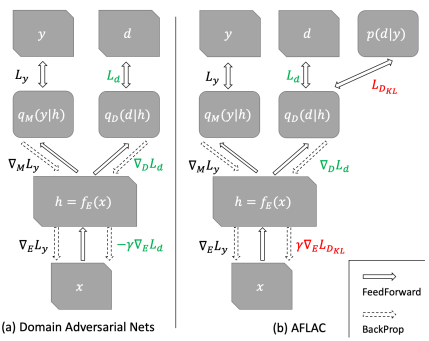
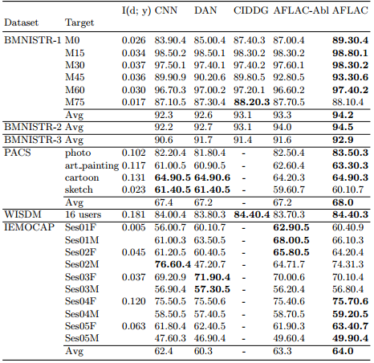

### Summary of DG Papers (2)

***

#### 1. JiGen

【**Paper**】Domain Generalization by Solving Jigsaw Puzzles 

【**Date**】CVPR 2019

【**Tag**】Multi-task

This paper adopts a multi-task pipeline to guide the network to do a  classification task as well as a "Jigsaw Puzzle" task at the same time.

The Jigsaw task is described as recovering the original image from shuffled orders of image patches. The motivation is that doing a Jigsaw task can help the network learn spatial correlations of different image parts, which may be useful for generalization. As for infants, doing a puzzle game can help them better recognize different objects.

The overall architecture of JiGen is as follows

For each image, $P$ different orders are chosen by the *maximal Hamming distance algorithm*. The Jigsaw task is defined as correctly classifying the permutation index *p* (i.e., the correct shuffled order). The shuffled images are not used for object classification because this would make object recognition tougher. 

During the test stage, only the object classification stage is used.

Note that this method **do not need domain labels**.

【**Hyperparameters**】

There are four important hyperparameters in JiGen for DG settings:

* the grid size $n \times n$
* the number of different patch permutation orders $P$ 

(This two hyperparameters are related to the jigsaw task.)

* weights  $\alpha$ of the jigsaw loss

* the data bias parameter $\beta$, denoting that the ratio of the ordered images in a mini-batch

(This two hyperparameters are related to the learning process.)

The authors study the influences of different hyperparameters on PACS:

The impact of parameter $\beta$ is saliency. For $\beta<0.5$, the shuffled images are more than the ordered images, which leads the object classification task to be a less important task. Therefore the performance of JigGen is worse than baseline. For $\beta =1$, the model does not utilize any information from shuffled images, therefore the performance is not good.

 #### 2. Feature-Critic

【**Paper**】Feature-Critic Networks for Heterogeneous Domain Generalization 

【**Date**】2019

【**Tag**】Meta-learning

This paper proposed a meta-learning based method which aims at learning an auxiliary loss to guide the network learn to generalize. The method in this paper, called feature-critic, is very similar to *MetaReg*. Because learning an auxiliary loss can also be seen as learning a regularizer. 

This paper also studied a new problem called **heterogeneous domain generalization**, which is defined as follows:

【**Definition**】 heterogeneous domain generalization refers to the DG problems where the label spaces between source and target domains are disjoint. 

In heterogeneous DG problem, the labelled training and testing split of target domain are available. The authors use a fixed feature extractor to extract features, and then only train a simple classifier (e.g., SVM or KNN) with the training split of target domain.

 Few-shot cases where only several training examples are available on target domain are also studied.

 In the case of homogeneous DG (i.e., the common DG problems), both source domains and target domain use a same classifier, as their are handling a same task.

【**Method**】

The main difference between original Meta-Reg and feature critic is that Meta-Reg only regularizes on the classifier, while feature critic only regularizes on the feature extractor. But Meta-Reg can be adjusted to heterogeneous DG by applying the regularizer on the feature extractor instead of the classifier. 

In addition, the regularizer of adjusted Meta-Reg operates on all the parameters of feature extractor. But the regularizer (or auxiliary loss) of feature-critic operates on the output features of feature extractor, in order to be scalable of parameters.

Two choices of  auxiliary loss are available:

* the set embedding:
  $$
  h_{\omega}(F)=\frac{1}{M} \sum_{i=1}^{M} \operatorname{MLP}_{\omega}\left(F_{i}\right)
  $$

* the flattened covariance matrix:
  $$
  h_{\omega}(F)=\operatorname{MLP}_{\omega}\left(\text { Flatten }\left(F^{T} F\right)\right)
  $$

where $F$ is the $M \times H$ sized matrix,  consisting of the $H$-dimensional features from $M$ examples in a mini-batch. $\omega$ is the parameter of the learned auxiliary loss.

The source domains are split into virtual source domains (training domain) and virtual target domains (testing domains) in order to support meta-learning.

The objective used to optimize the auxiliary loss is:
$$
\begin{array}{r}{\max _{D_{j} \in \mathcal{D}_{\operatorname{val}}, d_{j} \in D_{j}} \tanh \left(\gamma\left(\theta^{(\mathrm{NEW})}, \phi_{j}, x^{(j)}, y^{(j)}\right)\right.} \\ {-\gamma\left(\theta^{(\mathrm{OLD})}, \phi_{j}, x^{(j)}, y^{(j)}\right)})\end{array}
$$
where $\gamma$ is a function that measures the validation domain performance (larger is better). $\theta^{New}$ and $\theta^{Old}$ are parameters updated with or without the auxiliary loss respectively. This objective ensures that after updating the auxiliary loss $h_{\omega}$, the performance on the validation domain should be better than not using the auxiliary loss.

The authors use classification cross entropy for $\gamma$.

The full algorithm is:

**Step 1**: update the feature extractor with the auxiliary loss on training domains
$$
\theta \leftarrow \theta-\eta\left(\nabla_{\theta} \ell^{(\mathrm{CE})}+\nabla_{\theta} \ell^{(\mathrm{Aux})}\right)
$$
**Step 2**: according to the last step, decomposing the update process to compute $\theta^{OLD}$ and $\theta^{NEW}$
$$
\theta^{(\mathrm{OLD})}=\theta-\alpha \nabla_{\theta} \ell^{(\mathrm{CE})}
$$

$$
\theta^{(\mathrm{NEW})}=\theta^{(\mathrm{OLD})}-\alpha \nabla_{\theta} \ell^{(\mathrm{Aux})}
$$

(*There remains a question here: why using different learning rate $\alpha$ from the last step $\eta$*.)

**Step 3**: fix the feature extractor, update the classifiers on training and validation domains respectively
$$
\phi \leftarrow \phi-\eta \nabla_{\phi} \ell^{(\mathrm{CE})}
$$
**Step 4**: update the auxiliary loss using $\theta^{OLD}$, $\theta^{NEW}$, $\phi_{val}$ on the validation domain
$$
\omega \leftarrow \omega-\eta \nabla_{\omega} \ell^{(\mathrm{Meta})}
$$
Note that the parameter $\theta$ of feature extractor is only updated on training domains; the parameter $\omega$ of the auxiliary loss is only updated on validation; the parameter $\phi$ of the classifier is domain-specific for heterogeneous DG but shared for homogenous DG.

#### 3. Epi-FCR

【**Paper**】Episodic Training for Domain Generalization 

【**Date**】2019

【**Tag**】Training strategy

This paper proposed a simple training strategy to make the baseline AGG model more robust to domain shifts.

The method includes a domain-agnostic module and domain-specific modules. Each individual module consists of a feature extractor and a classifier. The domain-agnostic module is the final model shared across all domains. The domain specific modules are used to help the training of the domain-agnostic module.

The main idea is to combine the universal feature extractor with domain-specific classifiers which are mismatched to the current input domain, or combine the universal classifier with mismatched domain-specific feature extractors.

By doing so, the universal feature extractor or classifier should try its best to help an  "inexperienced" partner on current domain, which can improve the generalization ability of corresponding parts.

Note that when training the universal feature extractor, its paired domain-specific classifier is fixed. The settings for training the universal classifier is the likewise.

The authors also studied heterogenous DG problems. The goal is to find a robust off-the-shelf feature extractor.

In heterogenous DG, the label spaces are disjoint, hence mismatched domain-specific classifiers cannot be simply combined with the universal feature extractor. Therefore, the authors use a classifier with random weights to combine with the universal feature extractor. This configuration can also be used for homogenous DG. 

The full algorithm is

【**Issue**】

Batch norm should be carefully used when applying modern CNN as base model, such as ResNet. Because the statistics between source and target domains are different. Using ImageNet pretrain models and freezing the statistics of BN will be a good choice.

#### 4. AFLAC

【**Paper**】Adversarial Invariant Feature Learning with Accuracy Constraint for Domain Generalization 

【**Date**】2019

【**Tag**】Adversarial

【**Introduction**】

This paper provides an insight for domain-invariant feature learning. Merely improving domain-invariance does not guarantee the prefect classification accuracy on target domain. 

The paper assumes that domain $d$ and class labels $y$ are dependent. Therefore, there is a trade-off between domain-invariance and classification accuracy. The improvement of the invariance can negatively affect DG performance under this trade-off.

Since $y$ contains information about $d$ under the dependency, encoding information about $d$ into $y$. However, previous domain-invariant feature learning methods attempt to remove all domain information from the learned latent feature $h$.

 In contrast, the authors propose to maximize domain invariance within a range that does not interfere with the classification accuracy.

【**Methodology**】

The authors prove that when $H(d | h)=H(d | y)$, i.e., the learned representation $h$ contains as much domain information as the class labels,  it does not affect the classification performance.

The whole framework is based on DANN.

The authors impose regularization that ensures $H(d | h)=H(d | y)$, to achieve "accuracy -constrained domain invariance". In the framework of AFLAC, the encoder tries to minimize the label classification loss, as well as the KL divergence between $p(d | y)$ and $q_{D}(d | h)$ (i.e., the output of the discriminator). The discriminator tries to minimize the domain classification loss while the classifier tires to minimize the label classification loss.
$$
\begin{aligned} \min _{D} W(E, D)=& \mathbb{E}_{p(x, d)}\left[L_{d}\right] \\ \min _{E, M} V(E, M) &=\mathbb{E}_{p(x, d, y)}\left[\gamma L_{D_{K L}}+L_{y}\right] \\ \text {where} & L_{D_{K L}} :=D_{K L}\left[p(d | y) | q_{D}\left(d | h=f_{E}(x)\right)\right] \end{aligned}
$$
【**Experiment**】

The experiment results of AFLAC are not very good. The average accuracy on PACS is 68%.

