### Summary of Self-ensemble Methods

------

#### 1. Introduction

Self-ensemble methods are used for semi-supervised learning (SSL). These methods can also be called as **perturbation-based methods** or **consistency regularization methods**.

The main idea of self-ensemble methods is based on the **low-density separation assumption** in SSL, which means that the decision boundary should lie in the low-density regions of data points. 

Self-ensemble methods enforce the low-density separation assumption by encouraging invariant prediction $f(u)=f(u+\delta)$ for perturbations $u+\delta$ of unlabeled points $u$. Usually there is a pair of teacher-student networks in self-ensemble methods. Predictions of the student network should be consistent with that of the teacher network after perturbations. Different methods have different ways to define the teacher network and enforce the consistency.

The intuition behind consistency regularization methods is straightforward. If the decision boundary lies in a high-density region, the perturbed data points $u+\delta$ will be very likely to cross over the boundary. As a result, the consistency between $u$ and $u+\delta$ will be violated, and the corresponding punishment for inconsistency will be high. Therefore, the decision boundary will be pushed to low-density regions by consistency regularization. 

#### 2. Methods

##### 2.1 $\Pi$ model & Temporal Ensembling

【**Paper**】Temporal Ensembling for Semi-supervised Learning

【**Source**】ICLR 2017

This paper proposed two ways to implement self-ensembling, called $\Pi$ model and Temporal ensembling.

**1) $\Pi$ model**

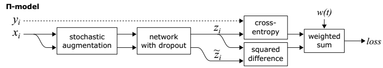

For each training input $x_i$, the network of $\Pi$ model is evaluated twice with stochastic augmentation and dropout. The consistency is computed between two stochastic predictions $z_i$ and $\tilde {z}_i$ given the same input $x_i$, in the form of mean squared difference. 

$\Pi$ model can also be seen as two network pathways with shared parameters and different perturbations.

The authors use a time-dependent weighting function $w(t)$ for the consistency loss. The weighting function $w(t)$ starts from zero and rams up along a Gaussian curve.

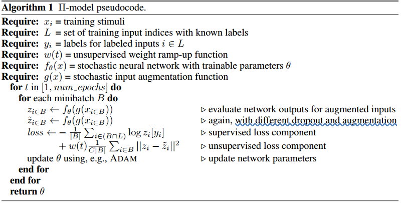

**2) Temporal Ensembling**

Temporal ensembing is an adapted version of $\Pi$ model. However, the network of temporal ensembling is evaluated only once per input per epoch, and the target vectors $\tilde{z}$ for consistency loss are based on prior network predictions, instead of a second evaluation of the network.

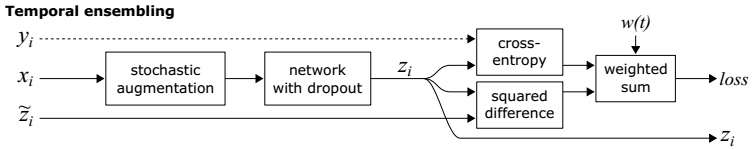

For each input sample, temporal ensembling maintains an exponential moving average $Z_{i} \leftarrow \alpha Z_{i}+(1-\alpha) z_{i}$ of the previous predictions $Z_i$ and current predictions $z_i$. Then $Z$ is biased by dividing by factor $\left(1-\alpha^{t}\right)$ to obtain the target vectors $\tilde{z}_i$.

Temporal ensembling forces the network to predict consistently with the ensembles of its previous predictions, which means that the network should take a small step each time. 

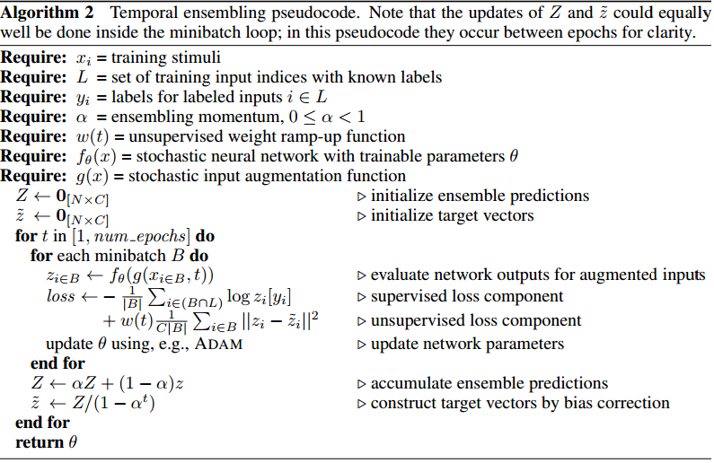

Compared with $\Pi$ model, the training of temporal ensembling is faster because the network is evaluated only once. In addition, the training targets for consistency loss is less noisy because of the moving average. However, in order to maintain the moving averages for each sample, an auxiliary storage is needed. Moreover, a new hyperparameter $\alpha$  is also introduced by temporal ensembling.

##### 2.2 Mean Teachers

【**Paper**】Mean teachers are better role models: Weight-averaged consistency targets improve semi-supervised deep learning results

【**Source**】NIPS 2017

Mean teachers (MT) is an improvement of temporal ensembling. Temporal ensembling updates the consistence targets for each sample only once per epoch. As a result, the learned information is incorporated into the training process at a low pace. Moreover, temporal ensembling is not scalable to large datasets because of the auxiliary storage for the moving averages of each sample. To overcome the limitations of temporal ensembling, MT averages model weights instead of label predictions. 

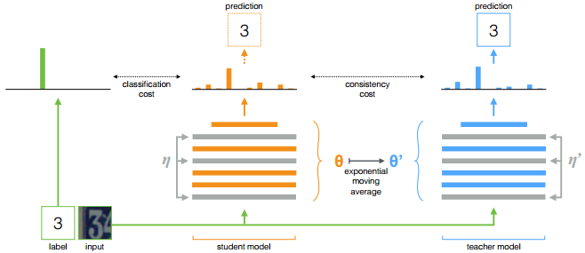The teacher model weights are updated as an exponential moving average of the student weights. 
$$
\theta_{t}^{\prime}=\alpha \theta_{t-1}^{\prime}+(1-\alpha) \theta_{t}
$$
By this way, the targets provided by the teacher model can be more accurate. Note that the inputs to student and teacher network are added with different noises.

Both model outputs can be used for prediction, but at the end of the training the teacher prediction is more likely to be correct because the teacher parameters are obtained by moving average of the student parameters. 

##### 2.3 VAT

【**Paper**】Virtual Adversarial Training: A Regularization Method for Supervised and Semi-Supervised Learning

【**Source**】TPAMI 2018

VAT adds adversarial perturbations to the inputs instead of random noises. In other words, VAT takes the "worst cases" of perturbations into account. The consistence is computed between the network outputs of the original samples and the corresponding adversarial samples.

Adversarial training for supervised learning finds adversarial perturbations based on the divergence of ground-truth label distributions and the output distributions of adversarial samples.
$$
\begin{array}{c}{L_{\mathrm{adv}}\left(x_{l}, \theta\right) :=D\left[q\left(y | x_{l}\right), p\left(y | x_{l}+r_{\mathrm{adv}}, \theta\right)\right]} \\ {\text { where } r_{\mathrm{adv}} :=\underset{r ;\|r\| \leq \epsilon}{\arg \max } D\left[q\left(y | x_{l}\right), p\left(y | x_{l}+r, \theta\right)\right]}\end{array}
$$
In order to adapt semi-supervised scenarios, VAT finds adversarial perturbations based on the divergence between the output distributions of the original samples and adversarial samples.
$$
\begin{array}{c}{\operatorname{LDS}\left(x_{*}, \theta\right) :=D\left[p\left(y | x_{*}, \hat{\theta}\right), p\left(y | x_{*}+r_{\mathrm{vadv}}, \theta\right)\right]} \\ {r_{\mathrm{vadv}} :=\arg \max _{r :\|r\|_{2} \leq \epsilon} D\left[p\left(y | x_{*}, \hat{\theta}\right), p\left(y | x_{*}+r\right)\right]}\end{array}
$$
If we view the output distributions of original samples as "virtual" labels, then VAT can be seen as computing adversarial directions based on the current virtual labels.

The consistency regularization term is the average of $\operatorname{LDS}\left(x_{*}, \theta\right)$ over all data points:
$$
\mathcal{R}_{\mathrm{vadv}}\left(\mathcal{D}_{l}, \mathcal{D}_{u l}, \theta\right) :=\frac{1}{N_{l}+N_{u l}} \sum_{x_{*} \in \mathcal{D}_{l}, \mathcal{D}_{u l}} \operatorname{LDS}\left(x_{*}, \theta\right)
$$
Note that the consistency loss is computed in the form of **KL divergence**.

In order to find the adversarial perturbations $r_{\mathrm{vadv}}$, VAT needs to compute gradients with respect to the inputs, which is computational inefficient. Therefore, the authors propose a fast approximation method for computing the adversarial perturbations. More details can be found in the paper.

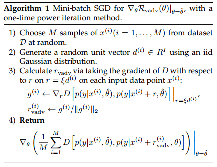

The authors also adopt a conditional entropy regularization term of $p(y | x, \theta)$ as an additional cost:
$$
\begin{aligned} \mathcal{R}_{\mathrm{cent}} &=\mathcal{H}(Y | X) \\ &=-\frac{1}{N_{l}+N_{u l}} \sum_{x \in \mathcal{D}_{l}, \mathcal{D}_{u l}} \sum_{y} p(y | x, \theta) \log p(y | x, \theta) \end{aligned}
$$
The conditional entropy minimization has an effect of exaggerating the prediction of the model $p(y | x, \theta)$ on each data point. VAT with this conditional entropy minimization is called "VAT+EntMin".

##### 2.4 VAdD

【**Paper**】Adversarial Dropout for Supervised and Semi-Supervised Learning

【**Source**】AAAI 2018

The idea of adversarial dropout is very similar to VAT, but instead of adding perturbations to the input data points, AdD applies the adversarial training concept to the sampling of neural network structures through dropout.

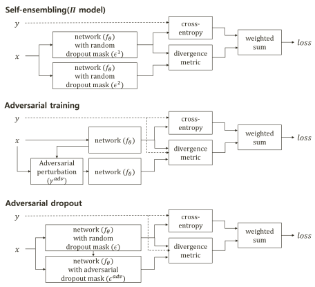

AdD can also be interpreted as a special case of $\Pi$ model, where the second dropout mask is optimized adversarially to the model's label (or virtual label) assignment, instead of another random one. 

In semi-supervised scenarios, given a random sampled dropout mask, virtual AdD (VAdD) will find the adversarial mask as bellow:
$$
\mathcal{L}_{V A d D}\left(\mathbf{x}, y, \epsilon^{s} ; \boldsymbol{\theta}, \delta\right) :=D\left[f_{\theta}\left(\mathbf{x}, \boldsymbol{\epsilon}^{s}\right), f_{\boldsymbol{\theta}}\left(\mathbf{x}, \boldsymbol{\epsilon}^{a d v}\right)\right] \\
\text{where} \quad \epsilon^{a d v} :=\operatorname{argmax}_{\epsilon ;\left\|\epsilon^{s}-\epsilon\right\|_{2} \leq \delta H} D\left[f_{\theta}\left(\mathbf{x}, \epsilon^{s}\right), f_{\theta}(\mathbf{x}, \epsilon)\right]
$$
Intuitively, AdD can be interpreted as deactivating the most contributing neurons and giving the "dead" neurons learning opportunities. 

The authors find that adversarial dropout will induce a sparser structure of neural network than normal dropout. 

VAdD can also be incorporated with VAT, which means both the input permutations and network permutations are obtained by adversarial training. 

Similar to VAT, the authors also propose a fast approximation method for VAdD. Details can be found in the paper.

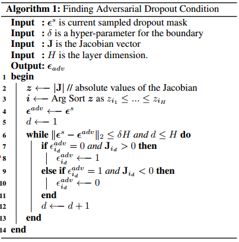

##### 2.5 SNTG

【**Paper**】Smooth Neighbors on Teacher Graphs for Semi-supervised Learning

【**Source**】CVPR 2018

This paper introduces an incremental component called SNTG to previous self-ensembling methods.

Previous methods only consider the perturbations around single data points, while ignoring the connections between data points, which can provide information about unlabeled data structure such as clusters or manifolds.

 Motivated by this, SNTG introduces to **learn a teacher graph based on the targets  generated by the teacher** (hard targets after *argmax*). 

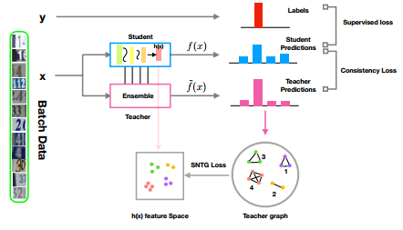

The teacher graph is built by connecting data points that belong to the same predicted class $\tilde{y}$:
$$
W_{i j}=\left\{\begin{array}{l}{1 \quad \text { if } \tilde{y}_{i}=\tilde{y}_{j}} \\ {0 \quad \text { if } \tilde{y}_{i} \neq \tilde{y}_{j}}\end{array}\right.
$$
Then a **graph constraint is added to the features of student network** to ensure that neighbor points have consistent features.
$$
\ell_{G}=\left\{\begin{array}{ll}{\left\|h\left(x_{i}\right)-h\left(x_{j}\right)\right\|^{2}} & {\text { if } W_{i j}=1} \\ {\max \left(0, m-\left\|h\left(x_{i}\right)-h\left(x_{j}\right)\right\|\right)^{2}} & {\text { if } W_{i j}=0}\end{array}\right.
$$
Compared to previous methods, SNTG explores more information in the teacher network and thus improves the target quality to guide the student network to learn better.

In order to accelerate training, the authors propose a doubly stochastic sampling approximation method. This method samples data points in a mini-batch to build a sub-graph instead of using all the data points in that mini-batch. 

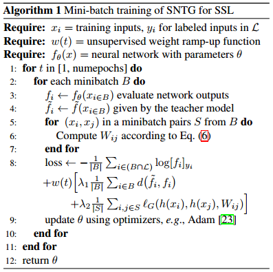

##### 2.6 ICT

【**Paper**】Interpolation Consistency Training for Semi-Supervised Learning

【**Source**】arxiv 2019

ICT incorporates the idea of Mixup into self-ensemble methods. ICT encourages consistent predictions $f(\alpha u_1 + (1-\alpha)u_2) = \alpha f\left(u_{1}\right)+(1-\alpha) f\left(u_{2}\right)$ at interpolations $\alpha u_1 + (1-\alpha)u_2$ of unlabeled points $u_1$ and $u_2$.

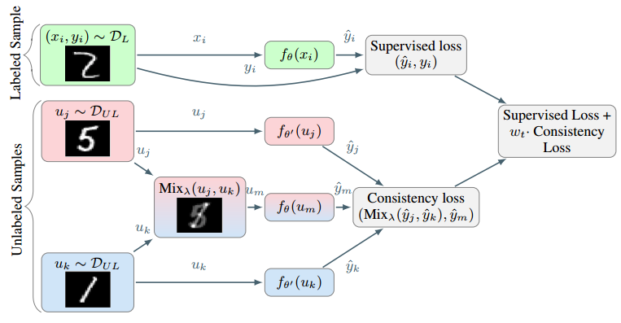

ICT also uses a mean teacher $f_{\theta^{\prime}}$, where $\theta^{\prime}$ is a moving average of $\theta$. 

Mixup operation can push the decision boundary far away from the class boundaries by enforcing the prediction model to change linearly in between samples. 

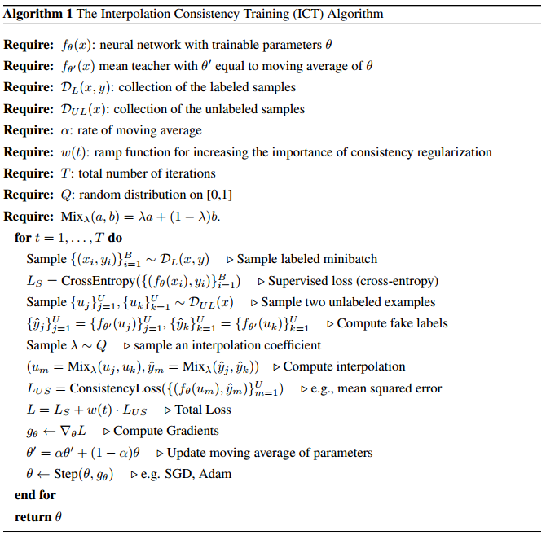

Experimental results:

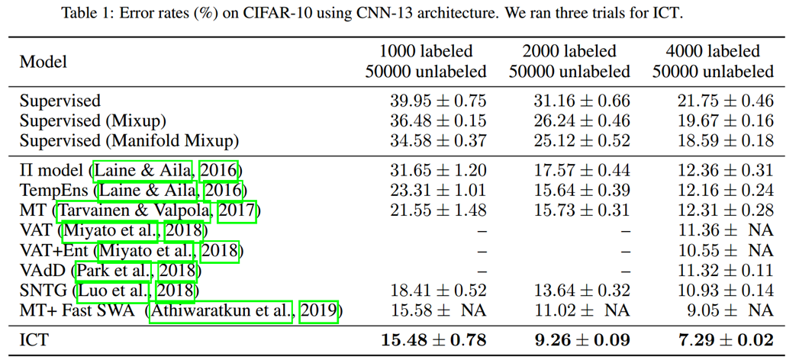

#### 3. Application

##### 3.1 MT for DA

【**Paper**】Self-ensembling for visual domain adaptation

【**Source**】ICLR 2018

The authors modify the mean teacher model for domain adaptation scenarios.

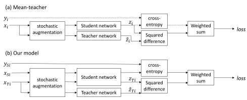

The supervised classification loss is computed with source samples. The unsupervised consistency loss is computed with target samples. 

The authors process source and target mini-batches separately per iteration so that batch normalization uses different statistics for each domain during training.

To achieve the best performance, the authors use various tricks, including confidence thresholding, data augmentation and class balance loss. More details can be found in the paper.