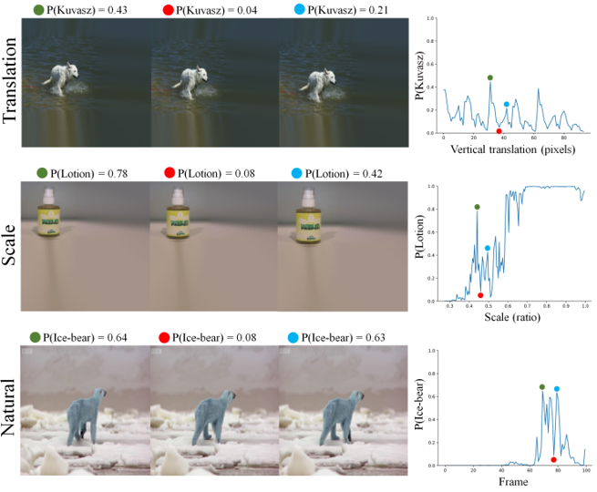
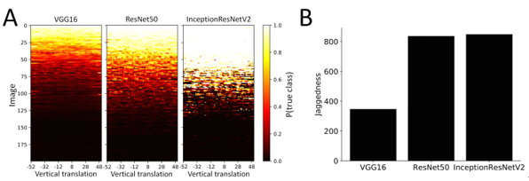
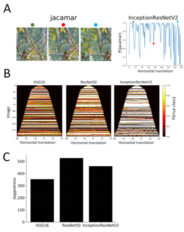
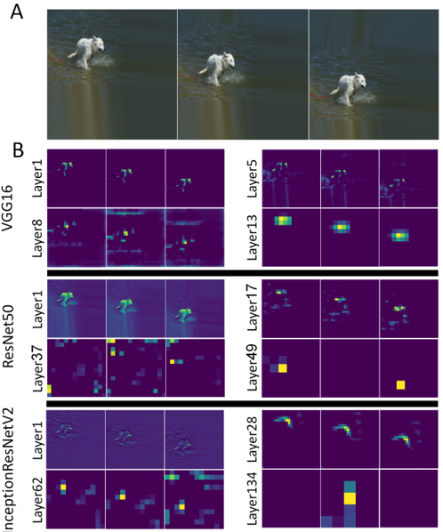
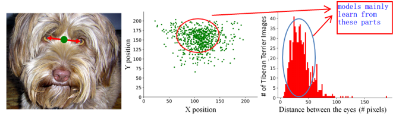
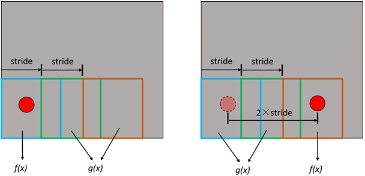
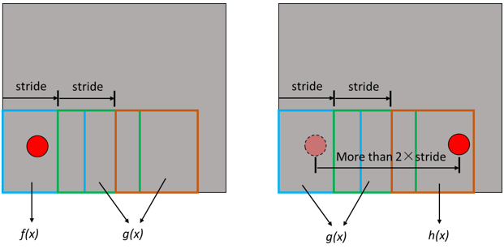

### **Rethinking the generalization ability of CNN**
------

**paper**: [**Why do deep convolutional networks generalize so poorly to small image transformations?**       *2018*](https://arxiv.org/pdf/1805.12177.pdf) 

#### 1. **A simple illustration**

In the top and middle rows, the object in the image is slightly translated and scaled respectively. In the bottom row, the bear moves almost imperceptibly between frames taken from a video. For all of the three situations, outputs from the InceptionResNet-V2 change dramatically.

#### 2. Failures of modern CNNs

**1)	Experiment 1**

Randomly choose 200 images from the ImageNet validation set and embed these images in a larger image and systematically varied the vertical translation. The qualitative and quantitative results are shown below.

In the left part A, a row is all light or all dark corresponds to a correct or incorrect classification respectively, which is invariant to translations. Rows with abrupt transitions from light to dark indicate that the classification changes dramatically as the object is translated. *(I feel that the accuracy here is a little bit low. Does this arise from the embedding operation?)*

The lack of invariance is quantified by a measure called “jaggedness”: the number of times the network’s predictions had the correct class in its top-5 and after just one pixel shift it moved outside of the top-5 (and also the opposite transition from non-top-5 to top5).

**Conclusion: while the deeper networks have better test accuracy, they are also less invariant.**

**2)	Experiment 2**

To exclude the probable influence of the embedding operation (i.e., the image resizing and inpainting procedures), the authors chose different crops of the original ImageNet image while making sure that the object bounding box remained within the crop. Conclusion from experiment 1 still holds.

#### 3. **Ignoring the Sampling Theorem**
The lack of invariance in CNN is related to the subsampling operation, also known as “stride” (different from “downsampling” or “pooling”). 

The following paragraph comes from the paper and I did not fully understand it (see in the **Discussion**):

*"We cannot literally expect translation invariance in a system based on convolution and subsampling: translation of the input signal cannot produce simple translations of the transform coefficients, unless the translation is a multiple of each of the subsampling factors in the system".*

The authors define a concept called “shiftable” and show that if a feature detector is shiftable then it should be invariant to input translation after global sum/average pooling. The authors find that the feature response $r(x)$ will be shiftable if and only if the subsampling frequency is at least twice the highest frequency in $r(x)$, corresponding to the classic **Shannon-Nyquist theorem**. From this perspective, a shiftable feature detector obeys the sampling theorem.

*(I did not fully understand the mathematical part of this section. My own understandings can be seen in **Discussion**.)*

An illustration

In the lower layers of VGG16, we can roughly see that the response moves as the object translates. While in the higher layers, the movement is not evident, but the global sum of the responses are approximately the same. In deeper networks such as ResNet50 and InceptionResNetV2, although the responses of lower layers are sharper, their global sum are not equivalent in higher layers. Therefore, deeper networks are less invariant to translations.

The basic message of the sampling theorem is that you should always blur before subsampling. **Translated to the language of neural networks this means that stride (i.e. subsampling) should always be combined with pooling (i.e. blurring) in the preceding layer** (*see my explanation in **Discussion***). While VGG16 has 5 pooling operations in its 16 layers, Resnet50 has only one pooling operation among its 50 intermediate layers and InceptionResnetV2 has only 5 among its intermediate 134 layers.

#### 4. **Biases in image datasets**
The ImageNet dataset has strong biases for object position and size and we cannot expect a learning system to learn an invariant representation. In other words, the distribution in the dataset is not uniform.

Actually this is a common problem that all the machine learning algorithms suffer from, not only CNNs. I think this can be seen a case of the **distribution skew** problem. It seems that if we construct a dataset that covers all the situations equally (*i.e.*, being a uniform distribution), this problem can be solved. But obviously, this is nearly impossible.

#### 5. Data augmentation

To make our model invariant, a widely used practice is data augmentation, even if the training set is not invariant. But obviously, data augmentation is invalid in all the experiments in this paper, because the authors use pre-trained networks that were trained using data augmentation. The authors argue that not any data augmentation is sufficient for the networks to learn invariances. For example, if the subsampling factor is 45 in the networks, then for a system to learn complete invariance to translation only, it would need to see $45^2 = 2025$ augmented versions of each training example, not to mention other transformations like rotations and scalings. 

*(This part is just a theoretical analysis and no evidence has been provided.)*

#### 6. Discussion

**1)** **Practices to learn invariance** *(can be seen in Chapter 5.5.3 of PRML)*

Usually four approaches:

* Data augmentation;

* Adding regularizations to punish the variances in output when input changes;

* Design features that are unaffected to input variance;

* Design special network architectures, such as CNN.

Data augmentation and CNN architectures are not very effective according to this paper. Traditional features such as SIFT may be helpful because they are specially designed in which invariance is hard coded. The paper also provides other researches focusing on designing neural network architectures that explicitly enforce invariance.

**2)** **My understandings on sampling theorem and its relation to CNNs**

The word “blurring” in this paper refers to downsampling. 

When the sampling rate is determined by other factors (e.g., industry standards), usually the original signal will be passed through a low-pass filter to reduce the high frequency component. The low-pass filter can limit the bandwidth of the signal to meet the conditions of the sampling theorem. 

An interesting phenomena in image processing is the Moiré pattern, shown by the figure below from Wikipedia.

Moiré pattern appears in the left image because the sampling rate is insufficient. The right image is clear because it has been downsampled by a low-pass filter, so the highest frequency is decreased to meet the conditions of the sampling theorem. This corresponds to the words in the paper ——“you should always blur before subsampling”. So when we combine “stride” with pooling, we downsample the image so that it will be easier to satisfy the sampling theorem. (*An issue: can pooling be seen as a type of low-pass filtering? For example, average pooling can be seen as mean filtering? What will happen if we replace pooling with other low-pass filters or other downsampling methods? Will the model be more generable?*)

I understand the concept “shiftable” from another angle. See the illustration below.

The grey area denotes the entire image, while the red circle is an object. The blue, green, orange boxes are convolutional kernels. We assume that when a kernel detect the object, its response is $f(x)$, otherwise its response is $g(x)$. So when the object is detected by the first kernel, then the total response of these three kernels are $f(x)+2g(x)$. Then we translate the object by 2 times of the stride, it falls into the third kernel. The total response is still $f ( x ) + 2 g ( x )$, which is invariant. In fact, if the length of translation is the multiple of the stride, the total response will always be invariant. We can adjust the stride of the kernel to meet this condition and this is the case of “shiftable”.

In the other hand, when we translate the object by more than 2×stride, the response of the third kernel has been changed, because the relative position between the object and kernel has been changed. Therefore, the global response is changed.

In shallow networks such as VGG16, the total stride is smaller, so the sampling rate is higher (can be seen as the reciprocal of the stride). Moreover, there are many pooling layers. So the sampling theorem is easier to satisfy. While in deep networks, the situation is the opposite, hence they fail to meet the sampling theorem.

**3)** **Invariance and equivariance**

 This paper discusses the defect of CNN from the perspective of the sampling theorem. Methods like capsules also focuses on this issue, but the problems they studied are quite different.

In this paper, the problem of CNN is its output changes when input changes slightly, but we expect the output to be invariant. While in the paper of capsules *(see details in the report on capsules)*, the problem of CNN is that its output maintain the same when input changes dramatically, while we expect the output to be variant to discriminate some wired examples (i.e., to discriminate adversarial attacks). Both this two problem show that the architecture of CNN is not robust. Inspired by the idea of capsules, a good representation generated by a good model should cover both equivariance and invariance. This means that when small transformations take place, the outer or global characteristic of the representation should be invariant, but the inner or local characteristics should be changed. This is a little bit like an adversarial case. The global characteristic and the local characteristic “fight” against each other. They are in a robust dynamic balance that small transformations of input will not break it, so the output is invariant. But when the transformation is dramatic, this balance is broken. In this case, both the global and local characteristics are changed, so the output will be changed.

It is easier to do object detection tasks with a representation covers both equivariance and invariance. This issue is discussed in the R-FCN paper Interestingly, in R-FCN paper, the authors conjecture that deeper networks are less sensitive to input transformations, which is contradict to the findings of this paper.