## **Report on Action Recognition**

### 1. Datasets

The datasets used in action recognition can roughly be divided into two categories.

**1) Low-level datasets:** **UCF-101, HMDB-51, Sports-1M, Kinetics**

These datasets contain simple actions such as swimming, biking, which is called low-level actions in this report. A typically single action is associated strongly with an object category in human-object interactions in these datasets. For example, if there is a bicycle in the scene there is a strong correlation with the biking class. 

There are also fewer temporal relations in these datasets, although temporal modelling such as optical flow can still improve the recognition accuracy. Some studies show that shuffle or reverse the input frames has little impact on recognition results. Usually RNN based models do not perform well on these datasets.

Kinetics is the most important dataset. It plays a similar role as ImageNet in image classification, as most models are pre-trained on it.

**2) High-level datasets: Something-Something**

These datasets contain more complex and fine-grained actions, which is called high-level actions in this report. Action recognition is still a challenging task on these datasets.

Some examples of actions in Something-Something:

* *‘Pouring something into something’*, *‘Pouring something into something until it overflows’* and *‘Trying to pour something into something, but missing so it spills next to it'*.
* *‘Open something’* and *‘Pretending to open something without actually opening it’*.
* *‘Move something up/down’* and *‘Pull/Push something to the left/right’*.

It can be seen that temporal information is very important in Something-Something. These actions are also more abstract and object-agnostic. 

### 2. Overview

In general, action recognition models can be divided into three categories: RNN based, two-stream based and 3d-conv based. The table below shows an overview of some representative methods. 

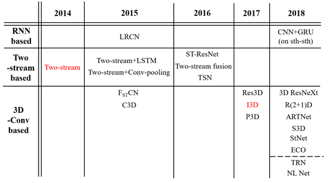

This is not a strict classification as RNN, two-stream and 3D convolution can be combined with each other, for example, two-stream+LSTM, two stream+I3D, etc.

In my opinion, there are two breakthroughs in action recognition models. The first is the two-stream network, which outperforms traditional action recognition methods such as IDT for the first time. The second is I3D, which beats two-stream based models without the optical flow inputs.

Actually most models are simply modified on previous methods, especially 3D-Conv based models. But TRN and NL Networks are proposed from a different perspective while the former focuses on temporal relations between multi-scare frames and the later focuses on exploiting relations between all positions in a global aspect.

These methods can also be classified into two categories depending on whether they focus on short term / local spatial-temporal features or long-term/global temporal relations.

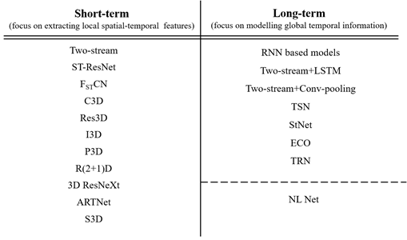

Generally, on low-level datasets, the performance of these methods is: compound 3D (e.g. two-stream+3D) > 3D based ≥ two-stream based > RNN based. Some state-of-the-art methods include NL I3D, S3D-G, ARTNeT, StNeT, two-stream I3D and TSN (best of two-stream based).

The mainly drawbacks of these methods are: 

1) RNN based models are not suitable for low-level action recognition; 

2) Extracting optical flow is time-consuming in two-stream based models; 

3) 3D-Conv based models suffer from expensive computational cost and overfitting due to many parameters. 

Recently, much work about 3D-Conv Nets has been done to lower computation cost and replacing optical flow inputs.

The performance of methods including TRN, CNN+RNN, S3D-G, ECO on Something-Something-V1:

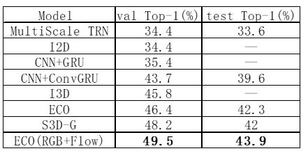

### 3. Methods

#### 3.1 **Two-Stream**

**paper**:  [**Two-Stream Convolutional Networks for Action Recognition in Videos**  *NIPS2014*](https://papers.nips.cc/paper/5353-two-stream-convolutional-networks-for-action-recognition-in-videos.pdf)

Classic two-stream architecture is shown below. Note that for a video input, only one
single frame and its corresponding dense optical flow. The stacking optical flows can be seen as an image whose channels are the optical flow maps.

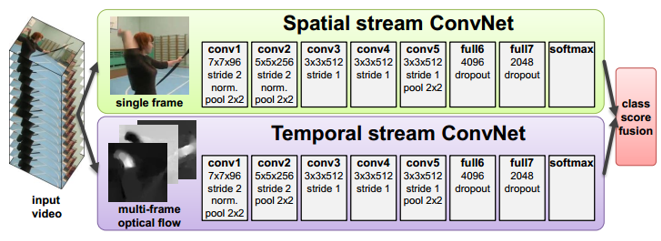

There are two ways to fuse the class score of two streams: averaging or train a SVM
based on the softmax scores. Experiment shows that SVM-based fusion performs
best. The author argues that training a joint stack of fully-connected layers on top of full6 or full7 layers of the two nets. Is not feasible because of overfitting.

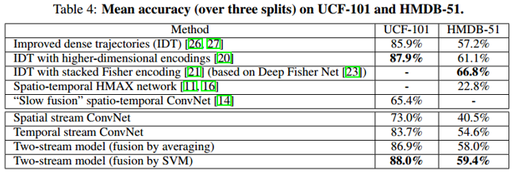

#### 3.2 LRCN

**paper**:  [**Long-term Recurrent Convolutional Networks for Visual Recognition and Description**      *CVPR2015*](https://www.cv-foundation.org/openaccess/content_cvpr_2015/papers/Donahue_Long-Term_Recurrent_Convolutional_2015_CVPR_paper.pdf)

A very classical method based on RNN. Not much to be mentioned. The architecture and experiment results on UCF-101 are shown as follows.

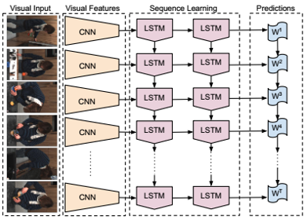

#### 3.3 **Two-stream Conv pooling & Two-stream + LSTM**

**paper**:  [**Beyond Short Snippets: Deep Networks for Video Classification**         *CVPR2015*](https://www.cv-foundation.org/openaccess/content_cvpr_2015/papers/Ng_Beyond_Short_Snippets_2015_CVPR_paper.pdf)

**1. Two-stream + Conv pooling**

This section mainly discussed several “pooling” ways to aggregate temporal features.
The author found that both average pooling and a fully connected layer for pooling failed to learn effectively due to the large number of gradients that they generate. Therefore max-pooling is used as the main feature aggregation technique. Several variations of the basic max-pooling architecture are shown below:

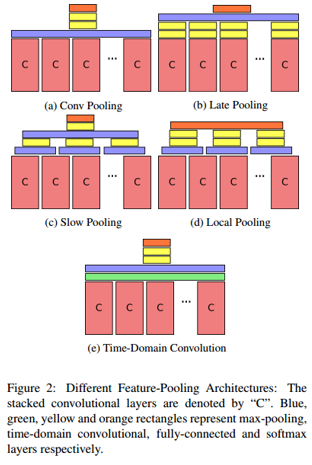

Experiment on Sports-1M dataset shows that **conv Pooling outperforms all other feature pooling architectures**. Note that the conv pooling here has nothing to do
with convolution operation although there is a “conv” in its name.

**2. Two-stream + LSTM**

This method simply combines two-stream architecture with LSTM. The LSTM frame-level predictions are combined into a single video-level prediction in several approaches:  1) returning the prediction at the last time step T, 2) max-pooling the predictions over time, 3) summing the predictions over time and return the max, 4) linearly weighting the predictions over time by g then sum and return the max. Weighted predictions usually resulted in the best performance but the accuracy for all four approaches was less than 1% different.

**3. Overall performance**

On UCF-101:

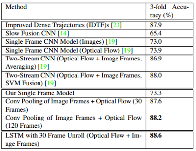

#### 3.4 C3D

**paper**:  [**Learning Spatiotemporal Features with 3D Convolutional Networks**      *ICCV2015*](https://www.cv-foundation.org/openaccess/content_iccv_2015/papers/Tran_Learning_Spatiotemporal_Features_ICCV_2015_paper.pdf)

Nothing much to note. The architecture is shown below:

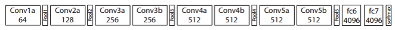

Note that all 3D convolution kernels are 3 × 3 × 3 with stride 1 in both spatial and temporal dimensions. The first pooling layer has kernel size 1 × 2 × 2 with the intention of not to merge the temporal signal too early. The input clip length is 16 frames.

Experiment results on UCF-101:

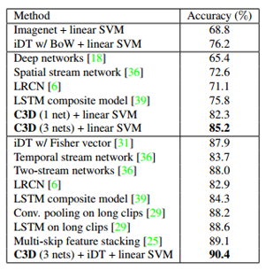

Note that **C3D performs worse than two-stream**.

#### 3.5 $\mathbf { F } _ { \mathrm { ST } } \mathbf { C N }$

**paper**:  [**Human Action Recognition using Factorized Spatio-Temporal Convolutional Networks**  *ICCV2015*](https://www.cv-foundation.org/openaccess/content_iccv_2015/papers/Sun_Human_Action_Recognition_ICCV_2015_paper.pdf)

This paper is known as the first paper to factorize the original 3D convolution kernel learning into 2D spatial learning and 1D learning. However, the factorization is done by using 2D spatial kernels in the lower layers and 1D temporal kernels in the upper layers, instead of factorizing the T×H×W kernels into 1×H×W and T×1×1 kernels. The former is also called network-level factorization by other papers, while the later is called layer-level factorization.

The architecture is shown below:

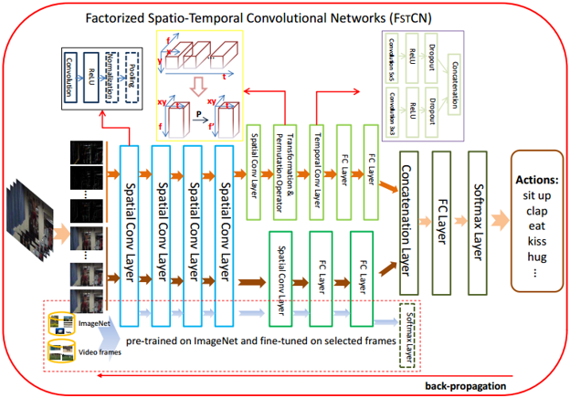

Note that there are auxiliary classifier layers connected to the lower spatial-conv layers (SCLs), as illustrated in the dashed red box of figure above. These layers are used for initialize the lower SCLs by pre-training this auxiliary network on ImageNet and then using randomly sampled training video frames to fine-tune.

After the lower SCLs, there is a transformation operation followed by a permutation operation. The transformation operation is to reshape the feature maps from size t×x×y×f to t×f×xy so that 2D convolution kernels can be learned and applied along the temporal and feature-channel dimensions (can be seen as 1D temporal convolution and easier for implementation in deep learning libraries). The permutation operation is done by multiplying a matrix of size f×f’.

*From my point of view, these transformations are a little bit strange. Usually we do not apply convolution operations along the channel dimension in CNNs. And the temporal convolution in this paper is not a 1D convolution actually.*

The paper also introduced a method called **SCI fusion** to aggregate clip-level scores. More details can be found in the paper.

Experiments results are shown below:

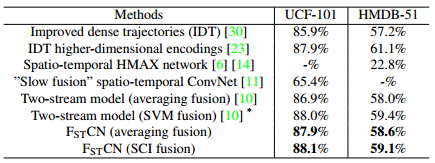

#### 3.6 **Two-stream fusion**

**paper**:  [**Convolutional Two-Stream Network Fusion for Video Action Recognition**   *CVPR2016*](https://www.cv-foundation.org/openaccess/content_cvpr_2016/papers/Feichtenhofer_Convolutional_Two-Stream_Network_CVPR_2016_paper.pdf)

This paper mainly discusses various fusion methods in two-stream network, including how and where to fuse the two stream (spatial fusion) and how to fuse multi-frame features (temporal fusion). This paper is meaningful in my opinion because the methods mentioned can also be applied to multimodal fusion.

**1. Spatial fusion**

Five strategies: 1) sum fusion; 2) max fusion; 3) concatenation; 

4) conv fusion: after concatenation
$$
\mathbf { y } ^ { \text { conv } } = \mathbf { y } ^ { \mathrm { cat } } * \mathbf { f } + b
$$
5) bilinear fusion: vector outer product, sum over all pixel locations
$$
\mathbf { y } ^ { \mathrm { bil } } = \sum _ { i = 1 } ^ { H } \sum _ { j = 1 } ^ { W } \mathbf { x } _ { i , j } ^ { a \top } \otimes \mathbf { x } _ { i , j } ^ { b }
$$
The output dimension is D×D (too much), while D is input dimension. To make bilinear features usable in practice, it is usually applied after the last convolution layer, the fully-connected layers are removed and power- and L2-normalization is applied for effective classification with linear SVMs. 

Parameters: concat > conv ≈ sum = max > bilinear (without FC layers)

Results: On UCF-101 (split 1)

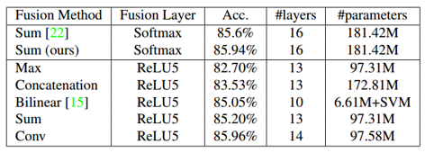

**2. Where to fuse the networks**

Whether to truncate one network tower or not can result in two different architectures
as the figure shows below:

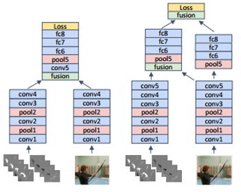

The left example shows fusion after the fourth conv-layer. Only a single network tower is used from the point of fusion. The right figure shows fusion at two layers (after conv5 and after fc8) where both network towers are kept, one as a hybrid spatiotemporal net and one as a purely spatial network.

Performance comparison for Conv fusion at different fusion layers is shown below:

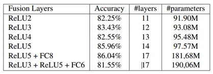

Note that **an earlier fusion (than after conv5) results in weaker performance**. Multiple fusions also lower performance if early layers are incorporated (last row). Best performance is achieved for fusing at ReLU5 or at ReLU5+FC8 (but with nearly double the parameters involved).

The poor results in the case of earlier fusion may be attribute to insufficient information learned by the network.

**3. Temporal fusion**

Three ways as the figure shows：

Results

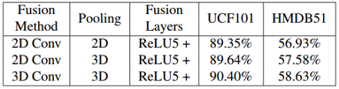

**4. Proposed architecture**

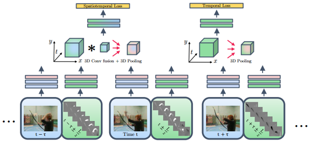

Note that the temporal stream is preserved after fusion to the spatial stream.

Overall performance

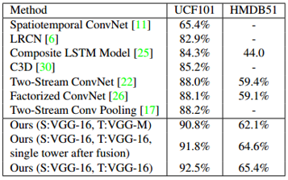

#### 3.7 **ST-ResNet**

**paper**:  [**Spatiotemporal Residual Networks for Video Action Recognition**  
*NIPS2016*](http://papers.nips.cc/paper/6433-spatiotemporal-residual-networks-for-video-action-recognition.pdf)

This paper introduces residual connections in a two-stream ConvNet model.

The residual units used in this paper are shown below:

There is an additional residual connection (highlighted in red) between the two streams that enables motion interactions. The motivation behind this is to let the network learn to represent what (captured by the spatial stream) moves in which way (captured by the temporal stream). The author found that direct connections between identical layers of the two streams or bidirectional connections led to an increase in validation error. 

To learn temporal information, the authors also transform spatial dimensionality mapping filters in the residual paths to temporal filters. Note that the motivation of the authors is not to utilize simple 3D convolution or its factorized version, but to expand the temporal receptive field by 1D temporal convolution. 

The proposed architecture is shown below:

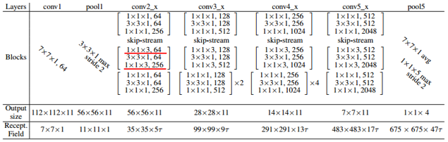

Results:

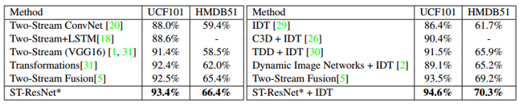

#### 3.8 **TSN**

**paper**:  [**Temporal Segment Networks: Towards Good Practices for Deep Action Recognition** *ECCV2016*](https://arxiv.org/pdf/1608.00859.pdf)

**TSN performs best among all the two-stream based methods.** Its success may be attributed to **a sparse sampling scheme** and various training tricks. The architecture proposed in this paper are not very innovative while heavy engineering works are included.

**1. TSN and sparse sampling**

TSN is a video-level framework shown as follows:

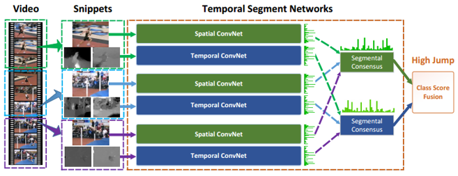

For a video input, TSN divide it into K segments (K=3 in the paper) and for each segment, a snippet consists of a single frame and corresponding optical flow is sampled, this is the so-called sparse sampling scheme. Then each snippet is passed to a two-stream network. The final results are computed by averaging scores of all snippets first and then scores of the two streams.

**2. Training strategies**

Three training strategies are designed by the authors, while only two of them will be introduced next (except data augmentation).

**Cross modality pre-training:** utilize RGB models to initialize the temporal networks. First, discretize optical flow fields into the interval from 0 to 255 by a linear transformation. Then, modify the weights of first convolution layer of RGB models to handle the input of optical flow fields. In detail, average the weights across the RGB channels and replicate this average by the channel number of temporal network input.

**Partial BN:** freeze the mean and variance parameters of all Batch Normalization layers except the first one. A extra dropout layer after the global pooling layer. This trick is used in many other papers.

**Multimodal inputs:** the authors also study different input modalities for two-stream ConvNets, including RGB image, RGB difference, optical flow and warped optical flow. Using three modalities except RGB difference leads to better performance.

**3. Results**

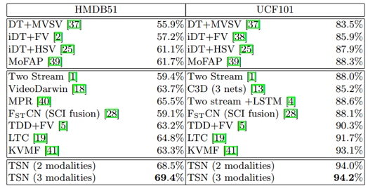

#### 3.9 **I3D**

**paper**:  [**Quo Vadis, Action Recognition? A New Model and the Kinetics Dataset**   *CVPR2017*](http://openaccess.thecvf.com/content_cvpr_2017/papers/Carreira_Quo_Vadis_Action_CVPR_2017_paper.pdf)

I3D, known as “Inflated 3D ConvNets”, is **an important breakthrough in the progress of 3D ConvNets.** I3D beats two-stream based methods for the first time using only RGB input and Kinetics pre-training on UCF-101 and HMDB-51.

**1. Architecture:** the architecture of I3D is rather trivial by converting Inception-V1 from 2D to 3D.

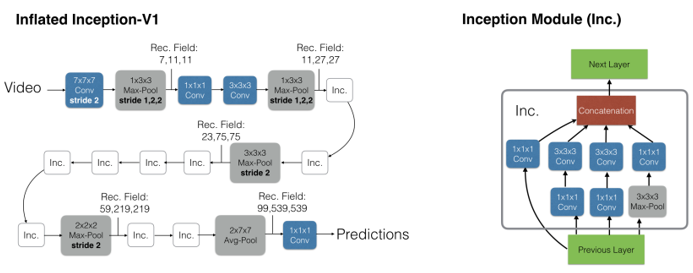

The main contribution of this paper is the **initialization method** of I3D, which utilizes pre-trained 2D ImageNet models. It is achieved by **repeating the weights of the 2D filters N times along the time dimension, and rescaling them by dividing by N**.

Unlike traditional C3D, I3D takes **64-frame** clips as input and is much deeper with fewer parameters.

**2. Experiment**

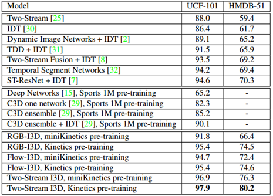

#### 3.10 **Res3D**

**paper**:  [**ConvNet Architecture Search for Spatiotemporal Feature Learning**     *2017*](https://arxiv.org/pdf/1708.05038.pdf)

Not much to mention. Known as the first paper to convert ResNet from 2D to 3D, but using a relatively shallow version (18 and 34 layers). The same author as C3D. 

#### 3.11 **P3D**

**paper**:  [**Learning Spatio-Temporal Representation with Pseudo-3D Residual Networks**       *ICCV2017*](https://arxiv.org/pdf/1711.10305.pdf)

A representative work about **3D kernel decomposition**.

The motivation of decomposing 3D kernels is to lower the computational cost of C3Ds by reducing parameters.

The author designed three blocks based on two issues: 1) whether the modules of 2D filters on spatial dimension and 1D filters on temporal domain (T) should directly or indirectly influence each other; 2) whether the two kinds of filters should both directly influence the final output. The building blocks are transformed from residual units.

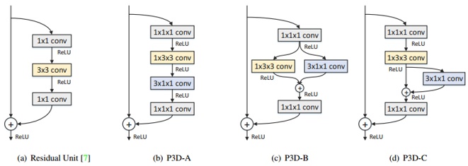

Effects of each block is studied by replacing all the residual units in a ResNet-50 backbone with respective P3D block. A final network architecture is proposed by replacing residual units with a chain of P3D blocks in the order **P3D-A→P3D-B→P3D-C**. Experimental results of different architectures on UCF-101-split1 are shown as follows:

Performance comparisons with other methods on UCF101 are presented, note that the results in brackets are gotten by using RGB and Flow inputs.

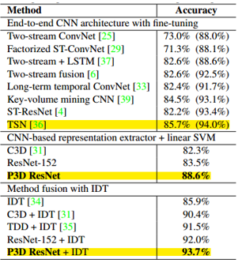

It can be seen that P3D (88.6%) outperforms two-stream network (88%), but still has some distance from TSN (94.0%).

#### 3.12 **3D ResNeXt**

**paper**:  [**Can Spatiotemporal 3D CNNs Retrace the History of 2D CNNs and ImageNet?**   *CVPR2018*](http://openaccess.thecvf.com/content_cvpr_2018/papers/Hara_Can_Spatiotemporal_3D_CVPR_2018_paper.pdf)

Not much to note. This paper mainly studies the effects of some deep 3D CNNs which are directly converted from their 2D versions, as the figure below:

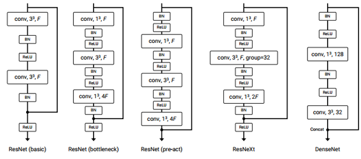

Experiment indicates that ResNeXt-101 performs best.

#### 3.13 **R(2+1)D**

**paper**:  [**A Closer Look at Spatiotemporal Convolutions for Action Recognition**      *CVPR2018*](http://openaccess.thecvf.com/content_cvpr_2018/CameraReady/2648.pdf)

This paper studies different residual network architectures that: 1) mixing 2D and 3D convolutions; 2) factorizing 3D kernels. 

**1. 2D and 3D convolutions mixture**

This is done by replacing 3D convolutions with 2D convolutions in either lower or higher layers of a ResNet backbone, in order to reduce parameters. The motivation stems from the observation that 2D CNNs applied to individual frames of the video have remained solid performers in action recognition.

**2. 3D kernel factorization**

This is done by factorizing each spatiotemporal convolution into a block of a spatial convolution followed by a temporal convolution. Different from the network factorization of *FSTCN*, this is a layer factorization, which is called (2+1)D-conv in this paper.

**3. Study of different architectures**

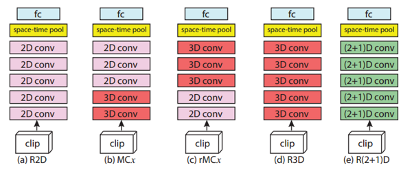

For fair comparison of model complexity, **the author keeps the number of parameters in the R(2+1)D block approximately the same as that in the R3D blocks**, which is different from P3D in that P3D is not purposely designed to match the number of parameters with the 3D convolutions This is done by adjusting the number of 2D and 1D filters in the R(2+1)D block.

**4. Experiments**

Results of different architectures on the Kinetics validation set:

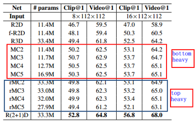

**Conclusion 1:** Generally, models using 2D-conv in higher layers outperform those using 2D-conv in lower layers. *(This conclusion is refuted in the S3D paper for the differences are small.)*

**Conclusion 2:** R(2+1)D performs best. The authors believes that reasons are two-fold: (2+1)D-conv 1) doubles the number of nonlinearities in the network due to the additional ReLU between the 2D and 1D convolution; 2) renders the optimization easier (seeing the figure below).

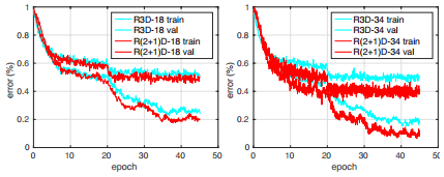

Another interesting issue, seeing the figure below (on Kinetics validation set):

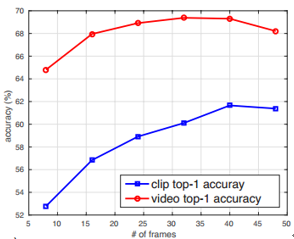

Although clip accuracy continues to increase when adding more frames, video accuracy peaks at 32 frames. **Training on longer clips yields different (better) clip-level models, as the filters learn longer-term temporal patterns. However, this improvement cannot be obtained “for free” by simply lengthening the clip input at test time.**

Comparison with other methods and more details can be found in the paper.

#### 3.14 **ARTNeT**

**paper**:  [**Appearance-and-Relation Networks for Video Classification**   *CVPR2018*](http://openaccess.thecvf.com/content_cvpr_2018/papers/Wang_Appearance-and-Relation_Networks_for_CVPR_2018_paper.pdf)

ARTNets are constructed by stacking multiple building blocks called **SMART blocks**, which has two branch to process **appearance and relation information** respectively. This work focuses on short-term temporal modeling and is most related with 3D CNNs.

A SMART block:

The upward branch is called relation branch based on 3D-conv, while the other is called appearance branch based on 2D-conv. 

The square operation is simply done by squaring the feature maps according to the codes released by the author. The purpose of this operation is to exploit multiplicative interactions between consecutive frames. This idea is inspired by energy models and not straightforward although the author explained by several equations in the paper. *It does not make any sense to me*. 

Cross channel pooling is just another calling of 1×1×1 convolution.

The experiment results are not presented here for the tables are too long and can be found in the paper. Note that the best performance is achieved by ARTNeT-ResNet18 using RGB + Flow inputs and a TSN framework.

#### 3.15 **NL Network**

**paper**:  [**Non-local Neural Networks** *CVPR2018*](http://openaccess.thecvf.com/content_cvpr_2018/papers/Wang_Non-Local_Neural_Networks_CVPR_2018_paper.pdf)

*This is a meaningful work in my opinion.* Instead of simply modifying previous 3D-conv networks, this paper proposes a new operation called **non-local operation** to process videos. Intuitively, a non-local operation computes the response at a position as a weighted sum of the features at all positions in the input feature maps (as the figure shows below).

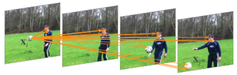

**1. Formulation**

A generic non-local operation is defined as follows:
$$
\mathbf { y } _ { i } = \frac { 1 } { \mathcal { C } ( \mathbf { x } ) } \sum _ { \forall j } f \left( \mathbf { x } _ { i } , \mathbf { x } _ { j } \right) g \left( \mathbf { x } _ { j } \right)
$$
Here $i$ is the index of an output position, and $j$ is the index of all other positions. A pairwise function $f$ computes a scalar that representing relationship between $i$ and all $j$. The function $g$ computes a representation of the input signal at position $j$. $C(x)$ is the normalization function. Unlike convolution and recurrent operation, **non-local operation takes all positions into account**.

For simplicity, function $g$ is a linear embedding. Function $f$ has several choices as follows.

* Gaussian
  $$
  f \left( \mathbf { x } _ { i } , \mathbf { x } _ { j } \right) = e ^ { \mathbf { x } _ { i } ^ { T } \mathbf { x } _ { j } }
  $$

* Embedded Gaussian
  $$
  f \left( \mathbf { x } _ { i } , \mathbf { x } _ { j } \right) = e ^ { \theta \left( \mathbf { x } _ { i } \right) ^ { T } \phi \left( \mathbf { x } _ { j } \right) }
  $$

​        This is equivalent to
$$
\mathbf { y } = \operatorname { softmax } \left( \mathbf { x } ^ { T } W _ { \theta } ^ { T } W _ { \phi } \mathbf { x } \right) g ( \mathbf { x } )
$$

* Dot product
  $$
  f \left( \mathbf { x } _ { i } , \mathbf { x } _ { j } \right) = \theta \left( \mathbf { x } _ { i } \right) ^ { T } \phi \left( \mathbf { x } _ { j } \right)
  $$

* Concatenation
  $$
  f \left( \mathbf { x } _ { i } , \mathbf { x } _ { j } \right) = \operatorname { Re } \mathbf { L } \mathbf { U } \left( \mathbf { w } _ { f } ^ { T } \left[ \theta \left( \mathbf { x } _ { i } \right) , \phi \left( \mathbf { x } _ { j } \right) \right] \right)
  $$

**2. Instantiations**

In the case of video classification, **the non-local operation can be implemented as 1×1×1 convolution in spacetime**. Here, vector Xi denotes a pixel and each element is a channel value.

A spacetime non-local blocks:

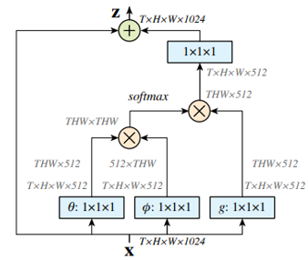

Note that the non-local block can be easily used together with convolution or recurrent layers.  

**3. Experiment**

All the experiments are done on Kinetics. C2D mentioned next is a 2D ResNet-50.

1) Different types of function $f$

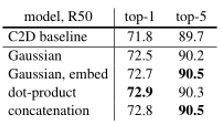

Non-local models are not sensitive to the types of function f, as the differences of results are small. It indicates that **the generic non-local behavior is the main reason for the improvement of models**.

2) Comparison with other methods

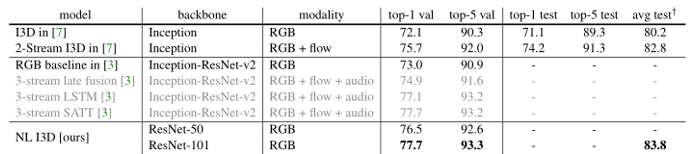

SATT is proposed by the winners of the Kinetics 2017 competition. NL I3D got the same results as SATT used only RGB inputs.

More experiments can be found in the paper.

#### 3.16 **StNet**

**paper**:  [**Exploiting Spatial-Temporal Modelling and Multi-Modal Fusion for Human Action Recognition**     *CVPR2018*](https://arxiv.org/pdf/1806.10319.pdf)

This is a subsequent work of the winners’ solution of the Kinetics 2017 Competition. Two issues to note: 1) Concatenating N successive frames as a 3N-channel image as inputs to model local space-time relations; 2) Multimodal fusion scheme that **integrate early and later fusion**.

**1. StNet**

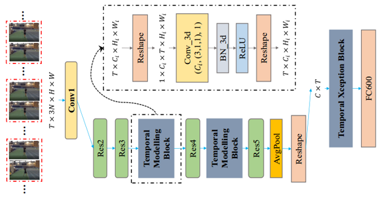

StNet first models local spatial-temporal correlation by applying 2D convolution over **a 3N-channel super image** which is formed by sampling N successive RGB frames from a video and concatenating them in the channel dimension. A TSN framework is used and the long-range dynamics is modelled by temporal convolution. Temporal Xception Block is a 3D version of Xception (seeing in the next figure) and used for further temporal modelling.

**2. iTXN: a multimodal fusion framework**

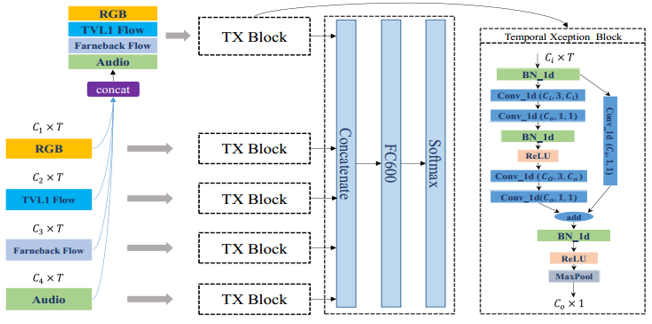

Note its multimodal fusion scheme which integrating early and late fusion.

**3. Experiments**

All the results are reported on the  Kinetics-600 validation set.

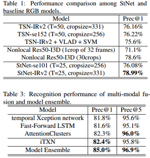

#### 3.17 **CNN+GRU**

**paper**:  [**Temporal Reasoning in Videos using Convolutional Gated Recurrent Units**       *CVPR2018*](http://openaccess.thecvf.com/content_cvpr_2018_workshops/papers/w19/Dwibedi_Temporal_Reasoning_in_CVPR_2018_paper.pdf)

The motivation of this work is that in high-level dataset such as Something-Something, **temporal order is very important, so RNNs may provide a good result.**

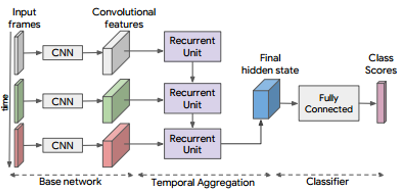

**Experiments**

On the 20BN Something-Something validation set:

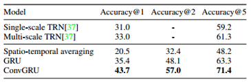

On the 20BN Something-Something test set:

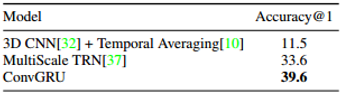

On the Kinetics validation set:

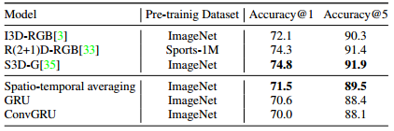

It can be seen clearly that **RNNs performs much better on high-level dataset that on low-level dataset**.

####  3.18 TRN 

**paper**:  [**Temporal Relational Reasoning in Videos** *ECCV2018*](https://arxiv.org/pdf/1711.08496.pdf)

This work focuses on high-level datasets including Something-Something, Jester and Charades. The author points out that **it is important for models to learn temporal causal relations (in other words, models should have temporal reasoning abilities) on high-level dataset.**

**1. Temporal relations**

For the input video $V$ with $n$ selected ordered frames as $V = { f_1, f_2, …, f_n }$, temporal relations between two frames are defined as:
$$
T _ { 2 } ( V ) = h _ { \phi } \left( \sum _ { i < j } g _ { \theta } \left( f _ { i } , f _ { j } \right) \right)
$$
In the paper, this is implemented by use MLP with parameters $φ$ and $θ$ respectively. For efficient computation, rather than adding all the combination pairs, the authors uniformly sample frames $i$ and $j$ and sort each pair.

Similarly, the temporal relations between 3 frames:
$$
T _ { 3 } ( V ) = h _ { \phi } ^ { \prime } \left( \sum _ { i < j < k } g _ { \theta } ^ { \prime } \left( f _ { i } , f _ { j } , f _ { k } \right) \right)
$$
For multi-scale:
$$
M T _ { N } ( V ) = T _ { 2 } ( V ) + T _ { 3 } ( V ) \ldots + T _ { N } ( V )
$$
**2. Architecture**

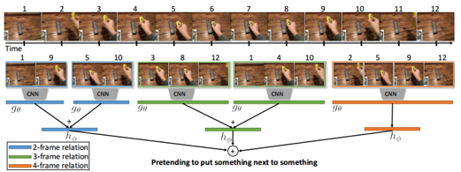

**3. Experiments**

On Something-Something:

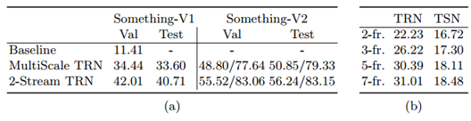

Note that TSN performs badly on this dataset (table(b)).

Other experimental results can be found in the paper.

#### 3.19 S3D

**paper**:  [**Rethinking Spatiotemporal Feature Learning: Speed-Accuracy Trade-offs in Video Classification**     *ECCV2018*](https://eccv2018.org/openaccess/content_ECCV_2018/papers/Saining_Xie_Rethinking_Spatiotemporal_Feature_ECCV_2018_paper.pdf)

This work studies **the speed-accuracy trade-off in 3D-Conv based models**. In detail, the impacts of replacing 3D-conv with 2D-conv in lower or higher layers are discussed, as well as separating 3D convolutions. Based on this, a final model called S3D-G is proposed. This paper is much related to the R(2+1)D paper.

**1. 2D-conv in 3D networks**

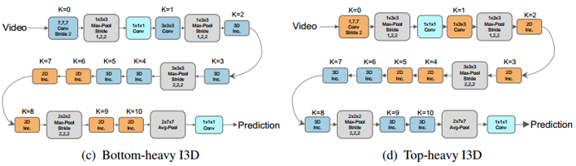

*Bottom-heavy*: 3D-conv in lower layers and 2D-conv in higher layers.

*Top-heavy*: 2D-conv in lower layers and 3D-conv in higher layers.

**2. Separating 3D kernels**

S3D separates 3D convolutions in an Inception module:

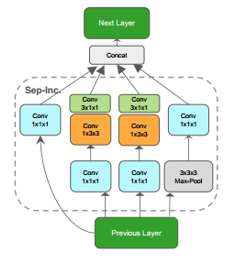

The whole architecture：

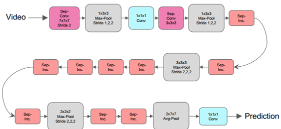

**3. Experiments of different architectures**

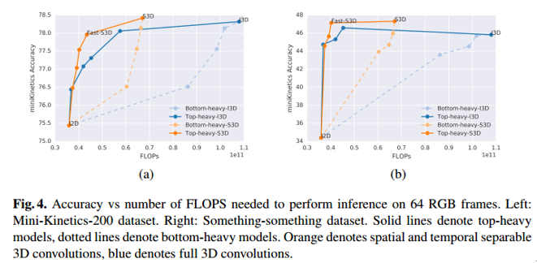

**Conclusion1** Replacing 3D kernel3 by 2D in **lower** layers is better.

This can be clearly seen by the accuracy curves of top-heavy and bottom-heavy I3D in the figure above on both datasets. Note that this conclusion is completely opposite to what have been found in the R(2+1)D paper, but is more convinced.

Moreover, top-heavy I3D is much faster than bottom-heavy I3D. This makes sense because the parameters of top-heavy I3D is fewer as the feature maps in top layers are smaller.

**Conclusion2** Separating 3D kernels leads to better performance. Because there are fewer parameters in S3D, hence overfitting is reduced.

Note that the top-heavy S3D performs best in both speed and accuracy, and the Fast-S3D is the model in which the authors keep the top 2 layers as separable 3D convolutions, and make the rest 2D convolutions.

**4. Feature gating**

Inspired by the context gating mechanism:
$$
y = \sigma ( W x + b ) \odot x
$$
This can be seen as a “self-attention” mechanism.

Feature gating is defined as:
$$
Y = \sigma ( W \operatorname { pool } ( X ) + b ) \odot X
$$
Where the pooling operation averages the dimensions of $X$ across space and time, $\odot$ represents multiplication across the channel dimension (done by replicating $W \operatorname { pool } ( X ) + b$) across space and time).

The best results are got by applying it directly after each of the [k; 1; 1] temporal convolutions in the S3D network. The final model is called **S3D-G**.

**5. Performance**

On Something-Something (v1):

Other experimental results can be found in the paper.

#### 3.20 ECO

**paper**:  [**ECO: Efficient Convolutional Network for Online Video Understanding**   *ECCV2018*](https://arxiv.org/pdf/1804.09066.pdf)

This work focuses on the model **speed** on video understanding tasks and proposes a very fast network called ECO. The approach achieves competitive performance across all datasets while being 10x to 80x faster than state-of-the-art methods, as the author said.

The motivation of ECO is to use a better way to aggregate temporal features, while it is insufficient to simply average the snippet-level scores like TSN does. This idea is much related to the two-stream fusion.

**1. Architecture**

The architecture of ECO is very straightforward. It uses a 3D ConvNet after the frame-level 2D ConvNet to aggregate temporal features. The frames are sampled across the entire video in a similar way like TSN.

There two versions of ECO: **ECO Lite and ECO Full**. Based on the observation that simple short-term actions that can be recognized just from the static image content, an additional 2D-conv branch is added in ECO Full to pay enough attention to the static image features, whereas the 3D network architecture takes care of the more complex actions that depend on the relationship between frames. This is similar to the appearance and relation branches in ARTNeT.

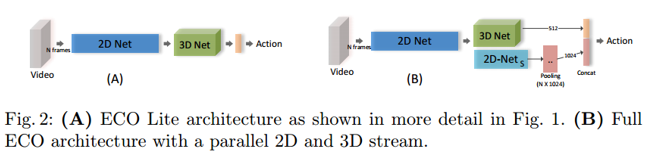

There is another version of ECO used for online video understanding. Details can be found in the paper.

**2. Experiments**

On kinetics:

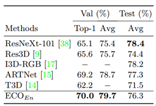

The term **ECOEn** refers to average scores obtained from an ensemble of networks with {16, 20, 24, 32} number of frames.

Note that these results are gotten by RGB inputs only. Actually ECO does not outperform state-of-the-art methods on low-level datasets as **it sacrifices accuracy for speed**.

On Something-Something (V1):

