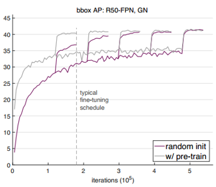
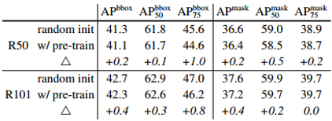
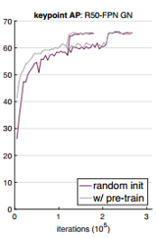

### **Rethinking ImageNet Pre-training**
------

**paper**:  [**Rethinking ImageNet Pre-training**        *2018*](https://arxiv.org/pdf/1811.08883)

**A surprising paper with a nice experimental part.** Here I will present the conclusions first,
follows the experimental results. Note that the experiments are mainly done on the COCO dataset.

#### 1. Conclusion (**drawn from the paper**)

* Training from scratch on target tasks is possible without architectural changes.

* Training from scratch requires **more iterations** to sufficiently **converge**.
* Training from scratch can be **no worse than** its ImageNet pre-training counterparts under many circumstances, down to as few as 10k COCO images.
* ImageNet pre-training **speeds up** convergence on the target task.
* ImageNet pre-training does **not** necessarily help **reduce overfitting** **unless** we enter a very **small data** regime.

* ImageNet pre-training **helps less** if the target task is more sensitive to **localization** **than** **classification**.

  

#### 2. **Experiment (only important results)**
Two modifications:

* Use Group Normalization (GN) or synchronized Batch Normalization (SyncBN) instead of BN, because in detection tasks batch size is small due to high resolution inputs. In contrast, GN is insensitive to batch size, and SyncBN increases the effective batch size for BN when using multiple GPUs.
* Train longer.

**1)**  **Preliminary experiments**

The figure below only shows an example, more results can be found in the paper.

**Observations:**

* Training form scratch can catch up the performance of ImageNet pre-training with more iterations.

* In the case of training from scratch, training longer for large learning rate is useful, but on small learning rates often leads to overfitting.

* Both GN and SyncBN can enable detection models to train from scratch, while GN performs better than SyncBN.

* For the metric using a high overlap threshold, training from scratch is even better than fine-tuning, suggesting that ImageNet pre-training may not be suitable for detection tasks.

**2)**  **Keypoint detection**

ImageNet pre-training, which has little explicit localization information, does not help keypoint detection.

**3)**  **Less data**

ImageNet pre-training does not help reduce overfitting as it suffers from overfitting without hyper-parameters optimization.

#### 3. Discussion

This paper does not fully deny the importance of ImageNet pre-training. It does help the model to converge quickly but will not boost the final accuracy. Compared with training from scratch, ImageNet pre-training is only helpful when the data of target tasks is less and computational ability is limited. It would be more effective to collect data in the target domain.

Finding a universal and more generalizable representation is still an important issue. This reminds me of the words of Hinton, which argues that our goal is to find a good representation for images, and if we can achieve this, then the representation can be used for classification, detection and segmentation. It is not our goal to blindly pursue the accuracy. 