### **Notes on Some Image Classification Methods After ResNet**

------

#### 1. ResNet

**paper**:  [**Deep Residual Learning for Image Recognition**    *CVPR2016*](https://www.cv-foundation.org/openaccess/content_cvpr_2016/papers/He_Deep_Residual_Learning_CVPR_2016_paper.pdf)

Nothing special to note except that the author consider two options of shortcut (i.e. the skip connections between layers): 1) identity mapping; 2) projection (done by 1×1 convolutions).
Experiments shows that **projection shortcuts are not essential** because of its small differences in results from identity mapping. 

#### 2. **Pre-activation ResNet**

**paper**:   [**Identity Mappings in Deep Residual Networks**      *ECCV2016*](https://arxiv.org/pdf/1603.05027.pdf)

**2. 1  Various types of shortcut connections**

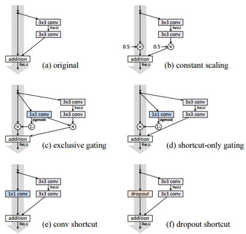

The gating function in (c) and (d) is:
$$
g ( \mathbf { x } ) = \sigma \left( \mathbf { W } _ { g } \mathbf { x } + b _ { g } \right)
$$
Results show that identity mapping performs best. These experiments suggest that **keeping a “clean” information path is helpful for easing optimization**. In contrast, multiplicative manipulations (scaling, gating, 1×1 convolutions, and dropout) on the shortcuts can hamper information propagation and lead to optimization problems.

**2.2  Pre-activation**

Moving BN and ReLu before weighted layers as the figure shows below. This figure also shows the training and testing loss curves of original and pre-act ResNet.

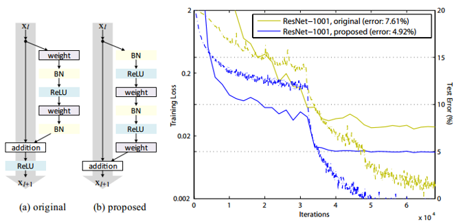

Experiments show that when BN and ReLU are both used as pre-activation, the results are improved by healthy margins. The reason is twofold:

**1) Ease of optimization**

The general function of residual units is:
$$
\begin{array} { c } { \mathbf { y } _ { l } = h \left( \mathbf { x } _ { l } \right) + \mathcal { F } \left( \mathbf { x } _ { l } , \mathcal { W } _ { l } \right) } \\ { \mathbf { x } _ { l + 1 } = f \left( \mathbf { y } _ { l } \right) } \end{array}
$$
In original ResNet, f is ReLu function that truncates the propagated signal. In pre-act version, f is an identity mapping so the signal can be propagated directly between any two units. 

The impact of $f=\text{ReLu}$ is especially prominent when ResNet is deep (e.g. 1001 layers ).

**2) Reducing overfitting**

The author believes that this is caused by BN’s regularization effect. In the original Residual Unit, the added signal (i.e. $y_l$) is not normalized while the inputs to all weight layers have been normalized in the pre-act version.

#### 3. Xception

**paper**:   [**Xception: Deep Learning with Depthwise Separable Convolutions**      *CVPR2017*](http://openaccess.thecvf.com/content_cvpr_2017/papers/Chollet_Xception_Deep_Learning_CVPR_2017_paper.pdf)

This paper modifies the Inception module with depth-wise convolution.

**Depth-wise convolution**: a spatial convolution performed independently over each channel of an input, followed by a pointwise convolution, i.e. a 1x1 convolution, projecting the channels output by the depth-wise convolution onto a new channel space.

An “extreme” version of an Inception module using depth-wise convolution can be derived from a simplified Inception module as follows.

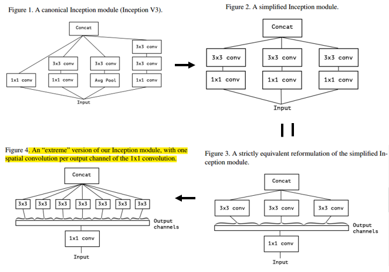

The Xception architecture is a linear stack of depthwise separable convolution layers with residual connections.

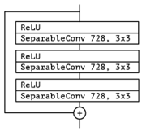

SeparableConv denotes the operation that perform 1x1 convolution first, followed by a channel-wise spatial convolution. All SeparableConvolution layers use a depth multiplier of 1 (no depth expansion).

**Experiment**: mainly compared with Inception V3, the table below shows the results on ImageNet.

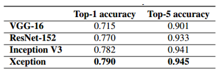

#### 4. **Inception-ResNet-v2**

**paper**:  [**Inception-v4, Inception-ResNet and the Impact of Residual Connections on Learning**         *AAAI2017*](http://www.aaai.org/ocs/index.php/AAAI/AAAI17/paper/download/14806/14311)

Nothing special to note and the figure below shows the Inception-A, Inception-B and Inception-C in the Inception-ResNet-v2 network.

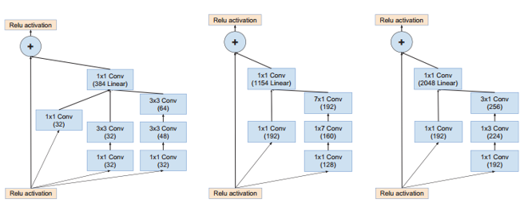

The table shows single-crop – single-model experimental results. Reported on the non-blacklisted subset of the validation set of ILSVRC 2012.

#### 5.  **ResNeXt**

**paper**:  [**Aggregated Residual Transformations for Deep Neural Networks**  
*CVPR2017*](http://openaccess.thecvf.com/content_cvpr_2017/papers/Xie_Aggregated_Residual_Transformations_CVPR_2017_paper.pdf)

This paper uses **group convolution** to modify the original ResNet and introduces a new dimension called “cardinality” (i.e. the groups in group convolution).

Note that the depth-wise convolution in *Xception* can be seen as a special case of group convolution in which the number of groups is equal to the number of channels.

A building block of ResNeXt:

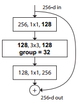

ResNeXt-50 architecture compared with ResNet-50, note that the width of the bottleneck (i.e. number of kernels or feature maps) is adjusted in group convolution to preserving complexity:

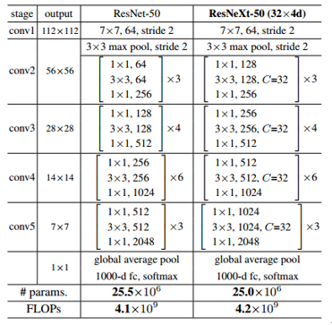

Ablation experiments on ImageNet-1K:

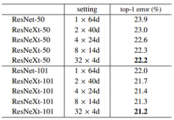

Comparisons on ImageNet-1K where model complexity is increased by 2×:

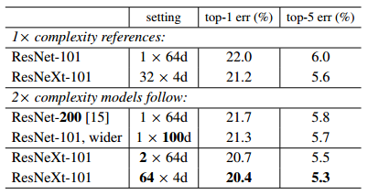

We can see **increasing cardinality C shows much better results than going deeper or wider**.

#### 6. **DenseNet**

**paper**:  [**Densely Connected Convolutional Networks**  *CVPR2017*](https://arxiv.org/pdf/1608.06993.pdf)

This paper is CVPR2017 oral. It proposes a new and efficient network, which is seen as the biggest breakthrough after ResNet.

DenseNet connects each layer to every other layer in a feed-forward fashion, hence the network has L(L+1)/2 direct connections totally. A 5-layer dense block is showed below:

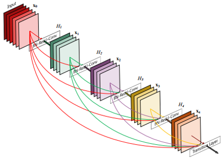

DenseNet combines features by **concatenating** them, but not through summation. The major difference between DenseNet and ResNet can be clearly showed by the equations below:

DenseNet:  $\mathbf { x } _ { \ell } = H _ { \ell } \left( \left[ \mathbf { x } _ { 0 } , \mathbf { x } _ { 1 } , \ldots , \mathbf { x } _ { \ell - 1 } \right] \right)$

ResNet:  $\mathbf { x } _ { \ell } = H _ { \ell } \left( \mathbf { x } _ { \ell - 1 } \right) + \mathbf { x } _ { \ell - 1 }$

DenseNet layers are very narrow (e.g., 12 filters per layer) and thus requires fewer parameters. The author believes that a relatively small filters per layer (called “growth rate” k in the paper) is sufficient to obtain good results. One explanation is that the feature maps can be viewed as the global state of the network. The growth rate regulates how much new information each layer contributes to the global state. **The global state, once written, can be accessed from everywhere within the network and, unlike in traditional network architectures, there is no need to replicate it from layer to layer.**

**In other words, each layer has direct access to the gradients from the loss function and the original input signal, leading to an implicit deep supervision.**

The figure below is the DenseNet architectures for ImageNet.

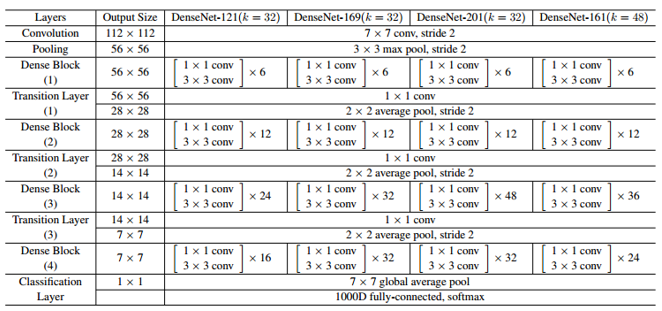

Some compositions of DenseNet are described as follows:

**Transition layers:** these layers consist of a batch normalization layer and an 1×1 convolutional layer followed by a 2×2 average pooling layer for down-sampling. The whole network is divided into multiple densely connected dense blocks to facilitate down-sampling.

**Bottleneck layers:** they are 1×1 convolution injected before each 3×3 convolution to reduce the large number of input feature-maps (because of dense connections).

**Experiments:** on ImageNet validation set

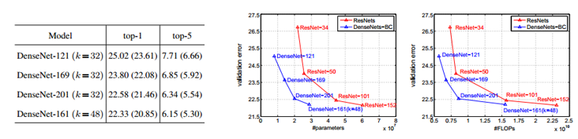

It can be indicated that DenseNets utilize parameters more efficiently than ResNets. One positive side-effect of the more efficient use of parameters is a tendency of DenseNets to be less prone to overfitting.