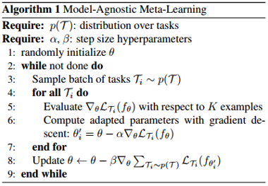
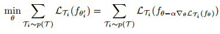
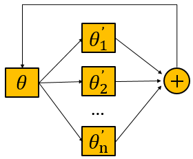
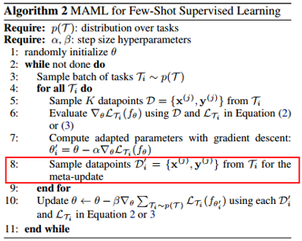
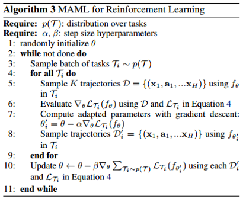
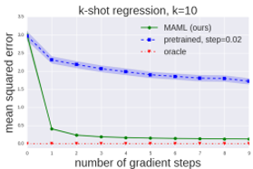

### Model Agnostic Meta Learning

------

**paper**:  [**Model-Agnostic Meta-Learning for Fast Adaptation of Deep Networks**     *ICML 2017*](https://arxiv.org/pdf/1703.03400.pdf)

**MAML** is a simple but effective algorithm aims at learning a good initial parameters of so that the model will have maximal performance on a new task after been updated through one or more gradient steps. This algorithm is model-agnostic and can be applied in different types of tasks including regression, classification and reinforcement learning. This algorithm is discussed in few-shot learning scenario in this paper.

#### 1. **General form of MAML algorithm**

In step 8, the objective function is:

The MAML meta-gradient update involves a gradient through a gradient (In other words, a second-order derivative). The goal of meta-gradient update (Step 8) is to minimize the total loss across all tasks after adapting the initial model to these specific tasks. During every iteration, MAML algorithm forces the model to considering all the tasks it trained with. 

In particular, MAML uses the **summation** of all the task-specific gradients to update the initial  parameters. The summation loss $\sum _ { \mathcal { T } _ { i } \sim p ( \mathcal { T } ) } \mathcal { L } _ { \mathcal { T } _ { i } } \left( f _ { \theta _ { i } ^ { \prime } } \right)$ can be seen as a composite function of parameter $\theta$.

The parameter $\theta$ can be seen as a global or general representation for the distribution over tasks, while the parameter $\theta _ { i } ^ { \prime }$ can be seen a local or specific representation after adaptation. 

This can be viewed from another perspective: MAML use a composite gradient from the individual gradients of specific tasks to update a global state to find a better “base model”.

#### 2. **Species of MAML**

For supervised classification and regression:

For reinforcement learning:

The only difference between two instantiations is Step5 and Step8 where the samples are from data points and trajectories respectively.

#### 3. Experiments

Only parts of the experiments are shown here, more details can be found in the paper.

1)	The learning curves in few-shot regression at meta test-time

MAML converges very quickly after one step and to a lower error.

2)	Few-shot image classification on MiniImagenet

Note the first order approximation of MAML. Since the second-order derivative is computational expensive, the authors omitted the second-order computation and found this operation only slightly affected the performance.

Apart from higher accuracy, the model with MAML uses fewer parameters compared to matching networks and the meta-learner LSTM, since the algorithm does not introduce any additional parameters beyond the weights of the classifier itself.