### **Summary on Generic Object Detection**

------

#### 1. Task

Object detection aims at getting the classes and locations of specific objects in an image. Usually the output is a list of arrays giving the classes and locations (represented by rectangle boxes) of the target objects. Common datasets including **PASCAL VOC 2007**, **PASCAL VOC 2012** and **MS** **COCO**.

#### 2. Evaluation

Commonly used metrics are **precision, recall, AP, mAP, IoU and FPS (speed)**. 

When multiple objects of different categories exist in one image, precision and recall are computed independently for each category.

AP: average over all the images, each category corresponds to an AP.

mAp: average over all the APs of all the categories, only one.

#### 3. Overview

Generally, object detection methods can be divided into two categories: two-stage methods and one-stage methods. 

Two methods refer to the methods which need a proposal generation stage. These models have a slower processing speed but a higher accuracy. Therefore, improvements of these models mainly focus on how to speed up.

In contrast, one stage methods do not need an extra proposal stage, or they are proposal-free. These models have a faster processing speed but a lower accuracy. Therefor one-stage models mainly focus on improving accuracy, sometimes with a little sacrifice on speed. Some latest one-stage methods can achieve comparable performance with two-stage methods but with a faster speed.

A brief summary of these methods are shown below.

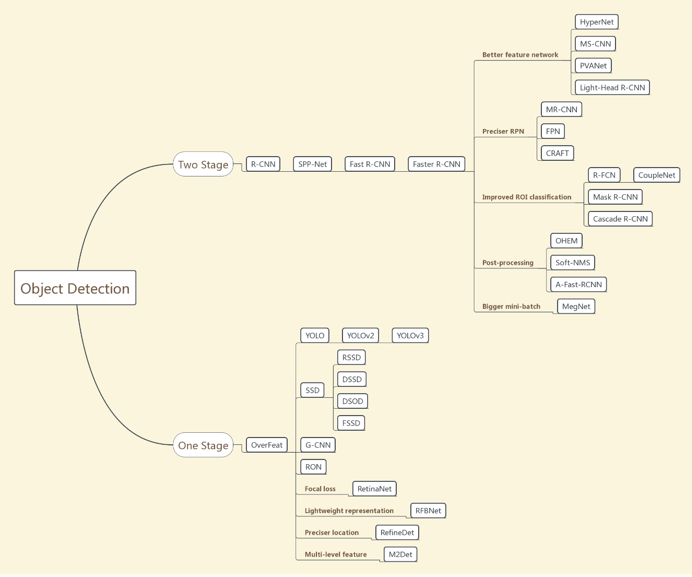

A timeline of these methods:

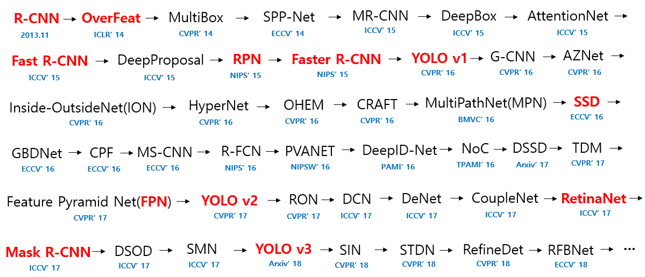

General performance of these methods on MS COCO:

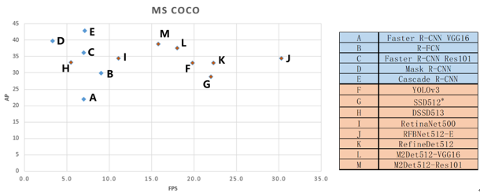

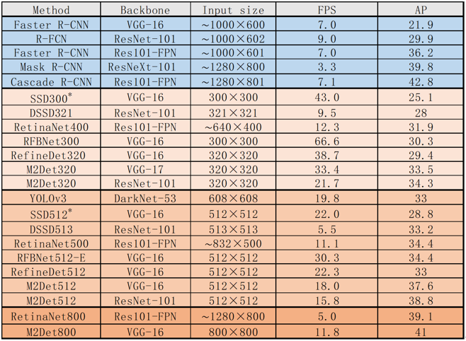

#### 4. Two-stage methods

##### 4.1 R-CNN

**paper**: [**Rich feature hierarchies for accurate object detection and semantic segmentation**   *CVPR2014*](http://arxiv.org/abs/1311.2524)

R-CNN = region proposal + CNN feature extractor classifier / bounding-box regressor

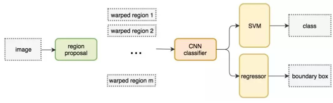

**1)**   **Procedure**

a)  Use selective search algorithm to produce approximately 2000 region proposals;

b)  Resize the region proposals to 227×227 (warped region);

c)   Use CNN to extract features of wrapped regions;

d)  Use SVM for classification and train a bounding-box regressor for each class respectively.

**2)**   **Some issues**

a)  CNN fine-tuning

Tune a pre-trained CNN whose inputs are wrapped regions and outputs are $(N+1)$ (where $N$ is the number of object classes, plus 1 for background); Region proposals with IoU ≥0.5 are positives and the rest are negatives.

b)  SVM training

Only the ground-truth boxes are positives and proposals with IoU less than 0.3 are negatives. Note that this is different from CNN fine-tuning.

The practice in CNN fine-tuning is necessary to include more samples and avoid overfitting. But this practice is likely suboptimal because the network is not being fine-tuned for precise localization. Therefore we should train another SVM.

Bounding-box regression is not a simple linear regression. See the details in *Appendix B*
of the paper. More details are elaborated in the *Appendix B* of this summary.

**3)**  **Problems of R-CNN**

a)  Large amount of computations for feature extraction from 2000 proposals; Many proposals are overlapped;

b)  Multi-stage pipeline, complicated steps;

c)  Time consuming for training; Need extra storage for CNN features.

##### 4.2 Fast R-CNN

**paper**: [**Fast R-CNN**    *ICCV2015*](https://arxiv.org/abs/1504.08083)

Improvement: shared convolutional computation + ROI pooling

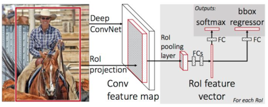

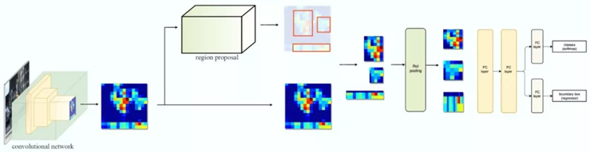

**1)**  **Procedures**

Similar to R-CNN except that:

a)  Input is the entire image and a list of ROIs in that image;

b)  ROI is projected to the feature map of the entire image, instead of extracting features from ROIs individually as R-CNN does;

c)  ROI pooling is used to get a fixed size of ROI feature representation. RoI max pooling works by dividing the h × w RoI window into an H × W grid of sub-windows of approximate size h/H × w/W and then max-pooling the values in each grid.

*An illustration of ROI pooling:*

*Top-left: feature map*

*Top-right: project ROI to the feature map (blue boundaries)*

*Below-left: divide the ROI window into grids, e.g. for a 2×2 representation, divide ROI into four similar sized parts.*

Below right: max-pooling each part to get a final representation.

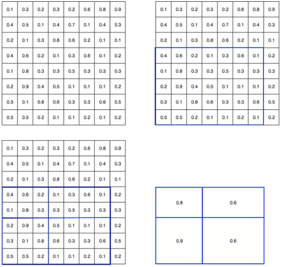

d)  Multi-task loss: classification bounding-box regression. The bounding-box regression loss is a smooth version of L2 loss to prevent gradient explosion. Find details in *sec. 2.3* in the paper.

**2)**   **Some issues:**

a)  Use softmax layer for classification instead of a separate SVM. Softmax outperforms SVM and the author explains that softmax introduces competition between classes, unlike one-vs-rest SVMs;

b)  Multi-task training helps;

c)  Using more proposals does not help.

**3)**   **Problems of fast R-CNN**

Region proposal with selective search (2~3s) is slow compared with feature extraction and classification (0.32s).

##### 4.3 Faster R-CNN

**paper**:  [**Faster R-CNN: Towards Real-Time Object Detection with Region Proposal Networks**     ***NIPS 2015***](<http://arxiv.org/abs/1506.01497>)

Faster R-CNN = RPN + Fast R-CNN

The main contribution of Faster R-CNN is the Region Proposal Network (RPN). Faster R-CNN uses RPN to generate proposals instead of selective search.

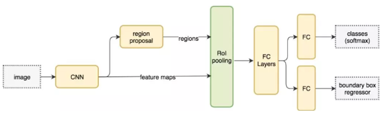

The main idea of RPN is using CNN to predict proposals directly.

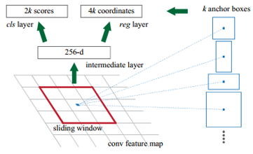

**1)**    **Details of RPN**

Firstly, RPN uses CNN (such as ZFNet) with a 3×3 sliding window to generate a 256-d feature vectors. Then this 256-d vector is fed into two independent FCN layers——a box-regression layer and a box-classification layer. 

At each sliding-window location, k region proposals are predicted simultaneously, so the regression layer has 4k outputs encoding the coordinates of k boxes. The classification layer outputs 2k scores that estimate probability of object / not-object for each proposal.

The k proposals are relative to k anchor boxes. The classification scores are irrelevant to different anchors because of the fixed 3×3 convolution kernel at each location. Therefore, different anchors only affect their regression coordinates. The paper uses k=9 anchors with 3 scales and 3 aspect ratios.

The **loss function** is defined as
$$
L \left( \left\{ p _ { i } \right\} , \left\{ t _ { i } \right\} \right) = \frac { 1 } { N _ { c l s } } \sum _ { i } L _ { c l s } \left( p _ { i } , p _ { i } ^ { * } \right) + \lambda \frac { 1 } { N _ { r e g } } \sum _ { i } p _ { i } ^ { * } L _ { r e g } \left( t _ { i } , t _ { i } ^ { * } \right)
$$
The parameterizations of the 4 coordinates：
$$
\begin{array} { c l } { t _ { \mathrm { x } } = \left( x - x _ { \mathrm { a } } \right) / w _ { \mathrm { a } } , } & { t _ { \mathrm { y } } = \left( y - y _ { \mathrm { a } } \right) / h _ { \mathrm { a } } , \quad t _ { \mathrm { w } } = \log \left( w / w _ { \mathrm { a } } \right) , \quad t _ { \mathrm { h } } = \log \left( h / h _ { \mathrm { a } } \right) } \\ { t _ { \mathrm { x } } ^ { * } = \left( x ^ { * } - x _ { \mathrm { a } } \right) / w _ { \mathrm { a } } , } & { t _ { \mathrm { y } } ^ { * } = \left( y ^ { * } - y _ { \mathrm { a } } \right) / h _ { \mathrm { a } } , \quad t _ { \mathrm { w } } ^ { * } = \log \left( w ^ { * } / w _ { \mathrm { a } } \right) , \quad t _ { \mathrm { h } } ^ { * } = \log \left( h ^ { * } / h _ { \mathrm { a } } \right) } \end{array}
$$
**This can be thought of as bounding-box regression from an anchor box to a nearby ground-truth box.**

**The function of anchor box: an intuitive explanation**

*In R-CNN and Fast R-CNN, proposals are generated by selective search (SS). In bounding-box regression, proposals are modified towards ground-truth. The output is a predicted box modified from the proposal.*

*In RPN, anchor boxes play a similar role as proposals generated by SS. The predicted box is generated by modifying anchor box towards the ground-truth. Anchors with different scales and aspect ratios are used in order to cover enough variations, as proposals generated by SS also have different scales and shapes.*

**2)**    **Alternating training (sharing weights between two separate networks)**

Training Faster R-CNN is a little bit complicated. RPN and Fast R-CNN deal with different tasks and thus modify their shared conv layers in different ways. Thus some techniques are needed for sharing conv layers between two separate networks.

Note that this problem is not as easy as simply training the two networks jointly. The reason is that Fast R-CNN training depends on fixed object proposals. When jointly trained, proposals generated by RPN varies time to time, so Fast R-CNN training may not converge.

The paper use an alternating training scheme with four steps:

Step 1: Train the RPN with pre-trained ImageNet models;

Step 2: Train a separate detection network by Fast R-CNN (initialized by ImageNet) using the proposals generated by the step-1 RPN;

Step 3: Use the detector network to initialize RPN training, but fix the shared conv layers and only fine-tune the layers unique to RPN;

Step 4: Keep the shared conv layers fixed and fine-tune the fc layers of the Fast R-CNN.

##### 4.4 R-FCN

**paper**:  [**R-FCN: Object Detection via Region-based Fully Convolutional Networks**   *NIPS 2016*](<https://arxiv.org/abs/1605.06409>)

Mainly contribution of R-FCN: a) use deeper CNN architecture (ResNet101); b) faster speed by reducing computation after ROI pooling.

Main idea: position-sensitive score maps and positive-sensitive ROI pooling

**1)**    **Motivation**

a)     How can Faster R-CNN further speed up?

In a Faster R-CNN architecture, computations are shared for ROIs, i.e. , the convolutions are done over the entire image, before ROI pooling. While after ROI pooling, computations (usually in the fc layers) are done independent of ROIs. For example, if there are 200 ROIs after ROI pooling, and the batch size is 20, then the network after ROI pooling need 10 iterations to output the results, and this is time-consuming. What R-FCN tries to do is reducing this computational cost by sharing computations for all ROIs in the entire network.

In other words, after ROI pooling, the entire input image is converted into several ROI images, which can be seen as sub-images and need to be computed independently. While in R-FCN, there are only one image computed through the layers, leaving no hidden layer after ROI pooling.

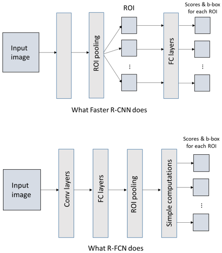

b)     Translation variance in object detection

The image-level classification task favors translation invariance —— shift of an object inside an image should be indiscriminative. The authors assume that deeper convolutional layers in an image classification network are less sensitive to translation. However, the object detection needs localization representations that are translation-variant for predicting coordinates.

To incorporate deep CNN architectures in object detection, previous work inserts the ROI pooling layer into convolutions, which is computational expensive because it introduces a considerable number of post-ROI convolutional layers.

Overall architecture 

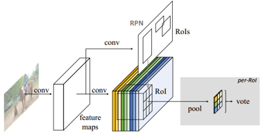

**2) **   **Position-sensitive score maps & Position-sensitive ROI pooling**

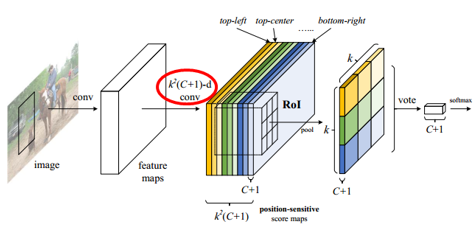

Let $C$ denote the number of object classes. Each ROI rectangle is divided into $k \times k$ grids. Each bin in this grid represents a spatial position (e.g., top-left) of the object. The last convolution layer outputs $k^2 (C+1)$-channel feature maps. For a specific category, the $k^2$ feature maps are called its **position-sensitive score maps**. For each ROI in a specific score map, average pooling is done over its position bin relative to the score map. Then we can get $k^2$ score maps for each ROI. This operation is called position-sensitive ROI pooling. A voting score for a ROI is gotten by average its position-sensitive scores, producing a $(C+1)$-dimensional vector for classification. For b-box regression, we use a sibling convolution layer to output a $4k^2-d$ vector for each ROI. Then it is aggregated into a $4-d​$ vector by average pooling.

**3)**    **Some experimental conclusions**

a)     When setting $k=1$, R-FCN is unable to converge, which demonstrates the importance of position-sensitivity;

b)    Mining more candidate ROIs does not improve the performance.

* ***Understanding of position-sensitive ROI pooling***

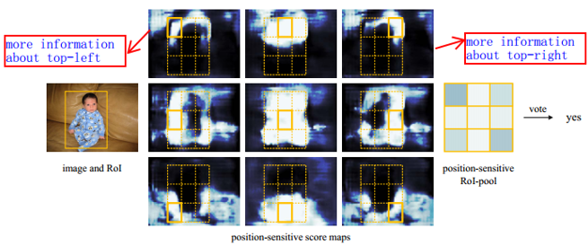

*For a specific category, we can see that its $k^2$ score maps (of the entire image) collect information of different spatial positions. I conjecture that for the $(C+1)$ score maps of each position $k$, only the information in the relative position is extracted for all ROIs. Therefore, during training, the entire feature map will emphasize more on relative position of each ROI.*

*Intuitively, in a specific feature map for position $k$ and category $C$, a pixel value represents the probability of a relative position in original image being the position $k$ of category $C$ (e.g., the probability of being the top-left part of category ‘person’).*

##### 4.5 FPN

**paper**:  [**Feature Pyramid Networks for Object Detection**   *CVPRR 2017*](<https://arxiv.org/abs/1612.03144>)

FPN is an architecture component which can be added into any detection models. FPN is classified to two-stage methods as it is combined with a Faster R-CNN in the paper. However FPN can also be used in one-stage models such as YOLOv3. The main idea of FPN
is very similar to DSSD. 

**1)**   **Architecture**

The construction of FPN involves a bottom-up pathway, a top-down pathway, and lateral connections.

The bottom-up pathway is just the feed-forward computation of the backbone ConvNet. The top-down pathway generates higher resolution features by upsampling (nearest neighbor upsampling is used in the paper). Each lateral connections merges feature maps of the same spatial size from the bottom-up and top-down pathway by element-wise addition. The merged feature map is then used to generate the next feature map. To start the iteration, a 1×1 convolution is attached to the top layer in the bottom-up pathway. 

Finally a 3×3 convolution is used on the merged feature maps to generate the final feature map. All extra convolutional layers have a fixed 256-channel outputs.

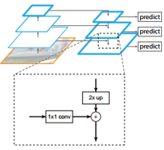

In summary, the key-point of FPN is combining the upsampled, strong-semantic features together with the original, location-precise features.

##### 4.6 Mask R-CNN

**paper**:  [**Mask R-CNN**      *ICCV 2017*](<https://arxiv.org/abs/1703.06870>)

Mask R-CNN is designed for instance segmentation, but it can also be used for object detection, as a by-product of instance segmentation. Mask R-CNN is an intuitive extension of Faster R-CNN, by adding a mask branch for predicting object masks.

**1)**    **Mask R-CNN and the mask branch**

Mask R-CNN uses a ResNet-FPN backbone for feature extraction. During training, a mask branch is added in parallel with the normal classification branch and bounding-box regression branch of Faster R-CNN. (Note that during inference mask prediction runs after ROI classification in order to speed up.)

The mask branch uses fully convolutional layers to predict pixel-wise masks. The head architecture is shown below.

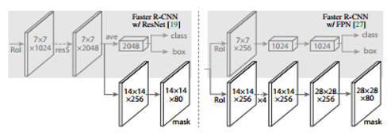

Mask R-CNN uses a multi-task loss as
$$
L = L _ { c l s } + L _ { b o x } + L _ { m a s k }
$$
The mask branch has a $Km^2$ dimensional output for each ROI, which encodes $K$ binary masks of resolution $m \times m$ one for each of the $K$ classes. Therefore, each ROI predicts $K$ masks, which is independent of the class prediction. This is because the authors found it essential to decouple mask and class prediction for instance segmentation.

A per-pixel sigmoid is applied to compute the average binary cross-entropy loss $L _ {mask}$. Only the loss of class $k$ which the ROI belongs to is propagated back. 

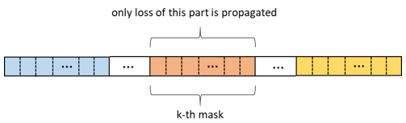

The classification prediction is used to select the output mask. Note that this is different from common practice when applying FCNs to semantic segmentation, which typically uses a per-pixel softmax and a multinomial cross-entropy loss.

**2)**   **ROIAlign**

ROI pooling performs quantizations on the coordinates and bins of ROIs. The authors find that this practice introduces misalignments between the ROI and the extracted features (see the illustration below), which is inappropriate for instance segmentation.

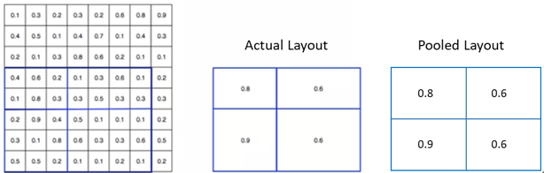

Instead, the authors use ROIAlign which does not involve any quantizations. ROIAlign divide the ROI boundaries and bins without quantizations (e.g. use $x / 16$ instead of $[x / 16]​$). Then serval points are sampled in each bin of a ROI (4 points in the paper). After that, ROIAlign computes the value of each sampling point by bilinear interpolation from the nearby grid points on the feature map. Finally, the results are aggregated by max or average in each bin. 

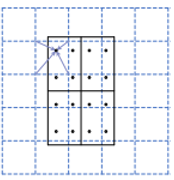

*The illustration above is a little confused, because in regular representation, pixel value falls into the grid cells. One can view this as each pixel value is located on the grid nodes of the feature map instead for better understanding. Actually the pixel data are represented in the form of matrix, the sampling is done directly in the matrix. In this way, the adjacent points of the sampling points is just the matrix elements.*

##### 4.7 Cascade R-CNN

**paper**:  [**Cascade R-CNN: Delving into High Quality Object Detection**     *CVPR 2018*](<https://arxiv.org/abs/1712.00726>)

Cascade R-CNN is a multi-stage extension of Faster R-CNN which aims at refining the predicted bounding boxes.

**1)**    **Motivation**

Object detector trained with low IoU threshold, e.g. 0.5, usually produces noisy detections, especially when evaluated with high IoU. We define the quality of an hypothesis as its IoU with the ground truth, and the quality of the detector as the IoU threshold $u$ used to train it. The basic problem is that a single detector can only be optimal for a single quality level. In other words, **a detector can only have high quality if presented with high quality proposals.**

Simply increasing the training IoU threshold is not a feasible solution for two reasons: 1) the number of positive samples decreases exponentially, leading to overfitting; 2) the detection could be suboptimal when they are asked to work on the hypotheses of other quality levels. (The second issue can be clearly seen from the figure below. Note that for both of the regressor and detector, training at threshold 0.7 performs worse than threshold 0.5, when provided with proposals of IoU threshold 0.5. Maybe this is because the model did not see any positive sample of IoU threshold 0.5 when training with IoU threshold 0.7).

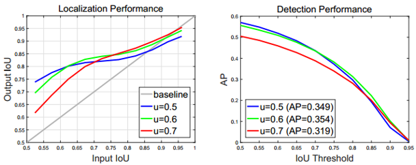

**An important observation is that the output IoU of a regressor is almost invariably better than the input IoU.** The design of Cascade R-CNN is just based on this observation.

**2)**    **Architecture**

Cascade R-CNN relies on cascade of regressors and training with increasing IoU stage by stage. The output bounding-boxes of the previous stage is used as input proposals for the next stage. 

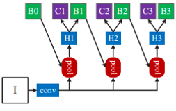

This practice is based on the aforementioned **observation**, which can also be shown in the figure below.

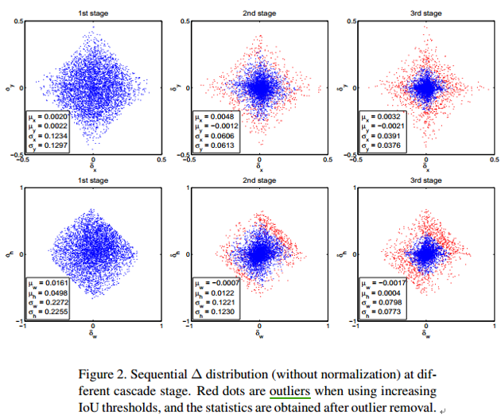

It can be clearly seen that the points have a trend to cluster towards the center, which means that the IoU is getting better. The cascade regression can be seen as a resampling mechanism for the input proposals. Therefore, it is possible keep the set of positive examples of the successive stages at a roughly constant size, even when the detector quality (IoU threshold) is increased. This can be seen more clearly in the figure below.

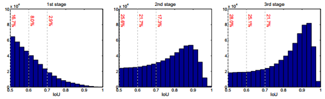

In the paper, Cascade R-CNN have four stages, one RPN and three for detection with $U = \{ 0.5, 0.6, 0.7 \}$. Using a four-stage detection has the best performance for high IoU levels, but the overall AP performance degrades. So the three-stage cascade achieves the best trade-off.

#### 5. One-stage methods

##### 5.1 SSD

**paper**:  [**SSD: Single Shot MultiBox Detector**    *ECCV 2016*](<https://arxiv.org/abs/1512.02325>)

SSD uses convolutions to predict directly at feature maps with different scales based on different default boxes.

**1)**    **Architecture**

External convolutional layers are added after a VGG-16 backbone to detect at different scales. Default boxes are applied in multiple feature maps. Therefore SSD can utilize multiscale features in that the former and bigger-sized feature maps can capture information of small object, while the later and smaller-sized ones can capture information of big object. Then a $3×3$ filter with $k×(c+4)$ channels is adopted to predict the scores and coordinates for each location, where k is the number of default boxes and c is the number of classes (+ background).

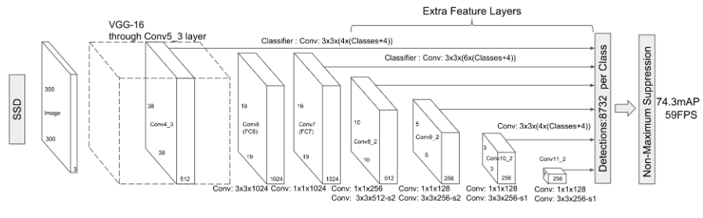

**2)**    **Configuration of default boxes**

The concept of default box is similar to that of anchor box in Faster R-CNN. At each location of a feature map, default boxes of different scales and aspect ratios are used. For a 300×300 sized input, SSD adopts 4, 6, 6, 6, 4, 4 default boxes at the conv4_3, conv7, conv8_2, conv9_2, conv10_2, conv11_2 feature maps respectively, as the above figure illustrates. The sizes of these feature maps are 38x38, 19x19, 10x10, 5x5, 3x3, 1x1 respectively. Therefore we have 38 x38x4 + 19x19x6 + 10x10x6 + 5x5x6 + 3x3x4 + 1x1x4 = 8732 default boxes totally, each corresponds to a detector.

**3)**    **Hard negative mining**

To balance the number of positive and negative examples, the authors sort the negative examples using the highest confidence loss for each default box and pick the top ones so that the ratio between the negatives and positives is at almost 3:1. That means, only the gradients of these examples are back propagated.

**4)**    **Final inference**

For each predicted box, if its maximum confidence score is lower than a threshold (0.01 in the paper), it will be dropped. Then NMS is applied with a IoU of 0.45 and the top 200 detections are kept per image. 

**5)**    **Drawbacks**

SSD has much worse performance on small objects. This is because those small objects may not have any information at the very top layers

##### 5.2 DSSD

**paper**:  [**DSSD : Deconvolutional Single Shot Detector**   *CVPR 2017*](<https://arxiv.org/abs/1701.06659>)

DSSD improves SSD’s ability to detect small objects by adding deconvolutional layers to compensate the lost sematic information in the down-sampling convolution.

**1)**    **Architecture**

The backbone of DSSD is ResNet-101. DSSD is an hourglass structure. 

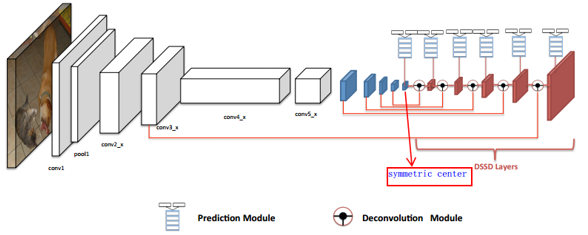

a)     Prediction module

The authors study different prediction approaches based on residual blocks, compared to the original way in SSD.

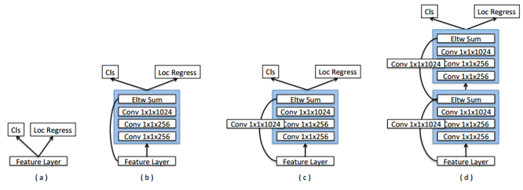

Ablation study shows module (c) performs best.

b)     Deconvolution module

Extra deconvolution layers are added to successively increase the resolution of feature map layers. In order to help integrating information from earlier features maps and the deconvolution layers, the authors introduce a deconvolution module.

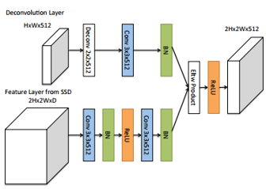

**2)**    **Other issues**

a)     According to the experiments, the best training strategy of DSSD is firstly training the original SSD as a pre-trained model and then fine-tune the extra deconvolution side by freezing all the weights of original SSD model.

b)    DSSD is not as fast as the original SSD not only because of the deeper ResNet-101 network but also the additional deconvolution layers.

##### 5.3 FSSD

**paper**:  [**FSSD: Feature Fusion Single Shot Multibox Detector**     *2017*](<https://arxiv.org/abs/1712.00960>)

FSSD uses feature fusion strategy to address the problem of SSD when detecting small objects.

**1)**    **Motivation: what’s wrong with SSD?**

The main problem of SSD is its poor performance on small object detection. Large feature maps in the shallow layers can help capture the information of small objects, but they lack enough high-level semantic features.

ConvNets extract pyramidal feature hierarchy from low to high levels. However, SSD regards these features in different levels as the same level and generates the object detection results directly from them. Therefore, SSD lacks the capability to capture both the local detailed features and global semantic features. The authors want to solve this problem by synthesizing the features.

**2)**    **Architecture**

The basic idea of FSSD is fusing the different level features at once with an appropriate way and generate feature pyramid from the fused features. In order to concatenate the features with different scales, Conv 1×1 is applied to reduce the dimension firstly. Then the authors choose 38×38 as the basic feature map size. For the feature maps whose size is larger than 38×38, a max-pooling is applied to down-sample. For those smaller than 38×38, a bilinear interpolation is used to resize the feature maps. Therefore, all the features have the same size on spatial dimension. Then a pyramid feature generator is used to produce multi-scale features to feed into the multi-box detectors.

The whole structure of the feature fusion module and the pyramidal feature generator can be seen as an encoder-decoder framework.

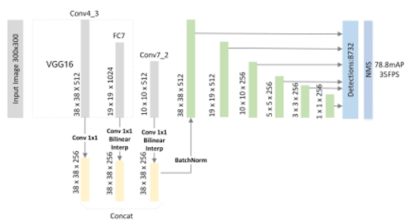

##### 5.4 DSOD

**paper**:  [**DSOD: Learning Deeply Supervised Object Detectors from Scratch**    *ICCV2017*](http://openaccess.thecvf.com/content_ICCV_2017/papers/Shen_DSOD_Learning_Deeply_ICCV_2017_paper.pdf)

The motivation of DSOD is designing a framework that can learn object detectors from scratch in order to alleviate learning bias arisen from pre-trained ImageNet models for classification tasks.

**1)**    **Architecture**

The architecture of DSOD can be seen as a combination of DenseNet and SSD. 

The backbone of DSOD is a modified DenseNet. The entire architecture of DSOD is shown below (growth rate $k=48$ in each dense block):

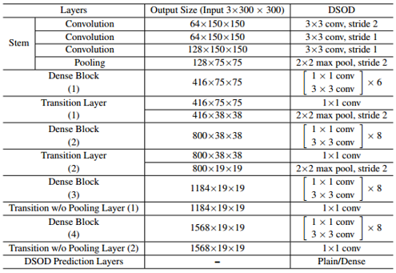

DSOD uses dense connection layers for multi-scale prediction. The plain structures used in SSD (left) and the dense structures used in DSOD (right) are shown below: 

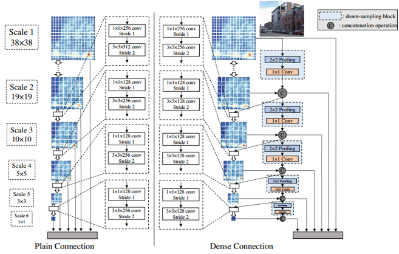

**2)**    **Some design principles**

* **Proposal free:** The authors found that two-stage methods did not converge successfully when training from scratch. They conjecture this is due to the ROI pooling which hinders the gradients being smoothly back-propagated from region-level to convolutional feature maps. Therefor they use one-stage methods to train from scratch.

* **Deep supervision:** The central idea is to provide integrated objective function as direct supervision to the earlier hidden layers, rather than only at the output layer (like DenseNet). The authors find deep supervision is key point to train from scratch.

* **Stem block:** The authors use stem block as a stack of three 3×3 convolution layers followed by a 2×2 max pooling layer. Note that this is different from the original design in DenseNet which uses a 7×7 conv-layer, stride = 2 followed by a 3×3 max pooling, stride = 2. 

* **Learning half and reusing half:** For each scale in the dense prediction layers, the network only learns half of new feature maps and reuse the remaining half of the previous ones (except scale-1).

##### 5.5 YOLOv1

**paper**:  [**You Only Look Once: Unified, Real-Time Object Detection**     *CVPR2016*](<http://arxiv.org/abs/1506.02640>)

The main innovation of YOLO is framing object detection as a regression problem. 

**1)**    **Architecture** 

The network architecture includes 24 convolution layers and 2 fully-connected layers. The last fully-connected layer predicts both the class probabilities and object locations, using a linear activation. All the other layers use the following leaky rectified linear activation:
$$
\phi ( x ) = \left\{ \begin{array} { l l } { x , } & { \text { if } x > 0 } \\ { 0.1 x , } & { \text { otherwise } } \end{array} \right.
$$
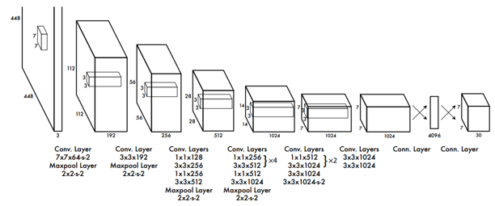

**2)**    **Input and output**

YOLO divides the input image into $S×S$ grids. If the center of an object falls into a grid cell, then this grid cell is responsible to detect this object.

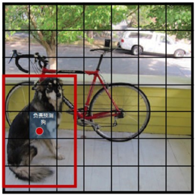

Each grid predicts B bounding boxes and C class probabilities. Each bounding box is represented by five values, including its coordinates, width, height and confidence score. The confidence score is computed by P(object) * IoU. Therefore, if a bounding box contains an object, then its confidence score is its IoU with the ground-truth, otherwise the confidence score is zero.

The dimension of the output of final fc layer is $S \times S \times (B \times 5 + C)$.

Note that although each grid generates B bounding boxes, only one bounding box with the highest IoU is used to predict the final results. That is to say, each grid predicts only one object. This is very different from the dense boxes in RPN and SSD.

**3)**   **Loss function**

The loss function of YOLO is an MSE loss with complicated modifications:

* The loss of coordinates is weighted by $\lambda _ {coord} = 5$
* For many grids which do not contain any object, their confidence scores are approximately zero, often overpowering the gradient from grids that do contain objects. Therefore, the loss from confidence scores for boxes that do not contain objects is weighted by $\lambda _ { n o o b j } = 0.5$
* It is rational that small deviations in large boxes should matter less than in small boxes. Therefore, **the square root** of the bounding box width and height is predicted instead.

The total loss is as follows:

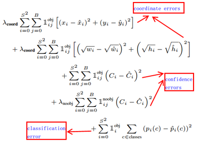

Where $\mathbb { l } _ { i } ^ { o b j }$ denotes if object appears in cell $i$ and $\mathbb { l } _ { i j } ^ { o b j }$ denotes that the $j \mathrm { th }$ bounding box predictor in cell $i$ is “responsible” for that prediction.

Note that the loss function only penalizes classification error if an object is present in that grid cell. It also only penalizes bounding box coordinate error if that predictor is responsible for the ground truth box.

**4)**   **Limitations of YOLO**

* Since each grid cell can predict only one object, YOLO struggles with small objects that appear in groups.
* YOLO struggles to generalize to objects in new or unusual aspect ratios or configurations because it learns to predict only from the training data.
* YOLO uses relatively coarse features for prediction because of multiple down-sampling layers.
* The loss function treats errors the same in small bounding boxes versus large bounding boxes (although the square root is used). The main error is incorrect localization.

##### 3.6 YOLOv2 & YOLO9000

**paper**:  [**YOLO9000: Better, Faster, Stronger**     *2016*](<https://arxiv.org/abs/1612.08242>)

**1)**    **YOLOv2: improved YOLO**

YOLOv2 improves the localization accuracy and recall through serval modifications of YOLO. These modifications include some tricks along with new architectures.

A table of the modifications:

Here I list some of them:

**a)**    **Dimension clustering**

In Faster R-CNN and SSD, the prior boxes are chosen by hand. As an alternative, the authors run k-means clustering on the training set bounding boxes to automatically find good priors. Instead of standard Euclidean distance, the authors use a distance metric based on IoU:
$$
d ( \text { box, centroid } ) = 1 - \operatorname { IOU } ( \text { box, centroid } )
$$
We can understand this as follows: imagine that all the boxes are overlay together, if the size and aspect ratio of two boxes are close to each other, i.e., the IoU is large, then the distance of these two boxes are small. Therefore, model will learn to predict boxes which has similar sizes and aspect ratios to the centroid box. The authors choose k=5 in the paper.

**b)**    **Direct location prediction**

Using anchor boxes in YOLO will cause a model instability problem. Most of the instability comes from predicting the $(x, y)$ locations for the box. To address this issue, the model predicts location coordinates relative to the location of the grid cell. This bounds the offset of the box falls into (0, 1). In other words, the predicted coordinates will not exceed the grid cell.

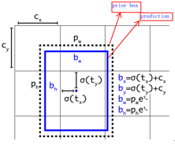

**c)**    **Fine-grained features**

The authors simply add a passthrough layer that brings features from an earlier layer to help detect small objects. The passthrough features are concatenated to the final feature maps by stacking adjacent features into different channels instead of spatial locations.

**d)**    **New convolution architecture**

YOLOv2 uses **Darknet-19** as a backbone. Darknet-19 has 19 convolutional layers and 5 max-pooling layers. When switching to detection, the last convolutional layer is removed and three more convolutional layers are added for prediction.

Performance of YOLOv2 on VOC2007 compared to other models:

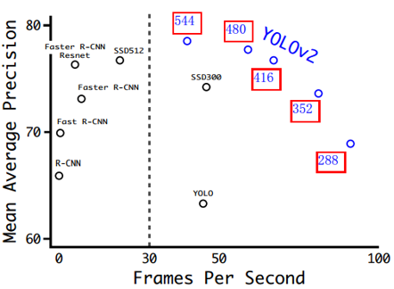

**1)**    **YOLO9000: predict more classes**

YOLO9000 can detect up to 9000 classes based on YOLOv2. YOLO9000 uses a jointly training mechanism on classification and detection data. By learning detection-specific information from labelled detection dataset (COCO) and learning classification-specific information from image datasets only with class labels (ImageNet), YOLO9000 can expand the number of categories it can detect.

YOLO9000 uses a special data structure to deal with the fine-grained class labels in ImageNet. The data structure is a WordTree as is illustrated:

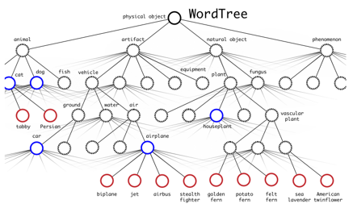

During training, when model sees a classification image, only the loss from the classification-specific parts of the architecture are propagated. Prediction is done by the product of serval conditional probabilities through a path of the tree. The implementation of YOLO9000 is a little complicated. See more details in the paper.

##### 3.7 YOLOv3

**paper**:  [**YOLOv3: An Incremental Improvement**      *2018*](<https://arxiv.org/abs/1804.02767>)

YOLOv3 introduces three main modifications.

**1)**    **Darknet-53**

Adding more convolutional layers along with residual connections. 

**2)**    **Multi-scale prediction**

YOLOv3 predicts boxes at 3 different scales, inspired by FPN. The authors use k-means clustering to choose 9 anchor boxes and divide them evenly across three scales. Darknet-53 with FPN is shown below:

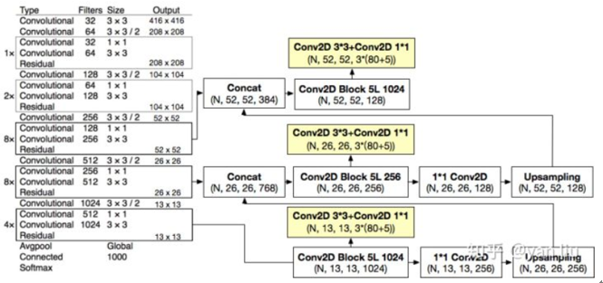

**3)**    **Multi-label classification**

YOLOv3 uses independent logistic classifiers to predict multi-labels instead of a softmax. A binary cross-entropy loss is used for the class predictions.

##### 3.8 RetinaNet

**paper**:  [**Focal Loss for Dense Object Detection**       *ICCV 2017 (Best Student Paper Award)*](<https://arxiv.org/abs/1708.02002>)

The authors identify class imbalance during training as the main obstacle impeding one-stage detector from achieving state-of-the-art accuracy and propose a new loss function called **Focal Loss** to eliminate this barrier.

**1)**    **Focal loss definition**

Let’s start with the standard cross entropy loss：
$$
\mathrm { CE } ( p , y ) = \mathrm { CE } \left( p _ { \mathrm { t } } \right) = - \log \left( p _ { \mathrm { t } } \right)
$$
In order to address class imbalance, we usually introduce a weighting factor $\alpha \in [ 0,1 ]$ for for class $1$ and $1-\alpha$. In practice $\alpha$ may be the set by inverse class frequency or treated as a hyperparameter by cross validation. We write the $\alpha-$balanced CE loss as:
$$
\mathrm { CE } \left( p _ { \mathrm { t } } \right) = - \alpha _ { \mathrm { t } } \log \left( p _ { \mathrm { t } } \right)
$$
While $\alpha​$ balances the importance of positive/negative examples, it does not differentiate between easy / hard examples. Instead, we propose to reshape the loss function to down-weight easy examples and thus focus training on hard negatives. 

More formally, we propose to add a **modulating factor** $\left( 1 - p _ { t } \right) ^ { \gamma }$ to the cross entropy loss, with tunable **focusing parameter** $\gamma \geq 0$.  The focal loss is defined as:
$$
\mathrm { FL } \left( p _ { \mathrm { t } } \right) = - \left( 1 - p _ { \mathrm { t } } \right) ^ { \gamma } \log \left( p _ { \mathrm { t } } \right)
$$
The focal loss is visualized in the figure below.

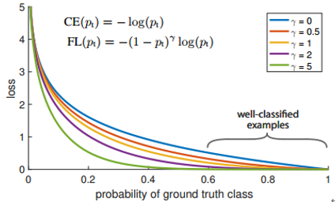

Intuitively, focal loss down-weights the examples with lower loss, which can be seen as well-classified easy examples, and forces the model to focus on the hard examples with higher loss. Note that a higher $\gamma​$ amplifies the effect of the modulating factor.

In practice, we can use an $\alpha-​$balanced variant of the focal loss:
$$
\mathrm { FL } \left( p _ { \mathrm { t } } \right) = - \alpha _ { \mathrm { t } } \left( 1 - p _ { \mathrm { t } } \right) ^ { \gamma } \log \left( p _ { \mathrm { t } } \right)
$$
Experiments show that $\alpha$ should be decreased slightly as $\gamma$ is increased. In the paper, $\gamma=2$, $\alpha=0.25$ works best.

**2)**    **Architecture of the RetinaNet**

RetinaNet is a simple one-stage detector which adopts a ResNet-FPN backbone.

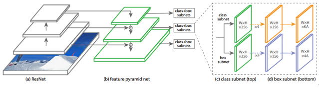

There are 9 anchors for each level of FPN. The class subnet and box subnet consist of four 3×3 conv layers respectively. RetinaNet uses binary logistic classifiers with focal loss for multi-label classification instead of a softmax.

**3)**    **Model initialization issue**

To counter the instability in early training caused by class imbalance, the authors introduce the concept of a ‘prior’ for the value of p estimated by the model for the rare class (foreground) at the start of training. The authors denote the prior by π and set it so that the model’s estimated p for examples of the rare class is low (π=0.01 in the paper). This practice is based on the observation that the proportion of rare class is very small.

In details, for the final conv layer of the classification subnet, the bias initialization is set to
$$
\mathrm { b } = - \log ( ( 1 - \pi ) / \pi )​
$$
where π specifies that at the start of training every anchor should be labeled as foreground with confidence of ∼π. This initialization prevents the large number of background anchors from generating a large, destabilizing loss value in the first iteration of training.

##### 3.9 RefineDet

**paper**:  [**Single-Shot Refinement Neural Network for Object Detection**    *CVPR 2018*](<https://arxiv.org/abs/1711.06897>)

RefineDet is a one-stage framework which imitates the two-stage structure to get a higher accuracy while maintain a fast inference speed. (But in my opinion RefineDet is more like a two-stage model without ROI pooling.)

**1)**    **Architecture** 

There are two inner-connected modules in RefineDet, called anchor refinement module (ARM) and object detection module (ODM) respectively. The ARM is designed to remove negative anchors to reduce search space for the classifier, and coarsely adjust the locations and sizes of anchors so that the subsequent ODM can further refine them.

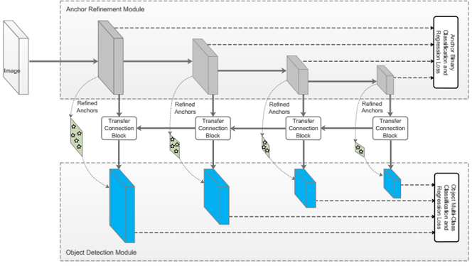

Transfer connection blocks (TCB) are used to link between ARM and ODM in order to transfer ARM features to ODM. TCB also receives high-level features by a deconvolution operation and integrates features by an element-wise sum. 

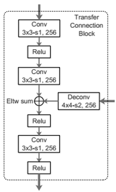

**2)**    **Addressing class imbalance**

RefineDet addresses class imbalance like two-stage methods. The process includes two aspects: 1) firstly the negative anchors generated by ARM are filtered if their confidence is larger than a threshold (0.99 empirically); 2) secondly, hard negative mining is applied by selecting some negative anchors with top loss value to make the ratio between the negatives and positives below 3:1.

##### 3.10 RFBNet

**paper**:  [**Receptive Field Block Net for Accurate and Fast Object Detection**    *ECCV 2018*](<https://arxiv.org/pdf/1711.07767.pdf>)

RFBNet aims at strengthening features learned from lightweight CNN models so that they can reach the performance of very deep detectors (ResNet101 or Inception backbones).

**1）** **Receptive Field Block (RFB)**

The idea of RFB is inspired by the structure of population Receptive Filed (pRF) in human visual system. RFB makes use of multi-branch pooling with varying kernels corresponding to RFs of different sizes, applies **dilated convolution** layers to control their eccentricities, and reshapes them to generate the final representation.

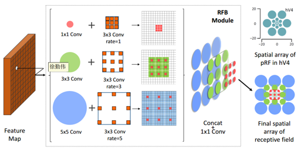

The proposed RFB is a multi-branch convolutional block. Its inner structure can be divided into two components: the multi-branch convolution layer with different kernels and the trailing dilated convolution layers. The former part is identical to that of Inception, responsible for simulating the pRFs of multiple sizes, and the latter part reproduces the relation between the pRF size and eccentricity in the human visual system.

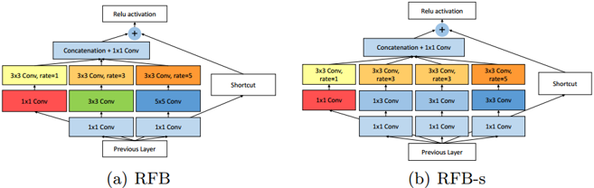

**2）** **RFB Net detection architecture**

RFBNet is based on the framework of SSD. The main modification lies in replacing the top convolution layers with RFB. In addition, RFB-s module is used as the rate of the size and eccentricity of pRF differs between visual maps. Note that the last few convolutional layers are preserved since the resolutions of their feature maps are too small to apply filters with large kernels like 5 × 5.

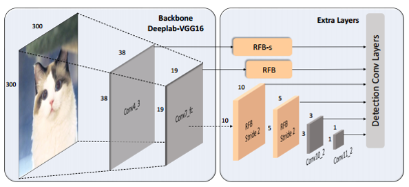

An updated version called **RFBNet512-E** is designed for input with higher resolutions (512). There are two modifications: 1) up-sample the conv7 fc feature maps and concat it with the conv4_3 before applying the RFB-s module, like FPN; 2) add a branch with a 7 × 7 kernel in all RFB layers.

##### 3.11 M2Det

**paper**:  [**M2Det: A Single-Shot Object Detector based on Multi-Level Feature Pyramid Network**      *AAAI 2019*](<https://arxiv.org/abs/1811.04533>)

The goal of M2Det is to design a specialized **multi-scale and multi-level feature pyramid** for object detection, while the feature pyramids used in previous methods like FPN and SSD are based on backbones of object classification tasks. In addition, these methods only construct feature pyramids on a single level (i.e., each feature map with a specific scale in the feature pyramid is only extracted from a single layer). The main idea of M2Det is similar to FSSD, but its architecture design is more complicated.

**1)**    **Multi-Level Feature Pyramid Network (MLFPN)**

MLFPN extracts multi-level features by fusing features from multiple layers and constructing feature pyramid from the fused feature. MLFPN consists of three modules, named Feature Fusion Module (**FFM**), Thinned U-shape Module (**TUM**) and Scale-wise Feature Aggregation Module (**SFAM**).

The entire architecture of M2Det and MLFPN is shown below.

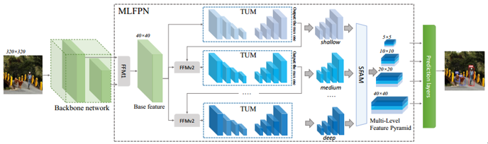

MLFPN operates as follows: 

* **FFMv1** fuses two feature maps with different scales in backbone (e.g., conv4_3 and conv5_3 of VGG) to produce the base feature.

* Several **TUMS** and **FFMv2** are stacked alternatively. Each TUM generates feature maps with different scales. The FFMv2 fuses the base feature and the largest output feature map of the previous TUM. Then the fused feature maps are fed to the next TUM.
* **SFAM** aggregates the features by a scale-wise feature concatenation and a channel-wise attention mechanism.

Structural details of each module (the inside numbers of each block denote: input channels, Conv kernel size, stride size, output channels):

**a)**    **FFMs**

FFMv1:

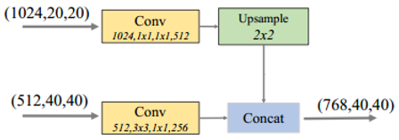

Note that FFMv1 uses one upsample operation to rescale.

FFMv2:

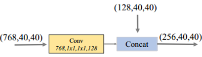

Note that the two feature maps are of the same scale.

**b)**    **TUMs**

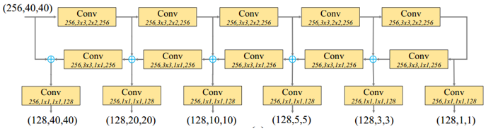

**c)**    **SFAM**

The channel wise attention is implemented by a squeeze and excitation step. The squeeze step is a channel-wise average pooling. The excitation step consists of two fc layers. In detail, the attention weight is learned by:
$$
\mathbf { s } = \mathbf { F } _ { e x } ( \mathbf { z } , \mathbf { W } ) = \sigma \left( \mathbf { W } _ { 2 } \delta \left( \mathbf { W } _ { 1 } \mathbf { z } \right) \right)
$$
where $\sigma$ refers to the ReLU function, $\delta$ refers to the sigmoid function, $\mathrm { W } _ { 1 } \in R ^ { \frac { c } { r } \times c }$, $\mathrm { W } _ { 2 } \in R ^ { C \times \frac { c } { r } }$, $r$ is the reduction ratio ($r=16$ in the paper). The final output is obtained by reweighting the input $X$ with activation $s$:
$$
\tilde { \mathbf { X } } _ { i } ^ { c } = \mathbf { F } _ { s c a l e } \left( \mathbf { X } _ { i } ^ { c } , s _ { c } \right) = s _ { c } \cdot \mathbf { X } _ { i } ^ { c }
$$
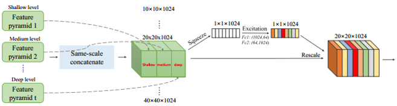

**2)**    **Network configurations**

All of the default configurations of MLFPN contain 8 TUMs, each TUM has 5 striding-Convs and 5 Upsample operations, so it will output features with 6 scales. 

Two convolution layers are added to each of the 6 pyramidal features to achieve location regression and classification respectively.

#### Appendix 1 Selective Search

The initial regions are denoted as $\mathrm { R } = \{ \mathrm { R } _1 , \mathrm { R } _2 , \ldots \mathrm { R } _\mathrm { n } \}$. Compute the similarity of each region and its neighbors (only its neighbors). Then we will get a $n \times n$ similarity matrix (similarity between the same region and similarity between a region and its non-adjacent regions are be set to NaN). Find the two regions corresponding to the largest similarity from the matrix, and merge them as one. Then n-1 regions remain in the image. Repeat the procedures above (only need to compute the similarity between the new region and its neighbors). Every time we repeat once, the total number of regions reduce one, until all the regions merge to one region.

#### Appendix 2 Details about bounding-box regression

Bounding-box regression is used to modify the proposal box. The goal of bounding-box regression is to find a map $f$ that can transform the proposal box to ground-truth box, as shown below:
$$
f \left( P _ { x } , P _ { y } , P _ { w } , P _ { h } \right) = \left( \hat { G } _ { x } , \hat { G } _ { y } , \hat { G } _ { w } , \hat { G } _ { h } \right) \approx \left( G _ { x } , G _ { y } , G _ { w } , G _ { h } \right)
$$
Where $P , \hat { G } , G$ denotes the proposal box, predicted box and ground-truth box respectively.

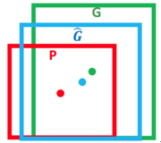

**1)**    **How to do b-box regression?**

A simple practice of the transformation is translating the proposal box firstly and then scale it to fit the ground truth. This is done by:

a)	Translation factor $( \Delta x , \Delta y )$, $\Delta x = P _ { w } d _ { x } ( P )$, $\Delta y = P _ { h } d _ { y } ( P )$:
$$
\begin{array} { l } { \hat { G } _ { x } = P _ { w } d _ { x } ( P ) + P _ { x } } \\ { \hat { G } _ { y } = P _ { h } d _ { y } ( P ) + P _ { y } } \end{array}
$$
b)	Scaling factor $\left( S _ { w } , S _ { h } \right)$, $S _ { w } = \exp \left( d _ { w } ( P ) \right)$, $S _ { h } = \exp \left( d _ { h } ( P ) \right)$:
$$
\begin{aligned} \hat { G } _ { w } & = P _ { w } \exp \left( d _ { t w } ( P ) \right) \\ \hat { G } _ { h } & = P _ { h } \exp \left( d _ { h } ( P ) \right) \end{aligned}
$$
Therefore, $d _ { x } ( P ) , d _ { y } ( P ) , d _ { w } ( P ) , d _ { h } ( P )$, are the transformations need to be learned by
b-box regression. $d _ { * } ( P )$ can be represented by a linear transformation:
$$
d _ { * } ( P ) = \mathbf { w } _ { \star } ^ { \mathrm { T } } \phi _ { 5 } ( P )
$$
Where $\phi _ { 5 } ( P )$ represents the feature vectors of the input proposal.

The real translation and scaling factors are:
$$
\begin{aligned} t _ { x } & = \left( G _ { x } - P _ { x } \right) / P _ { w } \\ t _ { y } & = \left( G _ { y } - P _ { y } \right) / P _ { h } \\ t _ { w } & = \log \left( G _ { w } / P _ { w } \right) \\ t _ { h } & = \log \left( G _ { h } / P _ { h } \right) \end{aligned}
$$
Then we have the loss function
$$
\mathbf { w } _ { \star } = \underset { \ddot { \mathbf { w } } } { \operatorname { argmin } } \sum _ { i } ^ { N } \left( t _ { \star } ^ { i } - \hat { \mathbf { w } } _ { \star } ^ { \mathrm { T } } \phi _ { 5 } \left( P ^ { i } \right) \right) ^ { 2 } + \lambda \left\| \hat { \mathbf { w } } _ { \star } \right\| ^ { 2 }
$$
**2)**	**Why do $t_x$, $t_y$, $t_w$, $t_h$** **have these forms?**

a)	$( \Delta x , \Delta y )$ divided by width and height

The reason is the scale invariance of CNN. 

The two people in the picture have different scales but same patterns. If the features learned by the model is $\phi _ { 1 }​$ and $\phi _ { 2 }​$, then a good feature representation (learned by CNN) should have the property that $\phi _ { 1 } = \phi _ { 2 }​$.

Now we assume the model learns the difference of coordinates directly, let $\mathrm { x } _ { i } , p _ { i }$ be the $x$ coordinate of the $i-th$ box and $f$ be the mapping function. Then we have
$$
f \left( \phi _ { 1 } \right) = x _ { 1 } - p _ { 1 } , f \left( \phi _ { 2 } \right) = x _ { 2 } - p _ { 2 }
$$
Obviously, $x _ { 1 } - p _ { 1 } \neq x _ { 2 } - p _ { 2 }$, this is contradict to $f \left( \phi _ { 1 } \right) = f \left( \phi _ { 2 } \right)$. However if we scale $x_1-p_1$, $x_2-p_2$ with $h_1$ and $h_2$, this problem can be handled.

b)	The logarithm of $t _ { w } , t _ { h }$

The scale factor should be larger than 0. An intuitive practice is using the exponential function, and its inverse is the logarithm function. 

**3)**	**Why does b-box regression only slightly modify the proposal and work under the condition that the proposal is close to ground-truth (*i.e.*, IoU is large)?**

When IoU is large, we use linear transformation to predict the scale factor. We have
$$
t _ { w } = \log \left( G _ { w } / P _ { w } \right) = \log \left( \frac { G _ { w } + P _ { w } - P _ { w } } { P _ { w } } \right) = \log \left( 1 + \frac { G _ { w } - P _ { w } } { P _ { w } } \right)
$$
Consider that
$$
\lim _ { x = 0 } \log ( 1 + x ) = x
$$
We can see that only when $G _ { w } - P _ { w } \approx 0$ the function can be seen as linear. Therefore, b-box regression works only when IoU is large. When IoU is small, the regression function will be non-linear and the problem will be more complicated.

#### Appendix 3 Class imbalance in object detection

Class imbalance is not a naïve problem in object detection, it has two aspects: 1) the number of negative examples (backgrounds) is much larger than the number of positive examples (foregrounds); 2) the number of easy negative examples is far larger than hard negative examples. 

This imbalance cause two problems: 1）training is inefficient as most locations are easy negatives that contribute no useful signal; 2) the easy negatives can overwhelming training and lead to misclassification, as the figure below shows.

Two-stage models can address this problem by a two-stage cascade and sampling heuristics. Usually the number of proposals generated by the proposal stage (e.g., RPN) is reduced to a small number (e.g., 1-2k) by methods such as NMS, filtering out most background examples. In the second classification stage, sampling heuristics, such as a fixed foreground-background ratio (1:3), or online hard example mining (OHEM), are performed to maintain a manageable balance between foreground and background.

In contrast, one-stage models suffer a lot from class imbalance, because these methods must process a much larger set of candidate object locations (~100k) regularly sampled across the image, due to a missing second-stage (i.e., the results of locations and classes are output together in which case NMS and sampling heuristics are not feasible). A common solution is to perform some form of hard negative mining that samples hard examples during training or more complex sampling/reweighting schemes. 